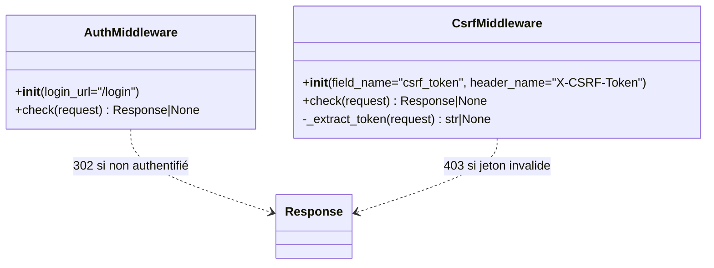
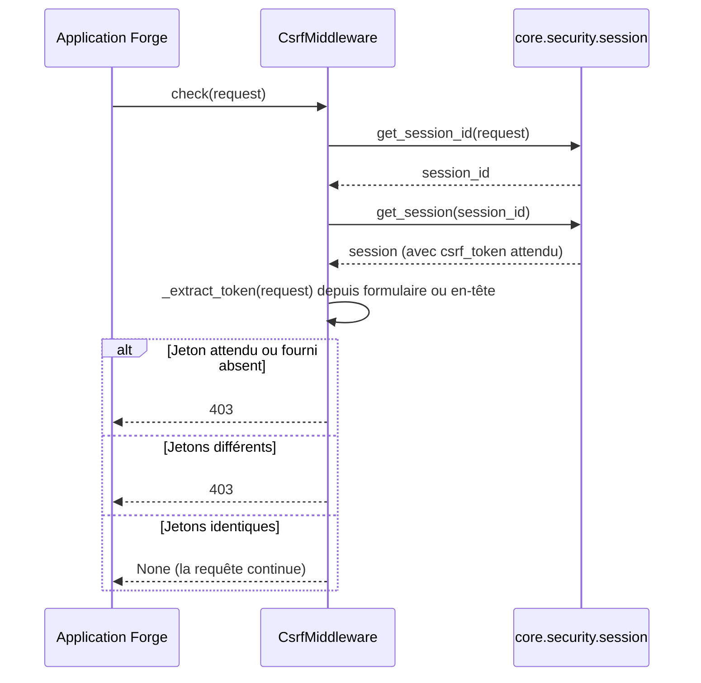

# Les middlewares de sécurité dans Forge

Ce document décrit les middlewares d'authentification et de protection CSRF.
Un middleware s'intercale dans le traitement d'une requête pour la garder.

## 1. Rôle

Le module `core.security.middleware` fournit deux gardes transverses sous forme de classes : exiger une session authentifiée, et vérifier le jeton CSRF des requêtes déjà déclarées protégées.

Le middleware ne décide pas quelles routes sont concernées.
Cette décision reste portée par `RouteEntry.csrf` et par la méthode HTTP.

## 2. Vue d'ensemble rapide

| Élément | Valeur |
|---|---|
| Module | `core.security.middleware` |
| Module Python | `core.security.middleware` |
| Couche | Sécurité |
| Rôle | gardes transverses d'authentification et de CSRF |
| Dépend de | `core.auth.session.is_authenticated`, `core.security.session` (`get_session_id`, `get_session`), `core.http.helpers.html`, `hmac` |
| API publique | `AuthMiddleware`, `CsrfMiddleware` |
| Objet lié | `Request`, `Response` |
| Convention | la méthode `check(request)` retourne `Response | None` |

Chaque middleware expose une méthode `check(request)` qui renvoie une `Response` de refus, ou `None` si la requête peut continuer.

## 3. Schémas UML

### 3.1 Diagramme de classe



À retenir :

- `AuthMiddleware.check` renvoie une redirection `302` si la session n'est pas authentifiée ;
- `CsrfMiddleware.check` renvoie un `403` (gabarit `errors/403.html`) si le jeton manque ou diffère ;
- `CsrfMiddleware` lit le jeton dans le champ de formulaire puis, à défaut, dans l'en-tête ;
- la comparaison du jeton passe par `hmac.compare_digest`, donc en temps constant.

### 3.2 Diagramme de séquence

Le diagramme montre la vérification CSRF d'une requête non sûre déjà déclarée protégée.



À retenir :

- le jeton attendu est lu dans la session courante ;
- le jeton fourni est lu d'abord dans le champ `csrf_token`, sinon dans l'en-tête `X-CSRF-Token` ;
- toute absence ou non-correspondance donne un `403` ;
- `None` signifie que la requête peut poursuivre vers l'action.

## 4. API publique

| Classe | Constructeur | Rôle |
|---|---|---|
| `AuthMiddleware` | `AuthMiddleware(login_url: str = "/login")` | `check(request)` renvoie `302` vers `login_url` si la session n'est pas authentifiée, `None` sinon |
| `CsrfMiddleware` | `CsrfMiddleware(field_name: str = "csrf_token", header_name: str = "X-CSRF-Token")` | `check(request)` renvoie `403` si le jeton CSRF est absent ou incorrect, `None` sinon |

## 5. Contextes d'utilisation

| Besoin | Élément |
|---|---|
| Exiger une session authentifiée en transverse | `AuthMiddleware().check(request)` |
| Vérifier le jeton CSRF en transverse | `CsrfMiddleware().check(request)` |
| Garde au cas par cas dans une action | les décorateurs `require_auth` / `require_csrf` |

## 6. Exemples d'utilisation

```python
from core.security.middleware import AuthMiddleware

auth = AuthMiddleware()
denied = auth.check(request)
if denied is not None:
    return denied
# la requête est authentifiée, on continue
```

Vérification CSRF transverse :

```python
from core.security.middleware import CsrfMiddleware

csrf = CsrfMiddleware()
denied = csrf.check(request)
if denied is not None:
    return denied
```

## 7. Portée

!!! note "Qui décide de protéger une route ?"
    Le middleware vérifie une requête déjà déclarée protégée.
    Le choix des routes concernées reste porté par `RouteEntry.csrf` et par la méthode HTTP (les méthodes non sûres : POST, PUT, PATCH, DELETE).

!!! tip "Décorateur ou middleware"
    Le décorateur `require_csrf` couvre le cas par action.
    `CsrfMiddleware` couvre le cas transverse ; le décorateur délègue d'ailleurs à ce middleware.

## Voir aussi

- [La protection CSRF dans Forge](csrf.md) : la vue d'ensemble du mécanisme.
- [Les décorateurs de sécurité dans Forge](decorators.md) : `require_auth`, `require_csrf`.
- [La session dans Forge](session.md) : où vit le jeton attendu.
