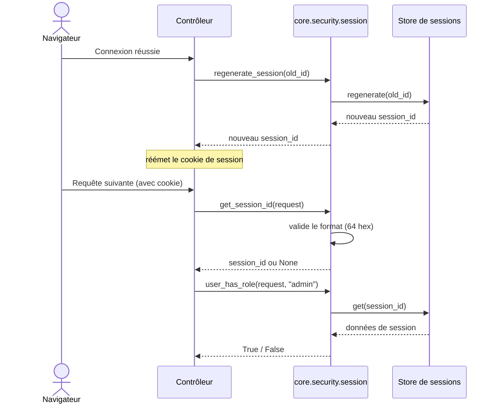

# La session dans Forge

Ce document décrit l'API de session côté serveur de `core.security.session` : lire, faire tourner, lire un rôle et gérer les messages flash.
Plusieurs fonctions historiques de ce module sont dépréciées au profit de `core.auth.session`.

## 1. Rôle

Une session garde une mémoire entre deux requêtes d'un même visiteur (connexion, messages flash).
Le module `core.security.session` identifie la session par un `session_id` transporté dans un cookie, et délègue le stockage au store de sessions (`core.sessions`).

Ce module porte aussi le nom du cookie de session (`SESSION_COOKIE_NAME`), l'extraction validée de l'identifiant depuis la requête, et la lecture des rôles et des messages flash.

## 2. Vue d'ensemble rapide

| Élément | Valeur |
|---|---|
| Module | `core.security.session` |
| Module Python | `core.security.session` |
| Couche | Sécurité |
| Rôle | gérer le cycle de vie d'une session côté serveur |
| Dépend de | `core.sessions.manager.get_session_store`, `core.sessions.keys`, `re` |
| API publique | `get_session`, `delete_session`, `regenerate_session`, `get_session_id`, `user_has_role`, `set_flash`, `get_flash`, plus les fonctions dépréciées ci-dessous |
| Constantes | `SESSION_COOKIE_NAME` = `"__Host-session_id"`, `SESSION_DURATION` = `3600` |
| API canonique | `core.auth.session` (login, authentification, utilisateur courant) |

Le store est résolu à chaque appel via `get_session_store()`, pour que `forge.configure(session_store=...)` soit pris en compte même si ce module est importé avant la configuration.

## 3. Schémas UML

### 3.1 Diagramme de séquence

Le diagramme montre la rotation d'identifiant au login (protection contre la fixation de session) et la lecture ultérieure.



À retenir :

- `regenerate_session` change l'identifiant en conservant les données : il ferme la fixation de session ;
- après rotation, l'appelant doit réémettre le cookie ;
- `get_session_id` valide le format (64 caractères hexadécimaux) et rejette tout identifiant malformé ;
- toutes les opérations de stockage passent par le store résolu dynamiquement.

## 4. API publique

| Fonction | Signature | Rôle |
|---|---|---|
| `get_session` | `get_session(session_id: str \| None) -> dict[str, Any] \| None` | données de la session, ou `None` si absente ou expirée |
| `delete_session` | `delete_session(session_id: str) -> None` | supprime la session (logout) |
| `regenerate_session` | `regenerate_session(old_session_id: str) -> str` | nouvel identifiant en conservant les données (anti-fixation) |
| `get_session_id` | `get_session_id(request: Request) -> str \| None` | extrait et valide l'identifiant depuis le cookie de la requête |
| `user_has_role` | `user_has_role(request: Request, role: str) -> bool` | `True` si l'utilisateur courant possède le rôle demandé |
| `set_flash` | `set_flash(session_id: str \| None, message: str, level: str = "success") -> None` | stocke un message flash (affiché une seule fois) |
| `get_flash` | `get_flash(session_id: str \| None) -> dict[str, Any] \| None` | retourne et supprime le message flash |

Constantes publiques : `SESSION_COOKIE_NAME` (`"__Host-session_id"`) et `SESSION_DURATION` (`3600` secondes).

### Fonctions dépréciées

Ces fonctions émettent un `DeprecationWarning` à l'appel.
Elles sont remplacées par l'API canonique `core.auth.session`.

| Fonction dépréciée | Remplacée par |
|---|---|
| `create_session()` | `core.sessions.manager.get_session_store().create()` |
| `authenticate_session(session_id, user)` | `core.auth.session.login_user(request, user)` |
| `is_authenticated(request)` | `core.auth.session.is_authenticated(request)` |
| `get_user(request)` | `core.auth.session.current_user(request, user_loader)` |

## 5. Contextes d'utilisation

| Besoin | Élément |
|---|---|
| Faire tourner l'identifiant au login | `regenerate_session(old_id)` puis réémission du cookie |
| Lire l'identifiant depuis la requête | `get_session_id(request)` |
| Lire les données d'une session | `get_session(session_id)` |
| Vérifier un rôle | `user_has_role(request, role)` |
| Afficher un message une fois | `set_flash` puis `get_flash` |
| Détruire la session au logout | `delete_session(session_id)` |

## 6. Exemples d'utilisation

Rotation au login, puis lecture d'un rôle :

```python
from core.security.session import regenerate_session, user_has_role

new_sid = regenerate_session(old_sid)
# réémettre le cookie de session avec new_sid

if user_has_role(request, "admin"):
    ...
```

Message flash autour d'une redirection :

```python
from core.security.session import set_flash, get_flash

set_flash(session_id, "Profil enregistré", level="success")
# ... après redirection
flash = get_flash(session_id)   # consommé une seule fois
```

## 7. Sécurité

!!! warning "Anti-fixation de session"
    Régénérer l'identifiant juste après le login (`regenerate_session`), puis réémettre le cookie.
    Cela empêche un attaquant d'imposer un identifiant de session connu d'avance.

!!! note "Identifiant validé à la lecture"
    `get_session_id` n'accepte qu'un identifiant de 64 caractères hexadécimaux.
    Tout cookie malformé est rejeté et renvoie `None`.

!!! tip "Préférer l'API canonique"
    Pour le login, l'authentification et l'utilisateur courant, utiliser `core.auth.session`.
    Les fonctions dépréciées de ce module restent disponibles seulement pour la compatibilité.

## Voir aussi

- [Les cookies de session dans Forge](cookies.md) : le transport de l'identifiant.
- [Les décorateurs de sécurité dans Forge](decorators.md) : `require_auth`, `require_role`.
- [Les middlewares de sécurité dans Forge](middleware.md) : `AuthMiddleware`, `CsrfMiddleware`.
- [La protection CSRF dans Forge](csrf.md) : le jeton vit dans la session.
