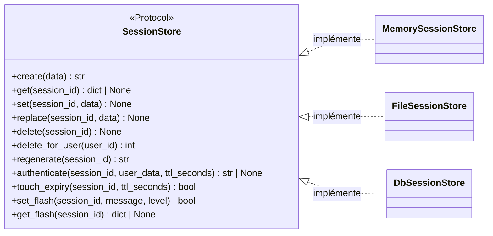

# Le contrat de backend de session dans Forge

Ce document décrit le contrat commun que tout backend de stockage de session doit respecter.
Le fichier de code correspondant est `core/sessions/contract.py`.

## 1. Rôle

Forge sait stocker les sessions de plusieurs façons : en mémoire, dans des fichiers ou dans une base MariaDB.
Pour que ces backends soient interchangeables, ils partagent une même interface.

`SessionStore` est cette interface.
C'est un `Protocol` Python décoré `@runtime_checkable` : tout objet qui expose les bonnes méthodes en est une implémentation valide, sans héritage explicite.

Les trois backends fournis par Forge (`MemorySessionStore`, `FileSessionStore`, `DbSessionStore`) respectent ce contrat.
Une application peut écrire son propre backend en implémentant les mêmes méthodes.

## 2. Vue d'ensemble rapide

| Élément | Valeur |
|---|---|
| Protocole | `SessionStore` |
| Module | `core.sessions.contract` |
| Couche | Sessions |
| Rôle | définir l'interface commune des backends de session |
| Nature | `typing.Protocol`, `@runtime_checkable` |
| API publique | `create`, `get`, `set`, `replace`, `delete`, `delete_for_user`, `regenerate`, `authenticate`, `touch_expiry`, `set_flash`, `get_flash` |
| Implémentations fournies | `MemorySessionStore`, `FileSessionStore`, `DbSessionStore` |
| Choisi par | `core.sessions.manager` |

`SessionStore` est un contrat de frontière : il sépare le code qui consomme une session du backend qui la stocke.

## 3. Schémas UML

### 3.1 Diagramme de classe

Le diagramme montre que les trois backends fournis implémentent le même protocole.
Le gestionnaire de backend ne connaît que le protocole, pas le backend concret.



À retenir :

- `SessionStore` ne contient aucune logique, seulement des signatures ;
- les trois backends officiels respectent ce contrat ;
- un backend sur mesure n'a qu'à exposer les mêmes méthodes ;
- le décorateur `@runtime_checkable` autorise `isinstance(obj, SessionStore)`.

## 4. API publique

| Méthode | Signature | Rôle |
|---|---|---|
| `create` | `create(self, data: dict[str, Any] | None = None) -> str` | crée une session et retourne son identifiant |
| `get` | `get(self, session_id: str) -> dict[str, Any] | None` | retourne les données de la session, ou `None` si absente ou expirée |
| `set` | `set(self, session_id: str, data: dict[str, Any]) -> None` | met à jour (merge) les données d'une session existante |
| `replace` | `replace(self, session_id: str, data: dict[str, Any]) -> None` | remplace intégralement les données, sans merge |
| `delete` | `delete(self, session_id: str) -> None` | supprime la session |
| `delete_for_user` | `delete_for_user(self, user_id: object) -> int` | supprime toutes les sessions du compte, et retourne leur nombre |
| `regenerate` | `regenerate(self, session_id: str) -> str` | crée un nouvel identifiant en conservant les données |
| `authenticate` | `authenticate(self, session_id: str, user_data: dict[str, Any], ttl_seconds: int) -> str | None` | rotation atomique : nouvel identifiant, écriture utilisateur, nouveau jeton CSRF ; `None` si la session n'existe pas |
| `touch_expiry` | `touch_expiry(self, session_id: str, ttl_seconds: int) -> bool` | repousse l'expiration ; `False` si la session n'existe pas |
| `set_flash` | `set_flash(self, session_id: str, message: str, level: str = "success") -> bool` | stocke un message flash ; `False` si la session n'existe pas |
| `get_flash` | `get_flash(self, session_id: str) -> dict[str, Any] | None` | lit et supprime atomiquement le message flash ; `None` si absent |

!!! warning "Révoquer les sessions d'un compte"
    `delete_for_user` ferme toutes les sessions déjà ouvertes d'un utilisateur.

    Trois événements l'exigent, et aucun ne pouvait être servi avant `SESSIONS-DELETE-FOR-USER-001` : l'activation d'un second facteur, le changement de mot de passe et la déconnexion à distance.
    Une session ouverte leur survivait, donc un accès obtenu avant l'événement restait valide après.

    L'identité comparée est celle que `login_user` pose, sous `SESSION_KEY_AUTH_USER_ID`.
    Une session anonyme n'est jamais touchée, et `None` ne révoque rien plutôt que de tout révoquer.

    Les stores mémoire et fichier balaient, leur volume étant borné par une seule instance.
    `DbSessionStore` interroge une colonne `user_id` indexée, sa table pouvant être grande et partagée entre processus.

!!! danger "Ajouter une méthode au contrat est une rupture"
    `SessionStore` est `@runtime_checkable` : un store auquel il manque une méthode n'est plus reconnu par `isinstance`, et `forge.configure` le refuse.

    Un store tiers écrit avant ce ticket doit donc implémenter `delete_for_user` pour rester accepté.
    C'est délibéré, un store qui ne sait pas révoquer ne remplissant pas le contrat de sécurité attendu (principe 10).

!!! note "Différence entre `set` et `replace`"
    `set` fusionne `data` dans la session existante : les clés non fournies sont conservées.
    `replace` écrase l'ensemble : les clés absentes de `data` sont supprimées.

## 5. Contextes d'utilisation

| Besoin | Élément |
|---|---|
| Brancher un backend conforme | `set_session_store(...)` (voir le gestionnaire) |
| Écrire un backend sur mesure | implémenter `SessionStore` |
| Vérifier qu'un objet est un backend | `isinstance(obj, SessionStore)` |

## 6. Exemples d'utilisation

Un backend sur mesure conforme au protocole.

```python
from typing import Any

from core.sessions.contract import SessionStore
from core.sessions.manager import set_session_store


class NullSessionStore:
    """Backend minimal : ne stocke rien (exemple de conformité au contrat)."""

    def create(self, data: dict[str, Any] | None = None) -> str:
        return "0" * 64

    def get(self, session_id: str) -> dict[str, Any] | None:
        return None

    def set(self, session_id: str, data: dict[str, Any]) -> None:
        ...

    def replace(self, session_id: str, data: dict[str, Any]) -> None:
        ...

    def delete(self, session_id: str) -> None:
        ...

    def regenerate(self, session_id: str) -> str:
        return "0" * 64

    def authenticate(self, session_id: str, user_data: dict[str, Any], ttl_seconds: int) -> str | None:
        return None

    def touch_expiry(self, session_id: str, ttl_seconds: int) -> bool:
        return False

    def set_flash(self, session_id: str, message: str, level: str = "success") -> bool:
        return False

    def get_flash(self, session_id: str) -> dict[str, Any] | None:
        return None


# Vérification de conformité au contrat.
assert isinstance(NullSessionStore(), SessionStore)

set_session_store(NullSessionStore())
```

## Voir aussi

- [Le gestionnaire de backend](manager.md) : choisir le backend actif.
- [Le backend mémoire](memory_store.md) : implémentation par défaut.
- [Le backend fichier](file_store.md) : persistance JSON sur disque.
- le store BDD `DbSessionStore` (opt-in `forge-mvc-sessions-db`) : sessions partagées entre processus.
- [Les clés de session](keys.md) : la structure de données rangée dans une session.
