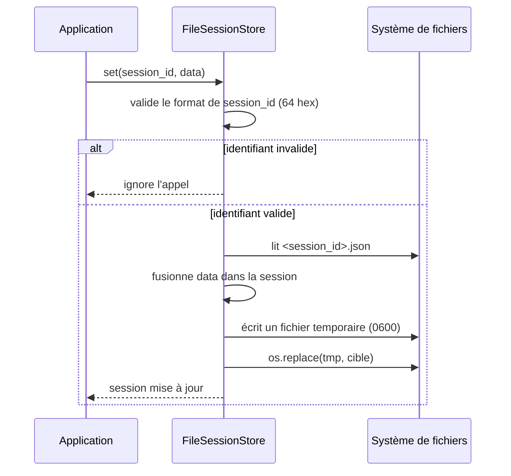

# Le backend de session fichier dans Forge

Ce document décrit le backend de session sur disque.
Le fichier de code correspondant est `core/sessions/file_store.py`.

## 1. Rôle

`FileSessionStore` stocke chaque session dans un fichier JSON sous un dossier dédié.
Chaque session occupe le fichier `<sessions_dir>/<session_id>.json`.

Les sessions survivent au redémarrage du processus, sans base de données.
Le backend est thread-safe via un `RLock`, mais il ne gère pas l'accès concurrent de plusieurs processus sur le même dossier sans verrou externe.

Ce backend est durci pour la sécurité : le dossier est forcé en `0700`, les fichiers sont créés en `0600`, et l'écriture est atomique (fichier temporaire puis `os.replace`).
Un identifiant de session non conforme au format attendu est rejeté, ce qui interdit toute traversée de chemin.

## 2. Vue d'ensemble rapide

| Élément | Valeur |
|---|---|
| Classe | `FileSessionStore` |
| Module | `core.sessions.file_store` |
| Couche | Sessions |
| Rôle | stocker chaque session dans un fichier JSON |
| Contrat respecté | `SessionStore` |
| Stockage | un fichier `<session_id>.json` par session |
| Dossier par défaut | `storage/sessions` |
| Concurrence | thread-safe (`RLock`), mono-processus sur le dossier |
| Persistance | oui, survit au redémarrage |
| Sécurité | dossier `0700`, fichiers `0600`, écriture atomique, identifiant filtré |

## 3. Schémas UML

### 3.1 Diagramme de séquence

Le diagramme montre l'écriture atomique et la validation de l'identifiant lors d'une mise à jour de session.



À retenir :

- l'identifiant doit être exactement 64 caractères hexadécimaux minuscules ;
- un identifiant invalide fait échouer silencieusement l'opération ;
- l'écriture passe par un fichier temporaire puis un `os.replace` atomique ;
- un crash en cours d'écriture ne corrompt pas le fichier existant.

## 4. API publique

`FileSessionStore` implémente l'intégralité du contrat `SessionStore` (voir [le contrat](contract.md)).
Il ajoute une méthode propre au backend.

| Élément | Signature | Rôle |
|---|---|---|
| Constructeur | `FileSessionStore(sessions_dir: Path | str = "storage/sessions", ttl: int = SESSION_TTL)` | crée le backend ; dossier de stockage et durée de vie en secondes |
| `cleanup_expired` | `cleanup_expired(self) -> int` | supprime les fichiers de session expirés et retourne le nombre supprimé |

## 5. Contextes d'utilisation

| Besoin | Élément |
|---|---|
| Persister les sessions sans base de données | `FileSessionStore()` |
| Déploiement mono-serveur | un seul nœud lit et écrit le dossier |
| Déploiement multi-nœud | préférer le store BDD `DbSessionStore` (opt-in `forge-mvc-sessions-db`) |
| Purger les sessions expirées du dossier | `cleanup_expired()` |

## 6. Exemples d'utilisation

Brancher le backend fichier au câblage de l'application.

```python
from core.sessions.file_store import FileSessionStore
from core.sessions.manager import set_session_store

set_session_store(FileSessionStore(sessions_dir="storage/sessions", ttl=3600))
```

Purger les sessions expirées, par exemple depuis un cron applicatif.

```python
from core.sessions.manager import get_session_store

store = get_session_store()
supprimees = store.cleanup_expired()
print(f"{supprimees} sessions expirées supprimées")
```

!!! warning "Un seul processus par dossier"
    Le verrou `RLock` ne protège que les threads d'un même processus.
    Plusieurs processus écrivant le même dossier sans verrou externe peuvent se concurrencer : pour un déploiement multi-worker, préférer le store BDD `DbSessionStore` (opt-in `forge-mvc-sessions-db`).

## Voir aussi

- [Le contrat de backend](contract.md) : l'interface implémentée.
- [Le gestionnaire de backend](manager.md) : brancher ce backend.
- [Le backend mémoire](memory_store.md) : le backend par défaut.
- le store BDD `DbSessionStore` (opt-in `forge-mvc-sessions-db`) : sessions partagées entre processus.
