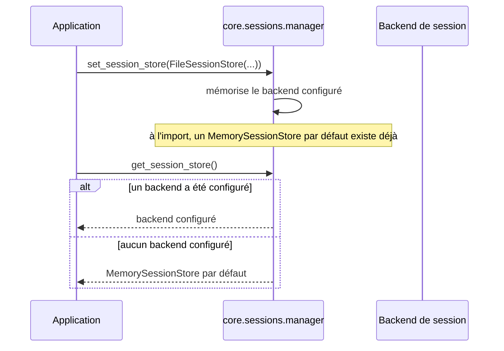

# Le gestionnaire de backend de session dans Forge

Ce document décrit comment Forge choisit le backend de session actif.
Le fichier de code correspondant est `core/sessions/manager.py`.

## 1. Rôle

Forge propose plusieurs backends de session : mémoire, fichier, MariaDB.
À un instant donné, un seul backend est actif pour toute l'application.

Le gestionnaire expose ce backend actif et permet d'en injecter un autre.
Sans configuration, le backend actif est un `MemorySessionStore` mono-processus.

L'injection se fait normalement au câblage de l'application, via `forge.configure(session_store=...)`, qui appelle `set_session_store(...)` en interne.

## 2. Vue d'ensemble rapide

| Élément | Valeur |
|---|---|
| Module | `core.sessions.manager` |
| Couche | Sessions |
| Rôle | exposer et injecter le backend de session actif |
| API publique | `get_session_store()`, `set_session_store(store)` |
| Backend par défaut | `MemorySessionStore` (mono-processus) |
| Contrat respecté par `store` | `SessionStore` |
| Appelé par | `forge.configure(session_store=...)` |

Le gestionnaire conserve un état de module : un backend par défaut figé et un backend configuré optionnel.

## 3. Schémas UML

### 3.1 Diagramme de séquence

Le diagramme montre l'ordre des opérations entre le câblage de l'application et la lecture du backend actif.



À retenir :

- le backend par défaut existe dès l'import du module ;
- `set_session_store(...)` remplace le backend actif ;
- `set_session_store(None)` réinitialise au backend mémoire par défaut ;
- `get_session_store()` renvoie le backend configuré, sinon le backend par défaut.

## 4. API publique

| Fonction | Signature | Rôle |
|---|---|---|
| `get_session_store` | `get_session_store() -> SessionStore` | retourne le backend de session actif |
| `set_session_store` | `set_session_store(store: SessionStore | None) -> None` | fixe le backend actif ; `None` réinitialise au backend mémoire par défaut |

## 5. Contextes d'utilisation

| Besoin | Élément |
|---|---|
| Lire le backend actif | `get_session_store()` |
| Brancher un backend persistant au démarrage | `set_session_store(FileSessionStore(...))` |
| Réinitialiser au backend par défaut (tests) | `set_session_store(None)` |

## 6. Exemples d'utilisation

Brancher le backend fichier au câblage de l'application.

```python
from core.sessions.file_store import FileSessionStore
from core.sessions.manager import get_session_store, set_session_store

set_session_store(FileSessionStore(sessions_dir="storage/sessions"))

store = get_session_store()   # le backend actif est maintenant FileSessionStore
session_id = store.create()
```

Réinitialiser au backend par défaut, utile entre deux tests.

```python
from core.sessions.manager import set_session_store

set_session_store(None)   # revient au MemorySessionStore par défaut
```

## Voir aussi

- [Le contrat de backend](contract.md) : l'interface attendue de `store`.
- [Le backend mémoire](memory_store.md) : le backend par défaut.
- [Le backend fichier](file_store.md) : persistance JSON sur disque.
- le store BDD `DbSessionStore` (opt-in `forge-mvc-sessions-db`) : sessions partagées entre processus.
