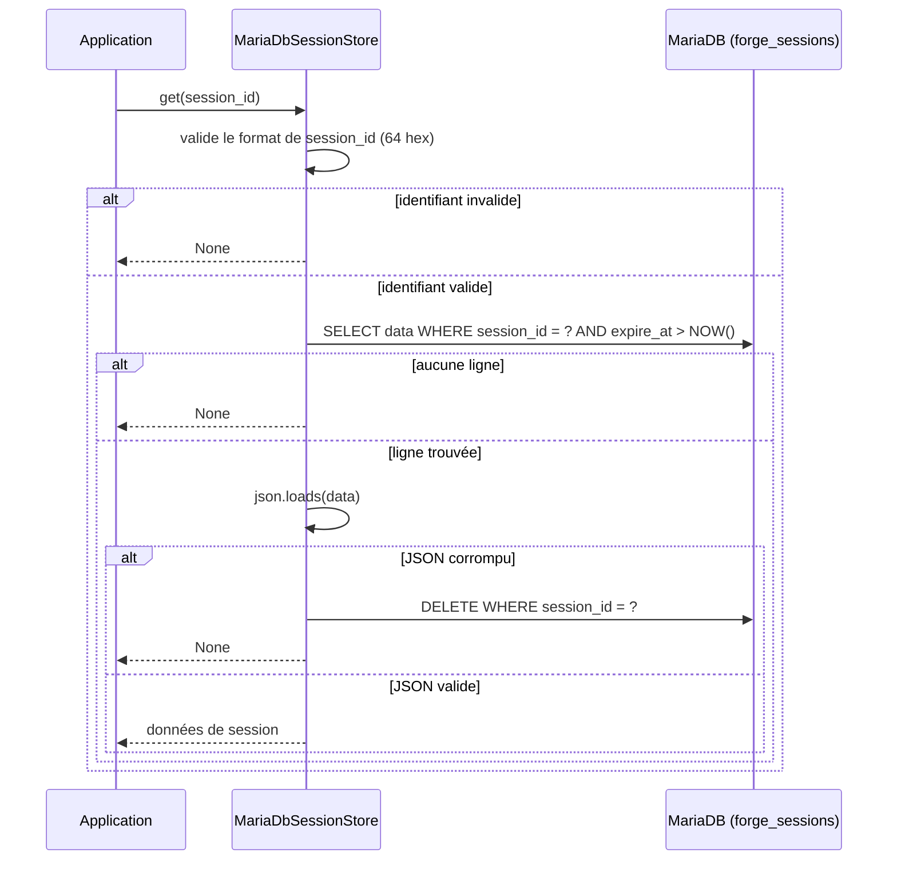

# Le backend de session MariaDB dans Forge

Ce document décrit le backend de session en base de données.
Le fichier de code correspondant est `core/sessions/mariadb_store.py`.

## 1. Rôle

`MariaDbSessionStore` stocke les sessions dans la table MariaDB `forge_sessions`.
Comme la base est partagée, ce backend convient aux déploiements multi-worker ou multi-nœud : tous les processus voient les mêmes sessions.

Les sessions sont sérialisées en JSON dans la colonne `data`, avec une date d'expiration `expire_at` filtrée côté SQL.
Les accesseurs SQL `fetch_one` et `execute` sont injectables au constructeur, ce qui facilite les tests sans base réelle.
À défaut, le backend utilise la connexion du noyau via `core.database.db`, chargée paresseusement pour éviter toute connexion à l'import.

La table requise est décrite dans `mvc/models/sql/forge_sessions.sql`.

## 2. Vue d'ensemble rapide

| Élément | Valeur |
|---|---|
| Classe | `MariaDbSessionStore` |
| Module | `core.sessions.mariadb_store` |
| Couche | Sessions |
| Rôle | stocker les sessions dans une table MariaDB |
| Contrat respecté | `SessionStore` |
| Stockage | table `forge_sessions` |
| Sérialisation | JSON dans la colonne `data` |
| Partage multi-worker | oui, via la base partagée |
| Persistance | oui, survit au redémarrage |
| Accès DB | `core.database.db` par défaut, injectable pour les tests |

## 3. Schémas UML

### 3.1 Diagramme de séquence

Le diagramme montre la lecture d'une session, avec filtrage de l'expiration côté SQL et purge des données corrompues.



À retenir :

- l'identifiant doit être exactement 64 caractères hexadécimaux minuscules ;
- l'expiration est filtrée par `expire_at > NOW()` directement en SQL ;
- une session au JSON corrompu est supprimée puis traitée comme absente ;
- l'écriture utilise des requêtes paramétrées (`?`), jamais de concaténation.

## 4. API publique

`MariaDbSessionStore` implémente l'intégralité du contrat `SessionStore` (voir [le contrat](contract.md)).
Il ajoute une méthode propre au backend.

| Élément | Signature | Rôle |
|---|---|---|
| Constructeur | `MariaDbSessionStore(fetch_one: _FetchOne | None = None, execute: _Execute | None = None, ttl: int = SESSION_TTL)` | crée le backend ; exécuteurs SQL injectables et durée de vie en secondes |
| `cleanup_expired` | `cleanup_expired(self) -> int` | supprime les sessions expirées et retourne le nombre de lignes supprimées |

Les paramètres `fetch_one` et `execute` ont les signatures suivantes.

| Accesseur | Signature attendue | Rôle |
|---|---|---|
| `fetch_one` | `(sql: str, params: tuple[Any, ...]) -> dict[str, Any] | None` | exécute un `SELECT` et retourne une ligne ou `None` |
| `execute` | `(sql: str, params: tuple[Any, ...]) -> int` | exécute un `INSERT`, `UPDATE` ou `DELETE` et retourne le nombre de lignes affectées |

## 5. Contextes d'utilisation

| Besoin | Élément |
|---|---|
| Sessions partagées entre plusieurs workers | `MariaDbSessionStore()` |
| Déploiement multi-nœud derrière la même base | `MariaDbSessionStore()` |
| Tester sans base réelle | injecter `fetch_one` et `execute` simulés |
| Purger les sessions expirées | `cleanup_expired()` |

## 6. Exemples d'utilisation

Brancher le backend MariaDB au câblage de l'application.

```python
from core.sessions.mariadb_store import MariaDbSessionStore
from core.sessions.manager import set_session_store

set_session_store(MariaDbSessionStore(ttl=3600))
```

Injecter des exécuteurs simulés pour un test sans base.

```python
from core.sessions.mariadb_store import MariaDbSessionStore

calls: list[tuple[str, tuple]] = []

def fake_fetch_one(sql, params):
    return None

def fake_execute(sql, params=()):
    calls.append((sql, params))
    return 1

store = MariaDbSessionStore(fetch_one=fake_fetch_one, execute=fake_execute)
session_id = store.create()
assert calls   # un INSERT a bien été émis
```

!!! note "Table requise"
    Ce backend suppose l'existence de la table `forge_sessions`.
    Le schéma de référence est fourni dans `mvc/models/sql/forge_sessions.sql`.

## Voir aussi

- [Le contrat de backend](contract.md) : l'interface implémentée.
- [Le gestionnaire de backend](manager.md) : brancher ce backend.
- [Le backend mémoire](memory_store.md) : le backend par défaut.
- [Le backend fichier](file_store.md) : persistance sur disque sans base.
