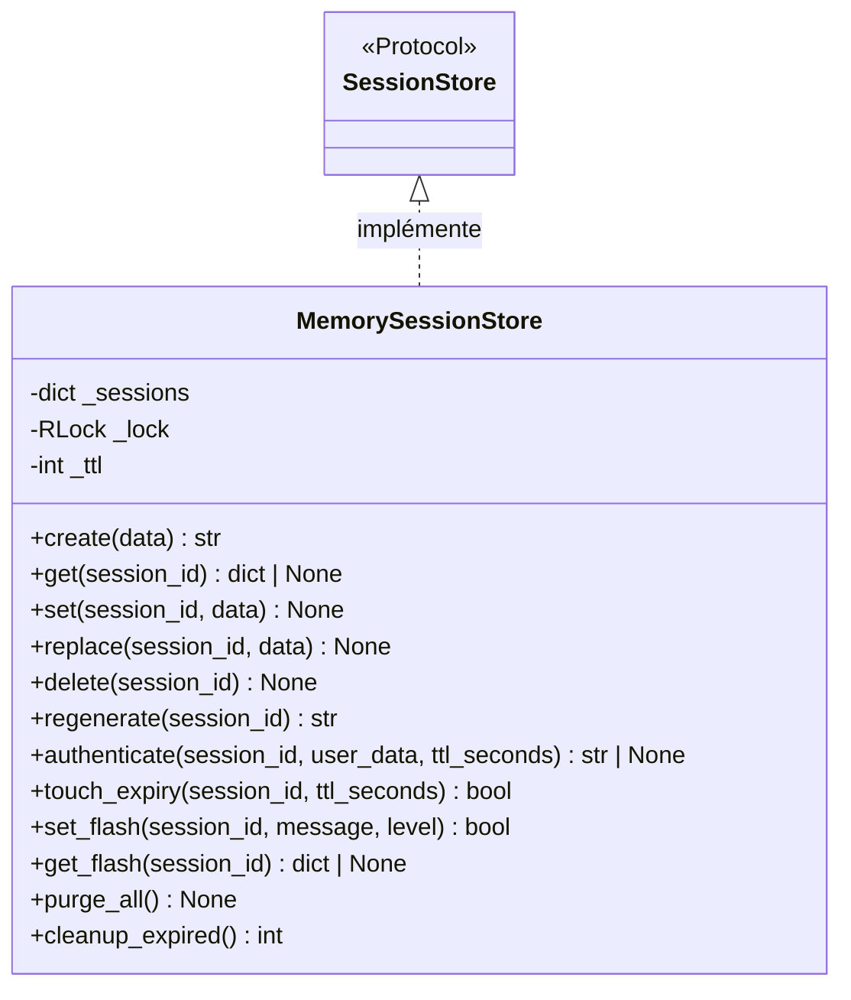

# Le backend de session mémoire dans Forge

Ce document décrit le backend de session par défaut, en mémoire.
Le fichier de code correspondant est `core/sessions/memory_store.py`.

## 1. Rôle

`MemorySessionStore` garde les sessions dans un dictionnaire Python, en mémoire du processus.
C'est le backend par défaut de Forge : simple, sans dépendance, adapté au développement et au mono-processus.

Il est thread-safe grâce à un `RLock` réentrant, ce qui permet à `create()` de déclencher un nettoyage interne sans interblocage.
Les sessions sont perdues au redémarrage du processus et ne sont pas partagées entre plusieurs workers.

Ce module exporte aussi la constante `SESSION_TTL`, la durée de vie par défaut commune aux trois backends.

## 2. Vue d'ensemble rapide

| Élément | Valeur |
|---|---|
| Classe | `MemorySessionStore` |
| Module | `core.sessions.memory_store` |
| Couche | Sessions |
| Rôle | stocker les sessions en mémoire du processus |
| Contrat respecté | `SessionStore` |
| Stockage | dictionnaire Python en mémoire |
| Concurrence | thread-safe (`threading.RLock`) |
| Persistance | aucune, perdu au redémarrage |
| Partage multi-worker | non |
| Constante exportée | `SESSION_TTL = 3600` (secondes) |

## 3. Schémas UML

### 3.1 Diagramme de classe

Le diagramme montre la structure interne et les méthodes propres à ce backend, en plus du contrat partagé.



À retenir :

- les sessions vivent dans `_sessions`, un dictionnaire en mémoire ;
- `_lock` est un `RLock` réentrant qui sérialise les accès ;
- `purge_all()` vide tout, réservé aux tests ;
- `cleanup_expired()` déclenche un balayage explicite des sessions expirées.

## 4. API publique

`MemorySessionStore` implémente l'intégralité du contrat `SessionStore` (voir [le contrat](contract.md)).
Il ajoute deux méthodes propres au backend.

| Élément | Signature | Rôle |
|---|---|---|
| Constructeur | `MemorySessionStore(ttl: int = SESSION_TTL)` | crée le backend ; `ttl` = durée de vie d'une session en secondes |
| `purge_all` | `purge_all(self) -> None` | vide toutes les sessions, usage réservé aux tests |
| `cleanup_expired` | `cleanup_expired(self) -> int` | supprime les sessions expirées et retourne le nombre supprimé |
| `SESSION_TTL` | `SESSION_TTL = 3600` | durée de vie par défaut, en secondes |

!!! note "Nettoyage des sessions expirées"
    Le nettoyage est opportuniste : `get()`, `replace()` et `touch_expiry()` retirent une session expirée à son accès, et `create()` déclenche un balayage global. `cleanup_expired()` permet en plus un balayage complet déclenché explicitement, sans thread ni scheduler.

## 5. Contextes d'utilisation

| Besoin | Élément |
|---|---|
| Développement, sans configuration | backend par défaut, rien à faire |
| Déploiement mono-processus | `MemorySessionStore()` |
| Vider les sessions entre deux tests | `purge_all()` |
| Forcer un nettoyage des expirées | `cleanup_expired()` |

## 6. Exemples d'utilisation

Utiliser le backend par défaut, déjà actif sans configuration.

```python
from core.sessions.manager import get_session_store

store = get_session_store()        # MemorySessionStore par défaut
session_id = store.create()
store.set(session_id, {"theme": "sombre"})
```

Instancier explicitement avec une durée de vie personnalisée.

```python
from core.sessions.memory_store import MemorySessionStore
from core.sessions.manager import set_session_store

set_session_store(MemorySessionStore(ttl=1800))   # sessions de 30 minutes
```

!!! warning "Pas de persistance ni de partage"
    Les sessions sont perdues au redémarrage du processus et ne sont pas visibles d'un autre worker.
    Pour un déploiement multi-worker ou persistant, utiliser [le backend fichier](file_store.md) ou [le backend MariaDB](mariadb_store.md).

## Voir aussi

- [Le contrat de backend](contract.md) : l'interface implémentée.
- [Le gestionnaire de backend](manager.md) : brancher un autre backend.
- [Le backend fichier](file_store.md) : persistance sur disque.
- [Le backend MariaDB](mariadb_store.md) : sessions partagées entre processus.
