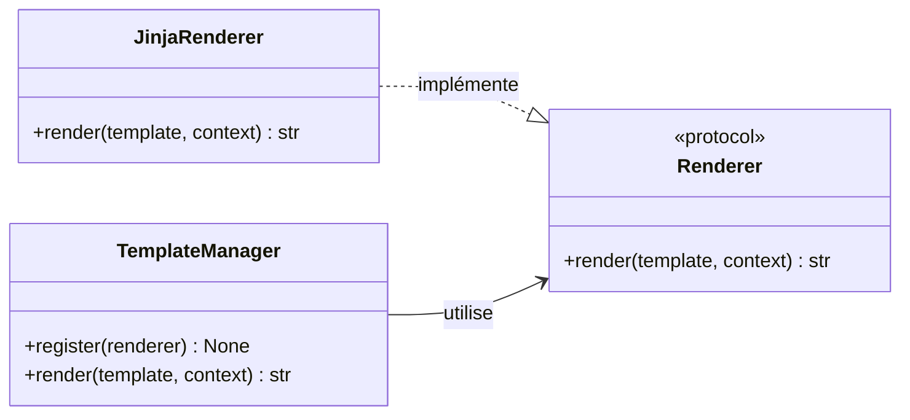

# Le contrat de rendu dans Forge

Ce document décrit `Renderer`, le protocole qui définit l'interface d'un moteur de rendu de gabarits.
Il explique son rôle, sa place dans l'architecture et la façon de l'utiliser.
Le fichier de code correspondant est `core/templating/contracts.py`.

## 1. Rôle

`Renderer` est le contrat minimal qu'un moteur de rendu doit respecter pour être branché dans Forge.

Pour découpler le cœur d'une implémentation précise, le rendu de gabarits passe par un protocole plutôt que par une classe concrète.
Tout objet qui sait rendre un gabarit nommé avec un contexte vers une chaîne est un `Renderer` valide.
Le moteur par défaut de Forge (Jinja2, enregistré dans `TemplateManager`) respecte ce contrat.

`Renderer` est un `Protocol` annoté `@runtime_checkable` : un objet est reconnu comme `Renderer` dès qu'il possède une méthode `render` à la bonne signature, sans héritage explicite.

## 2. Vue d'ensemble rapide

| Élément | Valeur |
|---|---|
| Protocole | `Renderer` |
| Module | `core.templating.contracts` |
| Couche | Templating |
| Rôle | définir l'interface attendue d'un moteur de rendu de gabarits |
| Nature | `typing.Protocol`, annoté `@runtime_checkable` |
| Méthode du contrat | `render(template: str, context: dict[str, Any]) -> str` |
| Implémentation par défaut | le renderer Jinja2 branché dans `TemplateManager` |
| Utilisé par | `TemplateManager` pour déléguer le rendu |

`Renderer` est un point d'extension : il permet de substituer le moteur de rendu sans modifier le cœur.

## 3. Schéma UML

Le composant est un simple contrat à une méthode, sans flux propre.
Un diagramme de classe suffit pour montrer la relation entre le protocole et ses implémentations.



À retenir :

- `Renderer` ne contient qu'une seule méthode : `render` ;
- toute classe possédant cette méthode est un `Renderer` valide, sans héritage explicite ;
- `TemplateManager` dépend de `Renderer`, pas d'une implémentation concrète ;
- le moteur Jinja2 par défaut implémente ce contrat.

## 4. API publique

| Élément | Signature | Rôle |
|---|---|---|
| `Renderer` | `class Renderer(Protocol)` | contrat d'un moteur de rendu, vérifiable à l'exécution |
| `Renderer.render` | `render(self, template: str, context: dict[str, Any]) -> str` | rend le gabarit nommé avec le contexte fourni en chaîne |

## 5. Contextes d'utilisation

| Besoin | Élément |
|---|---|
| Typer une dépendance de rendu sans la lier à une implémentation | annoter par `Renderer` |
| Brancher un moteur de rendu personnalisé | fournir une classe conforme à `Renderer` |
| Vérifier qu'un objet est un renderer | `isinstance(obj, Renderer)` (protocole `@runtime_checkable`) |

## 6. Exemples d'utilisation

Définir un moteur conforme au contrat, sans héritage explicite :

```python
from core.templating.contracts import Renderer


class JinjaRenderer:
    def render(self, template: str, context: dict[str, object]) -> str:
        # rendu Jinja2 réel ici
        ...


renderer: Renderer = JinjaRenderer()
```

Typer une fonction par le contrat plutôt que par une implémentation :

```python
from core.templating.contracts import Renderer


def render_home(renderer: Renderer) -> str:
    return renderer.render("home/index.html", {"title": "Accueil"})
```

Vérifier la conformité à l'exécution :

```python
from core.templating.contracts import Renderer

assert isinstance(JinjaRenderer(), Renderer)
```

## 7. Détails techniques

!!! note "Protocole vérifiable à l'exécution"
    `Renderer` est annoté `@runtime_checkable`.

    `isinstance(obj, Renderer)` vérifie alors la présence de la méthode `render`, mais pas sa signature exacte.

    Le typage statique reste la garantie principale du respect du contrat.

## Voir aussi

- [Le gestionnaire de gabarits dans Forge](manager.md) : l'implémentation par défaut qui utilise ce contrat.
- [Les erreurs de gabarit dans Forge](errors.md) : `TemplateNotFoundError` et le formatage des messages.
