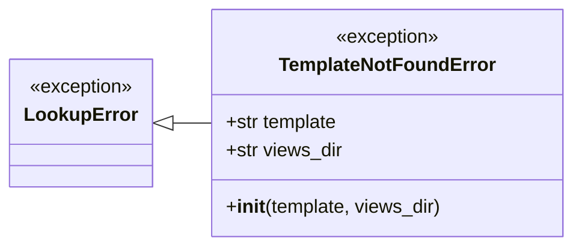

# Les erreurs de gabarit dans Forge

Ce document décrit `TemplateNotFoundError` et les fonctions de formatage des messages associés.
Il explique leur rôle, leur place dans l'architecture, l'API publique et le contrat dev / prod.
Le fichier de code correspondant est `core/templating/errors.py`.

## 1. Rôle

Ce module définit l'erreur levée quand un gabarit demandé est introuvable, et le formatage de son message selon l'environnement.

`TemplateNotFoundError` est l'exception interne levée par le renderer (Jinja2 aujourd'hui) quand un template demandé via `BaseController.render(...)` n'existe pas dans `mvc/views/`.
Le module fournit aussi deux fonctions de formatage du message d'erreur : une version pédagogique en `APP_ENV=dev` et une version sobre en `APP_ENV=prod`.
Le format pédagogique est volontairement en `text/plain` : il reste lisible dans tous les contextes (curl, journal, navigateur) et se distingue clairement d'une vraie page d'erreur HTML.

Le module définit seulement le contrat : le déclenchement et l'affichage du message restent côté CLI ou HTTP.

## 2. Vue d'ensemble rapide

| Élément | Valeur |
|---|---|
| Exception | `TemplateNotFoundError` |
| Module | `core.templating.errors` |
| Couche | Templating |
| Rôle | signaler un gabarit introuvable et formater le message |
| Classe parente | `LookupError` |
| Levée par | le renderer, quand le template demandé n'existe pas |
| API publique | `TemplateNotFoundError`, `format_missing_template_dev`, `format_missing_template_prod` |
| Contrat associé | message pédagogique en dev, message minimal en prod |
| Ticket d'origine | DX-RENDER-ERROR-001 |

`TemplateNotFoundError` hérite de `LookupError` pour rester filtrable par des helpers génériques qui ciblent la famille « ressource introuvable ».

## 3. Schéma UML

Le composant est une exception accompagnée de deux fonctions de formatage, sans flux complexe.
Un diagramme de classe suffit pour montrer la hiérarchie et les attributs.



À retenir :

- `TemplateNotFoundError` hérite de `LookupError`, pas directement de `Exception` ;
- elle porte le chemin du `template` demandé et le `views_dir` configuré si connu ;
- le message d'erreur final est produit par les fonctions de formatage, pas par l'exception seule ;
- le formatage distingue le mode développement du mode production.

## 4. API publique

| Élément | Signature | Rôle |
|---|---|---|
| `TemplateNotFoundError` | `TemplateNotFoundError(template: str, views_dir: str \| None = None)` | exception levée quand un gabarit est introuvable |
| `format_missing_template_dev` | `format_missing_template_dev(template: str, views_dir: str \| None) -> str` | message pédagogique en `APP_ENV=dev` (chemin cherché, exemples, alternatives) |
| `format_missing_template_prod` | `format_missing_template_prod() -> str` | message court en `APP_ENV=prod`, sans fuite de chemin interne |

Les attributs publics de l'exception sont `template` (chemin demandé) et `views_dir` (dossier `mvc/views/` configuré, ou `None`).

## 5. Contextes d'utilisation

| Besoin | Élément |
|---|---|
| Signaler un gabarit absent depuis le renderer | lever `TemplateNotFoundError(...)` |
| Afficher un message guidant en développement | `format_missing_template_dev(...)` |
| Afficher un message sobre en production | `format_missing_template_prod()` |
| Filtrer génériquement les « ressources introuvables » | capturer `LookupError` |

## 6. Exemples d'utilisation

Lever l'exception depuis un renderer quand le template manque :

```python
from core.templating.errors import TemplateNotFoundError

raise TemplateNotFoundError("welcome/index.html", views_dir="mvc/views")
```

Construire le message selon l'environnement :

```python
from core.forge import get as cfg
from core.templating.errors import (
    TemplateNotFoundError,
    format_missing_template_dev,
    format_missing_template_prod,
)

try:
    html = render_view("welcome/index.html")
except TemplateNotFoundError as exc:
    if cfg("app_env") == "prod":
        body = format_missing_template_prod()
    else:
        body = format_missing_template_dev(exc.template, exc.views_dir)
```

Le message de développement cite la vue cherchée et propose des alternatives :

```text
Vue introuvable : welcome/index.html

BaseController.render() attend un chemin de template relatif à mvc/views/.

Forge a cherché une vue correspondant à :
  mvc/views/welcome/index.html

Exemples valides :
  BaseController.render("landing/index.html", request=request)
  BaseController.render("welcome/index.html", request=request)
```

## 7. Le contrat dev / prod

!!! tip "Message pédagogique en développement"
    En `APP_ENV=dev`, `format_missing_template_dev(...)` guide le développeur.

    Il cite le nom de la vue, rappelle le rôle de `render()`, montre le chemin cherché, donne des exemples valides et propose les alternatives `Response.text(...)` et `Response.debug(...)`.

!!! warning "Message minimal en production"
    En `APP_ENV=prod`, `format_missing_template_prod()` renvoie un message court.

    Aucun chemin du serveur n'est divulgué, pour éviter toute fuite d'information interne.

## Voir aussi

- [Le gestionnaire de gabarits dans Forge](manager.md) : le rendu d'où provient l'erreur.
- [Le contrat de rendu dans Forge](contracts.md) : l'interface `Renderer` qui lève l'erreur.
