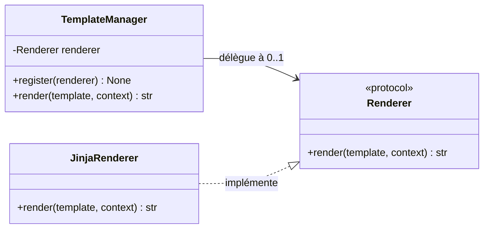
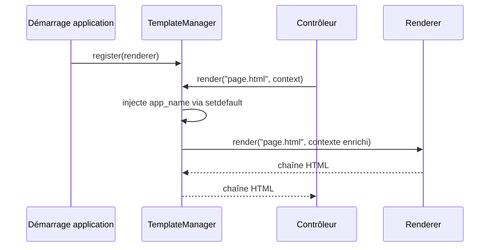

# Le gestionnaire de gabarits dans Forge

Ce document décrit `TemplateManager`, le point d'entrée de rendu de gabarits du cœur Forge.
Il explique son rôle, sa place dans l'architecture, son API publique et la façon de l'utiliser.
Le fichier de code correspondant est `core/templating/manager.py`.

## 1. Rôle

`TemplateManager` rend une vue nommée en HTML à partir d'un contexte de données.

Forge n'impose pas directement un moteur de rendu : `TemplateManager` délègue le rendu à un objet conforme au protocole `Renderer` (Jinja2 dans l'implémentation par défaut).
Au démarrage, l'application enregistre un renderer avec `register(...)`.
Ensuite, chaque appel à `render(...)` produit la chaîne HTML correspondante.

Le gestionnaire injecte automatiquement la variable `app_name` (lue dans la configuration `APP_NAME`) dans tout contexte de rendu.
Ainsi, le nom de l'application est disponible partout : layout partagé, pages, pages d'erreur.
Il injecte de la même façon `forge_version`, la version du paquet `forge-mvc` installé (chaîne vide si le paquet est introuvable), disponible dans tout template.
L'injection se fait avec `setdefault`, donc un contrôleur peut toujours surcharger ces valeurs.

En pratique, le rendu est généralement appelé via `BaseController.render(...)`, qui s'appuie sur l'instance partagée `template_manager`.

## 2. Vue d'ensemble rapide

| Élément | Valeur |
|---|---|
| Classe | `TemplateManager` |
| Instance partagée | `template_manager` |
| Module | `core.templating.manager` |
| Couche | Templating |
| Rôle | rendre une vue nommée en HTML à partir d'un contexte |
| Dépend de | le protocole `Renderer` (contrat de rendu) |
| Dépend de | la configuration `app_name` (`core.forge.get`) |
| API publique | `register(renderer)`, `render(template, context)` |
| Objet lié | `Renderer` (le moteur de rendu enregistré) |
| Exception liée | `RuntimeError` si aucun renderer n'est enregistré |

`TemplateManager` est un point de délégation : il ne sait pas rendre lui-même, il transmet l'appel au renderer enregistré.

## 3. Schémas UML

Les deux schémas suivants montrent deux vues complémentaires de `TemplateManager`.
Le diagramme de classe montre la relation avec le renderer.
Le diagramme de séquence montre le déroulement d'un rendu.

### 3.1 Diagramme de classe

Le diagramme de classe montre que `TemplateManager` détient un `Renderer` optionnel et lui délègue le rendu.



À retenir :

- `TemplateManager` ne rend pas lui-même : il délègue au renderer enregistré ;
- le renderer est optionnel au départ, il doit être enregistré avec `register(...)` ;
- tout objet conforme au protocole `Renderer` peut être branché ;
- l'implémentation par défaut de Forge repose sur Jinja2.

### 3.2 Diagramme de séquence

Le diagramme de séquence montre l'ordre des opérations lors d'un rendu déclenché par un contrôleur.



À retenir :

- l'enregistrement du renderer se fait une fois au démarrage ;
- chaque rendu enrichit le contexte avec `app_name` avant délégation ;
- si aucun renderer n'est enregistré, `render(...)` lève `RuntimeError` ;
- le contrôleur reçoit directement la chaîne HTML produite.

## 4. API publique

| Élément | Signature | Rôle |
|---|---|---|
| `TemplateManager` | `TemplateManager()` | crée un gestionnaire sans renderer enregistré |
| `register` | `register(self, renderer: Renderer) -> None` | enregistre le moteur de rendu à utiliser |
| `render` | `render(self, template: str, context: dict[str, Any]) -> str` | rend la vue nommée, contexte enrichi de `app_name`, en chaîne HTML |
| `template_manager` | instance partagée de `TemplateManager` | gestionnaire prêt à l'emploi, utilisé par `BaseController.render(...)` |

## 5. Contextes d'utilisation

| Besoin | Élément |
|---|---|
| Brancher un moteur de rendu au démarrage | `template_manager.register(...)` |
| Rendre une vue depuis un contrôleur | `BaseController.render(...)` (s'appuie sur `template_manager`) |
| Rendre une vue hors contrôleur | `template_manager.render(...)` |
| Disposer du nom d'application dans une vue | variable `app_name` (injectée automatiquement) |

## 6. Exemples d'utilisation

Enregistrement d'un renderer au démarrage :

```python
from core.templating.manager import template_manager
from core.templating.contracts import Renderer


class JinjaRenderer:
    def render(self, template: str, context: dict[str, object]) -> str:
        # rendu Jinja2 réel ici
        ...


template_manager.register(JinjaRenderer())
```

Rendu d'une vue avec un contexte :

```python
from core.templating.manager import template_manager

html = template_manager.render(
    "welcome/index.html",
    {"title": "Bonjour Forge"},
)
```

Le contexte est enrichi automatiquement avec `app_name`, sauf si le contrôleur fournit déjà sa propre valeur :

```python
html = template_manager.render(
    "welcome/index.html",
    {"app_name": "Mon application"},   # surcharge la valeur par défaut
)
```

## 7. Détails techniques

!!! note "Renderer obligatoire avant tout rendu"
    Un `TemplateManager` neuf n'a pas de renderer.

    Si `render(...)` est appelé sans `register(...)` préalable, Forge lève `RuntimeError` avec un message indiquant d'appeler `template_manager.register()` au démarrage.

!!! tip "Injection de app_name"
    `app_name` est injecté dans tout contexte de rendu, quel que soit le chemin emprunté : layout partagé, pages, pages d'erreur.

    L'injection utilise `setdefault`, donc une valeur fournie par le contrôleur a toujours la priorité.

## Voir aussi

- [Le contrat de rendu dans Forge](contracts.md) : l'interface `Renderer` attendue par le gestionnaire.
- [Les erreurs de gabarit dans Forge](errors.md) : `TemplateNotFoundError` et le formatage des messages.
