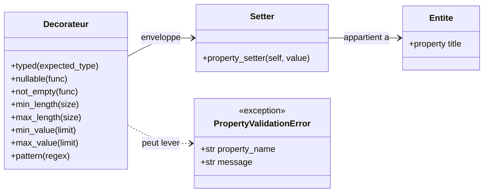
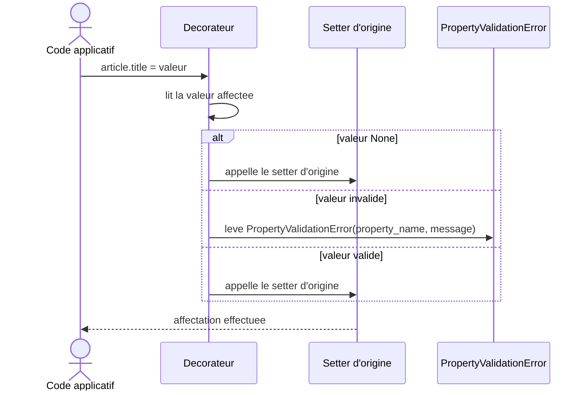

# Les décorateurs de validation dans Forge

Ce document explique comment Forge valide les propriétés d'une entité avec des décorateurs, comment ce module se situe dans le cœur du framework, et comment poser ces contraintes sur les setters de propriété.

Le fichier de code correspondant est `core/validation/decorators.py`.

## 1. Rôle

Les propriétés d'une entité doivent souvent respecter des contraintes : un type Python attendu, une longueur de chaîne, une plage numérique ou un format.

Ce module fournit des décorateurs à poser sur les setters de propriété.
Chaque décorateur vérifie la valeur reçue avant de la transmettre au setter d'origine.

La validation est explicite : elle refuse une valeur invalide en levant `PropertyValidationError`, et ne convertit jamais la valeur en douce.
Une valeur acceptée est transmise telle quelle au setter, sans transformation implicite.

```python
from core.validation import typed, not_empty, max_length


class Article:
    @property
    def title(self) -> str:
        return self._title

    @title.setter
    @typed(str)
    @not_empty
    @max_length(120)
    def title(self, value: str) -> None:
        self._title = value
```

Le décorateur `nullable` joue un rôle particulier : il marque la propriété comme acceptant `None`.
Tous les autres décorateurs laissent déjà passer la valeur `None` sans la valider ; `nullable` sert à déclarer cette intention de façon visible et exploitable par le reste du framework.

## 2. Vue d'ensemble rapide

| Élément | Valeur |
|---|---|
| Module | `core.validation.decorators` |
| Couche | Validation du cœur |
| Rôle | poser des contraintes sur les setters de propriété d'entité |
| API publique | `typed`, `nullable`, `not_empty`, `min_length`, `max_length`, `min_value`, `max_value`, `pattern` |
| Exposé par | `core.validation` |
| Exception liée | `PropertyValidationError` |
| Principe | valider sans transformer ; lever plutôt que corriger |

Ce module est un ensemble de fonctions décoratrices.
Il n'expose pas de classe : chaque entrée publique est un décorateur appliqué à un setter.

## 3. Schémas UML

### 3.1 Diagramme de classe

Le diagramme montre comment un décorateur enveloppe le setter d'une propriété d'entité, et son lien avec `PropertyValidationError`.

Il permet de voir que le décorateur ne remplace pas le setter : il l'enveloppe, contrôle la valeur, puis appelle le setter d'origine si la valeur est acceptée.



À retenir :

- un décorateur enveloppe le setter d'une propriété ;
- le setter appartient à une entité ;
- une valeur invalide fait lever `PropertyValidationError` ;
- une valeur valide est transmise au setter d'origine sans transformation.

### 3.2 Diagramme de séquence

Le diagramme montre l'ordre des opérations lors d'une affectation de propriété protégée par un décorateur.

Il permet de comprendre que la validation s'intercale entre l'affectation écrite par le développeur et le setter réel de la propriété.



À retenir :

- la valeur `None` traverse les décorateurs sans validation ;
- une valeur invalide interrompt l'affectation par une exception ;
- une valeur valide est transmise au setter d'origine ;
- aucune valeur n'est convertie en chemin de validation.

## 4. API publique

Tous ces décorateurs sont exposés par `core.validation` et par `core.validation.decorators`.

| Décorateur | Signature | Rôle |
|---|---|---|
| `typed` | `typed(expected_type: type)` | valide que la valeur est du type Python attendu ; pour `int`, refuse explicitement un `bool` |
| `nullable` | `nullable(func)` | marque la propriété comme acceptant `None` |
| `not_empty` | `not_empty(func)` | refuse les chaînes vides ou composées d'espaces |
| `min_length` | `min_length(size: int)` | impose une longueur minimale sur une chaîne |
| `max_length` | `max_length(size: int)` | impose une longueur maximale sur une chaîne |
| `min_value` | `min_value(limit: int \| float)` | impose une valeur numérique minimale |
| `max_value` | `max_value(limit: int \| float)` | impose une valeur numérique maximale |
| `pattern` | `pattern(regex: str)` | impose que la chaîne corresponde entièrement au motif (`fullmatch`) |

!!! note "Validation paramétrée et validation directe"
    `typed`, `min_length`, `max_length`, `min_value`, `max_value` et `pattern` prennent un argument : on les écrit avec des parenthèses, par exemple `@typed(str)` ou `@max_length(120)`.

    `nullable` et `not_empty` s'appliquent directement, sans parenthèses : `@nullable`, `@not_empty`.

!!! warning "Bornes refusées"
    `min_length(size)` et `max_length(size)` lèvent `ValueError` à la déclaration si `size` est négatif.

    Le contrôle s'effectue au moment où le décorateur est posé, avant toute affectation de propriété.

## 5. Contextes d'utilisation

| Besoin | Élément |
|---|---|
| Vérifier le type Python d'une propriété | `typed(expected_type)` |
| Déclarer qu'une propriété accepte `None` | `nullable` |
| Refuser une chaîne vide ou blanche | `not_empty` |
| Imposer une longueur de chaîne | `min_length(size)` / `max_length(size)` |
| Imposer une plage numérique | `min_value(limit)` / `max_value(limit)` |
| Imposer un format de chaîne | `pattern(regex)` |
| Identifier l'erreur levée | `PropertyValidationError` |

Ces décorateurs se posent sur les setters de propriété d'une entité, généralement empilés du plus général (`typed`) au plus spécifique (longueur, format).

## 6. Exemples d'utilisation

??? example "Valider le type sans conversion"

    ```python
    from core.validation import typed, PropertyValidationError


    class Compteur:
        @property
        def total(self) -> int:
            return self._total

        @total.setter
        @typed(int)
        def total(self, value: int) -> None:
            self._total = value


    compteur = Compteur()
    compteur.total = 3        # accepte

    try:
        compteur.total = "3"  # refuse : ce n'est pas un int
    except PropertyValidationError as error:
        print(error.property_name)  # "total"
        print(error.message)
    ```

    `typed(int)` refuse aussi un `bool`, car `True` et `False` sont des entiers en Python mais ne représentent pas un compteur.

??? example "Combiner plusieurs contraintes"

    ```python
    from core.validation import typed, not_empty, min_length, max_length


    class Article:
        @property
        def title(self) -> str:
            return self._title

        @title.setter
        @typed(str)
        @not_empty
        @min_length(3)
        @max_length(120)
        def title(self, value: str) -> None:
            self._title = value
    ```

    Le titre doit être une chaîne, non vide, d'au moins 3 caractères et d'au plus 120 caractères.

??? example "Déclarer une propriété nullable"

    ```python
    from core.validation import nullable, typed


    class Profil:
        @property
        def bio(self) -> str | None:
            return self._bio

        @bio.setter
        @nullable
        @typed(str)
        def bio(self, value: str | None) -> None:
            self._bio = value


    profil = Profil()
    profil.bio = None       # accepte
    profil.bio = "Bonjour"  # accepte
    ```

    `nullable` marque la propriété comme acceptant `None`.
    Les autres décorateurs laissent déjà passer `None` sans le valider.

??? example "Imposer un format avec pattern"

    ```python
    from core.validation import pattern, PropertyValidationError


    class Contact:
        @property
        def code_postal(self) -> str:
            return self._code_postal

        @code_postal.setter
        @pattern(r"\d{5}")
        def code_postal(self, value: str) -> None:
            self._code_postal = value


    contact = Contact()
    contact.code_postal = "75001"  # accepte

    try:
        contact.code_postal = "ABC"  # refuse : ne correspond pas au motif
    except PropertyValidationError as error:
        print(error.message)
    ```

    `pattern` utilise `fullmatch` : la chaîne entière doit correspondre au motif, pas seulement une partie.

## 7. Détails techniques

!!! tip "Empilement des décorateurs"
    Les décorateurs s'appliquent de bas en haut à la déclaration, mais s'exécutent de haut en bas à l'affectation.

    En pratique, placez `nullable` et `typed` en premier, puis les contraintes plus fines (longueur, plage, format) en dessous.

!!! note "La valeur None traverse les contraintes"
    Chaque décorateur de contrainte ignore une valeur `None` et la transmet au setter sans la valider.

    C'est `nullable` qui exprime, de façon explicite, qu'une propriété accepte réellement l'absence de valeur.

!!! warning "Cohérence type et contrainte"
    Les contraintes de chaîne (`not_empty`, `min_length`, `max_length`, `pattern`) lèvent `PropertyValidationError` si la valeur n'est pas une chaîne.

    Les contraintes numériques (`min_value`, `max_value`) lèvent `PropertyValidationError` si la valeur n'est pas un nombre, et refusent un `bool`.

    Posez `typed` en amont pour obtenir un message d'erreur plus clair sur le type attendu.

## Voir aussi

- [L'erreur de validation dans Forge](exceptions.md) : l'exception `PropertyValidationError` levée par ces décorateurs.
