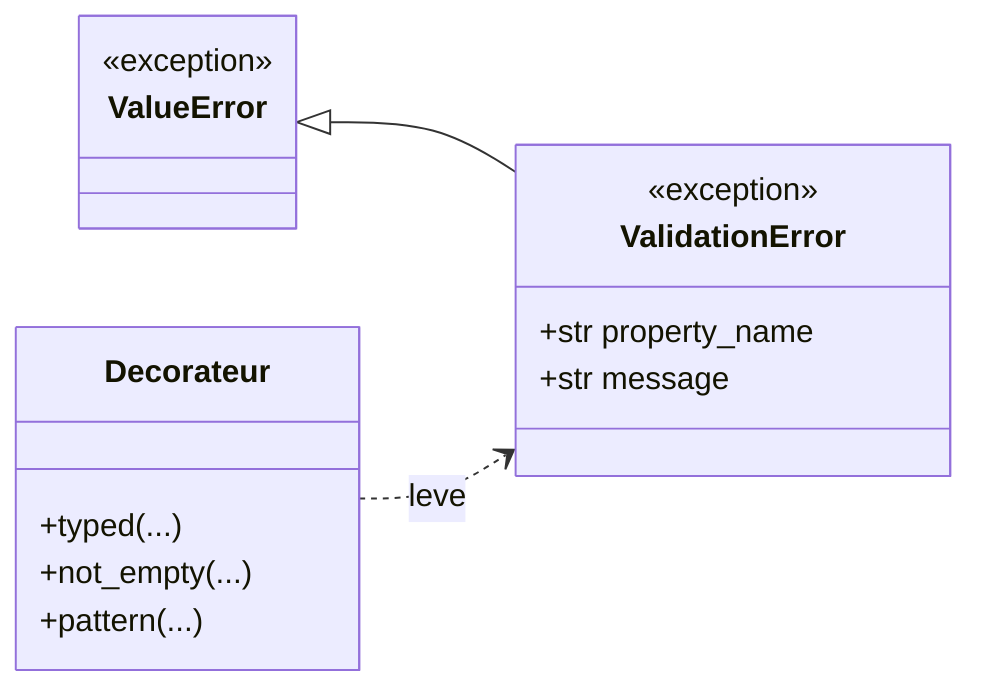

# L'erreur de validation dans Forge

Ce document explique l'exception centrale de validation des entités, son rôle dans le cœur du framework, et comment la lire dans le code applicatif.

Le fichier de code correspondant est `core/validation/exceptions.py`.

## 1. Rôle

`ValidationError` est l'exception unique levée quand une contrainte de propriété n'est pas respectée.

Elle porte deux informations : le nom de la propriété fautive et un message décrivant la raison du refus.
Ainsi, le code qui attrape l'erreur sait exactement quelle propriété a posé problème et peut afficher le bon message au bon endroit.

`ValidationError` hérite de `ValueError`.
Un code qui attrape déjà `ValueError` capture donc aussi les erreurs de validation Forge.

```python
from core.validation import ValidationError

try:
    article.title = ""
except ValidationError as error:
    print(error.property_name)  # "title"
    print(error.message)        # la raison du refus
```

## 2. Vue d'ensemble rapide

| Élément | Valeur |
|---|---|
| Classe | `ValidationError` |
| Module | `core.validation.exceptions` |
| Couche | Validation du cœur |
| Hérite de | `ValueError` |
| Rôle | signaler une propriété qui ne respecte pas sa contrainte |
| Levée par | les décorateurs de `core.validation.decorators` |
| Exposée par | `core.validation` |
| Attributs | `property_name`, `message` |

## 3. Schémas UML

### 3.1 Diagramme de classe

Le diagramme montre la place de `ValidationError` dans la hiérarchie des exceptions et son lien avec les décorateurs qui la lèvent.

Il permet de voir que `ValidationError` est une `ValueError` enrichie de deux attributs nommés, levée par les décorateurs de validation.



À retenir :

- `ValidationError` hérite de `ValueError` ;
- elle porte `property_name` et `message` ;
- elle est levée par les décorateurs de validation ;
- un code qui attrape `ValueError` attrape aussi `ValidationError`.

## 4. API publique

| Élément | Signature | Rôle |
|---|---|---|
| `ValidationError` | `ValidationError(property_name: str, message: str)` | construit l'exception avec la propriété fautive et le message de refus |
| `property_name` | attribut `str` | nom de la propriété en cause |
| `message` | attribut `str` | raison lisible du refus |

Le `message` est aussi l'argument transmis à `ValueError`, donc `str(error)` renvoie ce même message.

## 5. Contextes d'utilisation

| Besoin | Élément |
|---|---|
| Identifier la propriété fautive | `error.property_name` |
| Afficher la raison du refus | `error.message` |
| Capturer une erreur de validation | `except ValidationError` |
| Capturer largement les erreurs de valeur | `except ValueError` |

En pratique, les décorateurs de validation lèvent cette erreur lors d'une affectation de propriété.
Le code applicatif l'attrape, typiquement dans un contrôleur ou un service de formulaire, pour relier le message au bon champ.

## 6. Exemples d'utilisation

??? example "Attraper l'erreur et lire ses attributs"

    ```python
    from core.validation import ValidationError, typed, not_empty


    class Article:
        @property
        def title(self) -> str:
            return self._title

        @title.setter
        @typed(str)
        @not_empty
        def title(self, value: str) -> None:
            self._title = value


    article = Article()

    try:
        article.title = "   "
    except ValidationError as error:
        print(error.property_name)  # "title"
        print(error.message)        # la propriété 'title' ne doit pas être vide.
    ```

??? example "Relier l'erreur à un champ de formulaire"

    ```python
    from core.validation import ValidationError


    def soumettre(article, data) -> dict[str, str]:
        erreurs: dict[str, str] = {}
        try:
            article.title = data.get("title")
        except ValidationError as error:
            erreurs[error.property_name] = error.message
        return erreurs
    ```

    Le dictionnaire renvoyé associe chaque propriété fautive à son message, prêt à être affiché sur le bon champ.

## Voir aussi

- [Les décorateurs de validation dans Forge](decorators.md) : les décorateurs qui lèvent `ValidationError`.
