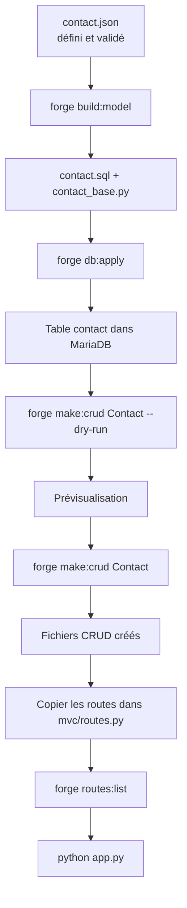

# CRUD explicite — Forge

[Accueil](index.html){ .md-button } <button class="md-button" onclick="window.history.back()">← Retour</button>

Forge génère un squelette CRUD lisible et modifiable à partir d'une entité JSON. La génération produit un point de départ, pas une cage : chaque fichier est ouvert, explicite, et ne sera jamais écrasé si vous le modifiez.

---

## 1. Doctrine

**Le développeur comprend toujours ce qui est exécuté.**

- Le JSON d'entité est la source canonique
- Le SQL reste visible dans le modèle applicatif
- Le code généré est lisible et modifiable
- Les fichiers existants ne sont jamais écrasés
- `mvc/routes.py` reste un fichier manuel — Forge ne l'écrit pas
- Forge ne génère pas de repository magique ni d'ORM implicite

---

## 2. Cycle `forge make:crud`



### Prérequis avant `forge make:crud`

```bash
forge make:entity Contact         # créer l'entité
# éditer mvc/entities/contact/contact.json
forge build:model                 # générer contact.sql et contact_base.py
forge db:apply                    # créer la table dans MariaDB
```

### Génération

```bash
forge make:crud Contact --dry-run   # prévisualiser sans écrire
forge make:crud Contact             # générer les fichiers
```

Sortie type :

```text
[CRÉÉ]      mvc/controllers/contact_controller.py
[CRÉÉ]      mvc/models/contact_model.py
[CRÉÉ]      mvc/forms/contact_form.py
[CRÉÉ]      mvc/views/layouts/app.html
[CRÉÉ]      mvc/views/contact/index.html
[CRÉÉ]      mvc/views/contact/show.html
[CRÉÉ]      mvc/views/contact/form.html

Routes à ajouter dans mvc/routes.py :
──────────────────────────────────────────────────────────────────────
  from mvc.controllers.contact_controller import ContactController

  with router.group("/contacts") as g:
      g.add("GET",  "",              ContactController.index,   name="contact_index")
      g.add("GET",  "/new",          ContactController.new,     name="contact_new")
      g.add("POST", "",              ContactController.create,  name="contact_create")
      g.add("GET",  "/{id}",         ContactController.show,    name="contact_show")
      g.add("GET",  "/{id}/edit",    ContactController.edit,    name="contact_edit")
      g.add("POST", "/{id}",         ContactController.update,  name="contact_update")
      g.add("POST", "/{id}/delete",  ContactController.destroy, name="contact_destroy")
```

Si un fichier existe déjà, il est marqué `[PRÉSERVÉ]` et non touché. Pour régénérer un fichier modifié manuellement, le supprimer avant de relancer la commande.

---

## 3. Routes

Les routes sont affichées par `forge make:crud` mais jamais injectées automatiquement. Les copier dans `mvc/routes.py` :

```python
from mvc.controllers.contact_controller import ContactController

with router.group("/contacts") as g:
    g.add("GET",  "",              ContactController.index,   name="contact_index")
    g.add("GET",  "/new",          ContactController.new,     name="contact_new")
    g.add("POST", "",              ContactController.create,  name="contact_create")
    g.add("GET",  "/{id}",         ContactController.show,    name="contact_show")
    g.add("GET",  "/{id}/edit",    ContactController.edit,    name="contact_edit")
    g.add("POST", "/{id}",         ContactController.update,  name="contact_update")
    g.add("POST", "/{id}/delete",  ContactController.destroy, name="contact_destroy")
```

!!! warning "Ordre obligatoire"
    `/new` doit être déclaré avant `/{id}`. Le routeur parcourt les routes dans l'ordre — sinon `new` est capturé comme identifiant.

Par défaut, un groupe de routes sans `public=True` est protégé par les middlewares d'authentification.

---

## 4. Formulaires générés

### Structure

```text
core/forms/      ← mécanique générique (Form, Field, cleaned_data, erreurs)
mvc/forms/       ← formulaires applicatifs (ContactForm, LoginForm…)
mvc/validators/  ← règles réutilisables
```

Un formulaire Forge lit les données HTTP, valide, remplit `cleaned_data` et produit des erreurs affichables. Il ne fait pas de requête SQL et ne décide pas d'une redirection.

### Exemple généré

```python
from core.forms import Form, StringField


class ContactForm(Form):
    nom      = StringField(label="Nom",    required=True,  max_length=80)
    prenom   = StringField(label="Prénom", required=True,  max_length=80)
    email    = StringField(label="Email",  required=False, max_length=120)
    telephone = StringField(label="Tél",  required=False, max_length=20)
```

### Utilisation dans un contrôleur

```python
form = ContactForm.from_request(request)

if not form.is_valid():
    return BaseController.validation_error(
        "contact/form.html",
        context={"form": form, "action": "/contacts", "titre": "Nouveau contact"},
        request=request,
    )

add_contact(form.cleaned_data)
return BaseController.redirect_with_flash(request, "/contacts", "Contact créé.")
```

### Dans un template Jinja2

```jinja2
<input name="nom" value="{{ form.value('nom') }}">

    <p class="text-red-600">{{ form.error('nom') }}</p>

```

### Mappage SQL → champ de formulaire

| Type SQL | Champ généré |
|---|---|
| `VARCHAR(n)`, `CHAR(n)` | `StringField(max_length=n)` |
| `TEXT`, `LONGTEXT` | `StringField()` + `textarea` dans le template |
| `INT`, `BIGINT`, `TINYINT` | `IntegerField()` |
| `DECIMAL`, `FLOAT`, `DOUBLE` | `DecimalField()` ; `cleaned_data` contient un `Decimal` |
| `BOOL`, `BOOLEAN` | `BooleanField()` |
| `DATE`, `DATETIME` | `StringField()` + avertissement `[WARN]` |

!!! note "Choix numérique V1"
    Les JSON d'entité gardent `python_type: "float"` pour les types SQL décimaux afin de rester compatibles avec la doctrine V1. Le formulaire généré utilise toutefois `DecimalField`, plus sûr pour la saisie utilisateur. Si votre classe métier attend strictement un `float`, convertissez explicitement dans le contrôleur ou dans votre code applicatif manuel.

---

## 5. Modèle applicatif SQL généré

Le modèle expose des fonctions avec SQL visible et paramétré. Pas d'abstraction cachée.

```python
from core.database.connection import get_connection, close_connection

SELECT_ALL   = "SELECT * FROM contact ORDER BY Id"
SELECT_BY_ID = "SELECT * FROM contact WHERE Id = ?"
INSERT       = "INSERT INTO contact (Nom, Prenom, Email, Telephone) VALUES (?, ?, ?, ?)"
UPDATE       = "UPDATE contact SET Nom = ?, Prenom = ?, Email = ?, Telephone = ? WHERE Id = ?"
DELETE       = "DELETE FROM contact WHERE Id = ?"


def get_contacts():
    connection = None
    cursor = None
    try:
        connection = get_connection()
        cursor = connection.cursor(dictionary=True)
        cursor.execute(SELECT_ALL)
        return cursor.fetchall()
    finally:
        if cursor:
            cursor.close()
        close_connection(connection)


def add_contact(data):
    connection = None
    cursor = None
    try:
        connection = get_connection()
        cursor = connection.cursor()
        cursor.execute(INSERT, (data["nom"], data["prenom"], data["email"], data["telephone"]))
        connection.commit()
    finally:
        if cursor:
            cursor.close()
        close_connection(connection)
```

Règles appliquées :
- Noms de table et colonnes issus du JSON canonique
- Paramètres `?` — jamais d'interpolation directe
- La clé primaire auto-incrémentée est exclue des `INSERT`
- `INSERT`, `UPDATE`, `DELETE` font un `commit()` explicite
- Connexion et curseur fermés dans un `finally`

---

## 6. Vues générées

`forge make:crud` crée un layout applicatif et trois vues :

```text
mvc/views/layouts/app.html   ← layout Jinja2 (créé si absent)
mvc/views/contact/index.html ← liste
mvc/views/contact/show.html  ← détail
mvc/views/contact/form.html  ← création et modification
```

Les vues héritent du layout :

```jinja2



    ...

```

Le champ CSRF est inclus dans tous les formulaires `POST` :

```jinja2
<input type="hidden" name="csrf_token" value="{{ csrf_token }}">
```

---

## 7. Personnalisation après génération

Les fichiers générés sont des points de départ — ils sont lisibles et à adapter librement.

| Fichier | Adaptations typiques |
|---|---|
| `contact_controller.py` | Ajouter `@require_auth`, pagination, tri, règles métier |
| `contact_form.py` | Ajouter `ChoiceField`, validations croisées via `clean()`, remplacer les `StringField` de type `DATE` |
| `contact_model.py` | Ajouter des requêtes métier, des jointures, de la pagination |
| `contact/index.html` | Ajouter des colonnes, la pagination, le tri |
| `layouts/app.html` | Menu de navigation, nom de l'application, styles |

!!! tip "Régénération partielle"
    Pour régénérer un seul fichier modifié, le supprimer puis relancer `forge make:crud Contact`.
    Les autres fichiers du CRUD sont préservés (`[PRÉSERVÉ]`).

---

## 8. Limites V1

`forge make:crud` V1 ne génère pas automatiquement :

- les jointures avec d'autres entités
- les champs `ChoiceField` depuis une table de référence
- les champs `RelatedIdsField` pour les pivots
- la pagination dans le contrôleur généré
- la recherche et le tri dynamique
- les permissions fines
- les uploads de fichiers

Ces éléments sont à ajouter manuellement après génération. Voir [Référence API et CLI](reference.md) pour les détails.
