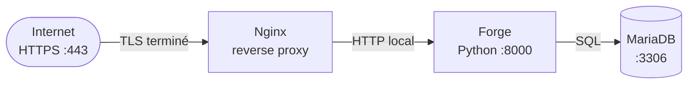
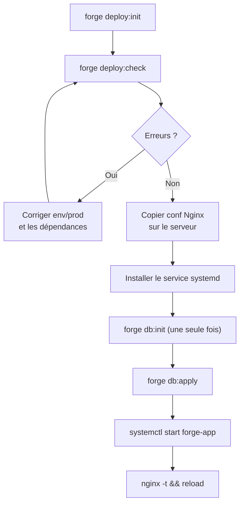

# Déploiement Forge

[Accueil](index.html) <a href="javascript:void(0)" onclick="window.history.back()">Retour</a>

## 1. Architecture recommandée



Forge inclut un serveur HTTPS Python autonome adapté au développement local. En production, **ne jamais l'exposer directement à Internet** :

- il ne gère pas la concurrence à grande échelle
- les connexions keep-alive et les timeouts réseau ne sont pas optimisés
- Nginx ou Apache absorbent les connexions simultanées et relaient proprement vers le processus Python
- le reverse proxy permet d'ajouter TLS, la compression gzip et les headers de sécurité sans modifier l'application

En production, le flux recommandé est : **Nginx termine HTTPS publiquement**, puis relaie vers Forge en **HTTP local** sur `127.0.0.1:8000`. Le mode `prod` de `app.py` désactive HTTPS par défaut ; vous pouvez forcer l'ancien comportement avec `APP_SSL_ENABLED=true` si votre proxy est configuré pour parler HTTPS au backend.

## 2. Checklist de déploiement



| Étape | Commande / action |
|---|---|
| 1. Générer les fichiers de déploiement | `forge deploy:init` |
| 2. Vérifier l'environnement | `forge deploy:check` |
| 3. Créer `env/prod` | `cp env/example env/prod` puis éditer |
| 4. Copier la conf Nginx | `sudo cp deploy/nginx/forge-app.conf /etc/nginx/sites-available/` |
| 5. Activer la conf Nginx | `sudo ln -sf ... /etc/nginx/sites-enabled/ && sudo nginx -t && sudo systemctl reload nginx` |
| 6. Copier le service systemd | `sudo cp deploy/systemd/forge-app.service /etc/systemd/system/` |
| 7. Activer le service | `sudo systemctl daemon-reload && sudo systemctl enable --now forge-app` |
| 8. Initialiser la base | `forge db:init` (une seule fois) puis `forge db:apply` |
| 9. Vérifier | `sudo systemctl status forge-app` |

---

## 3. Initialiser les fichiers de déploiement

```bash
forge deploy:init
```

Crée le dossier `deploy/` avec :

| Fichier | Rôle |
|---------|------|
| `deploy/nginx/forge-app.conf` | Configuration Nginx (reverse proxy) |
| `deploy/systemd/forge-app.service` | Unité systemd (daemon applicatif) |
| `deploy/README_DEPLOY.md` | Instructions d'installation résumées |

La commande est **idempotente** : elle affiche `[PRÉSERVÉ]` si un fichier existe déjà et ne l'écrase pas.

## 4. Vérifier l'environnement

```bash
forge deploy:check
```

| Élément vérifié | Résultat si absent ou invalide |
|-----------------|-------------------------------|
| Python ≥ 3.11 | `[ERREUR]` |
| Racine projet Forge | `[WARN]` |
| Environnement virtuel `.venv` | `[WARN]` |
| Dossier `env/` | `[WARN]` |
| Fichier `env/prod` | `[WARN]` |
| Variables `DB_APP_HOST`, `DB_NAME`, `DB_APP_LOGIN` | `[ERREUR]` |
| Variable `UPLOAD_ROOT` | `[WARN]` |
| Dossier `storage/` | `[WARN]` |
| Dossier `storage/uploads/` | `[WARN]` |
| Cohérence HTTP local / HTTPS proxy | `[WARN]` si incohérent |
| Module `mariadb` | `[ERREUR]` |
| Module `jinja2` | `[ERREUR]` |
| Fichiers `deploy/` générés | `[WARN]` |

La commande quitte avec le code 1 si au moins un `[ERREUR]` est détecté.

## 5. Configuration Nginx

Fichier généré : `deploy/nginx/forge-app.conf`

```nginx
server {
    listen 80;
    server_name _;

    client_max_body_size 6m;

    location / {
        # Forge écoute en HTTP local en mode prod ; Nginx termine HTTPS côté public.
        proxy_pass         http://127.0.0.1:8000;
        proxy_set_header   Host              $host;
        proxy_set_header   X-Real-IP         $remote_addr;
        proxy_set_header   X-Forwarded-For   $proxy_add_x_forwarded_for;
        proxy_set_header   X-Forwarded-Proto $scheme;
        proxy_http_version 1.1;
        proxy_read_timeout 30s;
    }
}
```

**Adapter avant installation :**

- Remplacer `server_name _;` par votre domaine réel (ex. `server_name mon-domaine.fr;`).
- La valeur `client_max_body_size` est calculée automatiquement à partir de `UPLOAD_MAX_SIZE` défini dans `config.py` (valeur générée = UPLOAD_MAX_SIZE en Mo + 1).
- Pour activer HTTPS public, ajouter un bloc `listen 443 ssl;` et les directives `ssl_certificate` / `ssl_certificate_key` dans Nginx. Le backend Forge reste en HTTP local.

**Installation sur le serveur :**

```bash
sudo cp deploy/nginx/forge-app.conf /etc/nginx/sites-available/
sudo ln -s /etc/nginx/sites-available/forge-app.conf /etc/nginx/sites-enabled/
sudo nginx -t && sudo systemctl reload nginx
```

## 6. Configuration systemd

Fichier généré : `deploy/systemd/forge-app.service`

```ini
[Unit]
Description=Forge Application
After=network.target mariadb.service

[Service]
Type=simple
# Adapter User à l'utilisateur système qui exécutera l'application
User=www-data
WorkingDirectory=/chemin/vers/projet
ExecStart=/chemin/vers/projet/.venv/bin/python /chemin/vers/projet/app.py --env prod
Restart=always
RestartSec=5
EnvironmentFile=/chemin/vers/projet/env/prod

[Install]
WantedBy=multi-user.target
```

**Adapter avant installation :**

- Remplacer `User=www-data` par l'utilisateur système approprié.
- Les chemins `WorkingDirectory`, `ExecStart` et `EnvironmentFile` sont générés automatiquement avec le chemin absolu du projet au moment de `forge deploy:init`.

**Installation sur le serveur :**

```bash
sudo cp deploy/systemd/forge-app.service /etc/systemd/system/
sudo systemctl daemon-reload
sudo systemctl enable forge-app
sudo systemctl start forge-app
sudo systemctl status forge-app
```

## 7. Variables env/prod

Créer `env/prod` sur le serveur à partir du template :

```bash
cp env/example env/prod
# Éditer env/prod avec les valeurs de production
```

Variables minimales requises :

```dotenv
APP_NAME=MonApplication
APP_ROUTES_MODULE=mvc.routes

DB_NAME=mon_projet_db
DB_APP_HOST=localhost
DB_APP_PORT=3306
DB_APP_LOGIN=utilisateur_app
DB_APP_PWD=mot_de_passe_fort

DB_ADMIN_HOST=localhost
DB_ADMIN_PORT=3306
DB_ADMIN_LOGIN=root
DB_ADMIN_PWD=<mot_de_passe_root_mariadb>

SSL_CERTFILE=cert.pem
SSL_KEYFILE=key.pem

APP_HOST=127.0.0.1
APP_PORT=8000
APP_SSL_ENABLED=false

UPLOAD_ROOT=storage/uploads
UPLOAD_MAX_SIZE=5242880
```

!!! warning "Sécurité"
    Ne jamais versionner `env/prod`. Vérifier que `.gitignore` contient `env/prod`.

<a id="deployer-une-starter-app-comme-demonstration"></a>

## 8. Déployer une starter-app comme démonstration

Une starter-app Forge est une application normale — elle se déploie exactement comme tout projet Forge.

**Étapes :**

1. Construire la starter-app localement en suivant son guide (`forge starter:list` pour les voir toutes).
2. Initialiser les fichiers de déploiement depuis le projet :
   ```bash
   forge deploy:init
   forge deploy:check
   ```
3. Copier la conf Nginx et le service systemd sur le serveur cible (voir sections ci-dessus).
4. Créer `env/prod` avec les identifiants de la base de démonstration.

**Recommandations pour une démo publique :**

- Utiliser une base de données dédiée, séparée de la production.
- Pré-charger des données fictives représentatives (pas de données réelles).
- Limiter les permissions de l'utilisateur MariaDB au strict nécessaire (`SELECT`, `INSERT`, `UPDATE`, `DELETE` sur la base démo uniquement).
- Activer la remise à zéro périodique des données si la démo est publiquement modifiable.

Consultez [la page des starter apps](starter-apps.md) pour la liste complète et les liens de démo.

## 9. Limites actuelles

- **Pas de déploiement automatique** — Forge génère les fichiers de configuration, l'installation sur le serveur reste manuelle.
- **Pas de HTTPS automatique** — configurer Nginx pour terminer TLS (Let's Encrypt + Certbot recommandé).
- **Pas de Docker** — non prévu pour l'instant.
- **Un seul processus Python** — le serveur Forge n'est pas multi-worker. Pour la haute disponibilité, utiliser plusieurs instances derrière un load balancer.
- **Nginx uniquement documenté** — Apache httpd est également un reverse proxy valide mais non documenté ici.
