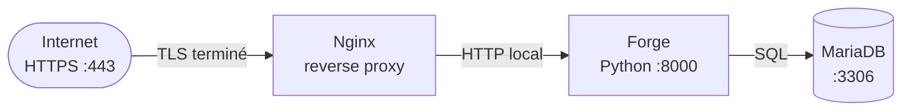

# Sécurité en production : Guide Forge

Ce guide rassemble les bonnes pratiques de déploiement sécurisé de Forge.
Il consolide les résultats des audits de sécurité réalisés lors de la Phase 4.5 : SECURITY-AUDIT-001, SECURITY-CSRF-AUDIT-001, SECURITY-AUTH-AUDIT-001, SECURITY-COOKIES-001, SECURITY-HEADERS-001, SECURITY-UPLOADS-AUDIT-001 et SECURITY-RBAC-AUDIT-001.

Voir aussi : [Déploiement](deployment.md) · [Auth/User](../features/auth.md) · RBAC · Médias

---

## 1. Architecture de production : HTTPS obligatoire

**En production, Forge doit être exécuté derrière un reverse proxy HTTPS.**



Forge inclut un serveur HTTPS Python adapté au développement local (`APP_SSL_ENABLED=true`, TLS 1.2 minimum).
**Ce serveur ne doit pas être exposé directement à Internet en production.**
En mode `prod`, `APP_SSL_ENABLED=false` est le défaut, Forge écoute en HTTP local, Nginx termine TLS.

La configuration Nginx générée par `forge deploy:init` expose un bloc HTTP : ajouter un bloc `listen 443 ssl` avec `ssl_certificate` / `ssl_certificate_key` (Let's Encrypt + Certbot recommandé) avant la mise en production.

Pourquoi HTTPS est obligatoire pour Forge :

- Les cookies de session portent l'attribut `Secure`, ils ne sont transmis que via HTTPS.
- HSTS (`Strict-Transport-Security`) est émis sur toutes les réponses, le navigateur refusera les connexions HTTP après la première visite.
- La CSP, Referrer-Policy et Permissions-Policy ont leur plein effet uniquement sur HTTPS.

---

## 2. Cookies de session

Résultats confirmés par SECURITY-COOKIES-001.

### Attributs appliqués

Tout cookie de session Forge est émis avec le préfixe `__Host-` :

```
Set-Cookie: __Host-session_id=<jeton opaque>; Path=/; HttpOnly; SameSite=Strict; Secure
```

| Attribut | Valeur | Garantie |
|---|---|---|
| `HttpOnly` | oui | JavaScript ne peut pas lire le cookie |
| `SameSite` | `Strict` | Cookie non transmis sur les requêtes cross-origin |
| `Secure` | oui | Cookie non transmis en HTTP clair |
| `Path` | `/` | Portée globale sur l'application |
| Valeur | jeton opaque (UUID hex) | Aucune donnée sensible dans le cookie |

`Secure` est actif en développement et en production.
C'est un choix délibéré : il force l'utilisation de HTTPS même en local et évite toute régression si `app_env` est mal configuré.

### Durée et rotation

- Durée de session : `DUREE_SESSION = 3600` secondes (1 heure), gérée côté serveur.
- À la déconnexion, `Max-Age=0` invalide le cookie immédiatement.
- Au login, `authentifier_session()` effectue une **rotation de session** : l'ancien identifiant de session est révoqué et un nouveau est émis, protection contre la fixation de session.

### Ce qui n'est pas en session

Aucun mot de passe, hash, token MFA, email ni donnée personnelle sensible n'est stocké dans le cookie ou en session côté serveur.
La session contient uniquement : `id`, `login`, `roles`, `permissions`, `authentifie`, `expire_a`, `csrf_token`.

### Limites connues

- `SameSite=Strict` peut bloquer la transmission du cookie sur les liens entrants depuis des sites tiers (ex. e-mail, notification externe).
  À documenter dans les applications qui nécessitent ce flux.

---

## 3. Headers HTTP de sécurité

Résultats confirmés par SECURITY-HEADERS-001.

### Stack complète

Les headers suivants sont émis sur **toutes** les réponses HTTP (200, 302, 404, 403, fichiers statiques, réponses `/media`) par `RequestHandler._send_response()` :

| Header | Valeur | Rôle |
|---|---|---|
| `X-Frame-Options` | `DENY` | Interdit l'inclusion dans un iframe |
| `X-Content-Type-Options` | `nosniff` | Interdit le MIME-sniffing |
| `Strict-Transport-Security` | `max-age=31536000; includeSubDomains` | Force HTTPS 1 an, tous sous-domaines |
| `Referrer-Policy` | `strict-origin-when-cross-origin` | Limit l'envoi du Referer |
| `Permissions-Policy` | `camera=(), microphone=(), geolocation=(), payment=()` | Désactive les API sensibles |
| `Content-Security-Policy` | voir ci-dessous | Politique de contenu |
| `Cache-Control` | `no-store` sur les routes marquées `no_store=True` | Interdit la mise en cache des pages sensibles |

!!! note "HSTS et reverse proxy"
    Le tableau décrit le comportement quand Forge termine lui-même TLS (serveur de développement HTTPS, `APP_SSL_ENABLED=true`).
    Dans le déploiement de production officiel (Gunicorn derrière un reverse proxy), Forge écoute en HTTP local : `wsgi.url_scheme` vaut `http`, donc Forge ne pose **pas** `Strict-Transport-Security`, et c'est le reverse proxy qui l'ajoute.
    Voir [Déploiement WSGI minimal](wsgi-deployment.md#41-headers-de-securite-et-hsts).

### Content-Security-Policy

CSP par défaut (sans nonce) :

```
default-src 'self'; script-src 'self'; style-src 'self'; img-src 'self' data:;
font-src 'self'; connect-src 'self'; frame-ancestors 'none'; base-uri 'self';
form-action 'self'
```

- `unsafe-inline` et `unsafe-eval` ne sont jamais ajoutés automatiquement.
- `frame-ancestors 'none'` bloque tout framing (renforce `X-Frame-Options: DENY`).
- Nonce optionnel pour scripts inline contrôlés : `APP_CSP_NONCE_ENABLED=true`.

```dotenv
APP_CSP_NONCE_ENABLED=true
```

```html
<script nonce="{{ csp_nonce() }}">/* script inline autorisé */</script>
```

### Cache-Control sur les routes auth

Les routes d'authentification reçoivent `Cache-Control: no-store` sur **les deux serveurs**, développement et production.

L'en-tête vient du drapeau `no_store` de la route, honoré par `Application.dispatch`.
`forge make:auth` le pose sur les trois routes qu'il engendre :

```python
router.add("GET", "/login", AuthController.login_form, public=True, name="auth-login_form",
           no_store=True)
```

Marquez de la même façon vos propres pages sensibles, une fiche de paie ou un export nominatif :

```python
router.add("GET", "/paie/{id}", PaieController.show, name="paie-show", no_store=True)
```

!!! note "Un contrôleur garde la main"

    L'en-tête est posé en `setdefault`.
    Une réponse qui définit elle-même sa directive de cache la conserve.

!!! warning "Projets créés avant Forge 1.0.0-rc.6"

    La règle vivait auparavant dans une liste de chemins codée en dur du serveur de développement, que la production ne connaissait pas.
    Un projet dont les routes ont été engendrées avant ce changement ne porte pas `no_store=True` : ajoutez-le à la main dans `mvc/routes/`, Forge ne réécrit jamais ce fichier (principe 9).

Le tableau ci-dessous décrit les en-têtes du socle de sécurité :

| Route | Méthode | No-store |
|---|---|---|
| `/login` | GET | ✅ |
| `/login` | POST | ✅ |
| `/login/mfa` | GET | ✅ |
| `/login/mfa` | POST | ✅ |
| `/logout` | POST | ✅ |

Le header est ajouté dans `_send_response()` (app.py) si le chemin est dans `_AUTH_NO_STORE_PATHS` et si la réponse ne fixe pas déjà `Cache-Control`.
Les fichiers statiques conservent leur propre `Cache-Control: max-age=…`.

### Limites connues

- CSP sans `img-src`, `font-src`, `connect-src` explicites distincts : couverts par `default-src 'self'` mais non listés séparément.
- HSTS est émis même en HTTP local (développement) : inoffensif mais techniquement redondant.

---

## 4. CSRF

Résultats confirmés par SECURITY-CSRF-AUDIT-001.

### Mécanisme

La protection CSRF est activée par défaut via `CsrfMiddleware`.
Le token est généré à la création de session et stocké en session côté serveur.

- Méthodes protégées : `POST`, `PUT`, `PATCH`, `DELETE`.
- Méthodes exemptées : `GET`, `HEAD`, `OPTIONS`.
- Token transmis via le champ de formulaire `csrf_token` ou le header `X-CSRF-Token`.

### Validation

Token absent → `403`.
Token invalide → `403`.
Token d'une autre session → `403`.

```html
<!-- Dans chaque formulaire POST -->
<input type="hidden" name="csrf_token" value="{{ csrf_token }}">
```

```javascript
// Requête AJAX
fetch('/api/action', {
    method: 'POST',
    headers: { 'X-CSRF-Token': document.querySelector('[name=csrf_token]').value },
    body: JSON.stringify(data)
});
```

### Opt-out explicite

Une route ou un groupe peut désactiver la vérification CSRF avec `csrf=False`.
Ce paramètre est **explicite**, aucune route n'est exempte sans déclaration.

Les routes `public=True` restent protégées par CSRF sauf si `csrf=False` est également spécifié.

### Method override

Forge gère le method override `POST → DELETE/PUT/PATCH` via `_method`.
Le token CSRF est vérifié **sur la méthode finale** après override.
Un formulaire HTML DELETE/PUT/PATCH doit inclure le token.

---

## 5. Authentification et audit

Résultats confirmés par SECURITY-AUTH-AUDIT-001.

### Journalisation des événements

`log_auth_event()` (module `core.auth.audit`) est branché dans `auth_controller.py` et `mfa_challenge_controller.py`.
Logger : `forge.auth.audit`.

| Événement | Niveau | Déclencheur |
|---|---|---|
| `login.success` | INFO | Connexion réussie |
| `login.failed` | WARNING | Mot de passe incorrect |
| `user.disabled` | WARNING | Tentative de connexion sur compte désactivé |
| `logout` | INFO | Déconnexion |
| `mfa.challenge.success` | INFO | Challenge MFA validé |
| `mfa.challenge.failed` | WARNING | Code MFA incorrect |

### Données absentes des logs

Aucun mot de passe, hash, token MFA ni donnée sensible n'est émis dans les messages de log.
`sanitize_auth_audit_metadata()` filtre les champs interdits avant emission.
En cas d'erreur interne dans le logger, `log_auth_event()` avale silencieusement l'exception pour ne pas perturber le flux d'authentification.

### Configuration des logs en production

Configurer un handler `forge.auth.audit` dans le système de logging Python pour rediriger les événements vers le fichier de log applicatif ou syslog :

```python
import logging

handler = logging.FileHandler("/var/log/forge-app/auth.log")
handler.setLevel(logging.INFO)
logging.getLogger("forge.auth.audit").addHandler(handler)
logging.getLogger("forge.auth.audit").setLevel(logging.INFO)
```

Les logs d'audit ne sont pas configurés automatiquement par Forge, la politique de log appartient à l'application.

### Rate limiting

Une protection anti-bruteforce est active sur `/login` via `core.auth.rate_limit`.
Par défaut : 5 tentatives par IP par fenêtre glissante de 60 secondes (`LOGIN_MAX_ATTEMPTS`, `LOGIN_RATE_LIMIT_WINDOW`).

Une protection anti-abus est active sur les routes d'upload via le rate-limit d'upload (module optionnel).
Par défaut : 10 uploads par IP par fenêtre glissante de 60 secondes.
Les compteurs sont **isolés** des compteurs de connexion.

#### Limite connue : compteur par processus (multi-worker)

Le compteur anti-bruteforce vit **en mémoire du processus** (`core.auth.rate_limit._attempts_store`).
Il est donc **local à chaque worker** et remis à zéro à chaque redémarrage.

Sur le chemin de production recommandé (Gunicorn multi-worker), la limite effective devient `5 × N` tentatives par fenêtre, où `N` est le nombre de workers, puisque chaque worker compte séparément.
Contrairement aux sessions (l'opt-in `forge-mvc-sessions-db` fournit un store partagé), il n'existe pas de store de tentatives partagé livré, et c'est un choix, motivé plus bas.

**La parade se pose au reverse proxy**, qui compte pour l'ensemble des workers.

Cette page la prescrivait sans que la configuration engendrée la porte : elle restait un extrait à recopier, donc une ligne de défense absente de tout projet qui n'avait pas lu cette page.
`forge deploy:init` l'engendre depuis `DEPLOY-NGINX-RATE-LIMIT-001`.

```nginx
# Contexte http. Le fichier engendré y est, étant inclus depuis sites-enabled/.
# Seul le POST est compté : limiter aussi le GET ferait répondre 429 à qui
# recharge la page de connexion, et une limite qui gêne se fait désactiver.
map $request_method $forge_login_monapp_key {
    POST    $binary_remote_addr;
    default "";
}
limit_req_zone $forge_login_monapp_key zone=forge_login_monapp:10m rate=5r/m;

server {
    # ... TLS, proxy_pass vers Gunicorn ...

    location = /login {
        # 5 requêtes/minute par IP, petite rafale tolérée, puis 429.
        limit_req        zone=forge_login_monapp burst=5 nodelay;
        limit_req_status 429;
        proxy_pass       http://127.0.0.1:8000;
    }
}
```

Le nom de la zone est dérivé du dossier du projet.
Deux projets Forge derrière le même Nginx déclareraient sinon deux zones homonymes, et Nginx refuserait de démarrer sur un message qui ne dit pas quel fichier est en cause.

!!! warning "Une route de connexion renommée n'est plus bornée"
    Le `location` engendré vise `/login`, la route qu'écrit `forge make:auth`.

    Un projet qui a renommé sa route de connexion adapte ce bloc, sans quoi la limite ne garde rien tout en paraissant posée.

!!! warning "Le challenge MFA n'est pas couvert"
    `forge-mvc-mfa` ne pose aucune route, l'application écrit les siennes, et Forge ne peut donc pas viser la route de challenge.

    Son compteur souffre pourtant du même défaut, cinq essais par processus.
    Ajoutez un `location` de même forme sur votre route de challenge.

Le rate-limit applicatif reste utile (défense en profondeur, mono-worker, développement) ; le rate-limit du proxy est la ligne de défense fiable en multi-worker.

Forge ne livre **pas** de store de tentatives partagé, et ce n'est pas un oubli.
Une fois la limite posée au proxy, le nombre de workers ne change plus ce qu'un attaquant peut tenter à travers lui.
Une application qui veut malgré tout un compteur applicatif partagé n'a besoin de rien de nouveau : `check_auth_rate_limit` accepte une liste de tentatives chargée d'où elle veut.

---

## 6. RBAC : Contrôle d'accès

Résultats confirmés par SECURITY-RBAC-AUDIT-001.

### Deux systèmes coexistants

| Système | API | Source des permissions |
|---|---|---|
| Historique | `@require_permission(code)` | `request.permissions` (injection serveur) |
| Auth/User | `@require_user_permission(code)` | `user_roles → roles → permissions` (DB) |

Les deux systèmes sont **étanches** : `request.permissions` n'influence pas `@require_user_permission`, et le `user_id` Auth/User n'influence pas `@require_permission`.

### Principe fondamental : protection serveur obligatoire

**Le masquage UI (``) n'est pas une barrière de sécurité.**
Il améliore l'ergonomie mais ne remplace pas le décorateur serveur.

```python
# ✅ Protection serveur - obligatoire pour la sécurité
@staticmethod
@require_permission("posts.delete")
def delete(request, post_id):
    ...

# ✅ Masquage UI - optionnel, améliore l'UX
# 
#   <button>Supprimer</button>
# 
```

### Helpers Jinja `can()`

`make_can(request)` (système historique) et `make_auth_jinja_can(request)` (système Auth/User) retournent un callable `can(permission) → bool`.

- Retourne toujours un `bool` (jamais `None`).
- Avale silencieusement toute exception (échec DB, permission invalide).
- Retourne `False` pour un utilisateur anonyme, un code vide, un code sans point.

```jinja2
{# Masquage conditionnel côté UI - n'est pas une protection serveur #}

  <a href="/posts/{{ post.id }}/edit">Modifier</a>

```

### Limite connue : boutons CRUD sans guard UI

Les templates CRUD générés par `make:crud` (table partielle, vue show) affichent les boutons **Modifier** et **Supprimer** sans `` conditionnel.
La protection serveur est présente (`@require_permission` dans le contrôleur généré si `rbac.permissions` est déclaré), et depuis **CRUD-RBAC-UI-001** (livré), les templates générés incluent également des guards `` autour de ces boutons quand `rbac.permissions` est déclaré dans la définition.

---

## 7. Uploads et médias

Résultats confirmés par SECURITY-UPLOADS-AUDIT-001.

### Architecture de validation

Tout upload transite par la chaîne : `validate_upload_metadata()` → `save_bytes()` → `normalize_media_path()`.

### Anti-path-traversal

`normalize_media_path()` + `os.path.commonpath()` bloquent les accès hors racine.
La racine absolue `storage/uploads/` est vérifiée sur chaque accès.

Chemins refusés : `/etc/passwd`, `../secret`, `images/../../secret`, null bytes, URLs (`https://...`), chemins Windows absolus.

### Extensions interdites (liste non exhaustive)

`.php`, `.py`, `.html`, `.js`, `.svg`, `.sh`, `.exe`, `.env`, toute extension hors liste blanche est refusée.
Liste blanche par défaut : `jpg`, `jpeg`, `png`, `webp`, `pdf`.

### Noms de fichiers

`secure_filename()` retire le chemin (basename uniquement), remplace les caractères spéciaux.
`generate_unique_filename()` ajoute un UUID hex, impossible de prédire le nom du fichier en base ou d'écraser un fichier existant.

### Route `/media`

GET `/media/<path>` est contrôlé par `serve_media_file()`.
Le path traversal via l'URL est bloqué avant toute lecture.
Les fichiers sont servis uniquement depuis `storage/uploads/`.

**Ne jamais servir `storage/` directement via Nginx** sans passer par la route `/media` de Forge, le filtrage anti-traversal ne s'appliquerait pas.

### Rate limiting upload

Le rate-limit d'upload (module optionnel) implémente une fenêtre glissante en mémoire, thread-safe.
Il se branche en tête de contrôleur d'upload ; ses compteurs sont isolés de ceux de la connexion.

| Constante | Valeur par défaut | Rôle |
|---|---|---|
| `UPLOAD_MAX_PAR_FENETRE` | 10 | Uploads autorisés par IP par fenêtre |
| `UPLOAD_FENETRE_SECONDES` | 60 | Durée de la fenêtre glissante (secondes) |

### Limites connues

- Pas de validation de signature binaire (magic bytes) : un fichier dangereux avec une extension et un Content-Type valides est accepté.
  Ticket futur : intégrer `python-magic` si nécessaire.
- Tests E2E multipart couverts par `test_e2e_upload_http.py` via `Application.dispatch()` (quasi-E2E, sans serveur TCP).
  Magic bytes non testés (ticket futur).
- Pas de scan antivirus intégré.

---

## 8. Logs runtime (mode développement)

Forge écrit les erreurs runtime dans :

```
storage/logs/errors.dev.jsonl   ← erreurs structurées JSON (une par ligne)
storage/logs/errors.dev.md      ← rapport lisible par humain
```

Ces fichiers sont **réservés au mode développement**.
Ils contiennent les tracebacks Python complets, **ne jamais les exposer publiquement**.

En production :

- Ne pas versionner `storage/logs/`.
- Ne pas servir `storage/` directement via Nginx.
- Configurer `.gitignore` : `storage/logs/` doit être exclu.
- Forge ne produit pas de fichier JSONL de logs en mode `prod`.
  La gestion des erreurs production (syslog, Sentry, ELK) est à la charge de l'application.

---

## 9. Secrets et fichiers sensibles

### Fichiers à ne jamais versionner

```
env/prod          → variables de production (DB, secrets)
env/dev           → variables de développement
storage/logs/     → logs runtime contenant des tracebacks
storage/uploads/  → fichiers uploadés par les utilisateurs
.git/             → historique Git (peut contenir des secrets commités)
```

Vérifier `.gitignore` :

```gitignore
env/prod
env/dev
storage/logs/
storage/uploads/
*.pem
*.key
```

### Variables sensibles

Ne jamais mettre de mot de passe, clé privée ou secret dans le code source.
Toujours passer par `env/prod` chargé via `EnvironmentFile=` dans le service systemd.

Variables critiques :

```dotenv
DB_APP_PWD=<mot_de_passe_fort>
DB_ADMIN_PWD=<mot_de_passe_admin_mariadb>
SSL_KEYFILE=<chemin_clé_privée>
```

### Permissions fichiers

Recommandations pour un déploiement Linux :

```bash
# Projet appartient à l'utilisateur applicatif (ex. forge-app)
chown -R forge-app:forge-app /srv/mon-projet/

# env/prod lisible uniquement par l'utilisateur applicatif
chmod 600 /srv/mon-projet/env/prod

# Clé privée TLS
chmod 600 /srv/mon-projet/key.pem

# storage/ accessible en écriture par l'application uniquement
chmod 750 /srv/mon-projet/storage/
chmod 750 /srv/mon-projet/storage/uploads/
chmod 700 /srv/mon-projet/storage/logs/
```

---

## 10. Base de données : principe de moindre privilège

Forge utilise deux comptes MariaDB :

| Compte | Variable | Droits requis |
|---|---|---|
| Compte applicatif | `DB_APP_LOGIN` / `DB_APP_PWD` | `SELECT`, `INSERT`, `UPDATE`, `DELETE` sur la base applicative uniquement |
| Compte admin | `DB_ADMIN_LOGIN` / `DB_ADMIN_PWD` | `CREATE TABLE`, `ALTER TABLE`, `DROP TABLE`, migrations uniquement |

Le compte applicatif **ne doit pas avoir de droits DDL** (`CREATE`, `DROP`, `ALTER`).
Le compte admin n'est utilisé que par `forge db:init` et `forge db:apply`.

```sql
-- Créer le compte applicatif avec droits limités
GRANT SELECT, INSERT, UPDATE, DELETE ON mon_projet_db.* TO 'app_user'@'localhost' IDENTIFIED BY 'mot_de_passe';
FLUSH PRIVILEGES;
```

### Politique de stockage des secrets DB_ADMIN_* (ENV-PROD-DB-ADMIN-SECRETS-POLICY-001)

**Règle stricte** : aucun mot de passe root/admin MariaDB réel ne doit être stocké dans `env/prod` (ou tout fichier commité).

Le **runtime applicatif Forge** (WSGI, dispatcher) n'utilise, pour les identifiants, **que** `DB_APP_*` : il se connecte au serveur partagé (`DB_HOST`/`DB_PORT`) avec `DB_APP_LOGIN`/`DB_APP_PWD`, jamais avec les identifiants d'administration `DB_ADMIN_*` (ADR-066).
Le backend runtime lit `DB_HOST, DB_PORT, DB_NAME, DB_APP_LOGIN, DB_APP_PWD, DB_POOL_SIZE, DB_POOL_TIMEOUT` ; `DB_ADMIN_LOGIN`/`DB_ADMIN_PWD` n'y apparaissent pas.

`DB_POOL_TIMEOUT` mérite d'être renseignée en production, et pas seulement `DB_POOL_SIZE`.
C'est elle qui borne l'attente d'une connexion : au-delà, Forge rend un `503` avec `Retry-After` plutôt que de laisser la requête pendre.
Sans borne, mesuré, une transaction coincée fait patienter les requêtes cinquante secondes sur MariaDB et indéfiniment sur PostgreSQL et SQL Server, les workers s'épuisant un à un sans qu'aucune ligne de journal ne le dise.

| Variable | Utilisée par | Stockée où en production ? |
|---|---|---|
| `DB_APP_*` | Runtime applicatif Forge (chaque requête) | `env/prod` (mot de passe applicatif limité) |
| `DB_ADMIN_*` | CLI de provisioning (`forge db:init`, `forge db:apply`) | **Fichier local non commité** `env/db-admin.local` (ignoré par `.gitignore` via `env/*.local`) ou variables d'environnement du shell de provisioning |

Procédure recommandée pour la production :

```bash
# 1. env/prod (commité ou copié sur le serveur, SANS DB_ADMIN_PWD réel)
DB_HOST=localhost
DB_PORT=3306

DB_APP_LOGIN=app_user
DB_APP_PWD=<mot_de_passe_applicatif>

# Compte admin : identifiants laissés vides ici.
DB_ADMIN_LOGIN=
DB_ADMIN_PWD=

# 2. env/db-admin.local (NON commité - pour les opérations de provisioning)
DB_ADMIN_LOGIN=root
DB_ADMIN_PWD=<mot_de_passe_root_réel>

# 3. Pour exécuter une commande de provisioning, charger en plus le local :
export $(grep -v '^#' env/db-admin.local | xargs)
forge db:init
```

Une fois `forge db:init` exécuté et le compte applicatif créé, les variables `DB_ADMIN_*` ne sont plus nécessaires côté serveur de runtime, elles peuvent être absentes ou vides dans `env/prod`.
Voir [`deploy-advanced.md`](deploy-advanced.md) §138 : « Les credentials admin (`DB_ADMIN_*`) servent uniquement lors des migrations, les supprimer de `env/prod` après `db:init` si vous n'en avez plus besoin. »

Cette politique est verrouillée par [`tests/meta/test_env_prod_db_admin_policy_001.py`](https://github.com/caucrogeGit/Forge/blob/main/tests/meta/test_env_prod_db_admin_policy_001.py).

### Tests E2E MariaDB

Les tests E2E MariaDB (`test_e2e_mariadb.py`) ne s'exécutent que si `FORGE_E2E_MARIADB=1` est défini.
Le nom de la base **doit commencer par `forge_e2e_`**, vérification appliquée pour empêcher l'exécution accidentelle sur une base de production.

**Ne jamais pointer les tests E2E vers une base de production.**

---

## 11. Configuration dev / prod

| Paramètre | Développement | Production |
|---|---|---|
| `APP_ENV` | `dev` | `prod` |
| `APP_SSL_ENABLED` | `true` (optionnel) | `false` (Nginx termine TLS) |
| `APP_DEBUG` | (absent = erreurs visibles) | désactiver l'affichage d'erreurs |
| Logs runtime JSONL | `storage/logs/errors.dev.jsonl` | non produits |
| `DB_APP_LOGIN` | compte de dev | compte applicatif restreint |
| Session store | Mémoire (défaut) | Fichier ou MariaDB recommandé |

En production, Forge doit être lancé avec `--env prod` (ou `APP_ENV=prod` dans `env/prod`) pour désactiver les comportements de développement.

---

## 12. Checklist production sécurisée

```
Infrastructure
──────────────
[ ] HTTPS actif via reverse proxy (Nginx)
[ ] Certificat TLS valide (Let's Encrypt / CA interne)
[ ] Domaine configuré dans Nginx (server_name)
[ ] Port 8000 non exposé publiquement (firewall)

Application
───────────
[ ] APP_ENV=prod dans env/prod
[ ] APP_SSL_ENABLED=false (Nginx termine TLS)
[ ] Secrets hors Git (env/prod dans .gitignore)
[ ] Mot de passe DB fort et non par défaut

Cookies et sessions
────────────────────
[ ] Cookies Secure compatibles HTTPS (actif par défaut)
[ ] Session store persistant configuré (Fichier ou MariaDB)
[ ] Durée session adaptée aux besoins métier

Sécurité applicative
─────────────────────
[ ] CSRF actif (défaut - ne pas désactiver sans raison)
[ ] Headers sécurité présents sur toutes les réponses (défaut)
[ ] RBAC : routes protégées par décorateurs serveur (@require_permission)
[ ] Auth audit : handler de log configuré (forge.auth.audit)
[ ] Rate limiting login actif
[ ] Rate limiting login au reverse proxy : engendré par deploy:init, à adapter si la route de connexion a été renommée (voir section 5)
[ ] Rate limiting upload actif (module d'upload optionnel)

Fichiers et stockage
─────────────────────
[ ] storage/ non exposé directement via Nginx
[ ] storage/uploads servi uniquement via route /media
[ ] storage/logs non accessible publiquement
[ ] Permissions fichiers restreintes (env/prod chmod 600)

Base de données
────────────────
[ ] Compte applicatif sans droits DDL
[ ] Compte admin utilisé uniquement pour les migrations
[ ] Base de test forge_e2e_* séparée de la production

Maintenance
────────────
[ ] Sauvegardes DB planifiées
[ ] Rotation des logs prévue
[ ] Procédure de mise à jour documentée
```

---

## 13. Dettes et tickets futurs

| Ticket | Domaine | Description |
|---|---|---|
| `SECURITY-CACHE-001` | Headers | ~~`Cache-Control: no-store` absent sur pages HTML authentifiées~~ livré |
| `SECURITY-COOKIES-HOST-PREFIX-001` | Cookies | ~~Ajouter le préfixe `__Host-` sur le cookie `session_id`~~ livré |
| `CRUD-RBAC-UI-001` | RBAC | ~~Ajouter `` sur boutons Modifier/Supprimer dans templates CRUD générés~~ livré |
| `E2E-UPLOAD-HTTP-001` | Uploads | ~~Tests multipart HTTP réels (cycle POST complet)~~ livré |
| `SECURITY-UPLOAD-RATE-LIMIT-001` | Uploads | ~~Rate limit sur les uploads~~ livré |

---

*Guide consolidé lors de DEPLOY-PROD-SECURITY-DOC-001 (Phase 4.5 sécurité avancée).*
