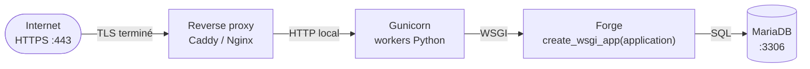

# Déploiement WSGI minimal

[Accueil](../index.html) <a href="javascript:void(0)" onclick="window.history.back()">Retour</a>

Cette page documente le chemin **WSGI minimal** pour exposer une application Forge en production, derrière un serveur WSGI externe (Gunicorn) et un reverse proxy (Caddy ou Nginx).

!!! warning "`python app.py` n'est pas pour la production publique"
    Le serveur `ThreadingHTTPServer` lancé par `python app.py` est conçu pour le développement local, les tests et les démonstrations.
    Il ne gère pas correctement la concurrence à grande échelle, le keep-alive, les timeouts ou la compression.
    **Pour une exposition publique, utiliser obligatoirement le chemin WSGI documenté ci-dessous**, derrière un reverse proxy.

Voir aussi : [Guide de déploiement](deployment.md) et [Sécurité en production](production-security.md).

---

## 1. Architecture cible



Trois responsabilités sont séparées :

- **Reverse proxy** : TLS, fichiers statiques, `X-Real-IP`, et `Strict-Transport-Security` (HSTS), voir [§4.1 Headers de sécurité](#41-headers-de-securite-et-hsts) ci-dessous.
- **Gunicorn** : pool de workers Python, gestion du cycle de vie.
- **Forge** : dispatch des routes via le callable WSGI.
  Depuis `WSGI-SECURITY-HEADERS-001`, Forge pose lui-même le socle des autres headers de sécurité (`X-Frame-Options`, `X-Content-Type-Options`, `Referrer-Policy`, `Permissions-Policy`, `Content-Security-Policy`) sur toutes les réponses WSGI.

---

## 2. Fichier `wsgi.py` applicatif

À placer à la racine du projet applicatif Forge :

```python
# wsgi.py
from app import application as _application
from core.app.wsgi import create_wsgi_app

application = create_wsgi_app(_application)
```

Ce point d'entrée sert l'application **déjà armée**, celle que construit `app.py`.
C'est elle qui porte vos middlewares et votre magasin de sessions, puisque le squelette prescrit de les câbler là.

`create_wsgi_app(application)` n'ajoute rien à cette application.
Il l'enveloppe dans un adaptateur WSGI, qui traduit `environ` en `Request`, sert `GET /health` avant le routage, contrôle la taille du corps et pose le socle de headers de sécurité.

### La fabrique générique, et pourquoi elle ne convient pas ici

`create_configured_wsgi_app()` construit une application depuis `config.py` seul.

C'est utile quand tout le câblage d'un projet tient dans des valeurs.
Ce n'est pas le cas d'un projet Forge ordinaire : `config.py` ne porte que des valeurs, jamais des objets construits, si bien que middlewares et magasin de sessions lui sont invisibles.

Une application servie ainsi démarre, répond 200, authentifie encore (`Application` pose `AuthMiddleware` par défaut), et laisse passer tout ce que les gardes suivantes auraient refusé.
Elle a l'air de fonctionner, ce qui est précisément le danger.

Depuis l'[ADR-092](../adr/092-wsgi-entrypoint-wiring-parity.md), la fabrique refuse de construire lorsqu'elle détecte dans `app.py` un câblage qu'elle ne verra pas.
Le service ne démarre pas, et l'erreur nomme les gardes manquantes.

---

## 3. Lancement Gunicorn

Forge **n'embarque pas Gunicorn** : c'est une dépendance à installer séparément côté projet applicatif.

```bash
pip install gunicorn
gunicorn wsgi:application --bind 127.0.0.1:8000
```

Notes :

- Gunicorn écoute uniquement sur la boucle locale (`127.0.0.1`), le reverse proxy s'occupe d'exposer HTTPS publiquement ;
- pour un démarrage type production, ajouter `--workers <N>` adapté au CPU disponible.
  **Voir la note multi-worker en [§7](#7-limites-actuelles-en-production)**.

!!! warning "`python app.py` refuse de démarrer en prod sur une interface publique"
    Depuis `APP-PY-PROD-HOST-GUARD-001`, `python app.py` refuse de démarrer quand `APP_ENV=prod` ET `APP_HOST` cible une interface publique (`0.0.0.0`, `::`, `[::]`).
    Le serveur direct reste un outil de développement, la production publique doit passer par WSGI + Gunicorn + reverse proxy (cette page).
    Les hôtes locaux (`127.0.0.1`, `localhost`, `::1`) restent autorisés en prod pour permettre les tests de validation locale.

---

## 4. Reverse proxy

### Caddy (recommandé pour la simplicité TLS)

```caddy
forgemvc.example {
    reverse_proxy 127.0.0.1:8000 {
        header_up X-Real-IP {remote_host}
    }
}
```

### Nginx (variante équivalente)

```nginx
server {
    listen 443 ssl;
    server_name forgemvc.example;
    # ... ssl_certificate / ssl_certificate_key ...

    location / {
        proxy_pass http://127.0.0.1:8000;
        proxy_set_header Host $host;
        proxy_set_header X-Real-IP $remote_addr;
    }
}
```

Les fichiers statiques (`/static/...`) sont servis directement par le reverse proxy, voir [§7](#7-limites-actuelles-en-production).
Les médias (`/media/...`), eux, restent servis par l'application : leur résolution anti-traversal et leurs tranches HTTP Range sont hors de portée du proxy.

### 4.1 Headers de sécurité et HSTS

Depuis `WSGI-SECURITY-HEADERS-001`, le chemin WSGI applique automatiquement le même socle de headers que `python app.py` :

| Header | Valeur | Source |
|---|---|---|
| `X-Frame-Options` | `DENY` | Forge (WSGI) |
| `X-Content-Type-Options` | `nosniff` | Forge (WSGI) |
| `Referrer-Policy` | `strict-origin-when-cross-origin` | Forge (WSGI) |
| `Permissions-Policy` | `camera=(), microphone=(), geolocation=(), payment=()` | Forge (WSGI) |
| `Content-Security-Policy` | `default-src 'self'; …` | Forge (WSGI) |
| `Strict-Transport-Security` (HSTS) | `max-age=31536000; includeSubDomains` | **Reverse proxy** (déploiement standard) ou Forge si `wsgi.url_scheme == "https"` |

Tous ces headers sont posés en `setdefault` via [`core/security/headers.py`](https://github.com/caucrogeGit/Forge/blob/main/core/security/headers.py) : une route applicative qui définit explicitement un de ces headers (`response.headers["Content-Security-Policy"] = "..."` par exemple) garde la main.

**HSTS, décision conservatrice WSGI.**
Forge ne pose HSTS que lorsque la requête a réellement atteint Forge en TLS (`wsgi.url_scheme == "https"`).
Dans le déploiement standard ci-dessus (reverse proxy qui termine TLS, Forge écoute en HTTP local sur `127.0.0.1:8000`), `wsgi.url_scheme` vaut `http` côté Forge, c'est donc au reverse proxy d'ajouter `Strict-Transport-Security`.

Exemples de configuration :

```caddy
forgemvc.example {
    reverse_proxy 127.0.0.1:8000 {
        header_up X-Real-IP {remote_host}
    }
    # Caddy émet HSTS automatiquement quand TLS est actif (header `Strict-Transport-Security`).
}
```

```nginx
server {
    listen 443 ssl;
    server_name forgemvc.example;
    # ... ssl_certificate / ssl_certificate_key ...

    add_header Strict-Transport-Security "max-age=31536000; includeSubDomains" always;

    location / {
        proxy_pass http://127.0.0.1:8000;
        proxy_set_header Host $host;
        proxy_set_header X-Real-IP $remote_addr;
    }
}
```

Cette répartition est protégée par [`tests/test_wsgi_security_headers_001.py`](https://github.com/caucrogeGit/Forge/blob/main/tests/test_wsgi_security_headers_001.py).

---

## 5. `APP_TRUSTED_PROXIES` et `X-Real-IP`

Sans configuration explicite, **Forge ignore `X-Real-IP`** et utilise toujours l'adresse IP observée au niveau du socket TCP.
Pour activer la résolution de l'IP réelle du client derrière un reverse proxy, déclarer la ou les IPs de confiance :

```bash
APP_TRUSTED_PROXIES=127.0.0.1
```

ou pour plusieurs proxies (espaces tolérés) :

```bash
APP_TRUSTED_PROXIES=127.0.0.1, ::1, 10.0.0.5
```

Règles :

- **vide par défaut** → `X-Real-IP` toujours ignoré ;
- **liste séparée par virgules**, espaces tolérés ;
- **comparaison IP exacte**, pas de notation CIDR ;
- **pas de wildcard** ;
- `0.0.0.0` n'a aucune signification spéciale (il ne couvre que `0.0.0.0`) ;
- `X-Real-IP` est ignoré si la requête arrive depuis une IP non listée ;
- une valeur invalide dans `X-Real-IP` est ignorée, Forge retombe sur l'IP du socket.

Ticket de référence : `HTTP-TRUSTED-PROXY-IP-001`.

---

## 6. Warnings production au démarrage

Les deux points d'entrée émettent, **une seule fois, à la construction de l'application, jamais par requête**, un avertissement si Forge est configuré en `APP_ENV=prod` avec un store de session mémoire :

```
AVERTISSEMENT-PROD - Forge tourne en APP_ENV=prod avec stockage mémoire.
  * Sessions : MemorySessionStore est volatile et mono-processus.
  * Rate-limit (login, uploads) : compteurs en mémoire non partagés.
Tolérée pour développement/test, cette configuration est fragile en
production. Configurer un session store partagé avant exposition
publique (ex. forge.configure(session_store=FileSessionStore(...))).
```

Pour silencer le warning dans les tests :

```python
application = create_wsgi_app(_application, emit_prod_warnings=False)
```

Pour rediriger le warning vers un logger applicatif :

```python
import logging
application = create_wsgi_app(
    _application,
    logger=logging.getLogger("my_app.startup"),
)
```

Cet avertissement a vécu dans la seule fabrique générique, ce qui l'aurait fait disparaître du chemin recommandé le jour où celui ci a changé.
Il appartient au passage en WSGI, pas à une fabrique particulière.

Tickets de référence : `AUTH-RATE-LIMIT-PROD-WARNING-001`, `WSGI-PROD-WARNINGS-001`, `WSGI-UNARMED-APP-GUARD-001`.

---

## 7. Limites actuelles en production

Ce guide est un **socle minimal**, pas une recette d'exploitation complète.
Les limites suivantes restent à la charge de l'opérateur :

- **Session store mémoire** (`MemorySessionStore`) : volatile au redémarrage, mono-processus.
  Utiliser `FileSessionStore` ou `DbSessionStore` (voir [ADR-002](../adr/002-session-strategy.md)) via `forge.configure(session_store=...)`.
- **`FileSessionStore`** : utilisable, mais reste fragile en multi-worker (pas de verrou partagé strict).
  Pour un déploiement multi-worker fiable, privilégier `DbSessionStore`.
- **Rate-limits login/upload encore en mémoire** : compteurs non partagés entre workers Gunicorn.
  Chaque worker tient son propre compteur, donc la limite effective est multipliée par le nombre de workers : avec le défaut login de 5 tentatives par fenêtre de 60 s (`core/auth/rate_limit.py`, `LOGIN_MAX_ATTEMPTS`/`LOGIN_RATE_LIMIT_WINDOW`), un déploiement à `N` workers tolère jusqu'à `N × 5` tentatives par fenêtre, l'attaquant étant réparti sur les workers par le proxy.
  La protection reste utile mais n'est pas distribuée.
  Pour un rate-limit effectif en multi-worker, brancher un backend partagé (table MariaDB ou Redis) qui centralise le comptage des tentatives ; c'est à la charge de l'application (hors périmètre du noyau, principe 8).
- **Anti-rejeu MFA (TOTP) en mémoire** : l'état anti-rejeu de `forge-mvc-mfa` est propre à chaque worker ; un code TOTP intercepté peut être rejoué sur un autre worker.
  Non distribué dans la série 1.0.0.
- **Multi-worker** : Forge émet déjà un avertissement supplémentaire au démarrage `python app.py` si `WEB_CONCURRENCY > 1` ou si `SERVER_SOFTWARE` contient `gunicorn`/`uwsgi`.
  Lire ce warning au premier démarrage Gunicorn.
- **Fichiers statiques (`/static/...`)** : faire servir directement par le reverse proxy, plus rapide et plus sûr qu'un dispatch Python.
- **Médias (`/media/...`)** : servis par l'application sur les deux serveurs depuis `CORE-WSGI-MEDIA-PARITY-001`.
  Le chemin WSGI les rendait auparavant en 404, ce qui donnait une application déployée servant ses pages et perdant tous ses médias.
  Ne pas les faire servir par le reverse proxy : cela rendrait public tout `UPLOAD_ROOT` et retirerait à l'application le droit de décider qui lit quoi.
  `/media/` ne demande **aucune authentification**, ici comme en développement : une application qui distingue des fichiers publics de fichiers personnels doit servir les seconds par une route authentifiée.
- **HTTPS** : à terminer **côté reverse proxy**.
  Le pipeline Gunicorn ↔ Forge reste en HTTP local sur `127.0.0.1`.
- **Pas de support `X-Forwarded-For`** : seul `X-Real-IP` est honoré, et uniquement derrière un proxy de confiance.
- **Pas de notation CIDR pour `APP_TRUSTED_PROXIES`** : seules les IPs exactes sont acceptées.
- **Aucune génération automatique** du fichier `wsgi.py` applicatif : c'est à l'utilisateur de le créer (voir [§2](#2-fichier-wsgipy-applicatif)).

Pour une vue d'ensemble des limites de production hors WSGI, voir le futur ticket `DOCS-PRODUCTION-LIMITS-001`.
