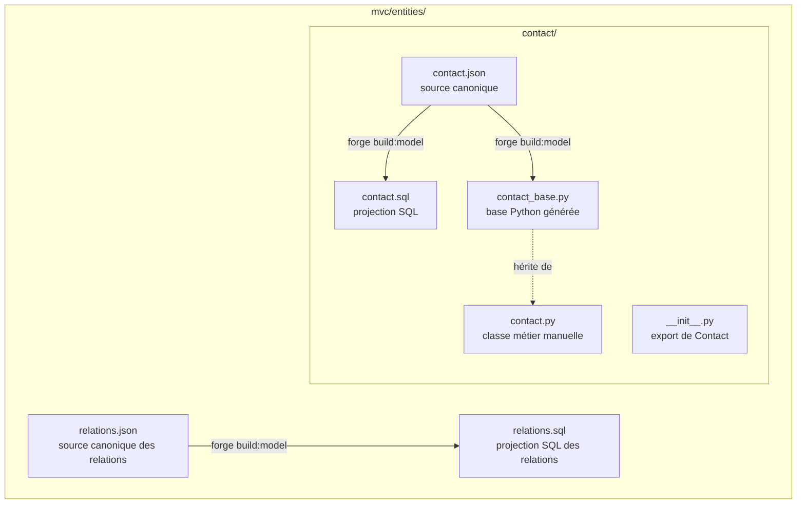
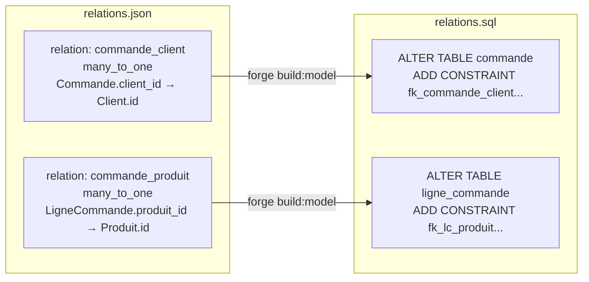
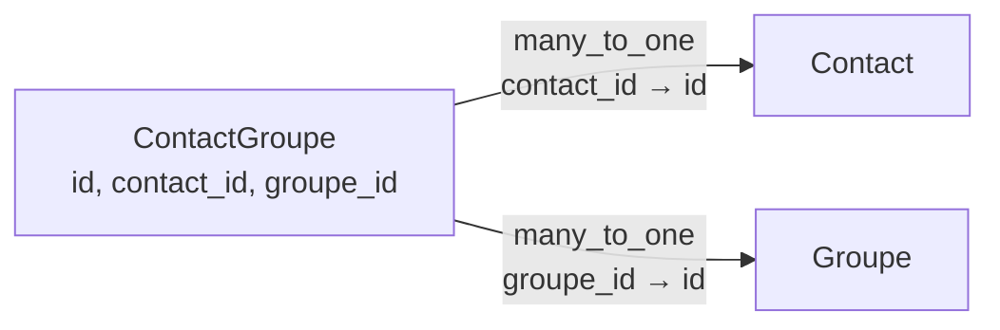
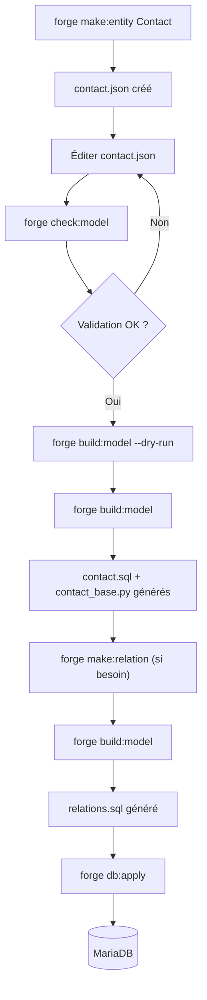

# Architecture des entités Forge

[Accueil](index.html) <a href="javascript:void(0)" onclick="window.history.back()">Retour</a>

Forge sépare la description d'une entité en trois niveaux distincts : la source canonique JSON, les projections techniques générées, et le code métier manuel. Cette séparation permet de régénérer les fichiers techniques sans jamais écraser le travail manuel.

---

## 1. Vue d'ensemble



| Fichier | Nature | Régénérable | Règle |
|---|---|---|---|
| `contact.json` | Source canonique | Non | À modifier librement |
| `contact.sql` | Projection SQL | Oui | Ne pas modifier manuellement |
| `contact_base.py` | Base Python | Oui | Ne pas modifier manuellement |
| `contact.py` | Classe métier | Non | Jamais écrasé par Forge |
| `__init__.py` | Export | Non | Jamais écrasé par Forge |
| `relations.json` | Source relationnelle | Non | À modifier librement |
| `relations.sql` | Projection relationnelle | Oui | Ne pas modifier manuellement |

---

## 2. Le modèle canonique JSON

### Format

```json
{
  "format_version": 1,
  "entity": "Contact",
  "table": "contact",
  "description": "Contacts de l'application",
  "fields": [
    {
      "name": "id",
      "sql_type": "INT",
      "primary_key": true,
      "auto_increment": true
    },
    {
      "name": "nom",
      "sql_type": "VARCHAR(80)",
      "constraints": {
        "not_empty": true,
        "max_length": 80
      }
    },
    {
      "name": "email",
      "sql_type": "VARCHAR(120)",
      "unique": true,
      "nullable": true,
      "constraints": {
        "max_length": 120
      }
    },
    {
      "name": "actif",
      "sql_type": "BOOLEAN",
      "default": true
    }
  ]
}
```

### Clés racine

| Clé | Obligatoire | Valeur par défaut |
|---|---|---|
| `entity` | Oui | — |
| `fields` | Oui | — |
| `format_version` | Non | `1` |
| `table` | Non | `entity` converti en `snake_case` |
| `description` | Non | `""` |

### Clés par champ

| Clé | Obligatoire | Valeur par défaut |
|---|---|---|
| `name` | Oui | — |
| `sql_type` | Oui | — |
| `column` | Non | `name` converti en `PascalCase` |
| `python_type` | Non | déduit depuis `sql_type` |
| `nullable` | Non | `false` |
| `primary_key` | Non | `false` |
| `auto_increment` | Non | `false` |
| `unique` | Non | `false` |
| `default` | Non | absent |
| `constraints` | Non | `{}` |

!!! warning "Dérivation automatique de `column`"
    La dérivation automatique ne préserve pas les acronymes métier.
    `montant_ttc` devient `MontantTtc`, pas `MontantTTC`.
    Si une casse spécifique est nécessaire, déclarer `column` explicitement.

### Contraintes disponibles dans `constraints`

| Clé | Types compatibles |
|---|---|
| `not_empty` | `str` |
| `min_length` | `str` |
| `max_length` | `str` |
| `min_value` | `int`, `float` |
| `max_value` | `int`, `float` |
| `pattern` | `str` (regex) |

### Valeurs par défaut (`default`)

La clé `default` accepte uniquement des valeurs simples : `str`, `int`, `float`, `bool`, `null`.

- Absence de `default` = aucune valeur par défaut
- `default: null` n'est autorisé que si `nullable: true`
- Pour les types `date` et `datetime`, `default` est une chaîne ISO (`"2024-01-01"`, `"2024-01-01T00:00:00"`)
- Les expressions SQL complexes (`CURRENT_TIMESTAMP`, `NOW()`) sont hors V1

---

## 3. Les projections générées

### `contact.sql` — projection SQL locale

Contient uniquement la table de l'entité. Pas de clé étrangère.

```sql
CREATE TABLE IF NOT EXISTS contact (
    Id INT NOT NULL AUTO_INCREMENT,
    Nom VARCHAR(80) NOT NULL,
    Email VARCHAR(120) NULL,
    Actif BOOLEAN NOT NULL DEFAULT 1,
    PRIMARY KEY (Id),
    UNIQUE KEY uk_contact_email (Email)
) ENGINE=InnoDB DEFAULT CHARSET=utf8mb4;
```

Règles de formatage :
- Mots-clés SQL en majuscules
- 4 espaces d'indentation, une colonne par ligne
- `PRIMARY KEY` et `UNIQUE KEY` en contraintes de table
- Toujours `ENGINE=InnoDB DEFAULT CHARSET=utf8mb4`

!!! danger "Règle stricte"
    Les clés étrangères inter-entités n'apparaissent **jamais** dans un `.sql` d'entité.
    Elles appartiennent exclusivement à `relations.sql`.

### `contact_base.py` — base Python générée

Contient le constructeur, les propriétés avec décorateurs de validation, `to_dict()`, `from_dict()` et `__repr__`.

```python
from core.validation import ValidationError, max_length, not_empty, nullable, typed


class ContactBase:
    """Classe de base régénérable de Contact."""

    def __init__(self, nom, actif, email=None, id=None):
        self.nom = nom
        self.email = email
        self.actif = actif
        self.id = id

    @property
    def nom(self):
        return self._nom

    @nom.setter
    @typed(str)
    @not_empty
    @max_length(80)
    def nom(self, value):
        if value is None:
            raise ValidationError("nom", 'La propriété "nom" ne peut pas être nulle.')
        self._nom = value

    def to_dict(self) -> dict:
        return {"id": self.id, "nom": self.nom, "email": self.email, "actif": self.actif}
```

Règle du constructeur : un champ devient paramètre obligatoire s'il est non nullable, sans valeur par défaut et non auto-increment.

### Décorateurs de validation disponibles

| Décorateur | Source JSON |
|---|---|
| `@typed(type_)` | `python_type` |
| `@nullable` | `nullable: true` |
| `@not_empty` | `constraints.not_empty` |
| `@min_length(n)` | `constraints.min_length` |
| `@max_length(n)` | `constraints.max_length` |
| `@min_value(n)` | `constraints.min_value` |
| `@max_value(n)` | `constraints.max_value` |
| `@pattern(regex)` | `constraints.pattern` |

Types Python supportés : `int`, `str`, `float`, `bool`, `date`, `datetime`.

!!! note "Règle nullable"
    `@nullable` est le seul décorateur qui autorise `None`.
    Les autres décorateurs ne doivent pas échouer sur `None`.
    `@typed(int)` refuse `bool`.

---

## 4. Les fichiers manuels

### `contact.py` — classe métier

Hérite de `ContactBase`. Créé une seule fois par Forge s'il est absent. Jamais écrasé.

```python
from .contact_base import ContactBase


class Contact(ContactBase):
    """Point d'extension métier pour Contact."""

    pass
```

Ajouter ici les méthodes métier, les validations croisées et les surcharges spécifiques.

### `__init__.py`

Créé une seule fois. Jamais écrasé.

```python
from .contact import Contact
```

---

## 5. Les relations

### Structure globale



### Format `relations.json`

```json
{
  "format_version": 1,
  "relations": [
    {
      "name": "commande_client",
      "type": "many_to_one",
      "from_entity": "Commande",
      "to_entity": "Client",
      "from_field": "client_id",
      "to_field": "id",
      "foreign_key_name": "fk_commande_client",
      "on_delete": "RESTRICT",
      "on_update": "CASCADE"
    }
  ]
}
```

Règles :
- `many_to_one` est le seul type supporté en V1
- `from_field` et `to_field` utilisent les noms Python des champs (pas les colonnes SQL)
- `to_field` doit être la clé primaire de l'entité cible
- `on_delete` et `on_update` sont toujours explicites

### Format `relations.sql`

```sql
ALTER TABLE commande
    ADD CONSTRAINT fk_commande_client
    FOREIGN KEY (ClientId)
    REFERENCES client (Id)
    ON DELETE RESTRICT
    ON UPDATE CASCADE;
```

!!! danger "Règle stricte"
    `relations.sql` ne doit contenir que des `ALTER TABLE ... ADD CONSTRAINT`.
    Aucun `CREATE TABLE` dans `relations.sql`.

### Pivot explicite pour many-to-many

Forge V1 ne fournit pas de `many_to_many` direct. Un lien many-to-many se modélise avec une entité pivot normale et deux relations `many_to_one`.



JSON de l'entité pivot :

```json
{
  "entity": "ContactGroupe",
  "fields": [
    { "name": "id",         "sql_type": "INT", "primary_key": true, "auto_increment": true },
    { "name": "contact_id", "sql_type": "INT" },
    { "name": "groupe_id",  "sql_type": "INT" }
  ]
}
```

Relations associées dans `relations.json` :

```json
{
  "format_version": 1,
  "relations": [
    {
      "name": "contact_groupe_contact",
      "type": "many_to_one",
      "from_entity": "ContactGroupe", "to_entity": "Contact",
      "from_field": "contact_id",     "to_field": "id",
      "foreign_key_name": "fk_contact_groupe_contact",
      "on_delete": "CASCADE", "on_update": "CASCADE"
    },
    {
      "name": "contact_groupe_groupe",
      "type": "many_to_one",
      "from_entity": "ContactGroupe", "to_entity": "Groupe",
      "from_field": "groupe_id",      "to_field": "id",
      "foreign_key_name": "fk_contact_groupe_groupe",
      "on_delete": "CASCADE", "on_update": "CASCADE"
    }
  ]
}
```

---

## 6. Conventions de nommage

| Élément | Convention | Exemple |
|---|---|---|
| Dossier d'entité | `snake_case` | `contact_client/` |
| Nom de table (`table`) | `snake_case` | `contact_client` |
| Nom de classe (`entity`) | `PascalCase` | `ContactClient` |
| Nom de champ Python (`name`) | `snake_case` | `date_creation` |
| Nom de colonne SQL (`column`) | `PascalCase` | `DateCreation` |
| Nom de relation | `snake_case` | `commande_client` |
| Nom de contrainte FK | `fk_<relation>` | `fk_commande_client` |

---

## 7. Cycle de génération



### Commandes et comportement

| Commande | Écrit | Préserve | Rôle |
|---|---|---|---|
| `forge make:entity Contact` | `contact.json`, `contact.sql`, `contact_base.py`, `contact.py`, `__init__.py` | fichiers existants | Création initiale |
| `forge sync:entity Contact` | `contact.sql`, `contact_base.py` | `contact.py`, `__init__.py` | Resynchronisation d'une entité |
| `forge make:relation` | `relations.json` | existant | Ajout interactif de relation |
| `forge sync:relations` | `relations.sql` | — | Resynchronisation des relations |
| `forge build:model` | tout le modèle | fichiers manuels | Régénération complète |
| `forge check:model` | rien | — | Validation sans écriture |

### Ordre d'exécution SQL obligatoire

```
1. Tous les *.sql d'entités (forge db:apply les applique dans cet ordre)
2. relations.sql
```

Jamais l'inverse : `relations.sql` référence des tables qui doivent exister.

---

## 8. Validation interne

Forge bloque toute génération si une validation échoue.

### Validation d'entité

- Structure obligatoire présente (`entity`, `fields`)
- Noms valides (format, unicité des champs et colonnes)
- Une seule clé primaire par entité
- Compatibilité `python_type` / `sql_type`
- Compatibilité contraintes / type
- Valeurs par défaut cohérentes avec la nullabilité

### Validation des relations

- Entités et champs référencés existants
- Type de relation valide (`many_to_one` en V1)
- Champ cible est une clé primaire
- Types compatibles entre `from_field` et `to_field`
- Unicité des noms de relation et de contrainte FK

### Validation globale

- Unicité des noms d'entité et de table
- Cohérence dossier / nom d'entité (`ContactClient` → dossier `contact_client`)
- Toutes les tables sont en `snake_case`

---

## 9. Limites de la V1

### Retenu en V1

- Une clé primaire simple par entité
- Source canonique JSON locale par entité
- Relations globales `many_to_one` uniquement
- Décorateurs de validation simples
- SQL MariaDB / InnoDB
- Pivot explicite pour many-to-many

### Hors V1

- Clés primaires composites
- `many_to_many` direct ou implicite
- `one_to_one` dédié
- Hooks de cycle de vie
- Navigation objet automatique (ORM)
- Génération de repository
- Contraintes conditionnelles entre champs
- Expressions SQL complexes dans `default`
- Contraintes d'unicité composées dans le JSON (à porter dans un script SQL séparé)
