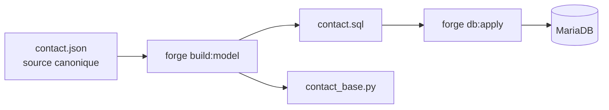
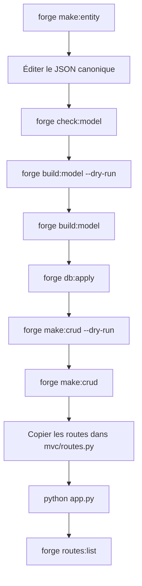

# Guide de démarrage Forge

Forge est un framework web MVC Python avec HTTPS natif, SQL explicite, templates Jinja2 et génération déterministe du modèle. Ce guide part d'un environnement Forge déjà installé et aboutit à un premier projet fonctionnel avec CRUD généré.

Pour la référence complète (contrôleurs, formulaires, sécurité, CLI), voir [Référence API et CLI](reference.md).

!!! tip "Forge n'est pas encore installé ?"
    Commencez par le parcours adapté dans le menu Installation :
    [VM Debian vierge](installation-vm-debian.md), [pipx](installation-pipx.md),
    [GitHub](installation-github.md), [mode développement](installation-developpement.md)
    ou [préparation MariaDB](installation-mariadb.md).

---

## Créer votre premier projet

### 1. Créer le projet

```bash
forge new MonProjet
cd MonProjet
source .venv/bin/activate
forge doctor
```

`forge new` clone le dépôt Forge, initialise un nouveau dépôt Git propre, crée l'environnement virtuel Python et installe les dépendances.

!!! tip "Installation manuelle"
    Si `forge new` n'est pas disponible ou pour un usage avancé :

    ```bash
    git clone --branch v1.0.1 --depth=1 https://github.com/caucrogeGit/Forge.git MonProjet
    cd MonProjet
    rm -rf .git && git init && git add -A && git commit -m "init: MonProjet"
    python3 -m venv .venv
    source .venv/bin/activate
    pip install -r requirements.txt
    pip install -e .
    forge doctor
    ```

### 2. Configurer l'environnement

```bash
cp env/example env/dev
```

Éditer `env/dev` avec les paramètres du projet :

```env
APP_NAME=MonProjet
APP_ROUTES_MODULE=mvc.routes

DB_ADMIN_HOST=localhost
DB_ADMIN_PORT=3306
DB_ADMIN_LOGIN=root
DB_ADMIN_PWD=<mot_de_passe_root_mariadb>

DB_NAME=mon_projet
DB_CHARSET=utf8mb4
DB_COLLATION=utf8mb4_unicode_ci

DB_APP_HOST=localhost
DB_APP_PORT=3306
DB_APP_LOGIN=mon_projet_app
DB_APP_PWD=<mot_de_passe_applicatif>
DB_POOL_SIZE=5

APP_HOST=127.0.0.1
APP_PORT=8000

SSL_CERTFILE=cert.pem
SSL_KEYFILE=key.pem
```

!!! warning "Ne pas confondre les deux comptes MariaDB"
    `DB_ADMIN_LOGIN` est utilisé uniquement par `forge db:init` pour créer la base et l'utilisateur applicatif.
    `DB_APP_LOGIN` est utilisé ensuite par l'application en fonctionnement normal et par `forge db:apply` dans le flux pédagogique V1.

    En production, utilisez idéalement un compte de migration séparé pour appliquer le schéma, puis un compte applicatif limité à `SELECT`, `INSERT`, `UPDATE`, `DELETE`.

### 3. Générer les certificats HTTPS locaux

```bash
openssl req -x509 -newkey rsa:2048 \
  -keyout key.pem \
  -out cert.pem \
  -days 365 \
  -nodes \
  -subj "/CN=localhost"
```

### 4. Initialiser la base MariaDB

```bash
forge db:init
```

Cette commande crée la base `DB_NAME`, crée l'utilisateur `DB_APP_LOGIN` et applique les droits nécessaires au flux Forge V1, y compris `forge db:apply` en développement.

!!! success "Avant de continuer"
    Vérifier que MariaDB est démarré, que `env/dev` est configuré avec `DB_ADMIN_LOGIN`, `DB_ADMIN_PWD`, `DB_APP_LOGIN`, `DB_APP_PWD` et `DB_NAME`.

### 5. Créer une entité

```bash
forge make:entity Contact
```

La commande lance l'assistant interactif. Pour un usage scriptable :

```bash
forge make:entity Contact --no-input
```

Puis éditer le fichier canonique `mvc/entities/contact/contact.json` :

```json
{
  "format_version": 1,
  "entity": "Contact",
  "table": "contact",
  "fields": [
    { "name": "id",       "sql_type": "INT",         "primary_key": true, "auto_increment": true },
    { "name": "nom",      "sql_type": "VARCHAR(80)",  "constraints": { "not_empty": true, "max_length": 80 } },
    { "name": "prenom",   "sql_type": "VARCHAR(80)",  "constraints": { "not_empty": true, "max_length": 80 } },
    { "name": "email",    "sql_type": "VARCHAR(120)", "unique": true, "constraints": { "not_empty": true, "max_length": 120 } },
    { "name": "telephone","sql_type": "VARCHAR(20)",  "nullable": true, "constraints": { "max_length": 20 } }
  ]
}
```

### 6. Générer et appliquer le modèle

```bash
forge check:model          # vérifier la cohérence du JSON
forge build:model --dry-run  # prévisualiser sans écrire
forge build:model          # générer contact.sql et contact_base.py
forge db:apply             # créer la table dans MariaDB
```



!!! danger "Ne pas modifier les fichiers générés"
    `contact.sql` et `contact_base.py` sont régénérables — ne pas y écrire de logique manuelle.
    La logique métier va dans `contact.py`, qui n'est jamais écrasé par Forge.

### 7. Générer le CRUD

```bash
forge make:crud Contact --dry-run  # prévisualiser
forge make:crud Contact            # générer
```

Fichiers créés s'ils sont absents :

```text
mvc/controllers/contact_controller.py
mvc/models/contact_model.py
mvc/forms/contact_form.py
mvc/views/layouts/app.html
mvc/views/contact/index.html
mvc/views/contact/show.html
mvc/views/contact/form.html
```

!!! tip "Génération non destructive"
    Si un fichier existe déjà, il est marqué `[PRÉSERVÉ]` et non touché.

### 8. Déclarer les routes

`forge make:crud` affiche le bloc de routes à ajouter dans `mvc/routes.py` — il ne l'écrit jamais automatiquement.

Copier le bloc affiché dans `mvc/routes.py` :

```python
from mvc.controllers.contact_controller import ContactController

with router.group("/contacts") as g:
    g.add("GET",  "",              ContactController.index,   name="contact_index")
    g.add("GET",  "/new",          ContactController.new,     name="contact_new")
    g.add("POST", "",              ContactController.create,  name="contact_create")
    g.add("GET",  "/{id}",         ContactController.show,    name="contact_show")
    g.add("GET",  "/{id}/edit",    ContactController.edit,    name="contact_edit")
    g.add("POST", "/{id}",         ContactController.update,  name="contact_update")
    g.add("POST", "/{id}/delete",  ContactController.destroy, name="contact_destroy")
```

!!! warning "Ordre des routes"
    `/new` doit être déclaré avant `/{id}`. Sinon le routeur capture `new` comme identifiant.

Vérifier les routes déclarées :

```bash
forge routes:list
```

### 9. Lancer l'application

```bash
python app.py
```

Ouvrir dans le navigateur :

```text
https://localhost:8000/contacts
```

---

## Structure du projet

```text
MonProjet/
├── app.py                    # Point d'entrée — serveur HTTPS
├── config.py                 # Chargement de env/dev
│
├── core/                     # Framework Forge — ne pas modifier
│   ├── application.py        # Dispatcher : middlewares + routage
│   ├── http/                 # Request, Response, Router
│   ├── security/             # Sessions, CSRF, hashing, décorateurs
│   ├── forms/                # Form, Field, cleaned_data, erreurs
│   ├── database/             # Pool MariaDB, sql_loader
│   ├── mvc/                  # BaseController, Pagination
│   └── templating/           # Contrat Renderer + singleton
│
├── mvc/                      # Application — c'est ici que vous travaillez
│   ├── routes.py             # Déclaration des routes (manuel)
│   ├── entities/             # JSON canoniques + fichiers générés
│   │   ├── relations.json
│   │   ├── relations.sql
│   │   └── contact/
│   │       ├── contact.json      # source canonique
│   │       ├── contact.sql       # projection SQL générée
│   │       ├── contact_base.py   # base Python générée
│   │       └── contact.py        # classe métier manuelle
│   ├── controllers/
│   ├── models/
│   ├── forms/
│   ├── validators/
│   ├── helpers/
│   └── views/
│
├── env/
│   ├── example               # commité — valeurs par défaut
│   ├── dev                   # ignoré par git
│   └── prod                  # ignoré par git
│
├── tests/
└── static/
```

La règle fondamentale : `core/` appartient à Forge, `mvc/` appartient à votre application.

---

## Cycle de développement standard



| Commande | Rôle |
|---|---|
| `forge doctor` | Diagnostique l'environnement |
| `forge make:entity Nom` | Crée l'entité (assistant interactif) |
| `forge check:model` | Valide tous les JSON sans écrire |
| `forge build:model` | Génère `.sql` et `_base.py` depuis les JSON |
| `forge db:init` | Crée la base et l'utilisateur applicatif |
| `forge db:apply` | Applique les SQL générés dans MariaDB |
| `forge make:crud Nom` | Génère contrôleur, modèle, formulaire, vues |
| `forge routes:list` | Affiche les routes déclarées |

Pour les commandes avancées et la référence complète des paramètres, voir [Référence API et CLI](reference.md).

---

## Dépannage rapide

| Erreur | Cause probable | Correction |
|---|---|---|
| `forge: command not found` | `pipx` n'est pas dans le PATH | `pipx ensurepath` puis `exec $SHELL -l` |
| `No module named venv` | `python3-venv` absent | `sudo apt install python3-venv` |
| `mariadb_config not found` | dépendances MariaDB dev absentes | `sudo apt install libmariadb-dev pkg-config` |
| `Access denied for user 'root'@'localhost'` | mauvais mot de passe ou root en `unix_socket` | vérifier le mot de passe, ou tester `sudo mariadb` |
| `mariadb: command not found` | client MariaDB absent | `sudo apt install mariadb-client` |
| erreur de compilation Python | outils de build absents | `sudo apt install build-essential pkg-config libmariadb-dev` |
| `forge doctor` signale des FAIL | configuration incomplète | lire les messages FAIL et corriger |
| table absente après `db:apply` | `build:model` non lancé avant | relancer `forge build:model` puis `forge db:apply` |
| routes absentes dans `routes:list` | bloc de routes non copié | copier le bloc affiché par `forge make:crud` dans `mvc/routes.py` |
