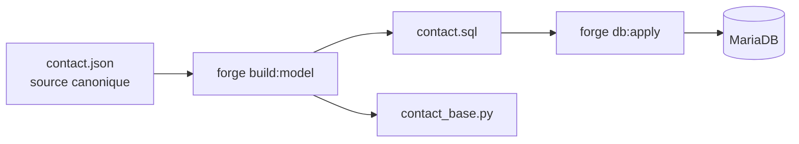
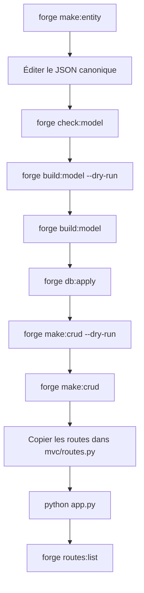

# Guide de démarrage Forge

[Accueil](index.html) <a href="javascript:void(0)" onclick="window.history.back()">Retour</a>

Forge est un framework web MVC Python avec HTTPS natif, SQL explicite, templates Jinja2 et génération déterministe du modèle. Ce guide part d'un environnement Forge déjà installé et aboutit à un premier projet fonctionnel avec CRUD généré.

Pour la référence complète (contrôleurs, formulaires, sécurité, CLI), voir [Référence API et CLI](reference.md).

!!! tip "Forge n'est pas encore installé ?"
    Commencez par le parcours adapté dans le menu Installation :
    [VM Debian vierge](installation-vm-debian.md), [pipx](installation-pipx.md),
    [GitHub](installation-github.md), [mode développement](installation-developpement.md)
    ou [préparation MariaDB](installation-mariadb.md).

---

## Créer votre premier projet

Deux méthodes selon votre situation.

### Cas A — Via `forge new` (recommandé)

```bash
forge new MonProjet
cd MonProjet
source .venv/bin/activate
```

`forge new` fait tout automatiquement : clonage du squelette, environnement virtuel Python, installation des dépendances, compilation CSS (si npm est présent) et génération des certificats SSL. Un dépôt Git propre est initialisé.

Il reste deux choses manuelles : **renseigner les mots de passe MariaDB** dans `env/dev`, puis lancer `forge db:init`.

### Cas B — Installation manuelle (usage avancé)

```bash
git clone --branch v1.0.1 --depth=1 https://github.com/caucrogeGit/Forge.git MonProjet
cd MonProjet
rm -rf .git && git init && git add -A && git commit -m "init: MonProjet"
python3 -m venv .venv
source .venv/bin/activate
pip install -r requirements.txt
pip install -e .
cp env/example env/dev
openssl req -x509 -newkey rsa:2048 -keyout key.pem -out cert.pem -days 365 -nodes -subj "/CN=localhost"
```

---

### 1. Vérifier l'environnement

```bash
forge doctor
```

### 2. Configurer `env/dev`

`forge new` crée `env/dev` depuis `env/example` avec `APP_NAME` et `DB_NAME` déjà renseignés. Il reste à renseigner les mots de passe MariaDB :

```env
# Compte admin MariaDB — utilisé uniquement par forge db:init
DB_ADMIN_LOGIN=root
DB_ADMIN_PWD=<mot_de_passe_root_mariadb>

# Compte applicatif — utilisé par l'application et forge db:apply
DB_APP_LOGIN=mon_projet_app
DB_APP_PWD=<mot_de_passe_applicatif>
```

??? info "Toutes les clés de `env/dev`"

    | Clé | Rôle | Valeur par défaut |
    |---|---|---|
    | `APP_NAME` | Nom de l'application (titre, logs) | défini par `forge new` |
    | `APP_ROUTES_MODULE` | Module Python des routes | `mvc.routes` |
    | `DB_ADMIN_HOST` | Hôte MariaDB admin | `localhost` |
    | `DB_ADMIN_PORT` | Port MariaDB admin | `3306` |
    | `DB_ADMIN_LOGIN` | Login administrateur MariaDB | `root` |
    | `DB_ADMIN_PWD` | Mot de passe administrateur | **à renseigner** |
    | `DB_NAME` | Nom de la base du projet | défini par `forge new` |
    | `DB_CHARSET` | Jeu de caractères | `utf8mb4` |
    | `DB_COLLATION` | Collation | `utf8mb4_unicode_ci` |
    | `DB_APP_HOST` | Hôte MariaDB applicatif | `localhost` |
    | `DB_APP_PORT` | Port MariaDB applicatif | `3306` |
    | `DB_APP_LOGIN` | Login applicatif MariaDB | **à renseigner** |
    | `DB_APP_PWD` | Mot de passe applicatif | **à renseigner** |
    | `DB_POOL_SIZE` | Taille du pool de connexions | `5` |
    | `APP_HOST` | Adresse d'écoute du serveur | `127.0.0.1` |
    | `APP_PORT` | Port du serveur | `8000` |
    | `SSL_CERTFILE` | Certificat SSL | `cert.pem` |
    | `SSL_KEYFILE` | Clé SSL | `key.pem` |

!!! warning "Ne pas confondre les deux comptes MariaDB"
    `DB_ADMIN_LOGIN` est utilisé uniquement par `forge db:init` pour créer la base et l'utilisateur applicatif.
    `DB_APP_LOGIN` est utilisé ensuite par l'application en fonctionnement normal et par `forge db:apply` en développement.

### 3. Initialiser la base MariaDB

```bash
forge db:init
```

Crée la base `DB_NAME`, l'utilisateur `DB_APP_LOGIN` et applique les droits nécessaires.

!!! success "Avant de continuer"
    Vérifier que MariaDB est démarré, que `env/dev` est configuré avec `DB_ADMIN_LOGIN`, `DB_ADMIN_PWD`, `DB_APP_LOGIN`, `DB_APP_PWD` et `DB_NAME`.

### 4. Créer une entité

```bash
forge make:entity Contact
```

La commande lance l'assistant interactif. Pour un usage scriptable :

```bash
forge make:entity Contact --no-input
```

Puis éditer le fichier canonique `mvc/entities/contact/contact.json` :

```json
{
  "format_version": 1,
  "entity": "Contact",
  "table": "contact",
  "fields": [
    { "name": "id",        "sql_type": "INT",          "primary_key": true, "auto_increment": true },
    { "name": "nom",       "sql_type": "VARCHAR(80)",   "constraints": { "not_empty": true, "max_length": 80 } },
    { "name": "prenom",    "sql_type": "VARCHAR(80)",   "constraints": { "not_empty": true, "max_length": 80 } },
    { "name": "email",     "sql_type": "VARCHAR(120)",  "unique": true, "constraints": { "not_empty": true, "max_length": 120 } },
    { "name": "telephone", "sql_type": "VARCHAR(20)",   "nullable": true, "constraints": { "max_length": 20 } }
  ]
}
```

??? info "Anatomie d'un JSON d'entité Forge"

    | Clé | Obligatoire | Description |
    |---|---|---|
    | `format_version` | non | Toujours `1` en V1 (défaut si absent) |
    | `entity` | **oui** | Nom PascalCase — devient le nom de la classe Python |
    | `table` | non | Nom snake_case — déduit de `entity` si absent |
    | `description` | non | Texte libre (documentaire) |
    | `fields` | **oui** | Liste des champs |

    **Chaque champ :**

    | Clé | Obligatoire | Description |
    |---|---|---|
    | `name` | **oui** | Nom snake_case du champ Python |
    | `sql_type` | **oui** | Type SQL MariaDB (`INT`, `VARCHAR(n)`, `DATE`…) |
    | `column` | non | Nom de colonne SQL — déduit de `name` si absent |
    | `python_type` | non | Type Python — déduit de `sql_type` si absent |
    | `nullable` | non | `true` / `false` (défaut : `false`) |
    | `primary_key` | non | `true` / `false` (défaut : `false`) |
    | `auto_increment` | non | `true` / `false` (défaut : `false`) |
    | `unique` | non | `true` / `false` (défaut : `false`) |
    | `default` | non | Valeur par défaut compatible avec `python_type` |
    | `constraints` | non | Validations applicatives (voir ci-dessous) |

    **Contraintes disponibles :**

    | Contrainte | Types | Description |
    |---|---|---|
    | `not_empty` | `str` | Interdit les chaînes vides |
    | `min_length` / `max_length` | `str` | Longueur min/max |
    | `min_value` / `max_value` | `int`, `float` | Valeur min/max |
    | `pattern` | `str` | Expression régulière Python |

### 5. Générer et appliquer le modèle

```bash
forge check:model          # vérifier la cohérence du JSON
forge build:model --dry-run  # prévisualiser sans écrire
forge build:model          # générer contact.sql et contact_base.py
forge db:apply             # créer la table dans MariaDB
```



!!! danger "Ne pas modifier les fichiers générés"
    `contact.sql` et `contact_base.py` sont régénérables — ne pas y écrire de logique manuelle.
    La logique métier va dans `contact.py`, qui n'est jamais écrasé par Forge.

### 6. Générer le CRUD

```bash
forge make:crud Contact --dry-run  # prévisualiser
forge make:crud Contact            # générer
```

Fichiers créés s'ils sont absents :

```text
mvc/controllers/contact_controller.py
mvc/models/contact_model.py
mvc/forms/contact_form.py
mvc/views/layouts/app.html
mvc/views/contact/index.html
mvc/views/contact/show.html
mvc/views/contact/form.html
```

!!! tip "Génération non destructive"
    Si un fichier existe déjà, il est marqué `[PRÉSERVÉ]` et non touché.

### 7. Déclarer les routes

`forge make:crud` affiche le bloc de routes à ajouter dans `mvc/routes.py` — il ne l'écrit jamais automatiquement.

Copier le bloc affiché dans `mvc/routes.py` :

```python
from mvc.controllers.contact_controller import ContactController

with router.group("/contacts") as g:
    g.add("GET",  "",              ContactController.index,   name="contact_index")
    g.add("GET",  "/new",          ContactController.new,     name="contact_new")
    g.add("POST", "",              ContactController.create,  name="contact_create")
    g.add("GET",  "/{id}",         ContactController.show,    name="contact_show")
    g.add("GET",  "/{id}/edit",    ContactController.edit,    name="contact_edit")
    g.add("POST", "/{id}",         ContactController.update,  name="contact_update")
    g.add("POST", "/{id}/delete",  ContactController.destroy, name="contact_destroy")
```

!!! warning "Ordre des routes"
    `/new` doit être déclaré avant `/{id}`. Sinon le routeur capture `new` comme identifiant.

Vérifier les routes déclarées :

```bash
forge routes:list
```

### 8. Lancer l'application

```bash
python app.py
```

Ouvrir dans le navigateur :

```text
https://localhost:8000/contacts
```

---

## Structure du projet

```text
MonProjet/
├── app.py                    # Point d'entrée — serveur HTTPS
├── config.py                 # Chargement de env/dev
│
├── core/                     # Framework Forge — ne pas modifier
│   ├── application.py        # Dispatcher : middlewares + routage
│   ├── http/                 # Request, Response, Router
│   ├── security/             # Sessions, CSRF, hashing, décorateurs
│   ├── forms/                # Form, Field, cleaned_data, erreurs
│   ├── database/             # Pool MariaDB, sql_loader
│   ├── mvc/                  # BaseController, Pagination
│   └── templating/           # Contrat Renderer + singleton
│
├── mvc/                      # Application — c'est ici que vous travaillez
│   ├── routes.py             # Déclaration des routes (manuel)
│   ├── entities/             # JSON canoniques + fichiers générés
│   │   ├── relations.json
│   │   ├── relations.sql
│   │   └── contact/
│   │       ├── contact.json      # source canonique
│   │       ├── contact.sql       # projection SQL générée
│   │       ├── contact_base.py   # base Python générée
│   │       └── contact.py        # classe métier manuelle
│   ├── controllers/
│   ├── models/
│   ├── forms/
│   ├── validators/
│   ├── helpers/
│   └── views/
│
├── env/
│   ├── example               # commité — valeurs par défaut
│   ├── dev                   # ignoré par git
│   └── prod                  # ignoré par git
│
├── tests/
└── static/
```

La règle fondamentale : `core/` appartient à Forge, `mvc/` appartient à votre application.

---

## Cycle de développement standard



| Commande | Rôle |
|---|---|
| `forge doctor` | Diagnostique l'environnement |
| `forge make:entity Nom` | Crée l'entité (assistant interactif) |
| `forge check:model` | Valide tous les JSON sans écrire |
| `forge build:model` | Génère `.sql` et `_base.py` depuis les JSON |
| `forge db:init` | Crée la base et l'utilisateur applicatif |
| `forge db:apply` | Applique les SQL générés dans MariaDB |
| `forge make:crud Nom` | Génère contrôleur, modèle, formulaire, vues |
| `forge routes:list` | Affiche les routes déclarées |

Pour les commandes avancées et la référence complète des paramètres, voir [Référence API et CLI](reference.md).

---

## Dépannage rapide

| Erreur | Cause probable | Correction |
|---|---|---|
| `forge: command not found` | `pipx` n'est pas dans le PATH | `pipx ensurepath` puis `exec $SHELL -l` |
| `No module named venv` | `python3-venv` absent | `sudo apt install python3-venv` |
| `mariadb_config not found` | dépendances MariaDB dev absentes | `sudo apt install libmariadb-dev pkg-config` |
| `Access denied for user 'root'@'localhost'` | mauvais mot de passe ou root en `unix_socket` | vérifier le mot de passe, ou tester `sudo mariadb` |
| `mariadb: command not found` | client MariaDB absent | `sudo apt install mariadb-client` |
| erreur de compilation Python | outils de build absents | `sudo apt install build-essential pkg-config libmariadb-dev` |
| `forge doctor` signale des FAIL | configuration incomplète | lire les messages FAIL et corriger |
| table absente après `db:apply` | `build:model` non lancé avant | relancer `forge build:model` puis `forge db:apply` |
| routes absentes dans `routes:list` | bloc de routes non copié | copier le bloc affiché par `forge make:crud` dans `mvc/routes.py` |
