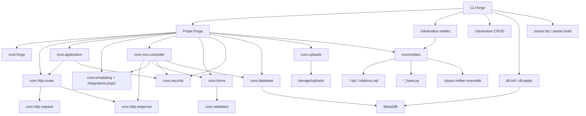

# Forge - Référence API et CLI

[Accueil](index.html){ .md-button }

Cette page décrit l'API publique actuelle de Forge `1.0.1`. Elle est organisée comme un index interactif : cliquez sur un élément pour afficher les détails, les signatures et les exemples.

Pour les flux guidés, voir aussi le [guide de démarrage](guide.md), le [CRUD explicite](crud.md) et l'[architecture des entités](entity_architecture.md).

## Schéma complet

[Ouvrir le schéma en grand](reference-schema.md){ .md-button .md-button--primary target="_blank" rel="noopener" }



## Index API

Chaque entrée ci-dessous est repliée par défaut. Ouvrez uniquement la partie utile pour lire le détail de l'API sans quitter l'index.

<details markdown="1" id="coreforge">
<summary><code>core.forge</code> - Configuration centrale</summary>

`core.forge` est le registre de configuration du noyau. Les modules `core/` lisent leurs paramètres avec `get()`.

### Fonctions

| API | Signature | Description |
|---|---|---|
| `configure` | `configure(**kwargs) -> None` | Configure Forge. Lève `KeyError` si une clé est inconnue. |
| `get` | `get(key: str) -> object` | Retourne une valeur. Lève `KeyError` si la clé est inconnue. |

### Clés disponibles

| Clé | Défaut | Description |
|---|---|---|
| `app_name` | `"Forge"` | Nom de l'application |
| `app_env` | `"dev"` | Environnement actif |
| `views_dir` | `mvc/views` | Dossier des templates |
| `sql_dir` | `mvc/models/sql` | Dossier des requêtes SQL |
| `upload_root` | `storage/uploads` | Racine des uploads |
| `upload_max_size` | `5242880` | Taille maximale d'un fichier |
| `upload_allowed_extensions` | `["jpg", "jpeg", "png", "webp", "pdf"]` | Extensions autorisées |
| `upload_allowed_mime_types` | `["image/jpeg", "image/png", "image/webp", "application/pdf"]` | MIME autorisés |
| `db_host` | `"localhost"` | Hôte MariaDB |
| `db_port` | `3306` | Port MariaDB |
| `db_name` | `"forge_db"` | Nom de la base |
| `db_user` | `"root"` | Utilisateur MariaDB |
| `db_password` | `""` | Mot de passe |
| `db_pool_size` | `5` | Taille du pool |
| `css_visible` | `"block"` | Classe pagination visible |
| `css_hidden` | `"hidden"` | Classe pagination masquée |
| `router` | `None` | Routeur actif pour `url_for()` |

Les chemins relatifs `views_dir`, `sql_dir` et `upload_root` sont résolus depuis la racine du projet.

### Exemple

```python
from core.forge import configure, get

configure(
    app_name="Carnet",
    app_env="dev",
    db_name="carnet_dev",
    db_user="carnet_app",
)

print(get("app_name"))
```

</details>

<details markdown="1" id="corehttprequest">
<summary><code>core.http.request</code> - Requête HTTP</summary>

### Classes

| API | Description |
|---|---|
| `Request` | Représente une requête HTTP entrante. |
| `UploadedFile` | Fichier reçu dans un formulaire `multipart/form-data`. |
| `RequestEntityTooLarge` | Exception levée si le body dépasse la limite autorisée. |

### `Request`

Attributs principaux :

| Attribut | Type | Description |
|---|---|---|
| `original_method` | `str` | Méthode reçue avant override. |
| `method` | `str` | Méthode effective. `POST` peut devenir `PUT`, `PATCH` ou `DELETE` via `_method`. |
| `path` | `str` | Chemin sans query string. |
| `headers` | `HTTPMessage` | En-têtes HTTP. |
| `params` | `dict[str, list[str]]` | Query string parsée avec `parse_qs`. |
| `body` | `dict[str, list[str]]` | Formulaire parsé. |
| `json_body` | `dict` | JSON parsé si `Content-Type` vaut `application/json`. |
| `files` | `dict[str, UploadedFile]` | Fichiers uploadés. |
| `ip` | `str` | Adresse IP client. |
| `route_params` | `dict[str, str]` | Paramètres injectés par le routeur. |

### Exemple

```python
def create_contact(request):
    name = request.body.get("name", [""])[0]
    avatar = request.files.get("avatar")

    if avatar:
        print(avatar.filename, avatar.content_type, avatar.size)

    return Response(201, f"Contact {name} créé")
```

Notes :

- `GET`, `HEAD` et `OPTIONS` ne lisent pas de body.
- La limite de body par défaut est `1_048_576` octets.
- Les uploads multipart utilisent au minimum `1 MiB` et ajoutent une marge de `65_536` octets à `upload_max_size`.

</details>

<details markdown="1" id="corehttpresponse">
<summary><code>core.http.response</code> - Réponse HTTP</summary>

### Classe

```python
Response(status=200, body=b"", content_type="text/html; charset=utf-8", headers=None)
```

| Attribut | Type | Description |
|---|---|---|
| `status` | `int` | Code HTTP. |
| `body` | `bytes` | Corps de réponse. Une `str` est encodée en UTF-8. |
| `content_type` | `str` | Type MIME. |
| `headers` | `dict` | En-têtes additionnels. |

### Exemples

```python
from core.http.response import Response

def health(request):
    return Response(200, "OK", content_type="text/plain; charset=utf-8")
```

```python
return Response(
    302,
    "",
    headers={"Location": "/login"},
)
```

</details>

<details markdown="1" id="corehttphelpers">
<summary><code>core.http.helpers</code> - Helper HTML</summary>

### Fonction

| API | Signature | Description |
|---|---|---|
| `html` | `html(template, status=200, context=None, raw=False) -> Response` | Rend un template et retourne une `Response`. |

`raw=True` lit le fichier depuis `views_dir` sans passer par Jinja2. C'est utile pour des fichiers contenant des accolades ou des fragments non templatisés.

### Exemple

```python
from core.http.helpers import html

def dashboard(request):
    return html("dashboard/index.html", context={"title": "Tableau de bord"})
```

</details>

<details markdown="1" id="corehttprouter">
<summary><code>core.http.router</code> - Router, routes et URL nommées</summary>

### Classes et constantes

| API | Description |
|---|---|
| `Router` | Registre de routes. |
| `RouteEntry` | Route compilée avec méthode, pattern, handler et options. |
| `RouteGroup` | Groupe de routes partageant un préfixe et des options. |
| `SAFE_METHODS` | `{"GET", "HEAD", "OPTIONS"}` |
| `UNSAFE_METHODS` | `{"POST", "PUT", "PATCH", "DELETE"}` |

### Méthodes publiques de `Router`

| API | Signature | Description |
|---|---|---|
| `add` | `add(method, pattern, handler, name=None, public=False, csrf=True, api=False) -> Router` | Ajoute une route. |
| `group` | `group(prefix, public=False, csrf=True, api=False) -> RouteGroup` | Crée un groupe utilisable avec `with`. |
| `match` | `match(method, path) -> tuple[RouteEntry, dict] \| None` | Retourne la route et ses paramètres. |
| `resolve` | `resolve(method, path) -> tuple[handler, dict] \| None` | Retourne le handler et ses paramètres. |
| `is_public` | `is_public(path, method=None) -> bool` | Indique si une route est publique. |
| `iter_routes` | `iter_routes() -> list[RouteEntry]` | Liste les routes déclarées. |
| `url_for` | `url_for(name, **params) -> str` | Génère une URL depuis une route nommée. |

### Patterns supportés

| Pattern | URL | Paramètres |
|---|---|---|
| `/contacts` | `/contacts` | `{}` |
| `/contacts/{id}` | `/contacts/42` | `{"id": "42"}` |
| `/api/{version}/contacts/{id}` | `/api/v1/contacts/5` | `{"version": "v1", "id": "5"}` |

### Exemples

```python
from core.http.router import Router

router = Router()
router.add("GET", "/", home, name="home", public=True, csrf=False)
router.add("POST", "/contacts", create_contact, name="contacts.create")

url = router.url_for("contacts.create")
```

```python
with router.group("/admin", public=False) as admin:
    admin.add("GET", "", admin_index, name="admin.index")
    admin.add("POST", "/users", create_user, name="admin.users.create")
```

Une route `POST`, `PUT`, `PATCH` ou `DELETE` est protégée par CSRF par défaut, sauf si `csrf=False`.

</details>

<details markdown="1" id="coreapplication">
<summary><code>core.application</code> - Dispatch applicatif</summary>

### Classe

```python
Application(router, middlewares=None, login_url="/login", csrf_middleware=None)
```

### Méthode

| API | Signature | Description |
|---|---|---|
| `dispatch` | `dispatch(request) -> Response` | Résout la route, applique CSRF et middlewares, appelle le handler. |

### Flux réel

1. Recherche de la route.
2. Si aucune route ne correspond, retourne `errors/404.html`.
3. Injection de `request.route_params`.
4. Vérification CSRF pour les méthodes unsafe si la route le demande.
5. Exécution des middlewares pour les routes non publiques.
6. Appel du handler.
7. En cas d'exception non gérée, retourne `errors/500.html`.

### Exemple middleware

```python
from core.http.response import Response

class AdminOnly:
    def check(self, request):
        if not request.headers.get("X-Admin"):
            return Response(403, "Interdit")
        return None
```

</details>

<details markdown="1" id="coretemplating-et-jinja2">
<summary><code>core.templating</code> et <code>integrations.jinja2</code> - Templates</summary>

### API

| Élément | Signature | Description |
|---|---|---|
| `template_manager` | singleton `TemplateManager` | Renderer actif. |
| `TemplateManager.register` | `register(renderer) -> None` | Enregistre ou remplace le renderer. |
| `TemplateManager.render` | `render(template, context) -> str` | Rend un template. Lève `RuntimeError` sans renderer. |
| `Jinja2Renderer` | `Jinja2Renderer(views_dir: str)` | Renderer Jinja2 avec autoescape HTML. |

`Jinja2Renderer` expose le helper global `url_for(name, **params)`, branché sur `core.forge.get("router")`.

### Exemples

```python
from core.forge import configure, get
from core.templating.manager import template_manager
from integrations.jinja2.renderer import Jinja2Renderer

configure(views_dir="mvc/views", router=router)
template_manager.register(Jinja2Renderer(get("views_dir")))
```

```html
<a href="{{ url_for('contacts.show', id=contact.ContactId) }}">
  Voir
</a>
```

</details>

<details markdown="1" id="coresecurity">
<summary><code>core.security</code> - Sessions, auth, CSRF et mots de passe</summary>

### Sessions mémoire

| API | Description |
|---|---|
| `creer_session()` | Crée une session et retourne son identifiant. |
| `get_session(session_id)` | Retourne la session ou `None`. |
| `supprimer_session(session_id)` | Supprime une session. |
| `regenerer_session(old_session_id)` | Crée une nouvelle session en copiant les données. |
| `authentifier_session(session_id, utilisateur)` | Marque une session comme authentifiée et retourne un nouveau `session_id`. |
| `get_session_id(request)` | Lit le cookie `session_id`. |
| `est_authentifie(request)` | Vérifie l'authentification. |
| `get_utilisateur(request)` | Retourne l'utilisateur de session. |
| `utilisateur_a_role(request, role)` | Vérifie un rôle. |
| `set_flash(session_id, message, level="success")` | Stocke un message flash. |
| `get_flash(session_id)` | Lit et consomme le flash. |

Le stockage de session est en mémoire. Il convient au développement, à la pédagogie et aux petites applications mono-processus. Les sessions sont perdues au redémarrage, ne sont pas partagées entre workers et ne conviennent pas au scaling horizontal.

### Middleware et décorateurs

| API | Description |
|---|---|
| `AuthMiddleware(login_url="/login")` | Redirige vers `/login` si la session n'est pas authentifiée. |
| `CsrfMiddleware(field_name="csrf_token", header_name="X-CSRF-Token")` | Vérifie le token CSRF sur les routes unsafe. |
| `require_auth` | Décorateur de handler authentifié. |
| `require_csrf` | Décorateur de handler avec CSRF. |
| `require_role(role)` | Décorateur de handler limité à un rôle. |

### Mots de passe et limitation

| API | Description |
|---|---|
| `hacher_mot_de_passe(password)` | Hash PBKDF2-HMAC-SHA256 avec sel. |
| `verifier_mot_de_passe(password, stored)` | Vérifie un mot de passe. |
| `enregistrer_tentative(ip)` | Enregistre une tentative par IP. |
| `est_limite(ip)` | Limite après `5` tentatives dans une fenêtre de `60` secondes. |

### Exemples

```python
from core.security.session import authentifier_session, creer_session, get_session

session_id = creer_session()
session_id = authentifier_session(session_id, {
    "UtilisateurId": 1,
    "Login": "roger",
    "roles": ["admin"],
})

session = get_session(session_id)
print(session["utilisateur"]["login"])
```

```python
from core.security.decorators import require_role

@require_role("admin")
def admin_dashboard(request):
    return self.render("admin/dashboard.html", request=request)
```

```html
<input type="hidden" name="csrf_token" value="{{ csrf_token }}">
```

</details>

<details markdown="1" id="coreforms">
<summary><code>core.forms</code> - Formulaires et champs</summary>

### Classe `Form`

| API | Description |
|---|---|
| `Form(data=None, **options)` | Instancie un formulaire. |
| `Form.from_request(request, **options)` | Crée un formulaire depuis `request.body`. |
| `is_bound` | Indique si le formulaire a reçu des données. |
| `errors` | Erreurs par champ. |
| `non_field_errors` | Erreurs globales. |
| `field_errors(name)` | Erreurs d'un champ. |
| `value(name, default="")` | Valeur nettoyée ou brute. |
| `error(name)` | Première erreur d'un champ. |
| `has_error(name)` | Indique si un champ a une erreur. |
| `add_error(name, message)` | Ajoute une erreur. |
| `is_valid()` | Lance la validation et retourne un booléen. |
| `clean()` | Hook de validation globale à surcharger. |
| `context()` | Contexte prêt pour le template. |

### Champs

| Champ | Valeur nettoyée | Usage |
|---|---|---|
| `StringField` | `str` | Texte, longueur, regex. |
| `IntegerField` | `int` | Entiers, min, max. |
| `DecimalField` | `Decimal` | Valeurs décimales précises. |
| `BooleanField` | `bool` | Checkbox. |
| `ChoiceField` | `str` | Valeur parmi une liste. |
| `RelatedIdsField` | `list[int]` | Liste d'identifiants reliés. |

### Exemple

```python
from core.forms import Form, StringField, IntegerField

class ContactForm(Form):
    prenom = StringField(required=True, max_length=100)
    age = IntegerField(required=False, min_value=0)

    def clean(self):
        if self.cleaned_data.get("prenom") == "admin":
            self.add_error("prenom", "Ce prénom est réservé.")


form = ContactForm.from_request(request)
if form.is_valid():
    contact.prenom = form.cleaned_data["prenom"]
```

`DecimalField` retourne un `Decimal`. Les CRUD générés gardent la doctrine Forge actuelle : les champs JSON de type Python `float` restent convertis en `float`.

</details>

<details markdown="1" id="coremvccontroller">
<summary><code>core.mvc.controller</code> - BaseController</summary>

### Méthodes publiques

| API | Description |
|---|---|
| `render(template, status=200, context=None, base="layouts/base.html", request=None, raw=False)` | Rend une vue Jinja2. Injecte un token CSRF si `request` est fourni et si `raw=False`. Le paramètre `base` est conservé pour compatibilité historique mais n'enveloppe plus le template. |
| `redirect(location, status=302)` | Redirection simple. |
| `redirect_with_flash(request, location, type_, message, status=302)` | Flash puis redirection. |
| `redirect_to_route(name, status=302, **params)` | Redirection vers une route nommée. |
| `not_found()` | Réponse 404. |
| `bad_request()` | Réponse 400. |
| `forbidden()` | Réponse 403. |
| `validation_error(context=None)` | Réponse 422. |
| `server_error()` | Réponse 500. |
| `set_flash(request, type_, message)` | Ajoute un flash. |
| `csrf_token(request)` | Retourne le token CSRF de session. |
| `current_user(request)` | Retourne l'utilisateur courant. |
| `include(template, context=None)` | Rend un fragment. |
| `json(data, status=200)` | Retourne du JSON. |
| `body(request)` | Aplatit `request.body`. |
| `json_body(request)` | Retourne `request.json_body`. |
| `render_form(template, form, status=200, context=None, request=None)` | Rend un template avec contexte de formulaire. |
| `form_context(form)` | Retourne `form.context()`. |

### Exemple

```python
from core.mvc.controller import BaseController

class ContactController(BaseController):
    def index(self, request):
        return self.render(
            "contacts/index.html",
            context={"contacts": []},
            request=request,
        )

    def api_index(self, request):
        return self.json({"contacts": []})
```

Dans les CRUD générés, les identifiants de route sont parsés avant usage. Une valeur invalide comme `/contacts/abc` retourne une réponse de type `not_found()` au lieu de provoquer une erreur serveur.

</details>

<details markdown="1" id="coremvcmodel">
<summary><code>core.mvc.model</code> - Validation MVC minimale</summary>

### API

| Élément | Description |
|---|---|
| `Validator` | Validateur simple avec erreurs par champ. |
| `DoublonError` | Exception métier pour signaler un doublon. |

### `Validator`

| Méthode | Description |
|---|---|
| `required(field, value, message=None)` | Vérifie une présence. |
| `max_length(field, value, max_len, message=None)` | Vérifie une longueur maximale. |
| `add_error(field, message)` | Ajoute une erreur. |
| `is_valid()` | Retourne `True` sans erreur. |
| `errors` | Dictionnaire des erreurs. |

### Exemple

```python
from core.mvc.model.validator import Validator

validator = Validator()
validator.required("Email", email)
validator.max_length("Nom", nom, 100)

if not validator.is_valid():
    return self.validation_error({"errors": validator.errors})
```

</details>

<details markdown="1" id="coremvcview">
<summary><code>core.mvc.view</code> - Pagination</summary>

### Classe

```python
Pagination(request, total, par_page)
```

### Attributs et méthodes

| API | Description |
|---|---|
| `total` | Nombre total d'éléments. |
| `par_page` | Taille de page. |
| `nb_pages` | Nombre de pages. |
| `page` | Page courante, lue depuis `?page=`. |
| `limit` | Limite SQL. |
| `offset` | Offset SQL. |
| `pages` | Liste des numéros de page. |
| `context` | Contexte avec classes CSS `css_visible` / `css_hidden`. |
| `to_dict()` | Version dictionnaire avec booléens `has_prev` et `has_next`. |

### Exemple

```python
pagination = Pagination(request, total=125, par_page=20)
rows = fetch_all("SELECT * FROM Contact LIMIT ? OFFSET ?", [
    pagination.limit,
    pagination.offset,
])

return self.render("contacts/index.html", {
    "contacts": rows,
    "pagination": pagination.context,
})
```

</details>

<details markdown="1" id="mvchelpers">
<summary><code>mvc.helpers</code> - Fragments HTML utiles aux vues</summary>

### API

| Élément | Signature | Description |
|---|---|---|
| `render_flash_html` | `render_flash_html(request) -> str` | Lit le flash de session, le consomme et rend `partials/flash.html`. |
| `render_errors_html` | `render_errors_html(errors: list[str]) -> str` | Convertit une liste d'erreurs en `<ul>` HTML échappée. |

### Niveaux de flash

| Niveau | Classes CSS |
|---|---|
| `success` | `bg-green-100 border-green-400 text-green-800` |
| `error` | `bg-red-100 border-red-400 text-red-800` |
| `warning` | `bg-gray-100 border-gray-300 text-gray-800` |
| `info` | `bg-gray-100 border-gray-300 text-gray-800` |

### Exemples

```python
from mvc.helpers.flash import render_flash_html

flash = render_flash_html(request)
return self.render("contacts/index.html", {
    "flash": flash,
}, request=request)
```

```html
{{ flash | safe }}
```

```python
from mvc.helpers.form_errors import render_errors_html

errors_html = render_errors_html(["Le nom est obligatoire."])
```

</details>

<details markdown="1" id="coredatabase">
<summary><code>core.database</code> - MariaDB, transactions et SQL loader</summary>

### Connexions

| API | Description |
|---|---|
| `get_connection()` | Retourne une connexion du pool MariaDB. |
| `close_connection(conn)` | Rend ou ferme une connexion. |

La connexion lit `db_host`, `db_port`, `db_name`, `db_user`, `db_password` et `db_pool_size` dans `core.forge`.

### Helpers SQL

| API | Description |
|---|---|
| `fetch_one(query, params=None, tx=None)` | Retourne une ligne ou `None`. |
| `fetch_all(query, params=None, tx=None)` | Retourne toutes les lignes. |
| `execute(query, params=None, tx=None)` | Exécute une requête et retourne le nombre de lignes affectées. |
| `insert(query, params=None, tx=None)` | Exécute un insert et retourne le dernier id. |

Sans transaction explicite, chaque helper ouvre une connexion et commit/rollback lui-même.

### Transactions

| API | Description |
|---|---|
| `Transaction` | Transaction explicite avec connexion dédiée. |
| `transaction()` | Context manager transactionnel. |

### SQL loader

| API | Description |
|---|---|
| `charger_queries(nom_fichier)` | Charge un fichier depuis `{sql_dir}/{app_env}/` et le met en cache. |

Le cache est invalidé si la taille ou `mtime_ns` du fichier change.

### Exemples

```python
from core.database.db import fetch_all

contacts = fetch_all("SELECT * FROM Contact ORDER BY Nom")
```

```python
from core.database.transaction import transaction
from core.database.db import execute, insert

with transaction() as tx:
    contact_id = insert(
        "INSERT INTO Contact (Nom) VALUES (?)",
        ["Dupont"],
        tx=tx,
    )
    execute(
        "INSERT INTO Log (Message) VALUES (?)",
        [f"Contact {contact_id} créé"],
        tx=tx,
    )
```

```python
from core.database.sql_loader import charger_queries

queries = charger_queries("contacts.sql")
rows = fetch_all(queries["select_all"])
```

En production, l'utilisateur applicatif MariaDB doit rester limité aux droits runtime (`SELECT`, `INSERT`, `UPDATE`, `DELETE`). Les droits de migration (`CREATE`, `ALTER`, `DROP`, `INDEX`, `REFERENCES`) doivent être réservés à un utilisateur d'administration ou de migration.

</details>

<details markdown="1" id="coreuploads">
<summary><code>core.uploads</code> - Uploads et stockage</summary>

### Gestionnaire

| API | Description |
|---|---|
| `SavedUpload` | Résultat d'un upload sauvegardé. |
| `upload_root()` | Racine des fichiers uploadés. |
| `save_upload(file, category="documents")` | Valide puis sauvegarde un fichier. |
| `delete_upload(path_or_saved_upload)` | Supprime un fichier. |
| `get_upload_path(relative_path)` | Résout un chemin d'upload. |

### Stockage

| API | Description |
|---|---|
| `ensure_upload_dirs()` | Crée les dossiers nécessaires. |
| `safe_category(category)` | Nettoie un nom de catégorie. |
| `secure_filename(filename)` | Nettoie un nom de fichier. |
| `generate_unique_filename(filename)` | Génère un nom unique. |
| `category_dir(category)` | Retourne le dossier de catégorie. |
| `save_bytes(data, filename, category)` | Sauvegarde des octets. |
| `delete_file(relative_path)` | Supprime un fichier. |

### Validation et exceptions

| API | Description |
|---|---|
| `validate_upload_metadata(filename, size, content_type)` | Valide nom, taille, extension et MIME. |
| `UploadError` | Exception de base. |
| `UploadTooLargeError` | Fichier trop volumineux. |
| `UploadInvalidExtensionError` | Extension refusée. |
| `UploadInvalidMimeTypeError` | MIME refusé. |
| `UploadStorageError` | Erreur d'écriture ou suppression. |

### Exemple

```python
from core.uploads.manager import save_upload

def upload_avatar(request):
    file = request.files.get("avatar")
    if not file:
        return self.bad_request()

    saved = save_upload(file, category="avatars")
    return self.json({
        "filename": saved.filename,
        "path": saved.relative_path,
        "size": saved.size,
    })
```

</details>

<details markdown="1" id="corevalidation">
<summary><code>core.validation</code> - Décorateurs V1 des entités</summary>

Ces décorateurs vivent dans `core/validation/decorators.py` et lèvent `ValidationError`, l'exception centrale de validation V1.

### Décorateurs autorisés

| Décorateur | Description |
|---|---|
| `typed(expected_type)` | Vérifie le type Python sans transformation implicite. `bool` est refusé pour `int`. |
| `nullable` | Marque explicitement une propriété nullable. |
| `not_empty` | Refuse les chaînes vides ou blanches. |
| `min_length(size)` | Longueur minimale d'une chaîne. |
| `max_length(size)` | Longueur maximale d'une chaîne. |
| `min_value(limit)` | Valeur numérique minimale. |
| `max_value(limit)` | Valeur numérique maximale. |
| `pattern(regex)` | Expression régulière avec `fullmatch`. |

### Exemple

```python
from core.validation.decorators import max_length, not_empty, typed

class ContactBase:
    @property
    def nom(self):
        return self._nom

    @nom.setter
    @typed(str)
    @not_empty
    @max_length(100)
    def nom(self, value):
        self._nom = value
```

Les fichiers générés `*_base.py` peuvent utiliser ces décorateurs. La classe métier manuelle reste le bon endroit pour ajouter du comportement applicatif.

</details>

<details markdown="1" id="forge-cli">
<summary><code>forge</code> CLI - Commandes officielles</summary>

L'interface officielle est la commande `forge`. La version stable actuelle est `1.0.1`.

### Commandes

| Commande | Rôle |
|---|---|
| `forge --version` | Affiche la version CLI. |
| `forge new NomProjet [--ref REF]` | Crée un projet depuis `v1.0.1` par défaut. `--ref main` est explicite pour le développement. |
| `forge make:entity NomEntite` | Crée le JSON canonique d'une entité. |
| `forge make:crud NomEntite [--dry-run]` | Génère contrôleur, vues et routes CRUD. |
| `forge make:relation` | Assistant de création de relation. |
| `forge sync:entity NomEntite` | Régénère `*_base.py` et SQL depuis le JSON. |
| `forge sync:relations` | Régénère `relations.sql` depuis `relations.json`. |
| `forge sync:landing [--check]` | Synchronise ou vérifie la landing. |
| `forge upload:init` | Prépare les dossiers d'uploads. |
| `forge build:model` | Régénère les modèles. |
| `forge check:model` | Vérifie la cohérence des modèles. |
| `forge db:init` | Prépare l'environnement MariaDB. |
| `forge db:apply` | Applique le SQL généré. |
| `forge routes:list` | Liste les routes de l'application. |
| `forge deploy:init` | Prépare les fichiers de déploiement. |
| `forge deploy:check` | Vérifie la configuration de déploiement. |
| `forge starter:list` | Liste les starter apps. |
| `forge starter:build` | Reconstruit une starter app. |
| `forge doctor` | Lance les diagnostics projet. |
| `forge help` | Affiche l'aide. |

### Exemples

```bash
forge --version
forge new GestionVentes
forge new ForgeDev --ref main
```

```bash
forge make:entity Contact
forge sync:entity Contact
forge make:crud Contact --dry-run
forge make:crud Contact
```

```bash
forge check:model
forge db:init
forge db:apply
forge routes:list
```

</details>

<details markdown="1" id="forgeclieentities">
<summary><code>forge_cli.entities</code> - Génération et validation des entités</summary>

Cette partie suit la doctrine V1 décrite dans l'[architecture des entités](entity_architecture.md).

### Doctrine générée

| Source | Statut | Règle |
|---|---|---|
| `mvc/entities/<entite>/<entite>.json` | Canonique | Décrit l'entité, ses champs et contraintes. |
| `mvc/entities/<entite>/<entite>_base.py` | Régénérable | Classe Python générée avec validation. |
| `mvc/entities/<entite>/<entite>.sql` | Régénérable | SQL de table. |
| `mvc/entities/<entite>/<entite>.py` | Manuel | Classe métier, jamais écrasée si elle existe. |
| `mvc/entities/<entite>/__init__.py` | Manuel | Jamais régénéré s'il existe. |
| `mvc/entities/relations.json` | Canonique | Relations globales. |
| `mvc/entities/relations.sql` | Régénérable | Contraintes de clés étrangères. |

### Validation importante

| Sujet | Règle actuelle |
|---|---|
| Noms | `snake_case` pour dossiers, tables et champs Python. Colonnes SQL en `PascalCase`. |
| Mots réservés SQL | Les noms comme `order`, `user`, `group` ou `select` sont refusés. |
| Relations | V1 accepte les relations `many_to_one`. |
| Clés primaires | V1 limite les entités à une clé primaire simple. |
| Types SQL de FK | Les types SQL normalisés doivent être compatibles. `INT` vers `BIGINT` ou `INT UNSIGNED` est refusé. |
| Génération | Un JSON invalide bloque la génération. |

### Exemple JSON entité

```json
{
  "entity": "Contact",
  "table": "contact",
  "primary_key": {
    "name": "contact_id",
    "sql": "ContactId",
    "python_type": "int",
    "sql_type": "INT",
    "auto_increment": true
  },
  "fields": [
    {
      "name": "prenom",
      "sql": "Prenom",
      "python_type": "str",
      "sql_type": "VARCHAR(100)",
      "nullable": false,
      "constraints": {
        "not_empty": true,
        "max_length": 100
      }
    }
  ]
}
```

### Exemple relation

```json
{
  "relations": [
    {
      "name": "contact_ville",
      "type": "many_to_one",
      "from_entity": "contact",
      "from_field": "ville_id",
      "to_entity": "ville",
      "to_field": "ville_id",
      "on_delete": "RESTRICT",
      "on_update": "CASCADE"
    }
  ]
}
```

### Exemples de cycle complet

```bash
forge make:entity Ville
forge make:entity Contact
forge sync:entity Ville
forge sync:entity Contact
forge make:relation
forge sync:relations
forge check:model
```

```bash
forge db:apply
forge make:crud Contact
```

La génération CRUD applique la correction de robustesse sur les identifiants invalides : un `id` de route non entier est traité comme une ressource introuvable.

</details>
