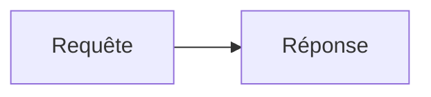

# Exemples Markdown

Cette page accompagne l'[aide-mémoire](aide-memoire.md) : pour chaque syntaxe, signe et séquence, elle montre un **petit exemple**.

Les éléments **en ligne** sont rendus directement dans une colonne « Exemple ».
Les éléments **en bloc** (titres, encadrés, code, onglets…) sont montrés en **source puis rendu**.

# En ligne

## Emphase et code

| Syntaxe | Exemple rendu |
|---|---|
| `**gras**` | **gras** |
| `_italique_` | _italique_ |
| `**_gras italique_**` | **_gras italique_** |
| `` `code` `` | `Response.text()` |
| `` `#!python fetch_all()` `` | `#!python fetch_all()` |

## Texte enrichi

| Syntaxe | Exemple rendu |
|---|---|
| `==surligné==` | ==surligné== |
| `^exposant^` | m^2^ |
| `^^inséré^^` | ^^inséré^^ |
| `~indice~` | H~2~O |
| `~~barré~~` | ~~barré~~ |
| `++ctrl+c++` | ++ctrl+c++ |
| `-->` `+/-` `(c)` | --> +/- (c) |
| `:material-check:` | :material-check: |
| `:rocket:` | :rocket: |
| `[=75% "75 %"]` | [=75% "75 %"] |

## Liens, attributs, relecture, maths

| Syntaxe | Exemple rendu |
|---|---|
| `[texte](cible)` | [Python](https://www.python.org) |
| `https://… (auto)` | https://www.python.org |
| `**texte**{ .classe }` | **Objectif**{ .intro-label } |
| `[texte](#){ title="…" }` | [survolez-moi](#){ title="exemple d'infobulle" } |
| `**mot**{ title="…" }` | **mot**{ title="infobulle au survol" } |
| `texte[^clé]` | une affirmation[^ex] |
| `{++ajout++}` | {++ajout++} |
| `{--retrait--}` | {--retrait--} |
| `{~~a~>b~~}` | {~~a~>b~~} |
| `{==surligné==}` | {==surligné==} |
| `$O(1)$` | $O(1)$ |

[^ex]: Voici la note de bas de page de l'exemple.

# Signes

L'exemple montre un usage courant du signe.

## Ponctuation

| Signe | Nom | Exemple |
|---|---|---|
| `;` | point-virgule | rouge ; vert ; bleu |
| `:` | deux-points | trois couleurs : rouge, vert, bleu |
| `…` | points de suspension | et ainsi de suite… |
| `·` | point médian | auteur·rice |
| `•` | puce | premier • deuxième |

## Tirets

| Signe | Nom | Exemple |
|---|---|---|
| `-` | trait d'union | porte-clé |
| `–` | tiret demi-cadratin | pages 10–20 |
| `—` | tiret cadratin (à éviter) | un aparté — comme ceci |

## Guillemets et apostrophes

| Signe | Nom | Exemple |
|---|---|---|
| `«` `»` | guillemets français | « Bonjour Forge » |
| `’` | apostrophe typographique | l’objet Request |
| `` ` `` | accent grave | code : `forge serve` |

## Parenthèses, opérateurs et symboles

| Signe | Nom | Exemple |
|---|---|---|
| `(` `)` | parenthèses | une remarque (entre parenthèses) |
| `[` `]` | crochets | un tableau index `[0]` |
| `{` `}` | accolades | un segment `/article/{id}` |
| `±` | plus ou moins | 20 ± 2 |
| `×` `÷` | multiplié, divisé | 6 × 7, 42 ÷ 6 |
| `≠` `≤` `≥` | comparateurs | a ≠ b, x ≤ y |
| `→` | flèche | requête → réponse |
| `°` | degré | 20 °C |
| `§` | paragraphe | voir § 2.1 |
| `µ` | micro | 5 µF |
| `©` `®` `™` | commerciaux | Forge © 2026 |

# En bloc

## Titres

~~~md
## Présentation
### Pour qui ?
~~~

Rendu : deux sous-titres qui apparaissent dans le sommaire de la page.

## Image

~~~md

~~~

Rendu :


Le chemin est relatif à la page ; le texte alternatif décrit l'image et s'affiche si elle manque.
**Cliquez sur l'image** : elle s'ouvre en grand dans une surimpression (lightbox, plugin `mkdocs-glightbox`), sans syntaxe particulière.

## Citation et règle horizontale

~~~md
> Refuser la magie cachée.

---
~~~

Rendu :

> Refuser la magie cachée.

---

## Listes

~~~md
- Explicite
- Minimal

1. Installer
2. Configurer

- [x] Fait
- [ ] À faire
~~~

Rendu :

- Explicite
- Minimal

1. Installer
2. Configurer

- [x] Fait
- [ ] À faire

## Tableau

~~~md
| Commande | Rôle |
|:---|:---|
| `forge new` | crée un projet |
~~~

Rendu :

| Commande | Rôle |
|:---|:---|
| `forge new` | crée un projet |

## Liste de définition

~~~md
Route
:   Chemin associé à une méthode de contrôleur.
~~~

Rendu :

Route
:   Chemin associé à une méthode de contrôleur.

## Admonition et bloc dépliable

~~~md
!!! warning "Attention"
    Forge exige Python 3.12.

??? note "Détail"
    Contenu replié par défaut.
~~~

Rendu :

!!! warning "Attention"
    Forge exige Python 3.12.

??? note "Détail"
    Contenu replié par défaut.

## Onglets

~~~md
=== "Linux"
    ```bash
    source .venv/bin/activate
    ```

=== "Windows"
    ```bat
    .venv\Scripts\activate
    ```
~~~

Rendu :

=== "Linux"
    ```bash
    source .venv/bin/activate
    ```

=== "Windows"
    ```bat
    .venv\Scripts\activate
    ```

## Bloc de code

````md
```python title="exemple.py" linenums="1" hl_lines="2"
def index(request):
    return Response.text("Bonjour")
```
````

Rendu :

```python title="exemple.py" linenums="1" hl_lines="2"
def index(request):
    return Response.text("Bonjour")
```

## Diagramme Mermaid

````md

````

Rendu :


## Note de bas de page et abréviation

~~~md
Forge suit le patron MVC[^mvc].

[^mvc]: Modèle, Vue, Contrôleur.

*[MVC]: Modèle Vue Contrôleur
~~~

Rendu :

Forge suit le patron MVC[^mvc].

[^mvc]: Modèle, Vue, Contrôleur.

*[MVC]: Modèle Vue Contrôleur

## Formule en bloc

~~~md
$$
T(n) = T(n/2) + O(1)
$$
~~~

Rendu :

$$
T(n) = T(n/2) + O(1)
$$
