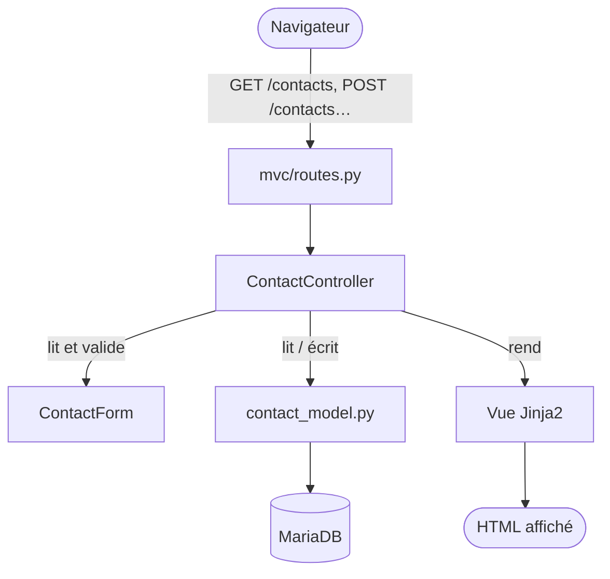
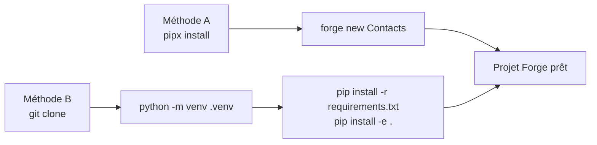
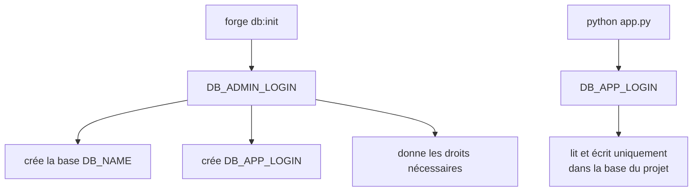
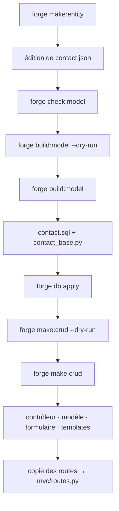
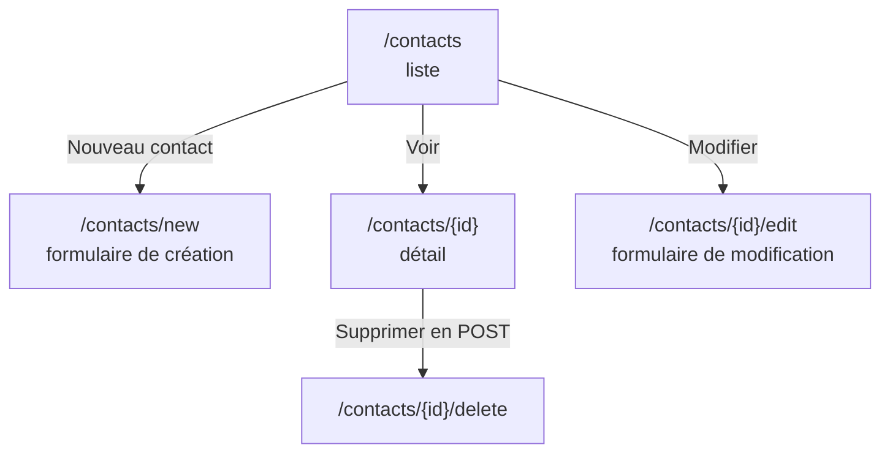
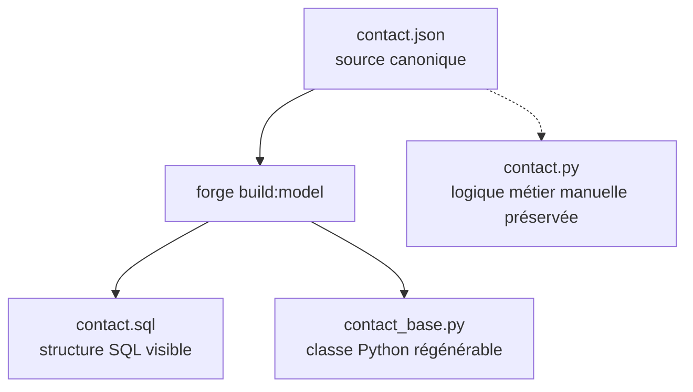
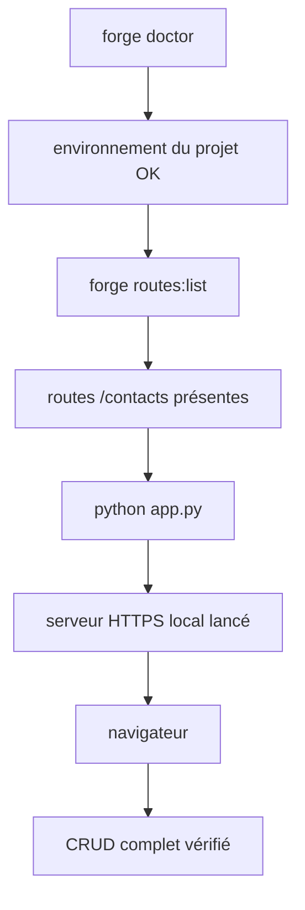

# Starter 1 — Contacts

[Accueil](index.html){ .md-button } <button class="md-button" onclick="window.history.back()">← Retour</button>

<div style="border:1px solid #FED7AA;background:linear-gradient(135deg,#FFF7ED 0%,#FFFFFF 55%,#F8FAFC 100%);border-radius:18px;padding:1.5rem 1.6rem;margin:1rem 0 1.5rem 0;">
  <p style="margin:0 0 .35rem 0;font-size:.85rem;font-weight:700;color:#EA580C;text-transform:uppercase;letter-spacing:.08em;">Starter Forge · Niveau 1</p>
  <h2 style="margin:.1rem 0 .45rem 0;font-size:2rem;line-height:1.15;color:#0F172A;">Application Contacts</h2>
  <p style="margin:0;color:#334155;font-size:1.05rem;max-width:880px;">Premier parcours Forge : une seule entité <code>Contact</code>, un CRUD généré, puis un câblage manuel des routes.</p>
</div>

<div class="grid cards" markdown>

-   **Objectif**

    ---

    Construire une petite application CRUD pour gérer des contacts.

-   **Niveau**

    ---

    Débutant Forge. Aucune relation, aucune authentification métier spécifique.

-   **Temps estimé**

    ---

    1 h à 2 h.

-   **Résultat attendu**

    ---

    Liste, création, détail, modification, suppression et messages flash.

</div>

!!! abstract "Ce que ce starter doit faire comprendre"
    Le but n'est pas seulement d'obtenir une page `/contacts` fonctionnelle. Ce starter sert surtout à voir les pièces réelles utilisées par Forge : le JSON canonique, le SQL généré, la classe Python générée, le contrôleur, le formulaire, le modèle SQL, les templates Jinja et les routes ajoutées manuellement.

---

## Prérequis

### Prérequis généraux

- Python 3.11 ou supérieur
- Git
- `pipx` (recommandé) ou environnement virtuel Python
- MariaDB installé et démarré
- Accès à un compte administrateur MariaDB (pour `forge db:init`)
- Fichier `env/dev` configuré avec les identifiants MariaDB

### Prérequis spécifiques au starter

- Projet Forge vierge (créé via `forge new` ou `git clone`)
- Commandes `forge make:entity`, `forge build:model`, `forge db:apply` et `forge make:crud` disponibles (incluses dans l'installation Forge)

---

## Partie 1 — Installer Forge sur une VM Debian vierge

> Si Forge est déjà installé et configuré sur votre machine, passez directement à la [Partie 2 — Construire l'application starter](#partie-2--construire-lapplication-starter).

### 1. Mettre à jour Debian

```bash
sudo apt update
sudo apt upgrade -y
```

### 2. Installer les dépendances système

```bash
sudo apt install -y \
  git \
  curl \
  ca-certificates \
  build-essential \
  pkg-config \
  python3 \
  python3-venv \
  python3-pip \
  pipx \
  mariadb-server \
  mariadb-client \
  libmariadb-dev \
  openssl
```

### 3. Activer pipx dans le PATH

```bash
pipx ensurepath
exec $SHELL -l
```

Vérifier que les outils sont disponibles :

```bash
python3 --version
git --version
pipx --version
mariadb --version
mariadb_config --version
openssl version
```

Si une commande échoue, la machine n'est pas encore prête.

### 4. Démarrer MariaDB

```bash
sudo systemctl enable --now mariadb
sudo systemctl status mariadb
```

### 5. Vérifier l'accès administrateur MariaDB

> Sur certaines installations Debian, le compte `root` MariaDB peut être configuré avec l'authentification système `unix_socket`. Dans ce cas, `mariadb -u root -p` peut échouer alors que `sudo mariadb` fonctionne.
> Dans cette procédure Forge, on suppose que le compte `root` MariaDB est configuré avec un mot de passe.

```bash
mariadb -u root -p
```

Entrer le mot de passe `root` MariaDB lorsqu'il est demandé. Une invite `MariaDB [(none)]>` confirme que l'accès fonctionne. Saisir `exit` pour quitter.

Le fichier `env/dev` devra ensuite contenir :

```env
DB_ADMIN_LOGIN=root
DB_ADMIN_PWD=<mot_de_passe_root_mariadb>
```

!!! note "Recommandation"
    Pour un environnement pédagogique simple, l'utilisation du compte `root` MariaDB avec mot de passe est acceptable afin de simplifier la procédure.

    Pour un environnement plus sécurisé, il est préférable de créer un compte administrateur dédié à Forge, par exemple `forge_admin`, et de l'utiliser dans `DB_ADMIN_LOGIN` / `DB_ADMIN_PWD`.

### 6. Installer Forge avec pipx

```bash
pipx install forge-mvc
forge --version
```

Si `forge` n'est pas trouvé après l'installation :

```bash
pipx ensurepath
exec $SHELL -l
forge --version
```

---

## Partie 2 — Construire l'application starter

## 1. Présentation rapide

### 1.1 Objectif

Construire une petite application de gestion de contacts avec :

- une liste simple, enrichissable ensuite ;
- une page de création ;
- une page de détail ;
- une page de modification ;
- une suppression en `POST` ;
- des messages flash après création, modification ou suppression.

Le starter sert à comprendre le flux Forge minimal : JSON canonique, SQL visible, modèle Python généré, CRUD MVC explicite et routes copiées manuellement.

### 1.2 Parcours général



!!! tip "Lecture du schéma"
    Une requête web ne va jamais directement en base. Elle passe par une route, un contrôleur, éventuellement un formulaire, puis un modèle SQL. La réponse revient ensuite sous forme de vue Jinja2 rendue en HTML.

---

## 2. Installation du projet Forge

Les deux méthodes arrivent au même résultat : un projet Forge local avec un environnement Python actif et une commande `forge` utilisable.

!!! tip "Si vous avez suivi la Partie 1"
    `forge` est déjà installé via `pipx install forge-mvc`. Dans l'onglet "Installation automatique" ci-dessous, ignorez la ligne `pipx install ...` et commencez directement par `forge new Contacts`.

=== "Installation automatique"

    ```bash
    pipx install git+https://github.com/caucrogeGit/Forge.git
    forge new Contacts
    cd Contacts
    source .venv/bin/activate
    forge doctor
    ```

=== "Installation manuelle"

    ```bash
    git clone https://github.com/caucrogeGit/Forge.git Contacts
    cd Contacts
    python -m venv .venv
    source .venv/bin/activate
    pip install -r requirements.txt
    pip install -e .
    npm install
    forge doctor
    ```

!!! note "CLI officielle"
    La documentation utilisateur suppose la CLI officielle `forge`, disponible après installation du package.

### 2.1 Schéma d'installation



<div class="grid cards" markdown>

-   **Contrôle à faire**

    ---

    ```bash
    forge doctor
    ```

-   **Répertoire attendu**

    ---

    ```text
    Contacts/
    ├── app.py
    ├── env/dev
    ├── mvc/
    └── core/
    ```

</div>

---

## 3. Préparation de la base

### 3.1 Configurer l'administrateur MariaDB du projet

Avant d'exécuter `forge db:init`, renseigner dans `env/dev` un compte MariaDB disposant des droits nécessaires pour :

- créer la base de données du projet ;
- créer l'utilisateur applicatif ;
- appliquer les privilèges nécessaires.

En développement local, on peut utiliser temporairement un compte administrateur MariaDB existant.

!!! warning "Ne pas confondre les deux comptes"
    `DB_ADMIN_LOGIN` prépare la base avec `forge db:init`.
    `DB_APP_LOGIN` est utilisé ensuite par l'application pendant son fonctionnement normal.

Exemple pour une application nommée `Contacts` :

```env
DB_ADMIN_HOST=localhost
DB_ADMIN_PORT=3306
DB_ADMIN_LOGIN=root
DB_ADMIN_PWD=<mot_de_passe_root_mariadb>

DB_NAME=contacts

DB_APP_HOST=localhost
DB_APP_PORT=3306
DB_APP_LOGIN=contacts_app
DB_APP_PWD=ContactsApp_2026!
```

!!! note "Compte administrateur MariaDB"
    La procédure utilise `root` avec mot de passe comme compte administrateur MariaDB. Ce choix simplifie la procédure pour un environnement pédagogique.

    Pour un environnement plus sécurisé, remplacer `root` par un compte dédié, par exemple `forge_admin`, dans `DB_ADMIN_LOGIN` / `DB_ADMIN_PWD`.

| Variable | Rôle | Moment d'utilisation |
|---|---|---|
| `DB_ADMIN_HOST` | Adresse du serveur MariaDB pour l'administration | Pendant `forge db:init` |
| `DB_ADMIN_PORT` | Port MariaDB pour l'administration | Pendant `forge db:init` |
| `DB_ADMIN_LOGIN` | Compte qui crée la base et les droits | Uniquement pendant `forge db:init` |
| `DB_ADMIN_PWD` | Mot de passe du compte administrateur | Uniquement pendant `forge db:init` |
| `DB_NAME` | Base de données du projet | Créée par `forge db:init` |
| `DB_APP_HOST` | Adresse du serveur MariaDB pour l'application | Exécution et `forge db:apply` |
| `DB_APP_PORT` | Port MariaDB pour l'application | Exécution et `forge db:apply` |
| `DB_APP_LOGIN` | Compte applicatif limité | Utilisé par l'application |
| `DB_APP_PWD` | Mot de passe du compte applicatif | Utilisé par l'application |

### 3.2 Schéma : rôle des comptes MariaDB



### 3.3 Initialiser la base

```bash
forge db:init
```

Cette commande crée la base de données du projet, l'utilisateur applicatif et applique les droits.

!!! success "Avant de continuer"
    Vérifier que MariaDB est installé, démarré, et que les variables `DB_ADMIN_HOST`, `DB_ADMIN_PORT`, `DB_ADMIN_LOGIN`, `DB_ADMIN_PWD`, `DB_APP_HOST`, `DB_APP_PORT`, `DB_APP_LOGIN`, `DB_APP_PWD` et `DB_NAME` sont bien renseignées dans `env/dev`.

---

## 4. Développement de l'application

!!! tip "Commande rapide"
    Pour générer directement ce starter depuis un projet Forge vierge :

    ```bash
    forge starter:build 1
    ```

    Le reste de ce chapitre détaille ce que cette commande fait étape par étape.

### 4.1 Ce que l'on apprend

<div class="grid cards" markdown>

-   **Modèle canonique**

    ---

    Créer une entité avec `forge make:entity`, puis compléter `contact.json`.

-   **Génération contrôlée**

    ---

    Prévisualiser avec `--dry-run`, puis générer `contact.sql` et `contact_base.py`.

-   **Base de données**

    ---

    Appliquer le SQL avec `forge db:apply` sur une base de développement.

-   **CRUD explicite**

    ---

    Générer contrôleur, modèle SQL, formulaire et templates avec `forge make:crud Contact`.

</div>

### 4.2 Parcours de développement



!!! tip "Principe Forge"
    Forge ne saute pas directement à une application terminée. Il produit des fichiers lisibles, puis le développeur les câble explicitement.

---

## 5. Navigation de l'application

### 5.1 Routes fonctionnelles attendues

| Route | Méthode | Rôle |
|---|---:|---|
| `/contacts` | `GET` | Liste des contacts |
| `/contacts/new` | `GET` | Formulaire de création |
| `/contacts` | `POST` | Création d'un contact |
| `/contacts/{id}` | `GET` | Détail d'un contact |
| `/contacts/{id}/edit` | `GET` | Formulaire de modification |
| `/contacts/{id}` | `POST` | Mise à jour d'un contact |
| `/contacts/{id}/delete` | `POST` | Suppression d'un contact |

!!! warning "Ordre des routes"
    `/contacts/new` doit rester déclaré avant `/contacts/{id}` dans les routes afin d'éviter que `new` soit interprété comme un identifiant.

### 5.2 Schéma de navigation



---

## 6. Charte graphique

Le starter utilise une charte volontairement simple. Les couleurs ci-dessous correspondent aux classes Tailwind utilisées dans les vues générées.

| Usage | Couleur | Code | Aperçu |
|---|---|---:|---|
| Fond des pages de formulaire et de liste | Slate très clair | `#F8FAFC` | <span style="display:inline-block;width:4rem;height:1.25rem;border:1px solid #CBD5E1;background:#F8FAFC;border-radius:0.25rem;"></span> |
| Barre supérieure dans `mvc/views/layouts/app.html` | Slate très foncé | `#0F172A` | <span style="display:inline-block;width:4rem;height:1.25rem;border:1px solid #0F172A;background:#0F172A;border-radius:0.25rem;"></span> |
| Actions principales | Orange Forge | `#EA580C` | <span style="display:inline-block;width:4rem;height:1.25rem;border:1px solid #C2410C;background:#EA580C;border-radius:0.25rem;"></span> |
| Survol des actions principales | Orange Forge foncé | `#C2410C` | <span style="display:inline-block;width:4rem;height:1.25rem;border:1px solid #9A3412;background:#C2410C;border-radius:0.25rem;"></span> |
| Actions secondaires : retour, annulation | Gris clair | `#E2E8F0` | <span style="display:inline-block;width:4rem;height:1.25rem;border:1px solid #CBD5E1;background:#E2E8F0;border-radius:0.25rem;"></span> |
| Texte principal | Slate foncé | `#0F172A` | <span style="display:inline-block;width:4rem;height:1.25rem;border:1px solid #0F172A;background:#0F172A;border-radius:0.25rem;"></span> |
| Texte secondaire | Slate moyen | `#64748B` | <span style="display:inline-block;width:4rem;height:1.25rem;border:1px solid #475569;background:#64748B;border-radius:0.25rem;"></span> |
| Cartes de formulaire et de détail | Blanc | `#FFFFFF` | <span style="display:inline-block;width:4rem;height:1.25rem;border:1px solid #CBD5E1;background:#FFFFFF;border-radius:0.25rem;"></span> |
| Bordures des cartes | Slate clair | `#E2E8F0` | <span style="display:inline-block;width:4rem;height:1.25rem;border:1px solid #CBD5E1;background:#E2E8F0;border-radius:0.25rem;"></span> |
| Message flash de succès | Vert clair | `#DCFCE7` | <span style="display:inline-block;width:4rem;height:1.25rem;border:1px solid #86EFAC;background:#DCFCE7;border-radius:0.25rem;"></span> |
| Message flash d'erreur | Rouge clair | `#FEE2E2` | <span style="display:inline-block;width:4rem;height:1.25rem;border:1px solid #FCA5A5;background:#FEE2E2;border-radius:0.25rem;"></span> |

!!! note "Objectif de la charte"
    Le but n'est pas de créer un thème complet, mais d'obtenir une interface lisible et facile à modifier.

---

## 7. Modèle de données

### 7.1 Fichier canonique

Fichier à modifier :

```text
mvc/entities/contact/contact.json
```

```json
{
  "format_version": 1,
  "entity": "Contact",
  "table": "contact",
  "description": "Contacts — starter niveau 1",
  "fields": [
    {
      "name": "id",
      "sql_type": "INT",
      "primary_key": true,
      "auto_increment": true
    },
    {
      "name": "nom",
      "sql_type": "VARCHAR(80)",
      "constraints": {
        "not_empty": true,
        "max_length": 80
      }
    },
    {
      "name": "prenom",
      "sql_type": "VARCHAR(80)",
      "constraints": {
        "not_empty": true,
        "max_length": 80
      }
    },
    {
      "name": "email",
      "sql_type": "VARCHAR(120)",
      "unique": true,
      "constraints": {
        "not_empty": true,
        "max_length": 120
      }
    },
    {
      "name": "telephone",
      "sql_type": "VARCHAR(20)",
      "nullable": true,
      "constraints": {
        "max_length": 20
      }
    }
  ]
}
```

### 7.2 Ce que Forge génère depuis ce JSON



!!! warning "Contrainte unique sur l'email"
    La contrainte `unique: true` empêche deux contacts d'utiliser le même email. Dans ce starter, cette contrainte est principalement portée par la base MariaDB. Si un doublon est saisi, la base peut refuser l'insertion ou la mise à jour.

!!! tip "Règle de modification"
    On modifie le JSON et le fichier métier manuel `contact.py`. On évite de modifier directement les fichiers régénérables comme `contact.sql` et `contact_base.py`.

---

## Sous le capot — ce que Forge a produit

=== "Commandes"

    ### Vue synthétique

    | Étape | Commande | Produit ou vérifie |
    |---:|---|---|
    | 1 | `forge make:entity Contact --no-input` | Structure de l'entité |
    | 2 | Modifier `contact.json` | Modèle canonique complet |
    | 3 | `forge check:model` | Cohérence des JSON |
    | 4 | `forge build:model --dry-run` | Prévisualisation du modèle généré |
    | 5 | `forge build:model` | `contact.sql` et `contact_base.py` |
    | 6 | `forge db:apply` | Table SQL dans MariaDB |
    | 7 | `forge make:crud Contact --dry-run` | Prévisualisation du CRUD |
    | 8 | `forge make:crud Contact` | Contrôleur, modèle SQL, formulaire et vues |

    ### make:entity

    ```bash
    forge make:entity Contact --no-input
    ```

    Crée la structure de départ. Le fichier manuel `contact.py` n'est pas écrasé lors des régénérations.

    ```text
    mvc/entities/contact/
    ├── __init__.py
    ├── contact.json
    ├── contact.sql
    ├── contact_base.py
    └── contact.py
    ```

    ### check:model et build:model

    ```bash
    forge check:model               # vérifie sans écrire
    forge build:model --dry-run     # prévisualise
    forge build:model               # génère contact.sql et contact_base.py
    ```

    SQL produit :

    ```sql
    CREATE TABLE IF NOT EXISTS contact (
        Id INT NOT NULL AUTO_INCREMENT,
        Nom VARCHAR(80) NOT NULL,
        Prenom VARCHAR(80) NOT NULL,
        Email VARCHAR(120) NOT NULL,
        UNIQUE KEY uk_contact_email (Email),
        Telephone VARCHAR(20) NULL,
        PRIMARY KEY (Id)
    ) ENGINE=InnoDB DEFAULT CHARSET=utf8mb4;
    ```

    !!! danger "Fichier régénérable"
        `contact_base.py` est régénérable — ne pas y écrire de logique métier. La logique va dans `contact.py`.

    ### db:apply

    ```bash
    forge db:apply
    ```

    Applique `contact.sql` sur la base MariaDB configurée dans `env/dev`.

    ### make:crud

    === "Prévisualiser"

        ```bash
        forge make:crud Contact --dry-run
        ```

    === "Générer"

        ```bash
        forge make:crud Contact
        ```

    ```mermaid
    flowchart TD
        A["forge make:crud Contact"] --> B["contact_controller.py"]
        A --> C["contact_model.py"]
        A --> D["contact_form.py"]
        A --> E["views/contact/*.html"]
        B --> B1["reçoit les requêtes<br/>et choisit la réponse"]
        C --> C1["contient les requêtes<br/>SQL explicites"]
        D --> D1["lit et valide<br/>les données du formulaire"]
        E --> E1["affiche la liste,<br/>le formulaire et le détail"]
    ```

    Requêtes SQL générées dans `contact_model.py` :

    ```python
    SELECT_ALL   = "SELECT * FROM contact ORDER BY Id"
    SELECT_BY_ID = "SELECT * FROM contact WHERE Id = ?"
    INSERT       = "INSERT INTO contact (Nom, Prenom, Email, Telephone) VALUES (?, ?, ?, ?)"
    UPDATE       = "UPDATE contact SET Nom = ?, Prenom = ?, Email = ?, Telephone = ? WHERE Id = ?"
    DELETE       = "DELETE FROM contact WHERE Id = ?"
    ```

    !!! note "Responsabilité du développeur"
        Les routes restent à déclarer explicitement dans `mvc/routes.py`.

=== "Routes"

    Copier dans `mvc/routes.py` après la génération du CRUD :

    ```python
    from mvc.controllers.contact_controller import ContactController

    # Routes protégées par défaut.
    # Pour un test local sans authentification :
    # with router.group("/contacts", public=True, csrf=False) as g:
    with router.group("/contacts") as g:
        g.add("GET",  "",              ContactController.index,   name="contact_index")
        g.add("GET",  "/new",          ContactController.new,     name="contact_new")
        g.add("POST", "",              ContactController.create,  name="contact_create")
        g.add("GET",  "/{id}",         ContactController.show,    name="contact_show")
        g.add("GET",  "/{id}/edit",    ContactController.edit,    name="contact_edit")
        g.add("POST", "/{id}",         ContactController.update,  name="contact_update")
        g.add("POST", "/{id}/delete",  ContactController.destroy, name="contact_destroy")
    ```

    !!! warning "À ne pas inverser"
        `/new` doit rester déclaré avant `/{id}` pour éviter que `new` soit interprété comme un identifiant.

=== "Fichiers"

    ### Fichiers canoniques et générés

    | Fichier | Nature | Rôle |
    |---|---|---|
    | `mvc/entities/contact/contact.json` | Canonique | Source à modifier |
    | `mvc/entities/contact/contact.sql` | Généré | SQL de création de la table |
    | `mvc/entities/contact/contact_base.py` | Généré | Classe de base régénérable |
    | `mvc/entities/contact/contact.py` | Manuel | Extension métier préservée |
    | `mvc/entities/contact/__init__.py` | Manuel | Initialisation du module |

    ### Fichiers CRUD créés s'ils sont absents

    | Fichier | Rôle |
    |---|---|
    | `mvc/controllers/contact_controller.py` | Contrôleur HTTP du CRUD |
    | `mvc/models/contact_model.py` | Requêtes SQL explicites |
    | `mvc/forms/contact_form.py` | Formulaire et validation |
    | `mvc/views/layouts/app.html` | Layout commun |
    | `mvc/views/contact/index.html` | Liste des contacts |
    | `mvc/views/contact/show.html` | Détail d'un contact |
    | `mvc/views/contact/form.html` | Création et modification |
    | `mvc/routes.py` | Fichier à modifier manuellement |

    ### Arborescence

    ```text
    mvc/
    ├── entities/
    │   └── contact/
    │       ├── contact.json        # source canonique
    │       ├── contact.sql         # SQL généré
    │       ├── contact_base.py     # classe générée
    │       ├── contact.py          # classe métier manuelle
    │       └── __init__.py
    │
    ├── controllers/
    │   └── contact_controller.py   # logique HTTP du CRUD
    │
    ├── models/
    │   └── contact_model.py        # requêtes SQL explicites
    │
    ├── forms/
    │   └── contact_form.py         # validation du formulaire
    │
    ├── views/
    │   ├── layouts/
    │   │   └── app.html            # layout commun
    │   └── contact/
    │       ├── index.html          # liste
    │       ├── form.html           # création / modification
    │       └── show.html           # détail
    │
    └── routes.py                   # routes à compléter manuellement
    ```

=== "Classes Python"

    | Classe | Origine | Rôle |
    |---|---|---|
    | `ContactBase` | Générée depuis le JSON | Propriétés, validations simples, conversion dictionnaire |
    | `Contact` | Manuelle | Logique métier spécifique |
    | `ContactForm` | Générée par le CRUD | Lecture et validation du formulaire |
    | `ContactController` | Généré par le CRUD | Actions `index`, `new`, `create`, `show`, `edit`, `update`, `destroy` |
    | `BaseController` | Core Forge | Rendu HTML, redirections, flash, erreurs de validation |

    ### Cycle d'une création de contact

    ```mermaid
    flowchart TD
        A([Navigateur]) -->|"POST /contacts"| B["mvc/routes.py"]
        B --> C["ContactController.create(request)"]
        C --> D["ContactForm.from_request(request)"]
        D --> E{"form.is_valid()"}
        E -->|non| F["contact/form.html\navec les erreurs"]
        E -->|oui| G["add_contact(form.cleaned_data)"]
        G --> H[(MariaDB)]
        H --> I["redirect_with_flash → /contacts"]
    ```

    ### Exemple — création

    ```python
    form = ContactForm.from_request(request)

    if not form.is_valid():
        return BaseController.validation_error(
            "contact/form.html",
            context={"form": form, "action": "/contacts", "titre": "Nouveau contact"},
            request=request,
        )

    add_contact(form.cleaned_data)
    return BaseController.redirect_with_flash(request, "/contacts", "Contact créé.")
    ```

    ### Fonctions SQL du modèle

    ```python
    get_contacts()
    get_contact_by_id(id)
    add_contact(data)
    update_contact(id, data)
    delete_contact(id)
    ```

    !!! tip "À retenir"
        Le formulaire ne va pas directement en base. Il passe par le contrôleur, puis par le modèle SQL.

=== "Templates"

    Quatre fichiers générés par `forge make:crud` :

    ```text
    mvc/views/layouts/app.html
    mvc/views/contact/index.html
    mvc/views/contact/form.html
    mvc/views/contact/show.html
    ```

    ### Héritage Jinja2

    ```mermaid
    flowchart TD
        A["layouts/app.html"] --> D["block content"]
        E["contact/index.html"] --> D
        F["contact/form.html"] --> D
        G["contact/show.html"] --> D
    ```

    ### index.html — liste

    ```jinja2
    

    
    <h1>Contacts</h1>
    <a href="/contacts/new">Nouveau contact</a>

    
        <article>
            <h2>{{ contact.Nom }} {{ contact.Prenom }}</h2>
            <p>{{ contact.Email }}</p>
            <a href="/contacts/{{ contact.Id }}">Voir</a>
            <a href="/contacts/{{ contact.Id }}/edit">Modifier</a>
        </article>
    
    
    ```

    Les noms `contact.Nom`, `contact.Prenom`… correspondent aux colonnes SQL retournées par `cursor(dictionary=True)`.

    ### form.html — création et modification

    ```jinja2
    

    
    <h1>{{ titre }}</h1>

    <form method="post" action="{{ action }}">
        <input type="hidden" name="csrf_token" value="{{ csrf_token }}">

        <label>Nom</label>
        <input type="text" name="nom" value="{{ form.value('nom') }}">

        <label>Prénom</label>
        <input type="text" name="prenom" value="{{ form.value('prenom') }}">

        <label>Email</label>
        <input type="email" name="email" value="{{ form.value('email') }}">

        <label>Téléphone</label>
        <input type="text" name="telephone" value="{{ form.value('telephone') }}">

        <button type="submit">Enregistrer</button>
    </form>
    
    ```

    Les noms de champs (`nom`, `prenom`…) sont les noms Python du JSON canonique. Les colonnes SQL (`Nom`, `Prenom`…) s'utilisent dans les vues de liste et de détail.

    ### show.html — détail

    ```jinja2
    

    
    <h1>{{ contact.Nom }} {{ contact.Prenom }}</h1>

    <p>Email : {{ contact.Email }}</p>
    <p>Téléphone : {{ contact.Telephone }}</p>

    <a href="/contacts/{{ contact.Id }}/edit">Modifier</a>

    <form method="post" action="/contacts/{{ contact.Id }}/delete">
        <input type="hidden" name="csrf_token" value="{{ csrf_token }}">
        <button type="submit">Supprimer</button>
    </form>
    
    ```

    !!! warning "Suppression en POST"
        La suppression utilise `POST` pour éviter une suppression accidentelle par navigation `GET`.

---

## 13. Test navigateur

### 13.1 Scénario nominal

| Étape | Action | Résultat attendu |
|---:|---|---|
| 1 | Lancer `python app.py` | Serveur HTTPS local lancé |
| 2 | Ouvrir `/contacts` | Liste affichée |
| 3 | Cliquer sur "Nouveau contact" | Formulaire affiché |
| 4 | Soumettre le formulaire vide | Erreurs visibles |
| 5 | Créer un contact valide | Retour à la liste |
| 6 | Vérifier le message flash | Message de succès affiché |
| 7 | Ouvrir le détail du contact | Détail affiché |
| 8 | Modifier le contact | Données mises à jour |
| 9 | Supprimer le contact | Suppression effectuée |
| 10 | Revenir à la liste | Contact supprimé absent |

### 13.2 Limites du starter

!!! info "Limites assumées"
    - Pas d'authentification dédiée.
    - Pas de recherche avancée.
    - Pas de pagination générée automatiquement.
    - Pas de validation métier au-delà des contraintes simples.
    - Pas de relation : ce starter est volontairement mono-entité.
    - Pas d'ORM : les requêtes SQL restent visibles dans `mvc/models/contact_model.py`.

---

## 14. Vérification finale du starter

La vérification finale sert à contrôler trois choses : l'environnement Forge, les routes et le comportement réel dans le navigateur.

### 14.1 Schéma de vérification



### 14.2 Vérifier l'environnement Forge

```bash
forge doctor
```

Cette commande permet de vérifier que le projet est correctement installé et que Forge trouve les éléments nécessaires à son fonctionnement.

### 14.3 Vérifier les routes

```bash
forge routes:list
```

Les routes suivantes doivent apparaître ou être équivalentes selon l'affichage de Forge :

```text
GET   /contacts
GET   /contacts/new
POST  /contacts
GET   /contacts/{id}
GET   /contacts/{id}/edit
POST  /contacts/{id}
POST  /contacts/{id}/delete
```

!!! warning "Erreur classique"
    Si `/contacts/new` n'apparaît pas avant `/contacts/{id}`, il faut vérifier l'ordre des routes dans `mvc/routes.py`.

### 14.4 Lancer le serveur local

```bash
python app.py
```

Ouvrir ensuite dans le navigateur :

```text
https://localhost:8000/contacts
```

### 14.5 Scénario de recette

```text
1. Ouvrir /contacts
2. Cliquer sur "Nouveau contact"
3. Soumettre le formulaire vide
4. Vérifier l'affichage des erreurs
5. Créer un contact valide
6. Vérifier le retour à la liste
7. Vérifier le message flash
8. Ouvrir le détail du contact
9. Modifier le contact
10. Supprimer le contact
11. Vérifier que le contact supprimé n'apparaît plus dans la liste
```

### 14.6 Erreurs fréquentes

| Symptôme | Cause probable | Fichier ou commande à vérifier |
|---|---|---|
| `/contacts` affiche une erreur 404 | Routes non copiées | `mvc/routes.py` |
| `/contacts/new` est interprété comme un identifiant | Ordre des routes incorrect | Placer `/new` avant `/{id}` |
| Erreur de connexion MariaDB | Variables incorrectes | `env/dev` |
| Table `contact` absente | SQL non appliqué | `forge db:apply` |
| Erreur sur `contact.Nom` dans la vue | Colonnes SQL différentes | `contact.sql`, `contact_model.py`, template Jinja |
| Formulaire sans protection CSRF | Champ caché absent | `contact/form.html` |
| Doublon email refusé | Contrainte `unique: true` | Vérifier la donnée saisie |

---

## Reconstruction

Le starter peut être reconstruit de deux façons.

### Génération automatique

Depuis un projet Forge vierge, après configuration de `env/dev` et initialisation de la base :

```bash
forge starter:build 1
```

Alias disponibles :

```bash
forge starter:build contacts
forge starter:build contact-simple
```

Pour prévisualiser sans écrire :

```bash
forge starter:build 1 --dry-run
```

Pour générer des routes publiques de test (sans authentification) :

```bash
forge starter:build 1 --public
```

Pour initialiser la base puis construire le starter en une seule commande :

```bash
forge starter:build 1 --init-db
```

Pour reconstruire un starter déjà présent :

```bash
forge starter:build 1 --force
```

!!! warning "Attention avec --force"
    L'option `--force` reconstruit uniquement les fichiers du starter Contacts : `mvc/entities/contact/`, `mvc/controllers/contact_controller.py`, `mvc/models/contact_model.py`, `mvc/forms/contact_form.py`, `mvc/views/contact/` et le bloc de routes marqué. Elle ne touche pas les autres entités ni le reste de `mvc/routes.py`.

### Reconstruction manuelle

Le fichier de reconstruction pas à pas est disponible dans [starters/01-contact-simple/rebuild.md](starters/01-contact-simple/rebuild.md).

---

## Dépannage rapide

| Erreur | Cause probable | Correction |
|---|---|---|
| `forge: command not found` | `pipx` n'est pas dans le PATH | `pipx ensurepath` puis `exec $SHELL -l` |
| `No module named venv` | `python3-venv` absent | `sudo apt install python3-venv` |
| `mariadb_config not found` | dépendances MariaDB dev absentes | `sudo apt install libmariadb-dev pkg-config` |
| `Access denied for user 'root'@'localhost'` | mauvais mot de passe root ou root configuré en `unix_socket` | vérifier le mot de passe, ou tester `sudo mariadb` |
| `mariadb: command not found` | client MariaDB absent | `sudo apt install mariadb-client` |
| erreur de compilation Python | outils de build absents | `sudo apt install build-essential pkg-config libmariadb-dev` |
| erreur certificat HTTPS | `openssl` absent | `sudo apt install openssl` |
