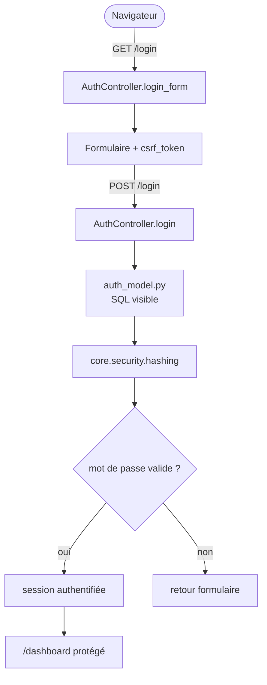

# Starter 2 — Utilisateurs / authentification

[Accueil](index.html) <a href="javascript:void(0)" onclick="window.history.back()">Retour</a>

<div style="border:1px solid #FED7AA;background:linear-gradient(135deg,#FFF7ED 0%,#FFFFFF 58%,#F8FAFC 100%);border-radius:18px;padding:1.5rem 1.6rem;margin:1rem 0 1.5rem 0;">
  <p style="margin:0 0 .35rem 0;font-size:.85rem;font-weight:700;color:#EA580C;text-transform:uppercase;letter-spacing:.08em;">Starter Forge · Niveau 2</p>
  <h2 style="margin:.1rem 0 .45rem 0;font-size:2rem;line-height:1.15;color:#0F172A;">Utilisateurs / authentification</h2>
  <p style="margin:0;color:#334155;font-size:1.05rem;max-width:880px;">Transformer le socle de sécurité Forge en petite application navigable : accueil public, connexion, dashboard protégé, profil simple et déconnexion.</p>
</div>

<div class="grid cards" markdown>

-   **Objectif**

    ---

    Comprendre les sessions, le CSRF et les routes publiques/protégées.

-   **Niveau**

    ---

    Intermédiaire Forge. Le CRUD mono-entité du starter 1 est supposé compris.

-   **Temps estimé**

    ---

    2 h à 3 h.

-   **Résultat attendu**

    ---

    Login, dashboard protégé, profil simple et logout en `POST`.

</div>

!!! tip "Génération automatique"
    Ce starter est maintenant générable avec `forge starter:build 2`, `forge starter:build auth` ou `forge starter:build utilisateurs-auth`. Il ne génère pas un CRUD utilisateur : il crée l'entité `Utilisateur`, copie les fichiers applicatifs d'authentification et injecte les routes explicites.

## Prérequis

### Prérequis généraux

- Python 3.11 ou supérieur
- Git
- `pipx` (recommandé) ou environnement virtuel Python
- MariaDB installé et démarré
- Accès à un compte administrateur MariaDB (pour `forge db:init`)
- Fichier `env/dev` configuré avec les identifiants MariaDB

### Prérequis spécifiques au starter

- Starter 1 compris : routes, contrôleurs, formulaires, vues Jinja2, messages flash
- Projet Forge vierge ou base MariaDB déjà initialisée
- Module `core.security.hashing` disponible (inclus dans Forge) pour le hachage des mots de passe
- Script `scripts/create_auth_user.py` fourni automatiquement par `forge starter:build 2`

---

## Partie 1 — Installer Forge sur une VM Debian vierge

> Si Forge est déjà installé et configuré sur votre machine, passez directement à la [Partie 2 — Construire l'application starter](#partie-2--construire-lapplication-starter).

### 1. Mettre à jour Debian

```bash
sudo apt update
sudo apt upgrade -y
```

### 2. Installer les dépendances système

```bash
sudo apt install -y \
  git \
  curl \
  ca-certificates \
  build-essential \
  pkg-config \
  python3 \
  python3-venv \
  python3-pip \
  pipx \
  mariadb-server \
  mariadb-client \
  libmariadb-dev \
  openssl
```

### 3. Activer pipx dans le PATH

```bash
pipx ensurepath
exec $SHELL -l
```

Vérifier que les outils sont disponibles :

```bash
python3 --version
git --version
pipx --version
mariadb --version
mariadb_config --version
openssl version
```

Si une commande échoue, la machine n'est pas encore prête.

### 4. Démarrer MariaDB

```bash
sudo systemctl enable --now mariadb
sudo systemctl status mariadb
```

### 5. Vérifier l'accès administrateur MariaDB

> Sur certaines installations Debian, le compte `root` MariaDB peut être configuré avec l'authentification système `unix_socket`. Dans ce cas, `mariadb -u root -p` peut échouer alors que `sudo mariadb` fonctionne.
> Dans cette procédure Forge, on suppose que le compte `root` MariaDB est configuré avec un mot de passe.

```bash
mariadb -u root -p
```

Entrer le mot de passe `root` MariaDB lorsqu'il est demandé. Une invite `MariaDB [(none)]>` confirme que l'accès fonctionne. Saisir `exit` pour quitter.

Le fichier `env/dev` devra ensuite contenir :

```env
DB_ADMIN_LOGIN=root
DB_ADMIN_PWD=<mot_de_passe_root_mariadb>
```

!!! note "Recommandation"
    Pour un environnement pédagogique simple, l'utilisation du compte `root` MariaDB avec mot de passe est acceptable afin de simplifier la procédure.

    Pour un environnement plus sécurisé, il est préférable de créer un compte administrateur dédié à Forge, par exemple `forge_admin`, et de l'utiliser dans `DB_ADMIN_LOGIN` / `DB_ADMIN_PWD`.

### 6. Installer Forge avec pipx

```bash
pipx install forge-mvc
forge --version
```

Si `forge` n'est pas trouvé après l'installation :

```bash
pipx ensurepath
exec $SHELL -l
forge --version
```

---

## Partie 2 — Construire l'application starter

## Présentation rapide

### Objectif

Construire un flux applicatif minimal :

- une page d'accueil publique ;
- un formulaire de connexion public ;
- un dashboard accessible uniquement après connexion ;
- une page profil simple ;
- une déconnexion en `POST`.

Le starter explique les sessions, le CSRF, les messages flash et la différence entre routes publiques et routes protégées. Il ne met pas en place de permissions multi-rôles.

### Niveau

Niveau 2 — intermédiaire Forge.

Il suppose que le starter 1 est compris : routes, contrôleurs, formulaires, vues Jinja2 et flash. La nouveauté est la sécurité HTTP et le cycle de session.

### Temps estimé

2h à 3h.

### Résultat attendu

Application avec authentification fonctionnelle — accueil public, formulaire de connexion sécurisé par CSRF, dashboard protégé, page profil et déconnexion en `POST`.

### Flux d'authentification



---

## Installation du projet Forge

!!! tip "Si vous avez suivi la Partie 1"
    `forge` est déjà installé via `pipx install forge-mvc`. Ignorez les étapes `pipx install ...` ci-dessous et commencez directement par `forge new AppAuth`.

### Méthode A — installation automatique (recommandée)

```bash
pipx install git+https://github.com/caucrogeGit/Forge.git
forge new AppAuth
cd AppAuth
source .venv/bin/activate
forge doctor
```

### Méthode B — installation manuelle

```bash
git clone https://github.com/caucrogeGit/Forge.git AppAuth
cd AppAuth
python -m venv .venv
source .venv/bin/activate
pip install -r requirements.txt
npm install
pip install -e .
forge doctor
```

> La documentation utilisateur utilise la CLI officielle `forge`, disponible après `pip install -e .`.

---

## Préparation de la base

Avant d'exécuter `forge db:init`, vérifier que `env/dev` contient les identifiants administrateur MariaDB :

```env
DB_ADMIN_LOGIN=root
DB_ADMIN_PWD=<mot_de_passe_root_mariadb>
```

!!! note "Compte administrateur MariaDB"
    La procédure utilise `root` avec mot de passe. Pour un environnement plus sécurisé, remplacer `root` par un compte dédié, par exemple `forge_admin`.

```bash
forge db:init
```

Cette commande crée la base de données du projet, l'utilisateur applicatif et applique les droits.

Prérequis :

- MariaDB installé et en cours d'exécution.
- Les identifiants `DB_ADMIN_LOGIN`, `DB_ADMIN_PWD`, `DB_APP_LOGIN`, `DB_APP_PWD` et `DB_NAME` renseignés dans `env/dev`.

---

## Développement de l'application

### Ce que l'on apprend

- Déclarer des routes publiques et protégées.
- Garder `POST /logout` derrière un token CSRF.
- Lire les champs de formulaire depuis `request.body`.
- Créer, authentifier et supprimer une session.
- Utiliser `BaseController.redirect_with_flash(request, ...)`.
- Rendre un dashboard protégé avec `BaseController.render(..., request=request)`.
- Ne pas inventer de permissions avancées quand le besoin est seulement "connecté ou non".

### Navigation de l'application

```text
/               accueil public
/login          formulaire de connexion public
/dashboard      page protégée
/profil         profil protégé
/logout         déconnexion en POST
```

`GET /logout` n'est pas proposé : la déconnexion modifie l'état de session et doit rester une action `POST`.

### Charte graphique

La charte reste proche du starter 1 :

- accueil public sobre avec un bouton "Se connecter" ;
- formulaire centré dans une carte ;
- dashboard en deux colonnes simples ;
- profil sous forme de fiche ;
- messages flash visibles après connexion et déconnexion ;
- bouton de déconnexion distinct, en style secondaire ou danger léger.

### Modèle de données

Pour un starter pédagogique, l'utilisateur peut être représenté par une table simple.

??? example "JSON canonique complet de `Utilisateur`"

    ```json
    {
      "format_version": 1,
      "entity": "Utilisateur",
      "table": "utilisateur",
      "description": "Utilisateur applicatif simple",
      "fields": [
        {
          "name": "utilisateur_id",
          "sql_type": "INT",
          "primary_key": true,
          "auto_increment": true
        },
        {
          "name": "login",
          "sql_type": "VARCHAR(80)",
          "unique": true,
          "constraints": {
            "not_empty": true,
            "max_length": 80
          }
        },
        {
          "name": "prenom",
          "sql_type": "VARCHAR(80)",
          "nullable": true,
          "constraints": {
            "max_length": 80
          }
        },
        {
          "name": "nom",
          "sql_type": "VARCHAR(80)",
          "constraints": {
            "not_empty": true,
            "max_length": 80
          }
        },
        {
          "name": "password_hash",
          "sql_type": "VARCHAR(255)",
          "constraints": {
            "not_empty": true,
            "max_length": 255
          }
        },
        {
          "name": "email",
          "sql_type": "VARCHAR(120)",
          "nullable": true,
          "constraints": {
            "max_length": 120
          }
        },
        {
          "name": "actif",
          "sql_type": "BOOLEAN"
        }
      ]
    }
    ```

Le mot de passe en clair ne va jamais dans le JSON ni dans la base. Le starter montre la structure, puis laisse le hachage au code applicatif.

### Commandes Forge

Pour générer directement ce starter depuis un projet Forge vierge :

```bash
forge starter:build 2
```

Alias disponibles :

```bash
forge starter:build auth
forge starter:build utilisateurs
forge starter:build utilisateurs-auth
```

Pour prévisualiser sans écrire :

```bash
forge starter:build 2 --dry-run
```

`--public` n'est pas applicable à ce starter : il sert justement à montrer la différence entre routes publiques (`/login`) et routes protégées (`/dashboard`, `/profil`, `/logout`).

Le flux manuel équivalent reste :

```bash
forge make:entity Utilisateur --no-input
# modifier mvc/entities/utilisateur/utilisateur.json
forge build:model --dry-run
forge build:model
forge check:model
forge db:apply
```

Le CRUD complet utilisateur n'est pas l'objectif de ce starter. On écrit plutôt un `AuthController` et un modèle applicatif SQL visible pour chercher l'utilisateur par login.

### Créer un utilisateur de test

L'auth réelle Forge vérifie le mot de passe avec `core.security.hashing.verifier_mot_de_passe()`. La valeur stockée dans `PasswordHash` doit donc être produite avec `hacher_mot_de_passe()`, au format `sel_hex:hash_hex`.

Le starter généré copie un modèle `mvc/models/auth_model.py` autonome : il lit uniquement la table `utilisateur` et ajoute `roles = []` pour rester compatible avec la session Forge sans dépendre de tables de rôles.

Après génération automatique, le script suivant est disponible :

```bash
python scripts/create_auth_user.py
```

Il crée ou met à jour l'utilisateur de test :

```text
login    admin
password secret123
```

Le mot de passe est stocké avec `hacher_mot_de_passe("secret123")`.

??? example "Script minimal de création d'utilisateur"

    ```python
    from core.database.connection import get_connection, close_connection
    from core.security.hashing import hacher_mot_de_passe

    connection = get_connection()
    cursor = connection.cursor()

    cursor.execute(
        """
        INSERT INTO utilisateur (Login, Prenom, Nom, Email, PasswordHash, Actif)
        VALUES (?, ?, ?, ?, ?, ?)
        """,
        (
            "admin",
            "Ada",
            "Lovelace",
            "admin@example.test",
            hacher_mot_de_passe("secret123"),
            True,
        ),
    )

    connection.commit()
    cursor.close()
    close_connection(connection)
    ```

Connexion navigateur :

```text
login    admin
password secret123
```

Si votre connecteur SQL utilise `%s` au lieu de `?`, gardez l'idée du script et adaptez uniquement les placeholders à votre connexion.

### Fichiers créés ou modifiés

Fichiers entité :

```text
mvc/entities/utilisateur/utilisateur.json
mvc/entities/utilisateur/utilisateur.sql
mvc/entities/utilisateur/utilisateur_base.py
mvc/entities/utilisateur/utilisateur.py
```

Fichiers applicatifs :

```text
mvc/controllers/auth_controller.py
mvc/controllers/dashboard_controller.py
mvc/models/auth_model.py
mvc/views/auth/login.html
mvc/views/dashboard/index.html
mvc/views/dashboard/profil.html
mvc/views/layouts/app.html
scripts/create_auth_user.py
mvc/routes.py
```

### Classes Python utilisées

- `BaseController` pour `render`, `redirect` et `redirect_with_flash`.
- `core.security.session` pour créer, lire, authentifier et supprimer une session.
- `core.security.csrf` via le middleware et le champ `csrf_token`.
- `AuthController` pour login/logout.
- `DashboardController` pour dashboard et profil.
- `Utilisateur` et `UtilisateurBase` pour la structure métier.

Lecture des données de connexion :

```python
login = request.body.get("login", [""])[0]
password = request.body.get("password", [""])[0]
```

Le contrôleur lit les cookies et la session via les helpers de sécurité, pas via un attribut magique sur `request`.

### Tags Jinja utilisés

- `` ;
- `` ;
- `` ou affichage équivalent selon le contexte du layout ;
- `{{ csrf_token }}` dans les formulaires `POST` ;
- `{{ utilisateur.Nom }}`, `{{ utilisateur.Login }}` et `{{ utilisateur.Email }}` dans le profil si le contexte reçoit directement le dictionnaire SQL ;
- `` pour adapter la navigation.

### Classes CSS/Tailwind importantes

- `min-h-screen`, `flex`, `items-center`, `justify-center` pour la page login ;
- `max-w-md`, `rounded`, `border`, `shadow-sm` pour la carte de connexion ;
- `bg-orange-600`, `hover:bg-orange-700` pour l'action principale ;
- `bg-slate-100`, `text-slate-700` pour les actions secondaires ;
- `grid`, `gap-6`, `md:grid-cols-2` pour le dashboard.

### Test navigateur

1. Ouvrir `/` et vérifier que l'accueil est public.
2. Ouvrir `/dashboard` sans session et vérifier la redirection vers `/login`.
3. Ouvrir `/login`.
4. Soumettre le formulaire sans token CSRF valide et vérifier le refus.
5. Se connecter avec un utilisateur de test.
6. Vérifier le message flash de connexion.
7. Ouvrir `/dashboard`.
8. Ouvrir `/profil`.
9. Cliquer sur déconnexion, qui soumet `POST /logout`.
10. Vérifier que `/dashboard` redevient inaccessible.

### Limites du starter

- Pas de permissions multi-rôles.
- Pas de réinitialisation de mot de passe.
- Pas d'inscription publique.
- Pas de politique de mot de passe avancée.
- Pas de gestion d'équipe ou d'organisation.
- Le modèle utilisateur est volontairement minimal.

---

## Vérification finale

```bash
forge doctor
forge routes:list
python app.py
```

Ouvrir dans le navigateur :

```text
https://localhost:8000/login
```

## Reconstruction

Le fichier complet de reconstruction est disponible dans [starters/02-utilisateurs-auth/rebuild.md](starters/02-utilisateurs-auth/rebuild.md).

---

## Dépannage rapide

| Erreur | Cause probable | Correction |
|---|---|---|
| `forge: command not found` | `pipx` n'est pas dans le PATH | `pipx ensurepath` puis `exec $SHELL -l` |
| `No module named venv` | `python3-venv` absent | `sudo apt install python3-venv` |
| `mariadb_config not found` | dépendances MariaDB dev absentes | `sudo apt install libmariadb-dev pkg-config` |
| `Access denied for user 'root'@'localhost'` | mauvais mot de passe root ou root configuré en `unix_socket` | vérifier le mot de passe, ou tester `sudo mariadb` |
| `mariadb: command not found` | client MariaDB absent | `sudo apt install mariadb-client` |
| erreur de compilation Python | outils de build absents | `sudo apt install build-essential pkg-config libmariadb-dev` |
| erreur certificat HTTPS | `openssl` absent | `sudo apt install openssl` |
