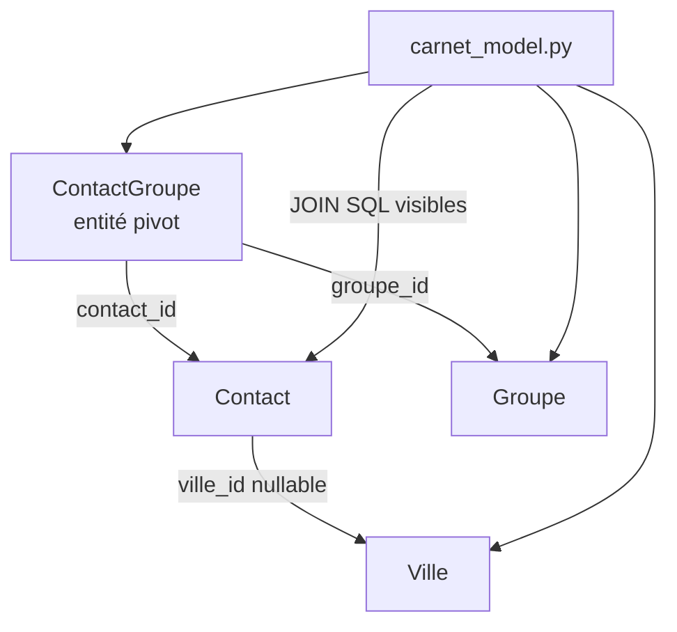

# Starter 3 — Carnet de contacts

<div style="border:1px solid #FED7AA;background:linear-gradient(135deg,#FFF7ED 0%,#FFFFFF 58%,#F8FAFC 100%);border-radius:18px;padding:1.5rem 1.6rem;margin:1rem 0 1.5rem 0;">
  <p style="margin:0 0 .35rem 0;font-size:.85rem;font-weight:700;color:#EA580C;text-transform:uppercase;letter-spacing:.08em;">Starter Forge · Niveau 3</p>
  <h2 style="margin:.1rem 0 .45rem 0;font-size:2rem;line-height:1.15;color:#0F172A;">Carnet de contacts</h2>
  <p style="margin:0;color:#334155;font-size:1.05rem;max-width:880px;">Lire un modèle relationnel Forge V1 sans magie : `many_to_one`, entité pivot explicite et requêtes `JOIN` visibles.</p>
</div>

<div class="grid cards" markdown>

-   **Objectif**

    ---

    Relier contacts, villes et groupes sans ORM implicite.

-   **Niveau**

    ---

    Intermédiaire avancé. Le CRUD mono-entité est supposé compris.

-   **Temps estimé**

    ---

    3 h à 4 h.

-   **Résultat attendu**

    ---

    Listes et détails enrichis avec relations explicites et SQL visible.

</div>

!!! warning "Génération automatique"
    Ce starter est un parcours pédagogique. Il est enregistré dans `forge starter:list`, mais sa génération automatique par `forge starter:build` est encore à venir.

## Présentation rapide

### Objectif

Construire un carnet de contacts navigable :

- liste des contacts avec leur ville ;
- détail d'un contact ;
- liste des villes ;
- liste des groupes ;
- affichage des groupes d'un contact ;
- modification manuelle des requêtes SQL applicatives quand le CRUD généré ne suffit plus.

### Niveau

Niveau 3 — intermédiaire avancé Forge.

Le starter suppose que le CRUD mono-entité est compris. La nouveauté est la modélisation relationnelle explicite : `many_to_one`, clé étrangère nullable et pivot many-to-many représenté par une vraie entité.

### Temps estimé

3h à 4h.

### Résultat attendu

Carnet de contacts — contacts liés à une ville, appartenance à des groupes via un pivot explicite, vues de liste et de détail enrichies avec `JOIN` SQL visibles.

### Flux relationnel



---

## Installation du projet Forge

### Méthode A — installation automatique (recommandée)

```bash
pipx install git+https://github.com/caucrogeGit/Forge.git
forge new CarnetContacts
cd CarnetContacts
source .venv/bin/activate
forge doctor
```

### Méthode B — installation manuelle

```bash
git clone https://github.com/caucrogeGit/Forge.git CarnetContacts
cd CarnetContacts
python -m venv .venv
source .venv/bin/activate
pip install -r requirements.txt
npm install
pip install -e .
forge doctor
```

> La documentation utilisateur utilise la CLI officielle `forge`, disponible après `pip install -e .`.

---

## Préparation de la base

```bash
forge db:init
```

Cette commande crée la base de données du projet, l'utilisateur applicatif et applique les droits.

Prérequis :

- MariaDB installé et en cours d'exécution.
- Les identifiants de connexion renseignés dans `env/dev` (`DB_ADMIN_PWD`, `DB_APP_PWD`, etc.).

---

## Développement de l'application

### Ce que l'on apprend

- Créer plusieurs entités.
- Déclarer des relations globales dans `mvc/entities/relations.json`.
- Comprendre pourquoi Forge V1 ne génère pas de `many_to_many` magique.
- Utiliser une entité pivot `ContactGroupe`.
- Lire les relations avec des requêtes `JOIN` visibles.
- Distinguer ce que Forge génère et ce qui reste du code applicatif manuel.

### Navigation de l'application

```text
/contacts            liste des contacts avec ville
/contacts/{id}       détail d'un contact avec ville et groupes
/villes              liste des villes
/villes/{id}         détail d'une ville avec ses contacts
/groupes             liste des groupes
/groupes/{id}        détail d'un groupe avec ses contacts
```

Le CRUD généré peut créer les écrans de base par entité. Les vues relationnelles enrichies, comme "contacts d'un groupe", restent manuelles.

### Charte graphique

- listes en tableaux sobres ;
- badges pour les groupes ;
- ville affichée comme information secondaire ;
- page détail en deux blocs : identité du contact et relations ;
- liens de navigation entre contact, ville et groupes ;
- formulaires simples, sans composant JavaScript obligatoire.

### Modèle de données

Entités :

```text
Ville
Contact
Groupe
ContactGroupe
```

Relations :

```text
Contact.ville_id -> Ville.id
ContactGroupe.contact_id -> Contact.id
ContactGroupe.groupe_id -> Groupe.id
```

`ContactGroupe` est une entité normale, avec sa propre clé primaire `id`. Elle représente explicitement le pivot entre contacts et groupes.

!!! tip "Doctrine relationnelle"
    Forge V1 ne fournit pas de `many_to_many` direct. Le pivot est un fichier JSON canonique comme les autres, puis les liens sont déclarés dans `mvc/entities/relations.json`.

Extrait `Contact` :

```json
{
  "format_version": 1,
  "entity": "Contact",
  "table": "contact",
  "fields": [
    { "name": "id", "sql_type": "INT", "primary_key": true, "auto_increment": true },
    { "name": "ville_id", "sql_type": "INT", "nullable": true },
    { "name": "nom", "sql_type": "VARCHAR(80)", "constraints": { "not_empty": true, "max_length": 80 } },
    { "name": "prenom", "sql_type": "VARCHAR(80)", "constraints": { "not_empty": true, "max_length": 80 } },
    { "name": "email", "sql_type": "VARCHAR(120)", "nullable": true, "unique": true }
  ]
}
```

Exemple de relation :

```json
{
  "name": "contact_ville",
  "type": "many_to_one",
  "from_entity": "Contact",
  "to_entity": "Ville",
  "from_field": "ville_id",
  "to_field": "id",
  "foreign_key_name": "fk_contact_ville",
  "on_delete": "SET NULL",
  "on_update": "CASCADE"
}
```

`SET NULL` exige que `Contact.ville_id` soit nullable.

### Commandes Forge

```bash
forge make:entity Ville --no-input
forge make:entity Contact --no-input
forge make:entity Groupe --no-input
forge make:entity ContactGroupe --no-input
# modifier les quatre JSON
forge build:model --dry-run
forge build:model
forge make:relation
forge make:relation
forge make:relation
forge sync:relations
forge check:model
forge db:apply
forge make:crud Contact
forge make:crud Ville
forge make:crud Groupe
```

Le CRUD de `ContactGroupe` est rarement exposé tel quel à l'utilisateur final. On préfère souvent une interface manuelle sur la page détail du contact.

### Fichiers créés ou modifiés

Génération entités :

```text
mvc/entities/ville/ville.json
mvc/entities/contact/contact.json
mvc/entities/groupe/groupe.json
mvc/entities/contact_groupe/contact_groupe.json
mvc/entities/*/*.sql
mvc/entities/*/*_base.py
mvc/entities/relations.json
mvc/entities/relations.sql
```

CRUD généré, si demandé :

```text
mvc/controllers/contact_controller.py
mvc/controllers/ville_controller.py
mvc/controllers/groupe_controller.py
mvc/models/contact_model.py
mvc/models/ville_model.py
mvc/models/groupe_model.py
mvc/forms/contact_form.py
mvc/forms/ville_form.py
mvc/forms/groupe_form.py
mvc/views/contact/
mvc/views/ville/
mvc/views/groupe/
```

Code relationnel manuel :

```text
mvc/models/carnet_model.py
mvc/controllers/carnet_controller.py
mvc/views/carnet/contact_detail.html
mvc/routes.py
```

### Classes Python utilisées

- `Ville`, `Contact`, `Groupe`, `ContactGroupe`.
- `BaseController` pour rendre les vues relationnelles.
- Contrôleurs CRUD générés pour les écrans simples.
- Modèle applicatif manuel pour les `JOIN`.

??? example "Exemple de requête visible"

    ```python
    LIST_CONTACTS = """
    SELECT
        c.Id,
        c.Prenom,
        c.Nom,
        c.Email,
        v.Nom AS VilleNom
    FROM contact c
    LEFT JOIN ville v ON v.Id = c.VilleId
    ORDER BY c.Nom, c.Prenom
    """
    ```

### Tags Jinja utilisés

- `` pour les listes ;
- `` pour les badges ;
- `` pour la ville optionnelle quand la requête SQL utilise `v.Nom AS VilleNom` ;
- `` si vous factorisez un formulaire ;
- `{{ contact.Nom }}`, `{{ ville.Nom }}`, `{{ groupe.Libelle }}` pour les dictionnaires SQL retournés par `cursor(dictionary=True)`.

Dans les templates CRUD générés par `make:crud`, les valeurs affichées suivent les noms de colonnes SQL (`Id`, `Nom`, `Email`). Les champs de formulaire restent en snake_case via `form.value("nom")`.

### Classes CSS/Tailwind importantes

- `table-auto`, `w-full`, `divide-y` pour les tableaux ;
- `inline-flex`, `rounded-full`, `bg-orange-100`, `text-orange-700` pour les badges ;
- `grid`, `md:grid-cols-2`, `gap-6` pour les détails relationnels ;
- `text-slate-500` pour les informations secondaires ;
- `hover:bg-slate-50` pour les lignes de liste.

### Test navigateur

1. Créer quelques villes.
2. Créer quelques contacts avec et sans ville.
3. Créer quelques groupes.
4. Insérer des lignes `ContactGroupe`.
5. Ouvrir `/contacts` et vérifier l'affichage des villes.
6. Ouvrir le détail d'un contact et vérifier ses groupes.
7. Ouvrir une ville et vérifier ses contacts.
8. Ouvrir un groupe et vérifier ses contacts.

### Limites du starter

- Le CRUD généré ne fabrique pas automatiquement une interface many-to-many confortable.
- Les vues relationnelles enrichies restent manuelles.
- Les filtres avancés et l'autocomplétion ne sont pas inclus.
- Il n'y a pas d'ORM : les `JOIN` sont assumés dans le modèle applicatif.

---

## Vérification finale

```bash
forge doctor
forge routes:list
python app.py
```

Ouvrir dans le navigateur :

```text
https://localhost:8000/contacts
```

## Reconstruction

Le fichier complet de reconstruction est disponible dans [starters/03-carnet-contacts/rebuild.md](starters/03-carnet-contacts/rebuild.md).
