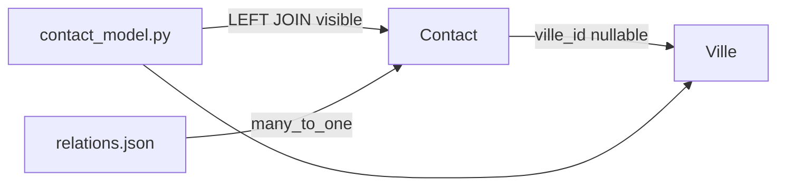

# Starter 3 — Carnet de contacts

<div style="border:1px solid #FED7AA;background:linear-gradient(135deg,#FFF7ED 0%,#FFFFFF 58%,#F8FAFC 100%);border-radius:18px;padding:1.5rem 1.6rem;margin:1rem 0 1.5rem 0;">
  <p style="margin:0 0 .35rem 0;font-size:.85rem;font-weight:700;color:#EA580C;text-transform:uppercase;letter-spacing:.08em;">Starter Forge · Niveau 3</p>
  <h2 style="margin:.1rem 0 .45rem 0;font-size:2rem;line-height:1.15;color:#0F172A;">Carnet de contacts</h2>
  <p style="margin:0;color:#334155;font-size:1.05rem;max-width:880px;">Un carnet relationnel simple : `Ville`, `Contact`, relation `many_to_one`, formulaire avec sélection et SQL visible en `LEFT JOIN`.</p>
</div>

<div class="grid cards" markdown>

-   **Objectif**

    ---

    Comprendre une relation Forge V1 sans ORM implicite.

-   **Génération**

    ---

    Disponible avec `forge starter:build 3`.

-   **Modèle**

    ---

    Deux entités, une relation globale, un SQL de relation visible.

-   **Résultat**

    ---

    Contacts liés optionnellement à une ville.

</div>

!!! success "Génération automatique disponible"
    Ce starter est générable avec `forge starter:build 3`, `forge starter:build carnet` ou `forge starter:build carnet-contacts`.

!!! note "Périmètre actuel"
    La génération automatique crée `Ville`, `Contact` et la relation `Contact.ville_id -> Ville.id`. Elle ne génère pas encore `Groupe`, `ContactGroupe` ni de many-to-many explicite.

## Présentation rapide

Le starter construit une application de carnet de contacts avec :

- une liste de contacts enrichie par leur ville ;
- un formulaire Contact avec `<select name="ville_id">` ;
- une page détail Contact ;
- une liste simple des villes ;
- un script de seed pour les villes de test ;
- des requêtes SQL visibles dans le modèle applicatif.



## Générer le starter

Depuis un projet Forge vierge ou préparé :

```bash
forge doctor
forge starter:build 3 --dry-run
forge starter:build 3 --init-db
python scripts/seed_villes.py
```

Alias équivalents :

```bash
forge starter:build carnet
forge starter:build carnet-contacts
```

`--init-db` lance explicitement l'initialisation MariaDB. Sans cette option, la base doit déjà être prête.

`--force` reconstruit les fichiers du starter 3 et le bloc de routes marqué. Il préserve les fichiers manuels d'entité comme `contact.py`, `ville.py` et les `__init__.py` existants.

## Modèle généré

Entités :

```text
Ville
Contact
```

Relation globale :

```text
Contact.ville_id -> Ville.id
```

Colonnes SQL importantes :

| Entité | Champs Python | Colonnes SQL |
|---|---|---|
| `Ville` | `id`, `nom`, `code_postal` | `VilleId`, `Nom`, `CodePostal` |
| `Contact` | `id`, `nom`, `prenom`, `email`, `telephone`, `ville_id` | `ContactId`, `Nom`, `Prenom`, `Email`, `Telephone`, `VilleId` |

`ville_id` est nullable pour permettre :

```sql
ON DELETE SET NULL
```

## JSON Et Relations

Le starter injecte deux JSON canoniques :

```text
mvc/entities/ville/ville.json
mvc/entities/contact/contact.json
```

Il injecte aussi la source canonique relationnelle :

```text
mvc/entities/relations.json
```

Forge génère ensuite :

```text
mvc/entities/ville/ville.sql
mvc/entities/contact/contact.sql
mvc/entities/relations.sql
```

??? example "Relation générée"

    ```json
    {
      "name": "contact_ville",
      "type": "many_to_one",
      "from_entity": "Contact",
      "to_entity": "Ville",
      "from_field": "ville_id",
      "to_field": "id",
      "foreign_key_name": "fk_contact_ville",
      "on_delete": "SET NULL",
      "on_update": "CASCADE"
    }
    ```

## SQL Visible

Le modèle `mvc/models/contact_model.py` utilise une jointure visible :

```python
SELECT
    contact.ContactId,
    contact.Nom,
    contact.Prenom,
    contact.Email,
    contact.Telephone,
    contact.VilleId,
    ville.Nom AS VilleNom,
    ville.CodePostal AS VilleCodePostal
FROM contact
LEFT JOIN ville ON ville.VilleId = contact.VilleId
ORDER BY contact.Nom, contact.Prenom
```

Il n'y a pas d'ORM implicite : le modèle applicatif porte explicitement les requêtes nécessaires à l'écran.

## Fichiers Créés

```text
mvc/entities/ville/
mvc/entities/contact/
mvc/entities/relations.json
mvc/entities/relations.sql
mvc/controllers/contact_controller.py
mvc/controllers/ville_controller.py
mvc/models/contact_model.py
mvc/models/ville_model.py
mvc/forms/contact_form.py
mvc/views/layouts/app.html
mvc/views/contact/index.html
mvc/views/contact/form.html
mvc/views/contact/show.html
mvc/views/ville/index.html
scripts/seed_villes.py
```

## Routes

```text
GET   /contacts
GET   /contacts/new
POST  /contacts
GET   /contacts/{id}
GET   /contacts/{id}/edit
POST  /contacts/{id}
POST  /contacts/{id}/delete
GET   /villes
```

Les routes sont injectées entre marqueurs :

```python
# forge-starter:carnet-contacts:start
# ...
# forge-starter:carnet-contacts:end
```

Elles sont publiques et sans CSRF automatique, car ce starter ne met pas en place d'authentification ni de session utilisateur.

!!! warning "Choix pédagogique — pas une bonne pratique générale"
    Le starter 3 est volontairement public pour rester centré sur les relations entre entités. Il ne traite pas encore l'authentification.
    Dans une application réelle, les routes d'écriture (`POST /contacts`, `POST /contacts/{id}`, `POST /contacts/{id}/delete`, `POST /villes`) devront être protégées et la protection CSRF conservée.

## Données De Test

Après génération :

```bash
python scripts/seed_villes.py
```

Le script insère de manière idempotente :

| Ville | Code postal |
|---|---|
| Dreux | 28100 |
| Chartres | 28000 |
| Paris | 75000 |
| Lyon | 69000 |
| Nantes | 44000 |

## Vérification finale

```bash
forge check:model
forge routes:list
python app.py
```

Ouvrir :

```text
https://localhost:8000/contacts
https://localhost:8000/villes
```

Tester :

1. créer un contact avec ville ;
2. afficher son détail ;
3. modifier sa ville ;
4. supprimer le contact ;
5. vérifier la liste des villes.

## Suite pédagogique

Le many-to-many explicite avec `Groupe` et `ContactGroupe` reste une évolution possible du parcours. Il doit rester modélisé par une entité pivot explicite et deux relations `many_to_one`, pas par une magie ORM.

## Reconstruction

Le fichier court de reconstruction est disponible dans [starters/03-carnet-contacts/rebuild.md](starters/03-carnet-contacts/rebuild.md).
