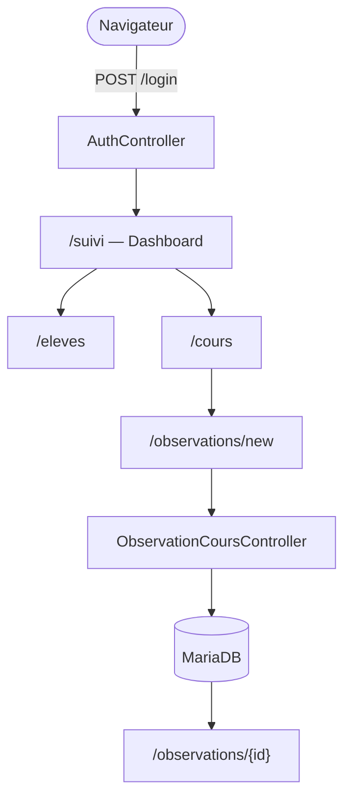
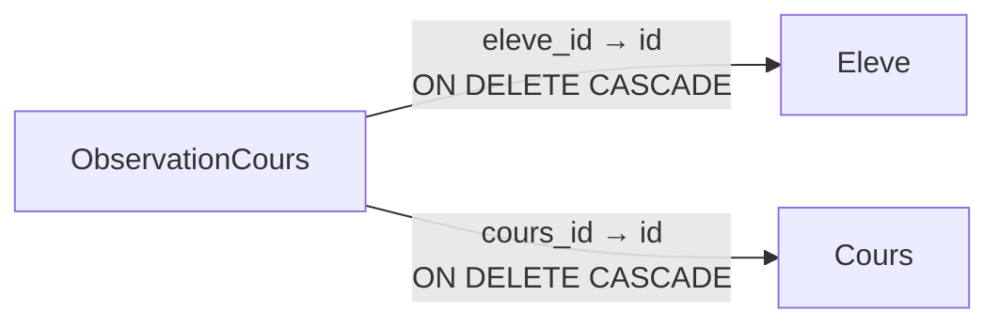

# Starter 4 — Suivi pédagogique

<div style="border:1px solid #FED7AA;background:linear-gradient(135deg,#FFF7ED 0%,#FFFFFF 58%,#F8FAFC 100%);border-radius:18px;padding:1.5rem 1.6rem;margin:1rem 0 1.5rem 0;">
  <p style="margin:0 0 .35rem 0;font-size:.85rem;font-weight:700;color:#EA580C;text-transform:uppercase;letter-spacing:.08em;">Starter Forge · Niveau 4</p>
  <h2 style="margin:.1rem 0 .45rem 0;font-size:2rem;line-height:1.15;color:#0F172A;">Application Suivi pédagogique</h2>
  <p style="margin:0;color:#334155;font-size:1.05rem;max-width:880px;">Vitrine Forge complète : authentification, routes protégées, plusieurs entités, relations SQL visibles, dashboard et seed de démonstration.</p>
</div>

<div class="grid cards" markdown>

-   **Objectif**

    ---

    Démontrer Forge sur une mini-application métier avec authentification, relations et vues de synthèse.

-   **Niveau**

    ---

    Application vitrine. Plusieurs entités, deux relations `many_to_one`, CSRF actif.

-   **Temps estimé**

    ---

    2 h à 3 h en suivant le guide.

-   **Résultat attendu**

    ---

    Dashboard, gestion d'élèves, de cours et d'observations, données persistées dans MariaDB.

</div>

!!! abstract "Ce que ce starter doit faire comprendre"
    Le starter 4 est une vitrine technique de Forge. Il ne vise pas à être un logiciel de suivi scolaire complet. Il vise à montrer comment Forge gère authentification, routes protégées, plusieurs entités et relations SQL dans une application cohérente et maîtrisée.

!!! warning "Génération automatique à venir"
    `forge starter:build 4` n'est pas encore disponible. Voir la section [Génération du starter](#4-generation-du-starter) et le fichier [rebuild.md](starters/04-suivi-comportement-eleves/rebuild.md) pour la reconstruction manuelle.

---

## 1. Objectif du starter

Construire une application de suivi pédagogique minimaliste :

- un enseignant se connecte ;
- il consulte un dashboard de ses cours récents ;
- il gère une liste d'élèves ;
- il crée et consulte des cours ;
- il saisit des observations pour un élève lors d'un cours ;
- il consulte et corrige ses observations.

Le tout avec authentification, sessions, CSRF actif et routes protégées — comme dans une application Forge réelle.

---

## 2. Ce que ce starter démontre dans Forge

<div class="grid cards" markdown>

-   **Authentification complète**

    ---

    Login, logout, session utilisateur, routes protégées par défaut.

-   **CSRF actif**

    ---

    Protection CSRF sur tous les formulaires `POST` — comportement par défaut Forge.

-   **Plusieurs entités**

    ---

    Trois entités indépendantes (`Eleve`, `Cours`, `ObservationCours`) générées depuis leurs JSON canoniques.

-   **Relations SQL visibles**

    ---

    Deux relations `many_to_one` déclarées dans `relations.json`, SQL visible dans `relations.sql`.

-   **Dashboard**

    ---

    Vue d'accueil protégée après connexion, point d'entrée de l'application.

-   **Seed de démonstration**

    ---

    `scripts/seed_suivi.py` peuple la base avec des données réalistes pour tester immédiatement.

-   **Séparation généré / applicatif**

    ---

    Entités générées par Forge, contrôleurs et vues métier écrits à la main — la frontière est explicite.

-   **Templates Jinja structurés**

    ---

    Héritage de layout, inclusion partielle, conditions sur les données liées.

</div>

### Flux de navigation



---

## 3. Installation du framework

Les deux méthodes produisent le même résultat : un projet Forge local avec `forge` disponible.

=== "Installation automatique"

    ```bash
    pipx install git+https://github.com/caucrogeGit/Forge.git
    forge new SuiviApp
    cd SuiviApp
    source .venv/bin/activate
    forge doctor
    ```

=== "Installation manuelle"

    ```bash
    git clone https://github.com/caucrogeGit/Forge.git SuiviApp
    cd SuiviApp
    python -m venv .venv
    source .venv/bin/activate
    pip install -r requirements.txt
    pip install -e .
    npm install
    forge doctor
    ```

---

## 4. Génération du starter

!!! warning "Génération automatique à venir"
    `forge starter:build 4` sera disponible dans une prochaine version. En attendant, suivre les étapes ci-dessous ou consulter [rebuild.md](starters/04-suivi-comportement-eleves/rebuild.md).

Depuis un projet Forge vierge :

```bash
# Créer les entités
forge make:entity Eleve --no-input
forge make:entity Cours --no-input
forge make:entity ObservationCours --no-input

# Remplacer les trois JSON par les modèles de la section 9
# Puis générer et appliquer
forge check:model
forge build:model
forge db:apply

# Générer les CRUD de base
forge make:crud Eleve
forge make:crud Cours

# Copier les fichiers applicatifs manuels (contrôleurs, vues métier, routes)
# Voir rebuild.md pour le détail complet
```

---

## 5. Initialisation de la base

Configurer `env/dev` avec les identifiants MariaDB, puis :

```bash
forge db:init
```

`DB_ADMIN_LOGIN` crée la base et l'utilisateur applicatif. `DB_APP_LOGIN` est utilisé ensuite par l'application.

!!! success "Avant de continuer"
    Vérifier que MariaDB est démarré et que `DB_ADMIN_LOGIN`, `DB_ADMIN_PWD`, `DB_APP_LOGIN`, `DB_APP_PWD` et `DB_NAME` sont renseignés dans `env/dev`.

---

## 6. Création de l'utilisateur de test

```bash
python scripts/create_auth_user.py
```

Ce script crée un compte de test avec les identifiants affichés dans le terminal.

---

## 7. Seed de démonstration

```bash
python scripts/seed_suivi.py
```

Le script insère de manière idempotente des élèves, des cours et quelques observations de démonstration. Il peut être relancé sans risque sur une base déjà peuplée.

---

## 8. Routes disponibles

```bash
forge routes:list
```

| Méthode | Route | Rôle |
|---|---|---|
| `GET` | `/login` | Formulaire de connexion |
| `POST` | `/login` | Authentification |
| `POST` | `/logout` | Déconnexion |
| `GET` | `/suivi` | Dashboard (protégé) |
| `GET` | `/eleves` | Liste des élèves |
| `GET` | `/eleves/{id}` | Fiche élève |
| `GET` | `/cours` | Liste des cours |
| `GET` | `/cours/{id}` | Détail d'un cours |
| `GET` | `/observations/new` | Formulaire de saisie |
| `POST` | `/observations` | Enregistrement |
| `GET` | `/observations/{id}` | Détail d'une observation |
| `GET` | `/observations/{id}/edit` | Modification |
| `POST` | `/observations/{id}` | Mise à jour |

Toutes les routes hors `/login` sont protégées par défaut — comportement standard Forge.

---

## 9. Modèle de données

### Eleve

```json
{
  "format_version": 1,
  "entity": "Eleve",
  "table": "eleve",
  "fields": [
    { "name": "id",     "sql_type": "INT",         "primary_key": true, "auto_increment": true },
    { "name": "nom",    "sql_type": "VARCHAR(80)",  "constraints": { "not_empty": true, "max_length": 80 } },
    { "name": "prenom", "sql_type": "VARCHAR(80)",  "constraints": { "not_empty": true, "max_length": 80 } },
    { "name": "classe", "sql_type": "VARCHAR(40)",  "constraints": { "not_empty": true, "max_length": 40 } },
    { "name": "actif",  "sql_type": "BOOLEAN" }
  ]
}
```

### Cours

```json
{
  "format_version": 1,
  "entity": "Cours",
  "table": "cours",
  "fields": [
    { "name": "id",         "sql_type": "INT",          "primary_key": true, "auto_increment": true },
    { "name": "date_cours", "sql_type": "DATE" },
    { "name": "titre",      "sql_type": "VARCHAR(120)", "constraints": { "not_empty": true, "max_length": 120 } },
    { "name": "classe",     "sql_type": "VARCHAR(40)",  "constraints": { "not_empty": true, "max_length": 40 } }
  ]
}
```

### ObservationCours

```json
{
  "format_version": 1,
  "entity": "ObservationCours",
  "table": "observation_cours",
  "fields": [
    { "name": "id",              "sql_type": "INT",     "primary_key": true, "auto_increment": true },
    { "name": "eleve_id",        "sql_type": "INT" },
    { "name": "cours_id",        "sql_type": "INT" },
    { "name": "ne_travaille_pas","sql_type": "BOOLEAN" },
    { "name": "bavarde",         "sql_type": "BOOLEAN" },
    { "name": "dort",            "sql_type": "BOOLEAN" },
    { "name": "telephone",       "sql_type": "BOOLEAN" },
    { "name": "perturbe",        "sql_type": "BOOLEAN" },
    { "name": "refuse_consigne", "sql_type": "BOOLEAN" },
    { "name": "remarque",        "sql_type": "TEXT",    "nullable": true }
  ]
}
```

Les booléens correspondent directement aux cases à cocher — pas de table de types intermédiaire. C'est un choix pédagogique délibéré pour garder le SQL lisible.

---

## 10. Relations SQL



Déclarées dans `mvc/entities/relations.json` :

| Relation | Type | De | Vers | FK |
|---|---|---|---|---|
| `observation_cours_eleve` | `many_to_one` | `ObservationCours.eleve_id` | `Eleve.id` | `fk_observation_cours_eleve` |
| `observation_cours_cours` | `many_to_one` | `ObservationCours.cours_id` | `Cours.id` | `fk_observation_cours_cours` |

Le SQL généré dans `mvc/entities/relations.sql` est visible et modifiable directement.

---

## 11. Limites assumées

Ce starter n'inclut pas, volontairement :

- statistiques par période (trimestre, semaine, mois) ;
- rapports ou exports PDF ;
- système de sanctions ou de points ;
- gestion multi-enseignants ;
- import CSV d'élèves ;
- rôles avancés ou permissions fines ;
- notifications.

Ces fonctionnalités font partie d'une application réelle à construire à partir de ce starter — elles ne sont pas dans le périmètre de la vitrine.

---

## 12. Starter 4 et application Suivi Classe

Le starter 4 est une **vitrine technique Forge**. Il démontre que Forge permet de construire une application avec authentification, relations et formulaires métier en partant de JSON canoniques.

Une future application `Suivi Classe` pourrait être construite en partant du starter 4 et en y ajoutant :

- demi-classes et groupes ;
- rapports par période ;
- export et envoi par email ;
- rôles enseignant / direction ;
- suivi annuel par élève.

**Le starter 4 n'est pas `Suivi Classe`.** Il montre que Forge peut servir de base à ce type d'application.

---

## Reconstruction

Le fichier de reconstruction pas à pas est disponible dans [starters/04-suivi-comportement-eleves/rebuild.md](starters/04-suivi-comportement-eleves/rebuild.md).
