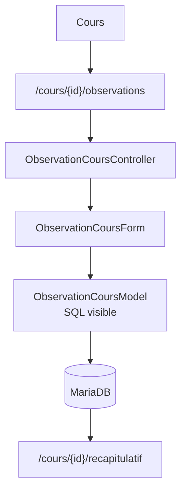

# Starter 4 — Suivi comportement élèves

<div style="border:1px solid #FED7AA;background:linear-gradient(135deg,#FFF7ED 0%,#FFFFFF 58%,#F8FAFC 100%);border-radius:18px;padding:1.5rem 1.6rem;margin:1rem 0 1.5rem 0;">
  <p style="margin:0 0 .35rem 0;font-size:.85rem;font-weight:700;color:#EA580C;text-transform:uppercase;letter-spacing:.08em;">Starter Forge · Niveau 4</p>
  <h2 style="margin:.1rem 0 .45rem 0;font-size:2rem;line-height:1.15;color:#0F172A;">Suivi comportement élèves</h2>
  <p style="margin:0;color:#334155;font-size:1.05rem;max-width:880px;">Application métier guidée : pendant un cours, l'enseignant coche des comportements observés puis consulte un récapitulatif.</p>
</div>

<div class="grid cards" markdown>

-   **Objectif**

    ---

    Construire une saisie métier dense sans cacher le modèle ni le SQL.

-   **Niveau**

    ---

    Application métier guidée avec plusieurs entités et relations.

-   **Temps estimé**

    ---

    3 h à 4 h.

-   **Résultat attendu**

    ---

    Grille de saisie par cours et tableau récapitulatif lisible.

</div>

!!! warning "Génération automatique"
    Ce starter est un parcours pédagogique. Il est enregistré dans `forge starter:list`, mais sa génération automatique par `forge starter:build` est encore à venir.

## Présentation rapide

### Objectif

Construire un suivi de cours simple :

- choisir un cours ;
- afficher les élèves de la classe ;
- cocher les comportements observés pendant le cours ;
- ajouter une remarque libre ;
- enregistrer les observations ;
- afficher un tableau récapitulatif à la fin du cours.

Comportements suivis :

- ne travaille pas ;
- bavarde ;
- dort ;
- utilise son téléphone ;
- perturbe le cours ;
- refuse une consigne ;
- remarque libre.

### Niveau

Niveau 4 — application métier guidée.

Le parcours combine plusieurs entités, relations, formulaires à cases à cocher, vues de saisie et vue de synthèse. Il reste volontairement simple : ce n'est pas un système statistique avancé.

### Temps estimé

3h à 4h.

### Résultat attendu

Interface de saisie des comportements par cours — grille élèves/comportements à cases à cocher, tableau récapitulatif lisible, données persistées dans MariaDB.

### Flux de saisie



---

## Installation du projet Forge

### Méthode A — installation automatique (recommandée)

```bash
pipx install git+https://github.com/caucrogeGit/Forge.git
forge new SuiviEleves
cd SuiviEleves
source .venv/bin/activate
forge doctor
```

### Méthode B — installation manuelle

```bash
git clone https://github.com/caucrogeGit/Forge.git SuiviEleves
cd SuiviEleves
python -m venv .venv
source .venv/bin/activate
pip install -r requirements.txt
npm install
pip install -e .
forge doctor
```

> La documentation utilisateur utilise la CLI officielle `forge`, disponible après `pip install -e .`.

---

## Préparation de la base

```bash
forge db:init
```

Cette commande crée la base de données du projet, l'utilisateur applicatif et applique les droits.

Prérequis :

- MariaDB installé et en cours d'exécution.
- Les identifiants de connexion renseignés dans `env/dev` (`DB_ADMIN_PWD`, `DB_APP_PWD`, etc.).

---

## Développement de l'application

### Ce que l'on apprend

- Modéliser un cas métier avec trois entités.
- Utiliser des booléens pour des cases à cocher.
- Déclarer deux relations `many_to_one`.
- Écrire un formulaire applicatif aligné sur une table métier.
- Construire une vue de saisie par cours.
- Construire un tableau récapitulatif lisible.
- Garder la logique métier hors des JSON.

### Navigation de l'application

```text
/cours                         liste des cours
/cours/new                     création d'un cours
/cours/{id}                    détail du cours
/cours/{id}/observations       saisie des comportements
/cours/{id}/recapitulatif      tableau récapitulatif
/eleves                        liste des élèves
```

La saisie des observations est pensée pour une utilisation en classe : lignes élèves, colonnes comportements, cases à cocher.

### Charte graphique

- tableau dense mais lisible ;
- colonnes courtes pour les comportements ;
- ligne par élève ;
- cases à cocher alignées ;
- remarque libre en champ texte court ou zone compacte ;
- couleurs sobres : orange pour l'action principale, gris pour la structure ;
- récapitulatif final avec coches, libellés courts et remarque visible.

### Modèle de données

#### Eleve

```json
{
  "format_version": 1,
  "entity": "Eleve",
  "table": "eleve",
  "fields": [
    { "name": "id", "sql_type": "INT", "primary_key": true, "auto_increment": true },
    { "name": "nom", "sql_type": "VARCHAR(80)", "constraints": { "not_empty": true, "max_length": 80 } },
    { "name": "prenom", "sql_type": "VARCHAR(80)", "constraints": { "not_empty": true, "max_length": 80 } },
    { "name": "classe", "sql_type": "VARCHAR(40)", "constraints": { "not_empty": true, "max_length": 40 } },
    { "name": "actif", "sql_type": "BOOLEAN" }
  ]
}
```

#### Cours

```json
{
  "format_version": 1,
  "entity": "Cours",
  "table": "cours",
  "fields": [
    { "name": "id", "sql_type": "INT", "primary_key": true, "auto_increment": true },
    { "name": "date_cours", "sql_type": "DATE", "constraints": { "not_empty": true } },
    { "name": "titre", "sql_type": "VARCHAR(120)", "constraints": { "not_empty": true, "max_length": 120 } },
    { "name": "classe", "sql_type": "VARCHAR(40)", "constraints": { "not_empty": true, "max_length": 40 } }
  ]
}
```

#### ObservationCours

```json
{
  "format_version": 1,
  "entity": "ObservationCours",
  "table": "observation_cours",
  "fields": [
    { "name": "id", "sql_type": "INT", "primary_key": true, "auto_increment": true },
    { "name": "eleve_id", "sql_type": "INT" },
    { "name": "cours_id", "sql_type": "INT" },
    { "name": "ne_travaille_pas", "sql_type": "BOOLEAN" },
    { "name": "bavarde", "sql_type": "BOOLEAN" },
    { "name": "dort", "sql_type": "BOOLEAN" },
    { "name": "telephone", "sql_type": "BOOLEAN" },
    { "name": "perturbe", "sql_type": "BOOLEAN" },
    { "name": "refuse_consigne", "sql_type": "BOOLEAN" },
    { "name": "remarque", "sql_type": "TEXT", "nullable": true }
  ]
}
```

Relations :

```text
ObservationCours.eleve_id -> Eleve.id
ObservationCours.cours_id -> Cours.id
```

On choisit des booléens parce qu'ils correspondent directement aux cases à cocher, rendent le tableau récapitulatif simple, et suffisent pour un starter métier clair.

!!! tip "Logique métier"
    Les JSON décrivent la structure. La saisie par cours, la normalisation des cases à cocher et le récapitulatif restent dans les contrôleurs, formulaires, modèles SQL et vues applicatives.

### Commandes Forge

```bash
forge make:entity Eleve --no-input
forge make:entity Cours --no-input
forge make:entity ObservationCours --no-input
# modifier les trois JSON
forge build:model --dry-run
forge build:model
forge make:relation
forge make:relation
forge sync:relations
forge check:model
forge db:apply
forge make:crud Eleve
forge make:crud Cours
```

Le CRUD généré aide pour `Eleve` et `Cours`. La saisie des observations est une interface métier manuelle.

### Fichiers créés ou modifiés

Générés ou canoniques :

```text
mvc/entities/eleve/eleve.json
mvc/entities/cours/cours.json
mvc/entities/observation_cours/observation_cours.json
mvc/entities/*/*.sql
mvc/entities/*/*_base.py
mvc/entities/relations.json
mvc/entities/relations.sql
```

Manuels applicatifs :

```text
mvc/controllers/cours_controller.py
mvc/controllers/observation_cours_controller.py
mvc/models/observation_cours_model.py
mvc/forms/observation_cours_form.py
mvc/views/cours/observations.html
mvc/views/cours/recapitulatif.html
mvc/routes.py
```

### Classes Python utilisées

- `Eleve`, `Cours`, `ObservationCours`.
- `ObservationCoursForm` pour normaliser les cases à cocher.
- `ObservationCoursController` pour afficher la grille et enregistrer.
- `BaseController` pour rendre les vues avec `request=request`.
- Modèle applicatif SQL visible pour charger élèves, cours et observations.

??? example "Squelette minimal côté formulaire"

    ```python
    from core.forms import BooleanField, Form, StringField


    class ObservationCoursForm(Form):
        ne_travaille_pas = BooleanField(label="Ne travaille pas")
        bavarde = BooleanField(label="Bavarde")
        dort = BooleanField(label="Dort")
        telephone = BooleanField(label="Utilise son téléphone")
        perturbe = BooleanField(label="Perturbe le cours")
        refuse_consigne = BooleanField(label="Refuse une consigne")
        remarque = StringField(label="Remarque", required=False, max_length=500)
    ```

Les `BooleanField` ne sont pas obligatoires par défaut : une case absente dans le `POST` devient `False`. La persistance reste dans `ObservationCours`.

### Tags Jinja utilisés

- `` pour les lignes du tableau ;
- `` pour le récapitulatif ;
- `` pour afficher une coche ;
- `{{ csrf_token }}` pour le formulaire `POST` ;
- `{{ eleve.nom }}`, `{{ cours.titre }}`, `{{ observation.remarque }}` pour les valeurs ;
- `` peut aider à construire des libellés courts dans le tableau.

### Classes CSS/Tailwind importantes

- `overflow-x-auto` pour le tableau large ;
- `table-auto`, `w-full`, `text-sm` pour la grille ;
- `sticky`, `left-0`, `bg-white` si la colonne élève doit rester visible ;
- `text-center` pour les cases ;
- `rounded`, `border`, `bg-white`, `shadow-sm` pour les blocs ;
- `bg-orange-600`, `text-white` pour l'enregistrement.

### Test navigateur

1. Créer quelques élèves actifs dans une classe.
2. Créer un cours pour cette classe.
3. Ouvrir `/cours/{id}/observations`.
4. Cocher plusieurs comportements pour plusieurs élèves.
5. Ajouter au moins une remarque libre.
6. Enregistrer.
7. Ouvrir `/cours/{id}/recapitulatif`.
8. Vérifier que chaque coche correspond à l'observation enregistrée.
9. Modifier une observation et vérifier que le récapitulatif change.
10. Vérifier que les élèves inactifs ne sont pas proposés si le modèle applicatif les filtre.

### Limites du starter

- Pas de statistiques par trimestre.
- Pas de gestion avancée des sanctions.
- Pas d'import d'élèves.
- Pas de multi-enseignant.
- Pas de workflow de validation.
- Pas de système d'événements typés : les booléens sont choisis pour rester pédagogiques et directs.

---

## Vérification finale

```bash
forge doctor
forge routes:list
python app.py
```

Ouvrir dans le navigateur :

```text
https://localhost:8000/cours
```

## Reconstruction

Le fichier complet de reconstruction est disponible dans [starters/04-suivi-comportement-eleves/rebuild.md](starters/04-suivi-comportement-eleves/rebuild.md).
