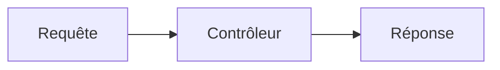

# Code et diagrammes

**Objectif**{ .intro-label } : afficher du code lisible et coloré, et tracer des diagrammes.

**Ce que vous allez apprendre :**{ .intro-label } code en ligne (`pymdownx.inlinehilite`), blocs de code colorés avec numéros et surlignage (`pymdownx.highlight` + `pymdownx.superfences`), diagrammes Mermaid et inclusions de fichiers (`pymdownx.snippets`).

## Code en ligne

Entourez un fragment de simples backticks.

~~~md
La fonction `fetch_one(...)` renvoie une ligne ou `None`.
~~~

Rendu :

La fonction `fetch_one(...)` renvoie une ligne ou `None`.

Avec `inlinehilite`, un préfixe `#!langage` colore même le code en ligne.

~~~md
Un appel coloré en ligne : `#!python fetch_all("SELECT 1")`.
~~~

Rendu :

Un appel coloré en ligne : `#!python fetch_all("SELECT 1")`.

## Blocs de code

Une clôture de trois backticks, suivie du nom du langage, ouvre un bloc coloré.

````md
```python
def index(request: Request) -> Response:
    return Response.text("Bonjour Forge")
```
````

Rendu :

```python
def index(request: Request) -> Response:
    return Response.text("Bonjour Forge")
```

## Numéros de ligne, titre et surlignage

Les options `linenums`, `title` et `hl_lines` enrichissent le bloc.

````md
```python title="welcome_controller.py" linenums="1" hl_lines="2 3"
class WelcomeController(BaseController):
    @staticmethod
    def index(request: Request) -> Response:
        return Response.text("Bonjour Forge")
```
````

Rendu :

```python title="welcome_controller.py" linenums="1" hl_lines="2 3"
class WelcomeController(BaseController):
    @staticmethod
    def index(request: Request) -> Response:
        return Response.text("Bonjour Forge")
```

!!! tip "Afficher des backticks dans un bloc"
    Pour montrer un bloc de trois backticks comme ci-dessus, **entourez-le d'une clôture plus longue** (quatre backticks).
    La clôture la plus longue gagne : le bloc intérieur s'affiche alors littéralement.

## Diagrammes Mermaid

Une clôture `mermaid` (fence personnalisée déclarée dans `mkdocs.yml`) trace un diagramme.

````md

````

Rendu :


## Inclure un fichier

L'extension `snippets` insère le contenu d'un autre fichier avec la directive `--8<--`.

~~~md
--8<-- "chemin/vers/extrait.py"
~~~

C'est utile pour ne documenter qu'**une** source de vérité : on inclut un vrai fichier d'exemple plutôt que de recopier son contenu, qui se périmerait.

[Continuer avec Texte enrichi](texte-enrichi.md)
