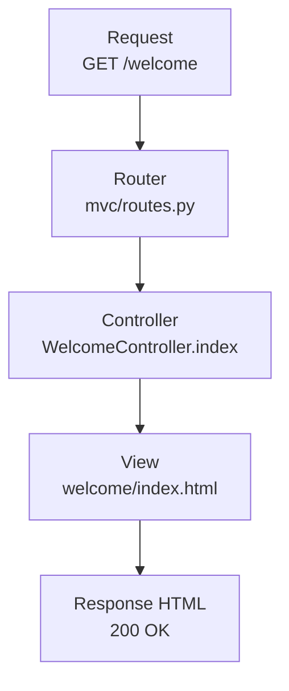
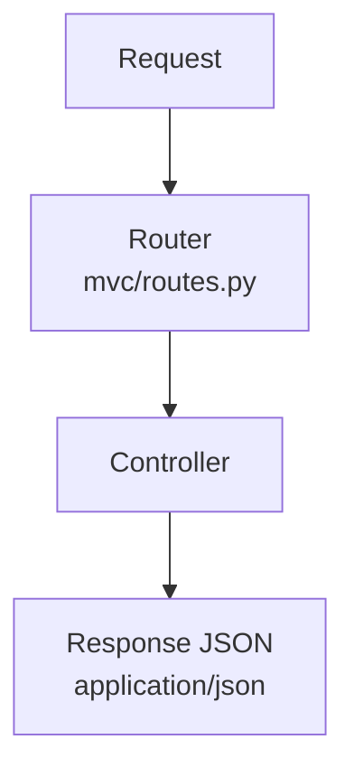

# Premier pas — Bienvenue dans Forge

> Ce starter est le point d'entrée recommandé pour découvrir Forge sans base de données.

!!! tip "Aucun risque pour commencer"
    Ce starter ne crée aucune table, ne lance aucune migration et ne demande aucune base de données.
    Il sert uniquement à comprendre comment Forge traite une requête HTTP.

<div style="border:1px solid #FED7AA;background:linear-gradient(135deg,#FFF7ED 0%,#FFFFFF 58%,#F8FAFC 100%);border-radius:18px;padding:1.5rem 1.6rem;margin:1rem 0 1.5rem 0;">
  <p style="margin:0 0 .35rem 0;font-size:.85rem;font-weight:700;color:#EA580C;text-transform:uppercase;letter-spacing:.08em;">Forge · Premier pas — Sans base de données</p>
  <h2 style="margin:.1rem 0 .45rem 0;font-size:1.6rem;line-height:1.15;color:#0F172A;">Cycle HTTP illustré</h2>
  <p style="margin:0;color:#334155;font-size:1rem;">Découvrez le traitement d'une requête HTTP dans Forge. Cycle HTML : Request → Router → Controller → View → Response HTML. Cycle JSON : Request → Router → Controller → Response JSON. Sans SQL, sans base de données, sans entité, sans migration, sans CRUD.</p>
</div>

## Pourquoi commencer ici ?

Ce starter montre **comment Forge traite une requête HTTP**, depuis l'URL saisie dans le navigateur jusqu'à la réponse renvoyée. C'est le cycle fondamental d'une application MVC : une requête entre, une route choisit un contrôleur, le contrôleur retourne une réponse.

Vous n'avez pas besoin de configurer MariaDB, de créer des entités ni d'initialiser une base. Un simple `python app.py` suffit pour ouvrir les pages pédagogiques.

Ce starter est volontairement rassurant : **sans SQL, sans base de données, sans entité, sans migration, sans CRUD**. Il isole le premier geste à comprendre avant tout le reste.

Référence technique : ce starter reste le **Starter 7** dans la CLI Forge.

## Ce que vous allez comprendre

- Le traitement d'une requête HTTP de bout en bout.
- La différence entre cycle HTML avec `View` et cycle JSON sans `View`.
- Le rôle de `Request`, `Router`, `Controller`, `View` et `Response`.
- Où lire les routes dans `mvc/routes.py`.
- Où lire le code du contrôleur dans `mvc/controllers/welcome_controller.py`.
- Où trouver les templates dans `mvc/views/welcome/`.

## Les deux cycles HTTP

Forge distingue deux types de réponses. Ils partagent le même début, puis divergent au moment où le contrôleur choisit ce qu'il retourne.

### Cycle HTML — via la View



**Request → Router → Controller → View → Response HTML**

Dans le starter réel, le contrôleur appelle :

```python
return BaseController.render("welcome/index.html", request=request)
```

Forge charge alors le template Jinja2, produit le HTML, puis renvoie une `Response` au navigateur.

### Cycle JSON — sans View



**Request → Router → Controller → Response JSON**

Ce starter explique le principe d'une réponse JSON, mais il **n'expose pas de route JSON dédiée**. Les six routes générées renvoient toutes des pages HTML pédagogiques.

Dans Forge, une réponse JSON réelle peut être produite par un contrôleur avec l'API du `BaseController` :

```python
# Exemple conceptuel : cette route n'existe pas dans le starter welcome.
return BaseController.json({"status": "ok"})
```

Ce point pourra être matérialisé par une route dédiée dans un ticket suivant si le starter doit démontrer le JSON en exécution.

## Visite guidée en 10 minutes

1. Lancez le projet avec `python app.py`.
2. Ouvrez `http://localhost:8000/welcome`.
3. Cliquez sur **Cycle HTTP**.
4. Ouvrez `mvc/routes.py`.
5. Retrouvez la route `/welcome/cycle`.
6. Ouvrez `mvc/controllers/welcome_controller.py`.
7. Retrouvez la méthode `WelcomeController.cycle`.
8. Ouvrez la vue `mvc/views/welcome/cycle.html`.
9. Revenez au navigateur.
10. Comparez ce que vous voyez avec le code.

L'objectif est simple : ne pas apprendre Forge par abstraction, mais en suivant un chemin visible dans les fichiers.

## Les composants en détail

### Request

La `Request` représente la requête HTTP entrante. Elle contient ce que le navigateur a envoyé.

Dans ce starter, vous l'observez dans :

```text
mvc/controllers/welcome_controller.py
mvc/views/welcome/request_example.html
```

Le contrôleur lit réellement :

```python
ctx = {
    "method": request.method,
    "path": request.path,
    "params": {k: v[0] if len(v) == 1 else v for k, v in request.params.items()},
}
```

Elle ne choisit pas la route, ne rend pas de template et ne contient pas la logique métier. Elle transporte les informations de l'appel HTTP.

### Router

Le `Router` associe simplement une méthode HTTP et une URL à une méthode de contrôleur.

Dans ce starter, vous l'observez dans :

```text
mvc/routes.py
```

Le snippet réel injecté par le starter déclare :

```python
with router.group("", public=True) as pub:
    pub.add("GET", "/welcome", WelcomeController.index, name="welcome_index")
    pub.add("GET", "/welcome/cycle", WelcomeController.cycle, name="welcome_cycle")
```

Le Router ne fabrique pas la page. Il ne contient pas la logique métier. Il ne devine pas les contrôleurs par convention cachée.

### Controller

Le `Controller` reçoit la `Request` et décide quelle `Response` retourner.

Dans ce starter, vous l'observez dans :

```text
mvc/controllers/welcome_controller.py
```

Les méthodes sont statiques et reçoivent explicitement `request` :

```python
@staticmethod
def cycle(request):
    return BaseController.render("welcome/cycle.html", request=request)
```

Le contrôleur ne parle pas à MariaDB dans ce starter. Il ne crée pas d'entité. Il ne lance pas de migration. Il choisit seulement la vue HTML à rendre.

### View

La `View` est le template HTML/Jinja2. Elle produit le corps HTML de la page.

Dans ce starter, vous l'observez dans :

```text
mvc/views/welcome/
```

Exemple réel :

```text
mvc/views/welcome/cycle.html
```

La View ne choisit pas la route. Elle ne construit pas la `Request`. Elle ne doit pas porter la logique métier : elle met en forme ce que le contrôleur lui donne.

### Response

La `Response` est ce que Forge renvoie au navigateur.

Dans ce starter, vous l'observez indirectement dans chaque méthode du contrôleur :

```python
return BaseController.render("welcome/response_example.html", request=request)
```

Ce starter ne déclenche pas de redirection réelle. Dans une application Forge, la vraie API de redirection est :

```python
# Exemple conceptuel : cette redirection n'est pas utilisée dans le starter welcome.
return BaseController.redirect("/welcome")
```

La Response ne décide pas du contrôleur à appeler. Elle porte le statut HTTP, le contenu et les en-têtes à envoyer.

## Structure du projet déployé

```text
mvc/
├── routes.py                    ← 6 routes injectées par le starter
├── controllers/
│   └── welcome_controller.py    ← WelcomeController (6 méthodes)
└── views/
    └── welcome/
        ├── index.html             ← page d'accueil, liens vers les 5 démos
        ├── cycle.html             ← cycles HTML et JSON illustrés
        ├── request_example.html   ← objet Request inspecté en direct
        ├── response_example.html  ← types de réponses Forge
        ├── routing_example.html   ← déclaration des routes
        └── not_found_demo.html    ← gestion 404 et erreurs
```

## Routes — correspondance route / concept / code

| Route | Concept | À lire dans le code |
|---|---|---|
| `/welcome` | Page d'accueil et navigation | `mvc/routes.py`, `WelcomeController.index`, `views/welcome/index.html` |
| `/welcome/cycle` | Tunnel HTML / JSON | `mvc/routes.py`, `WelcomeController.cycle`, `views/welcome/cycle.html` |
| `/welcome/request` | Objet Request inspecté | `mvc/routes.py`, `WelcomeController.request_example`, `views/welcome/request_example.html` |
| `/welcome/response` | Types de réponses Forge | `mvc/routes.py`, `WelcomeController.response_example`, `views/welcome/response_example.html` |
| `/welcome/routing` | Déclaration des routes | `mvc/routes.py`, `WelcomeController.routing_example`, `views/welcome/routing_example.html` |
| `/welcome/404-demo` | Gestion visuelle d'une 404 | `mvc/routes.py`, `WelcomeController.not_found_demo`, `views/welcome/not_found_demo.html` |

Les six routes sont publiques et déclarées avec `pub.add("GET", ...)` dans le snippet réel du starter.

## Démarrer

```bash
# Nouveau projet avec le starter pré-appliqué (recommandé)
forge new mon-projet --starter welcome
cd mon-projet
source .venv/bin/activate
python app.py
# Ouvrir http://localhost:8000/welcome
```

Ou dans un projet Forge existant :

```bash
forge starter:build 7
python app.py
```

## Ce que ce starter ne fait pas

Ce starter est volontairement limité au cycle HTTP de base. Il n'illustre **pas** :

- la connexion à une base de données MariaDB ;
- la création d'entités JSON ;
- les migrations SQL ;
- la génération de CRUD ;
- l'authentification ;
- les sessions protégées ;
- les formulaires POST avec validation ;
- les relations entre entités ;
- les fichiers, médias ou uploads.

Cette limite est une qualité pédagogique : le premier contact avec Forge reste lisible.

!!! success "À retenir"
    - Le Router choisit le Controller.
    - Le Controller décide quoi retourner.
    - La View produit le HTML.
    - La Response repart vers le navigateur.
    - Le JSON peut être renvoyé sans View.

## Après ce starter

Une fois le cycle HTTP assimilé, passez au **Starter 1 — Contacts** pour un premier CRUD complet avec base de données.

```bash
forge starter:build 1 --init-db
```

[Starter 1 — Contacts](../01-contact-simple/) · [Vue d'ensemble des starters](../)
