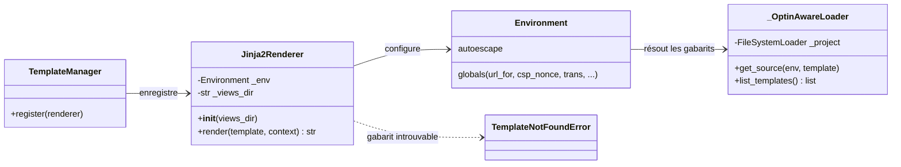
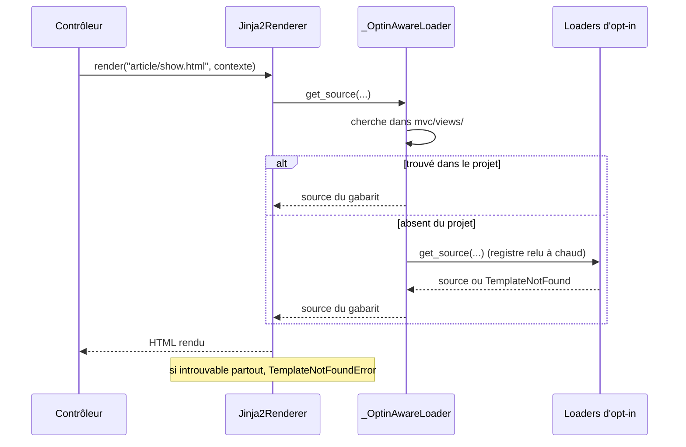

# Le moteur de rendu Jinja2 (renderer.py) dans Forge

Ce document explique le moteur de rendu Jinja2 de Forge, porté par `integrations/jinja2/renderer.py`.

C'est l'implémentation concrète qui transforme un gabarit et un contexte en HTML.

## 1. Rôle du module

`Jinja2Renderer` est l'adaptateur entre Forge et le moteur de templates Jinja2.

Il implémente le contrat de rendu attendu par `core.templating` : une méthode `render(template, context)` qui retourne du HTML.

Autour de Jinja2, il ajoute quatre choses propres à Forge : un loader composite (projet + opt-ins), l'échappement automatique de sécurité, des variables globales injectées dans tous les gabarits, et la conversion des erreurs vers l'exception publique de Forge.

## 2. Vue d'ensemble rapide

| Élément | Valeur |
|---|---|
| Classe | `Jinja2Renderer` |
| Module | `integrations.jinja2.renderer` |
| Couche | Intégration (templating) |
| Rôle | rendre un gabarit Jinja2 en HTML pour les contrôleurs |
| Implémente | le contrat de rendu de `core.templating` |
| Enregistré par | `core.templating.manager` (via `template_manager.register(...)`) |
| Construit par | `core.app.app_factory` et le `app.py` du squelette |
| Loader | `_OptinAwareLoader` : `mvc/views/` puis les loaders d'opt-in (ADR-046) |
| Dépend de | `jinja2`, `core.forge` (routeur), `core.security.csp` (nonce) |
| Exception levée | `core.templating.errors.TemplateNotFoundError` (DX-RENDER-ERROR-001) |
| Sécurité | autoescape pour toutes les extensions et chaînes (SEC-JINJA-AUTOESCAPE-001) |

## 3. Schémas UML

Les deux schémas montrent la structure du renderer et le déroulé d'un rendu.

### 3.1 Diagramme de classe

Le diagramme de classe montre le renderer, son loader composite et son environnement Jinja2.



À retenir :

- `Jinja2Renderer` n'expose qu'un constructeur et `render(...)` ;
- le loader composite cherche d'abord dans `mvc/views/`, puis dans les opt-ins ;
- l'environnement Jinja2 porte les globals et l'autoescape ;
- une erreur de gabarit est convertie en `TemplateNotFoundError` (exception publique de Forge).

### 3.2 Diagramme de séquence

Le diagramme de séquence montre la résolution d'un gabarit à travers la chaîne de loaders.



À retenir :

- le dossier `mvc/views/` est prioritaire : on peut surcharger un gabarit d'opt-in ;
- la liste des loaders d'opt-in est relue à chaque résolution (l'ordre d'import des paquets n'importe pas) ;
- introuvable partout, le rendu lève `TemplateNotFoundError`, pas l'erreur brute de Jinja2.

## 4. API publique

| Membre | Signature | Rôle |
|---|---|---|
| `Jinja2Renderer` | `Jinja2Renderer(views_dir: str)` | construit le renderer pour un dossier de vues |
| `render` | `render(template: str, context: dict) -> str` | rend le gabarit et retourne le HTML ; lève `TemplateNotFoundError` si absent |

## 5. Variables globales injectées

Ces variables sont disponibles dans tous les gabarits, sans les passer explicitement.

| Global | Valeur par défaut | Rôle |
|---|---|---|
| `url_for` | résout via le routeur actif | construit une URL à partir d'un nom de route |
| `csp_nonce` | nonce de la requête, sinon `""` | nonce CSP pour les scripts inline |
| `current_user` | `None` | utilisateur courant (renseigné par l'application) |
| `is_authenticated` | `False` | drapeau d'authentification |
| `can` | refuse tout (`_deny`) | contrôle d'accès (enrichi par l'opt-in RBAC) |
| `trans` | repli no-op (retourne la clé) | traduction ; remplacé par l'opt-in `forge-mvc-i18n` (ADR-027) |

!!! note "Helpers d'opt-in"
    Si `forge-mvc-i18n` est installé, `trans` charge les vrais catalogues JSON.

    Si `forge-mvc-workflow` est installé, ses helpers Jinja sont ajoutés aux globals.

    Ces enrichissements sont optionnels : sans les opt-ins, les gabarits générés rendent quand même.

## 6. Contextes d'utilisation

| Besoin | Élément |
|---|---|
| Enregistrer le moteur au démarrage | `template_manager.register(Jinja2Renderer(views_dir))` |
| Rendre une vue dans un contrôleur | `BaseController.render(...)` (qui délègue au renderer) |
| Surcharger un gabarit d'opt-in | placer un fichier de même chemin dans `mvc/views/` |
| Construire une URL dans un gabarit | `{{ url_for("article-show", id=1) }}` |

## 7. Exemples d'utilisation

### 7.1 Enregistrer le renderer au démarrage

```python
from integrations.jinja2.renderer import Jinja2Renderer
from core.templating.manager import template_manager

template_manager.register(Jinja2Renderer("mvc/views"))
```

C'est ce que fait `core.app.app_factory` (et le `app.py` du squelette).

### 7.2 Rendre un gabarit

```python
renderer = Jinja2Renderer("mvc/views")
html = renderer.render("article/show.html", {"article": article})
```

!!! warning "Échappement automatique global"
    L'autoescape est actif pour toutes les extensions et les chaînes, pas seulement `.html` (SEC-JINJA-AUTOESCAPE-001).

    Pour insérer du HTML voulu, utilisez explicitement le filtre `| safe`.

!!! tip "Surcharge par le projet"
    Le dossier `mvc/views/` est consulté en premier.

    Un fichier de même chemin que celui d'un opt-in remplace le gabarit par défaut du paquet.

## Voir aussi

- Le contrat et le gestionnaire de templating `core.templating` (`manager`, `contracts`, `errors`) : ce que le renderer implémente et l'exception qu'il lève.
- Le registre de configuration `core.forge` : fournit le routeur actif utilisé par `url_for`.
- ADR-046 (loaders de templates Jinja pour les opt-ins) et ADR-027 (extraction i18n, repli no-op du noyau).
