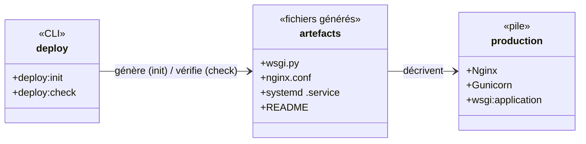
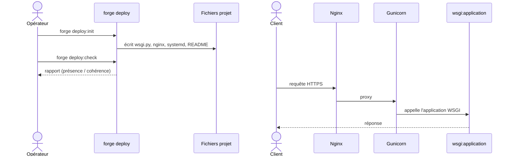

# Le déploiement dans Forge (forge-mvc-deploy)

Ce document explique ce que fait l'opt-in `forge-mvc-deploy`, ce qu'il expose, et comment on s'en sert.

`forge-mvc-deploy` est un outillage **CLI-only** : il ajoute `forge deploy:init` (générer les fichiers de déploiement) et `forge deploy:check` (les vérifier).

Il n'expose aucune API runtime : une application ne l'importe jamais à l'exécution (ADR-053).

## 1. Rôle du module

Mettre une application Forge en production demande quelques fichiers standard : un point d'entrée WSGI, une configuration de serveur web, un service système.

L'opt-in **génère** ces fichiers à partir de gabarits : `wsgi.py`, une configuration Nginx, une unité systemd et un README, alignés sur le chemin de production officiel (Gunicorn).

Il reste un outil de **préparation** : il écrit des fichiers que vous relisez et adaptez, il ne déploie pas à votre place et ne tourne pas dans le serveur.

## 2. Installation et désinstallation

### Installation

```bash
pip install --pre forge-mvc-deploy
forge opt-in:enable deploy
```

`opt-in:enable` inscrit l'opt-in dans `optins/registry.py` (ADR-061) (l'opt-in expose ses commandes CLI).
`forge opt-in:install deploy` affiche la commande `pip` sans l'exécuter.

### Désinstallation

```bash
forge opt-in:disable deploy
pip uninstall forge-mvc-deploy
```

`opt-in:disable` est l'inverse d'`enable` : il dé-inscrit du registre, sans toucher au paquet.
`forge opt-in:remove deploy` affiche la commande `pip uninstall` sans l'exécuter.

## 3. Vue d'ensemble rapide

| Élément | Valeur |
|---|---|
| Paquet | `forge-mvc-deploy` |
| Module | `forge_mvc_deploy` |
| Catégorie | Exploitation et outillage (ADR-055) |
| Couche | opt-in **CLI-only** (aucune API runtime) |
| Dépend de | `forge-mvc` (au moment du CLI seulement) |
| Commandes | `deploy:init`, `deploy:check` |
| Génère | `wsgi.py`, configuration Nginx, unité systemd, README |
| Serveur de production | Gunicorn (`wsgi:application`) |
| Décision d'architecture | ADR-053 (extraction, opt-in CLI-only) |
| Installation | `pip install --pre forge-mvc-deploy` |

## 4. Schémas UML

Les deux schémas suivants montrent deux vues complémentaires de l'opt-in.

Le diagramme de classe montre les commandes et les fichiers générés.

Le diagramme de séquence montre la préparation puis la pile de production servie.

### 4.1 Diagramme de classe

Le diagramme de classe montre les deux commandes et les artefacts qu'elles produisent ou vérifient.



À retenir :

- `deploy:init` écrit les fichiers de déploiement (write-if-new) ;
- `deploy:check` vérifie leur présence et leur cohérence ;
- la pile cible est Nginx devant Gunicorn servant `wsgi:application` ;
- aucun de ces fichiers n'est importé par l'application au runtime.

### 4.2 Diagramme de séquence

Le diagramme de séquence montre la préparation, puis une requête servie en production.



À retenir :

- la génération et la vérification sont des étapes d'**opérateur**, hors application ;
- en production, Nginx reçoit le trafic et le passe à Gunicorn ;
- Gunicorn sert le callable `application` de `wsgi.py` ;
- le serveur de développement (`python app.py`) ne sert pas la production.

## 5. Commandes (API CLI)

| Commande | Rôle |
|---|---|
| `forge deploy:init` | génère `wsgi.py`, la configuration Nginx, l'unité systemd et un README (write-if-new) |
| `forge deploy:check` | vérifie la configuration de déploiement |

Le paquet expose aussi `cmd_deploy_init`, `cmd_deploy_check` et `main` pour le dispatch CLI ; ce ne sont pas des points d'entrée applicatifs.

## 6. Contextes d'utilisation

| Besoin | Élément |
|---|---|
| Générer les fichiers de déploiement | `forge deploy:init` |
| Vérifier la configuration | `forge deploy:check` |
| Servir en production | Gunicorn sur `wsgi:application` |
| Mettre derrière un proxy | configuration Nginx générée |
| Gérer le service | unité systemd générée |

## 7. Exemple d'utilisation

```bash
# 1. Générer les fichiers (ne réécrit pas l'existant)
forge deploy:init

# 2. Vérifier la cohérence
forge deploy:check

# 3. Servir en production (exemple)
.venv/bin/gunicorn wsgi:application --workers 4 --bind 127.0.0.1:8000
```

Relisez et adaptez les fichiers générés (domaine, chemins, nombre de workers) avant de les mettre en service.

!!! tip "Aide-mémoire"
    Deux commandes, une pile :

    - `deploy:init` génère, `deploy:check` vérifie ;
    - en production, Nginx devant Gunicorn servant `wsgi:application`.

## 8. CLI-only et adaptation

`forge-mvc-deploy` n'a pas d'API runtime : il sert uniquement à préparer le déploiement.
Une application ne l'importe pas à l'exécution.

Les fichiers générés sont des **points de départ** : adaptez le domaine, les chemins absolus, le nombre de workers et les options TLS à votre serveur.

!!! warning "Relire avant de déployer"
    Les gabarits supposent une disposition standard (`.venv`, `wsgi.py` à la racine).

    Vérifiez chemins, utilisateur système, certificats et limites de taille avant la mise en service.

!!! note "Chemin de production officiel"
    Gunicorn servant `wsgi:application`, derrière Nginx, est le chemin de production de Forge.

    Le serveur de développement (`python app.py`) n'est pas destiné à la production.

!!! note "Indépendance du cœur"
    Le cœur de Forge ne dépend pas de `forge-mvc-deploy` ; le paquet n'ajoute que des commandes CLI quand il est installé (ADR-053).

## Voir aussi

- [Commandes deploy:* (cli/deploy.py)](references/cli.md) : détail de `deploy:init` / `deploy:check`.
- [Progression Deploy](welcome/installation.md) : apprendre l'opt-in pas à pas.
