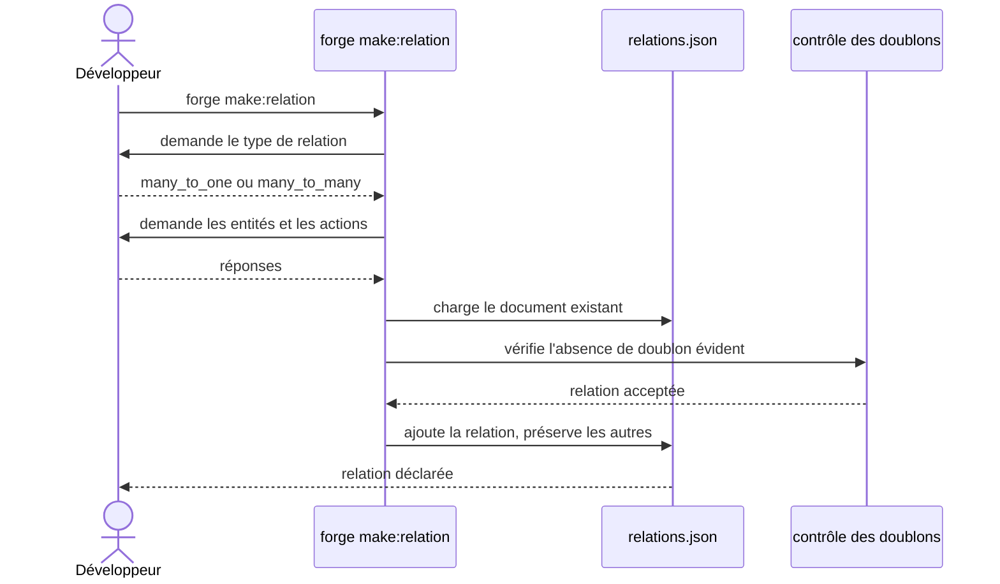

# La commande make:relation dans Forge

Ce document décrit la commande `forge make:relation`.
Elle déclare une relation entre deux entités dans le document de relations du projet.

Le module correspondant est `forge_mvc_entities.make_relation`.

## 1. Rôle

`make:relation` ajoute une relation entre entités au document `mvc/entities/relations.json`.
Elle fonctionne en mode interactif : elle guide le choix du type de relation, des entités et des actions.

Elle prend en charge les relations `many_to_one` et `many_to_many` (pivot canonique).
Elle ajoute la relation au document existant sans détruire les relations déjà déclarées (principe 9).

Pour une relation `many_to_one`, elle **injecte aussi** la clé étrangère comme champ de première classe dans le JSON de l'entité source (type `foreign_key`, ADR-069), de façon chirurgicale et idempotente (écriture annoncée `[MODIFIE]`, préserve les autres champs). La colonne FK vient alors de l'entité ; `relations.sql` ne pose que la contrainte.

## 2. Vue d'ensemble rapide

| Élément | Valeur |
|---|---|
| Commande forge | `forge make:relation` |
| Module Python | `forge_mvc_entities.make_relation` |
| Catégorie | génération du modèle de données |
| Rôle | déclarer une relation entre entités |
| Entrées | réponses interactives (type, entités, actions) |
| Sorties | une entrée ajoutée dans `relations.json` |
| Fichiers touchés | `mvc/entities/relations.json` |
| Mode Forge | génère (ajout sans destruction des relations existantes) |
| Types pris en charge | `many_to_one`, `many_to_many` |

## 3. Schémas UML

### 3.1 Diagramme de séquence

Le diagramme suivant montre le déroulé interactif de `forge make:relation`.



À retenir :

- la commande est entièrement interactive ;
- elle charge le document existant avant d'y ajouter une relation ;
- un contrôle empêche un doublon évident ;
- les relations déjà déclarées sont préservées.

## 4. API publique / Commande

| Symbole | Signature | Rôle |
|---|---|---|
| `main` | `main(argv: list[str] \| None = None) -> None` | point d'entrée de `forge make:relation` |

Le module offre deux modes, de surface identique.
Sans argument, il assemble la relation à partir des réponses de l'utilisateur ; avec `--from` et `--to`, il la décrit entièrement en ligne de commande, avec les mêmes défauts (`ENTITIES-NON-INTERACTIVE-002`).

Invocation :

| Invocation | Effet |
|---|---|
| `forge make:relation` | lance l'assistant interactif de déclaration de relation |
| `forge make:relation --from Eleve --to Classe` | déclare une relation `many_to_one` sans terminal |
| `forge make:relation --type many_to_many --from Article --to Tag` | déclare une relation `many_to_many` à pivot simple |
| `--pivot-field "nom:type[:attributs]"` | ajoute un attribut au pivot, option répétable |

Un pivot qui porte au moins un attribut relève de `make:pivot-crud` et non de `make:crud`.
La grammaire de `--pivot-field` est celle de `make:entity --field`, et le dialogue pose la même question, un attribut par ligne.
Deux types d'entité ne s'y appliquent pas, `foreign_key` et `slug` ; les noms `id`, `from_key` et `to_key` sont gérés par Forge.

## 5. Contextes d'utilisation

| Besoin | Commande / Élément |
|---|---|
| Relier deux entités existantes | `forge make:relation` |
| Déclarer une relation `many_to_many` enrichie | `forge make:relation` |

## 6. Exemples d'utilisation

Lancer l'assistant de déclaration de relation :

```bash
forge make:relation
```

L'assistant pose successivement le type de relation, les entités concernées et les actions, puis ajoute l'entrée dans `relations.json`.
Pour une relation `many_to_many`, il demande enfin les attributs du pivot, un par ligne, une réponse vide terminant la saisie.

Déclarer la même relation enrichie sans terminal :

```bash
forge make:relation --type many_to_many --from Article --to Tag --name tags \
  --pivot-field "position:integer" \
  --pivot-field "note:string:max_length=200,optional"
```

Les deux attributs deviennent des colonnes de la table pivot, dans cet ordre.
Le sous-CRUD correspondant se génère ensuite avec `forge make:pivot-crud Article tags`.

## 7. Ajout sans destruction

!!! note "Préservation des relations existantes"
    `make:relation` ajoute une relation au document sans réécrire ni supprimer les relations déjà présentes (principe 9).

!!! tip "Valider après déclaration"
    Après l'ajout, lancez `forge entity:validate` pour vérifier la cohérence des relations déclarées.

## Voir aussi

- [La commande entity:validate](entity_validate.md) : validation des relations déclarées.
- [Les relations globales](relations.md) : validation et génération du SQL de relations.
- [La commande make:entity](make_entity.md) : création des entités à relier.
