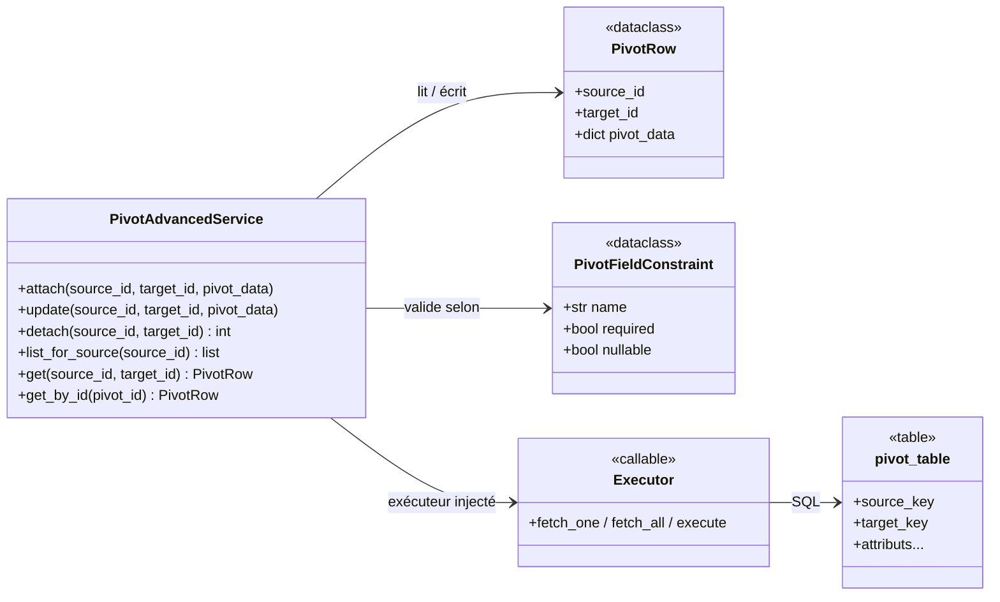
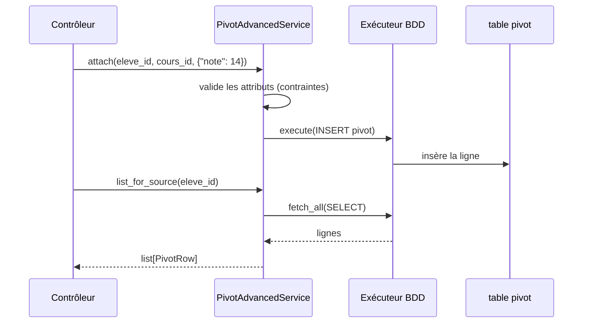

# Les tables pivot enrichies dans Forge (forge-mvc-pivot)

Ce document explique ce que fait l'opt-in `forge-mvc-pivot`, ce qu'il expose, et comment on s'en sert.

`forge-mvc-pivot` gère les associations `many_to_many` **portant des attributs** : une table pivot avec des champs propres, un service de persistance, et un générateur de sous-CRUD.

Le `many_to_many` de base (jonction simple) reste du cœur ; l'enrichi (la jonction avec des données) est cet opt-in (ADR-021).

## 1. Rôle du module

Certaines associations portent des informations : une inscription relie un élève et un cours, avec une note et une date.

L'opt-in modélise cette jonction enrichie : `PivotAdvancedService` lit et écrit des lignes pivot (source, cible, attributs), et `forge make:pivot-crud` génère un sous-CRUD dédié pour gérer ces attributs.

Le contrat du bloc pivot est décrit par `pivot.schema.json`, embarqué dans le paquet depuis l'ADR-057.

## 2. Installation et désinstallation

### Installation

```bash
pip install --pre forge-mvc-pivot
forge opt-in:enable pivot
```

`opt-in:enable` inscrit l'opt-in dans `optins/registry.py` (ADR-061) (l'opt-in s'importe et s'utilise directement, sans route).
`forge opt-in:install pivot` affiche la commande `pip` sans l'exécuter.

### Désinstallation

```bash
forge opt-in:disable pivot
pip uninstall forge-mvc-pivot
```

`opt-in:disable` est l'inverse d'`enable` : il dé-inscrit du registre (le code n'était pas câblé), sans toucher au paquet.
`forge opt-in:remove pivot` affiche la commande `pip uninstall` sans l'exécuter.

## 3. Vue d'ensemble rapide

| Élément | Valeur |
|---|---|
| Paquet | `forge-mvc-pivot` |
| Module | `forge_mvc_entities` |
| Catégorie | Données et modélisation (ADR-055) |
| Couche | opt-in (brique optionnelle) |
| Dépend de | `forge-mvc` et un backend BDD (ADR-054) |
| API publique | `PivotAdvancedService`, `PivotRow`, `PivotFieldConstraint`, `PivotConstraintError`, `PivotFormError`, `pivot_error_to_form_error` |
| Générateur | `forge make:pivot-crud` |
| Contrat | `pivot.schema.json` (embarqué, ADR-057) |
| Exécuteur | injecté (`fetch_one`, `fetch_all`, `execute`) |
| Décisions d'architecture | ADR-021 (extraction), ADR-057 (schéma) |
| Installation | `pip install --pre forge-mvc-pivot` |

## 4. Schémas UML

Les deux schémas suivants montrent deux vues complémentaires de l'opt-in.

Le diagramme de classe montre le service, la ligne pivot et les contraintes.

Le diagramme de séquence montre l'attachement d'une association enrichie.

### 4.1 Diagramme de classe

Le diagramme de classe montre que `PivotAdvancedService` lit et écrit des `PivotRow` via un exécuteur **injecté**, en respectant des `PivotFieldConstraint`.



À retenir :

- le service porte le CRUD de la jonction enrichie ;
- une `PivotRow` = source + cible + dictionnaire d'attributs ;
- les `PivotFieldConstraint` valident les attributs (requis, nullable) ;
- l'exécuteur SQL est injecté, jamais ouvert par le module.

### 4.2 Diagramme de séquence

Le diagramme de séquence montre l'attachement d'un cours à un élève avec une note.



À retenir :

- `attach` valide puis insère l'association avec ses attributs ;
- `unique_pair` empêche les doublons source/cible si activé ;
- les lectures renvoient des `PivotRow` typés ;
- une donnée invalide lève `PivotConstraintError` (convertible en erreur de formulaire).

## 5. API publique

| Élément | Signature | Rôle |
|---|---|---|
| `PivotAdvancedService` | `PivotAdvancedService(table, source_key, target_key, *, pivot_fields=None, pivot_constraints=None, unique_pair=False, id_field=None, fetch_one=..., fetch_all=..., execute=...)` | service de persistance |
| `.attach` | `attach(source_id, target_id, pivot_data)` | crée l'association enrichie |
| `.update` | `update(source_id, target_id, pivot_data)` | met à jour les attributs |
| `.detach` | `detach(source_id, target_id) -> int` | supprime l'association |
| `.list_for_source` | `list_for_source(source_id) -> list[PivotRow]` | associations d'une source |
| `.get` / `.get_by_id` | lecture | une association |
| `PivotRow` | dataclass | `source_id`, `target_id`, `pivot_data` |
| `PivotFieldConstraint` | dataclass | `name`, `required`, `nullable` |
| `PivotConstraintError`, `PivotFormError` | exceptions | attribut invalide |
| `pivot_error_to_form_error` | fonction | convertit une erreur en erreur de formulaire |

### Générateur CLI

| Commande | Rôle |
|---|---|
| `forge make:pivot-crud` | génère un sous-CRUD dédié pour un pivot avec attributs |

## 6. Contextes d'utilisation

| Besoin | Élément |
|---|---|
| Relier deux entités avec des données | `service.attach(...)` |
| Empêcher les doublons | `unique_pair=True` |
| Lister les associations d'une source | `service.list_for_source(...)` |
| Modifier les attributs | `service.update(...)` |
| Générer l'écran de gestion | `forge make:pivot-crud` |
| Afficher une erreur de saisie | `pivot_error_to_form_error(...)` |

## 7. Exemples d'utilisation

### 7.1 Configurer le service et attacher

```python
import core.database.db as db
from forge_mvc_entities import PivotAdvancedService, PivotFieldConstraint

service = PivotAdvancedService(
    table="inscription",
    source_key="eleve_id",
    target_key="cours_id",
    pivot_fields=["note"],
    pivot_constraints=[PivotFieldConstraint("note", required=True)],
    unique_pair=True,
    fetch_one=db.fetch_one, fetch_all=db.fetch_all, execute=db.execute,
)

service.attach(eleve_id=1, target_id=7, pivot_data={"note": 14})
inscriptions = service.list_for_source(1)
```

### 7.2 Générer le sous-CRUD

```bash
forge make:pivot-crud
```

Le générateur produit les écrans de gestion de la jonction enrichie, à partir des relations `many_to_many` déclarées.

!!! tip "Aide-mémoire"
    Une jonction qui porte des données :

    - `PivotAdvancedService` pour le CRUD de l'association ;
    - `make:pivot-crud` pour générer l'écran ;
    - `unique_pair` pour interdire les doublons.

## 8. Périmètre, contraintes et exécuteur

L'opt-in gère la jonction **enrichie** ; le `many_to_many` de base (sans attributs) reste géré par le cœur.

Les contraintes (`required`, `nullable`) valident les attributs avant écriture ; une violation lève `PivotConstraintError`, convertible en `PivotFormError` pour l'affichage.

!!! note "SQL visible et exécuteur injecté"
    Le service reçoit `fetch_one` / `fetch_all` / `execute` : il ne crée pas de connexion et le SQL reste visible.

    En test, injectez de faux exécuteurs.

!!! note "Contrat de schéma embarqué"
    Le `pivot.schema.json` qui décrit le bloc pivot est embarqué par ce paquet (ADR-057) ; le cœur ne le référence plus (bloc pivot opaque côté `relations`).

!!! note "Indépendance du cœur"
    Le cœur de Forge ne dépend pas de `forge-mvc-pivot` : la dépendance va de l'opt-in vers le cœur.

## Voir aussi

- [Service pivot (service.py)](references/service.md) : CRUD de la jonction enrichie.
- [Générateur de sous-CRUD (make_pivot_crud.py)](references/make_pivot_crud.md) : `make:pivot-crud`.
- [Progression Pivot](welcome/installation.md) : apprendre l'opt-in pas à pas.
