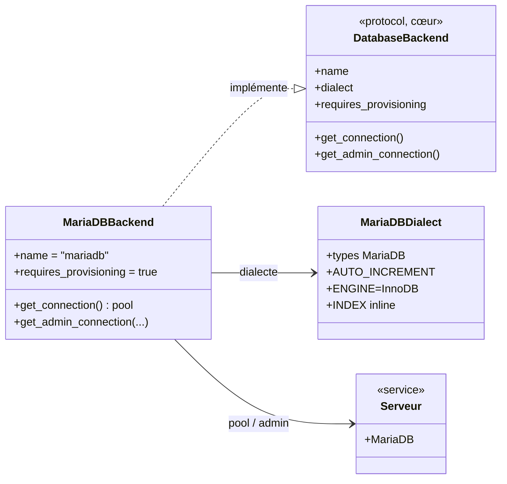
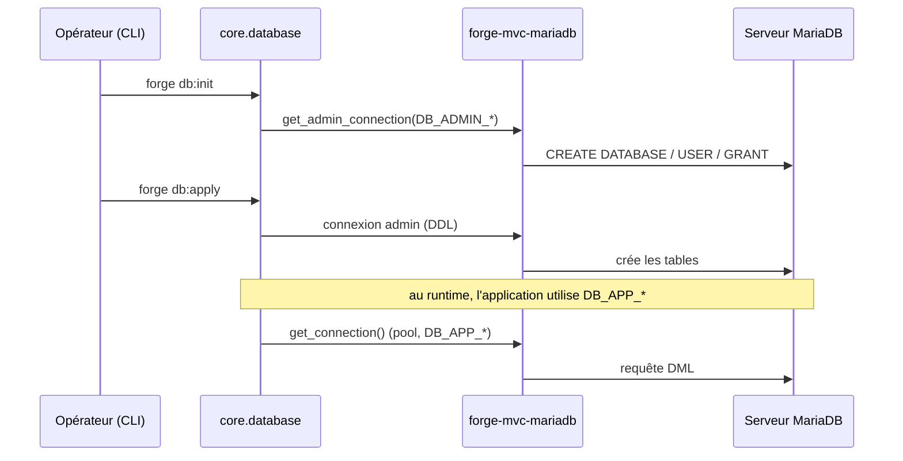

# Le backend MariaDB dans Forge (forge-mvc-mariadb)

Ce document explique ce que fait l'opt-in `forge-mvc-mariadb`, ce qu'il expose, et comment on s'en sert.

`forge-mvc-mariadb` est **un** backend de base de données **de production** pour Forge : il fait fonctionner la couche BDD du cœur au-dessus d'un serveur MariaDB, via un pool de connexions.

Le cœur de Forge est agnostique BDD (ADR-054) : il découvre le backend installé par un entry point, et n'en utilise **qu'un seul** par projet, au choix du développeur (MariaDB, SQLite, PostgreSQL ou SQL Server).
Forge n'impose aucun backend de référence.

## 1. Rôle du module

Le cœur génère le SQL et pilote `db:init` / `db:apply` / `migration:*`, mais ne parle à aucune base directement : c'est le rôle d'un backend.

`forge-mvc-mariadb` fournit ce backend : un pool de connexions MariaDB adapté aux attentes du cœur (curseur lignes-dict, `lastrowid`, `autocommit`), un dialecte SQL MariaDB, et le **provisioning** de la base et des comptes par `db:init`.

MariaDB est **client-serveur** : un serveur doit être joignable.
C'est un choix éprouvé pour la production.

## 2. Installation et désinstallation

MariaDB est client-serveur : un serveur doit être joignable (local, conteneur ou distant).
Le pilote `mariadb` est installé avec l'opt-in.

```bash
pip install --pre forge-mvc-mariadb
```

Le cœur découvre le backend par son entry point `forge_mvc.db_backend` : aucune commande d'activation n'est nécessaire, contrairement aux opt-ins de route.

`forge db:config` amorce les variables du backend dans `env/example`, `env/dev` et `env/prod` (write-if-missing, annoncé, sans secret ; ADR-064) :

```bash
forge db:config
```

Renseignez ensuite les valeurs dans `env/dev` (et `env/prod`) :

```env
DB_HOST=127.0.0.1
DB_PORT=3306
DB_NAME=mon_projet
DB_APP_LOGIN=mon_projet
DB_APP_PWD=...
DB_ADMIN_LOGIN=root
DB_ADMIN_PWD=...
```

`DB_ADMIN_*` sert au provisioning et à la DDL ; `DB_APP_*` au runtime (DML).
Vérifiez avec `forge doctor`, qui indique le backend résolu et l'état de la connexion ; si plusieurs backends sont installés, fixez `DB_BACKEND=mariadb`.
Provisionnez enfin la base et les comptes avec `forge db:init`.

La progression guidée, pas à pas : [Installation de forge-mvc-mariadb](welcome/installation.md).

### Désinstallation

Retirez d'abord la configuration des fichiers d'environnement, puis le paquet :

```bash
forge db:config --remove
pip uninstall forge-mvc-mariadb
```

`db:config --remove` retire les clés `DB_*` posées par `db:config` des trois fichiers d'environnement (les valeurs renseignées sont perdues ; ADR-064).
Un backend n'a pas de commande `disable` : découvert par entry point (ADR-054), retirer le paquet suffit ensuite à ce que le cœur ne le voie plus.
Si besoin, supprimez aussi la base et le compte créés par `db:init`.

## 3. Vue d'ensemble rapide

| Élément | Valeur |
|---|---|
| Paquet | `forge-mvc-mariadb` |
| Module | `forge_mvc_mariadb` |
| Catégorie | Bases de données (ADR-055) |
| Couche | backend BDD opt-in **exclusif** (un seul par projet) |
| Dépend de | `forge-mvc`, `mariadb` (pilote), un serveur MariaDB |
| Découverte | entry point `forge_mvc.db_backend` nommé `mariadb` |
| Sélection | automatique si seul installé ; sinon `DB_BACKEND=mariadb` |
| Provisioning | **oui** : `db:init` crée base + compte via `DB_ADMIN_*` |
| Comptes | `DB_ADMIN_*` (DDL, migrations) et `DB_APP_*` (runtime, DML) (ADR-033) |
| Connexions | pool thread-safe |
| Décision d'architecture | ADR-054 (cœur agnostique BDD) |
| Installation | `pip install --pre forge-mvc-mariadb` |

## 4. Schémas UML

Les deux schémas suivants montrent deux vues complémentaires du backend.

Le diagramme de classe montre comment le cœur consomme le backend.

Le diagramme de séquence montre le provisioning puis une requête runtime.

### 4.1 Diagramme de classe

Le diagramme de classe montre que le cœur résout un `DatabaseBackend` par entry point, et que `forge-mvc-mariadb` le fournit avec son pool et son dialecte.



À retenir :

- le cœur ne connaît que le contrat `DatabaseBackend` ;
- `forge-mvc-mariadb` l'implémente avec un pool de connexions ;
- la connexion d'administration (`DB_ADMIN_*`) sert le provisioning et la DDL ;
- le dialecte traduit types et DDL en SQL MariaDB.

### 4.2 Diagramme de séquence

Le diagramme de séquence montre le provisioning par `db:init`, puis une requête runtime.



À retenir :

- `db:init` provisionne base et compte avec `DB_ADMIN_*` ;
- `db:apply` et les migrations utilisent aussi le compte admin (DDL) ;
- le runtime utilise le compte applicatif `DB_APP_*` (DML strict) ;
- la séparation des comptes suit l'ADR-033.

## 5. Ce que fournit le backend

| Élément | Rôle |
|---|---|
| `MariaDBBackend` | implémente le contrat `DatabaseBackend` (pool + connexion admin) |
| Pool de connexions | connexions thread-safe pour le runtime |
| `MariaDBDialect` | types MariaDB, `AUTO_INCREMENT`, `ENGINE=InnoDB`, index inline |
| Provisioning | `db:init` crée la base et le compte applicatif |
| Entry point | `forge_mvc.db_backend = mariadb` |

L'API que vous utilisez reste celle du cœur : `db:init`, `db:apply`, `migration:*`, et `core.database.db`.

## 6. Contextes d'utilisation

| Besoin | Élément |
|---|---|
| Backend de production | installer `forge-mvc-mariadb` + un serveur MariaDB |
| Forcer ce backend | `DB_BACKEND=mariadb` |
| Provisionner base + compte | `forge db:init` (avec `DB_ADMIN_*`) |
| Appliquer le schéma | `forge db:apply` |
| Faire évoluer le schéma | `forge migration:make` / `migration:apply` |
| Lire/écrire en code | `core.database.db` (compte `DB_APP_*`) |

## 7. Exemple d'utilisation

Configurer l'environnement (`env/dev`), puis :

```bash
pip install --pre forge-mvc-mariadb
forge db:init      # crée la base et le compte applicatif (DB_ADMIN_*)
forge db:apply     # applique le schéma des entités
```

```python
import core.database.db as db
rows = db.fetch_all("SELECT * FROM article", ())
```

Le code applicatif ne sait pas qu'il parle à MariaDB : il utilise la couche BDD du cœur.

!!! tip "Aide-mémoire"
    Deux comptes, un serveur :

    - `DB_ADMIN_*` pour provisionner et faire la DDL (`db:init`, `db:apply`, migrations) ;
    - `DB_APP_*` pour le runtime (DML) ;
    - le code utilise `core.database.db`, pas `mariadb`.

## 8. Serveur, comptes et dialecte

MariaDB est client-serveur : un serveur doit être joignable.
`forge doctor` aide à diagnostiquer la connexion.

Deux comptes séparent les responsabilités (ADR-033) : `DB_ADMIN_*` pour la structure, `DB_APP_*` (DML strict) pour le runtime, ce qui limite les droits de l'application en exécution.

!!! warning "Provisioning et droits"
    `db:init` a besoin de `DB_ADMIN_*` avec les droits de créer une base, un utilisateur et d'accorder des privilèges.

    Le compte runtime `DB_APP_*` reste volontairement limité au DML.

!!! note "Dialecte MariaDB"
    Le dialecte gère `AUTO_INCREMENT`, `ENGINE=InnoDB DEFAULT CHARSET=utf8mb4`, les index dans le `CREATE TABLE`, les backticks.

    Le SQL généré reste lisible (principe 5).

!!! note "Indépendance du cœur"
    Le cœur de Forge ne dépend pas de `forge-mvc-mariadb` : il le découvre par entry point (ADR-054).

## Voir aussi

- [Progression MariaDB](welcome/installation.md) : apprendre le backend pas à pas.
- [ADR-054](https://forgemvc.com/docs/forge/adr/054-database-backend-optins/) : cœur agnostique BDD.
