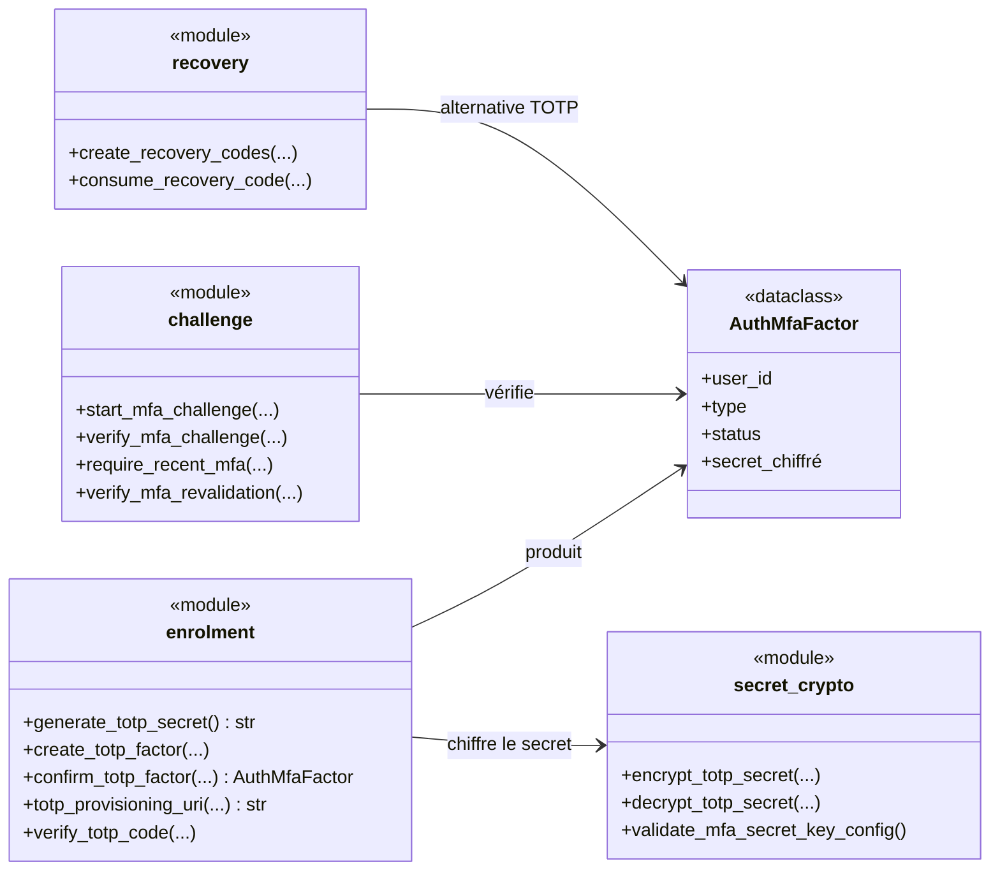
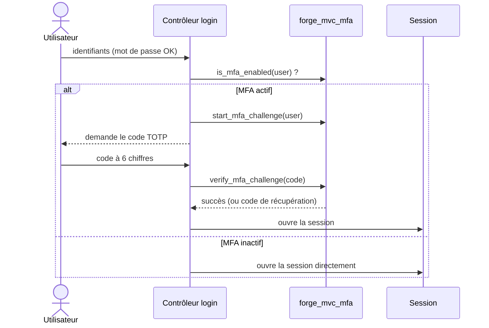

# L'authentification multi-facteurs dans Forge (forge-mvc-mfa)

Ce document explique ce que fait l'opt-in `forge-mvc-mfa`, ce qu'il expose, et comment on s'en sert.

!!! note "Module extrait"
    Le code MFA a été extrait du cœur vers le paquet `forge-mvc-mfa` ; le cœur Forge n'en dépend pas.

`forge-mvc-mfa` ajoute un second facteur d'authentification : TOTP (application d'authentification), codes de récupération, challenge à la connexion, revalidation et protections (anti-rejeu, rate-limit).

Le secret TOTP est **chiffré au repos** (Fernet) ; l'application décide où persister les facteurs et quand exiger le second facteur.

!!! warning "Clé de chiffrement obligatoire"
    Le secret TOTP est chiffré avec `FORGE_MFA_SECRET_KEY` (Fernet).

    Démarrer sans cette variable lève `MfaSecretKeyMissing` : le chiffrement n'est pas optionnel.

## 1. Rôle du module

Le mot de passe seul ne suffit pas pour les actions sensibles. L'opt-in ajoute un **second facteur**.

Il couvre quatre temps :

- **enrôlement** : générer un secret TOTP, l'afficher en QR Code, confirmer le premier code ;
- **challenge** : après le mot de passe, exiger un code TOTP avant d'ouvrir la session ;
- **revalidation** : redemander le facteur avant une action critique (step-up) ;
- **récupération** : des codes à usage unique si l'appareil TOTP est perdu.

Forge fournit les helpers et les contrats ; la **persistance** des facteurs et des codes reste applicative (ADR-008).

## 2. Vue d'ensemble rapide

| Élément | Valeur |
|---|---|
| Paquet | `forge-mvc-mfa` |
| Module | `forge_mvc_mfa` |
| Catégorie | Sécurité et accès (ADR-055) |
| Couche | opt-in (brique optionnelle), transversal au flux d'auth |
| Dépend de | `forge-mvc`, `pyotp`, `cryptography` (Fernet) |
| Facteurs | TOTP (`MFA_FACTOR_TOTP`), codes de récupération (`MFA_FACTOR_RECOVERY`) |
| Chiffrement | secret TOTP chiffré (Fernet), clé `FORGE_MFA_SECRET_KEY` |
| Protections | anti-rejeu TOTP, rate-limit du challenge et de la revalidation |
| API publique | enrôlement, challenge, revalidation, codes de récupération, chiffrement |
| Persistance | applicative (ADR-008) : `AuthMfaFactor`, codes de récupération |
| Installation | `pip install --pre forge-mvc-mfa` |

## 3. Schémas UML

Les deux schémas suivants montrent deux vues complémentaires de l'opt-in.

Le diagramme de classe montre les groupes d'API et le secret chiffré.

Le diagramme de séquence montre le challenge MFA à la connexion.

### 3.1 Diagramme de classe

Le diagramme de classe montre les fonctions groupées par rôle, le facteur persisté et le chiffrement du secret.



À retenir :

- l'enrôlement produit un `AuthMfaFactor` (secret chiffré) ;
- le challenge vérifie un code TOTP ou un code de récupération ;
- la revalidation rejoue le facteur avant une action critique ;
- le secret n'est jamais stocké en clair (Fernet).

### 3.2 Diagramme de séquence

Le diagramme de séquence montre le challenge à la connexion, après le mot de passe.



À retenir :

- le challenge intervient **après** la vérification du mot de passe ;
- la session n'est ouverte qu'une fois le second facteur validé ;
- un code de récupération est une alternative au code TOTP ;
- le challenge est limité en tentatives et en durée (anti-bruteforce).

## 4. API publique

### Secret et chiffrement

| Élément | Rôle |
|---|---|
| `generate_totp_secret() -> str` | génère un secret TOTP |
| `encrypt_totp_secret` / `decrypt_totp_secret` | chiffre/déchiffre le secret (Fernet) |
| `validate_mfa_secret_key_config() -> None` | vérifie `FORGE_MFA_SECRET_KEY` au démarrage |

### Enrôlement TOTP

| Élément | Rôle |
|---|---|
| `create_totp_factor(...)` | crée un facteur TOTP en attente |
| `confirm_totp_factor(...) -> AuthMfaFactor` | confirme avec le premier code |
| `totp_provisioning_uri(...) -> str` | URI `otpauth://` (pour QR Code) |
| `verify_totp_code(...)` | vérifie un code TOTP |
| `TotpSetup`, `AuthMfaFactor` | données d'enrôlement et facteur |

### Challenge et revalidation

| Élément | Rôle |
|---|---|
| `start_mfa_challenge(...)` | démarre le challenge (état en session) |
| `verify_mfa_challenge(...)` | vérifie le code du challenge |
| `has_pending_mfa_challenge`, `clear_mfa_challenge` | état du challenge |
| `require_recent_mfa(...)` | exige une revalidation récente (step-up) |
| `mark_mfa_revalidated`, `verify_mfa_revalidation` | revalidation |

### Codes de récupération

| Élément | Rôle |
|---|---|
| `create_recovery_codes(...)` | génère des codes à usage unique |
| `consume_recovery_code(...)` | consomme un code (irréversible) |

### Constantes

`MFA_FACTOR_TOTP`, `MFA_FACTOR_RECOVERY`, `MFA_STATUS_ACTIVE` / `PENDING` / `DISABLED`, fenêtres et tentatives du challenge et de la revalidation.

## 5. Contextes d'utilisation

| Besoin | Élément |
|---|---|
| Vérifier la clé au démarrage | `validate_mfa_secret_key_config()` |
| Enrôler un utilisateur | `create_totp_factor` + `totp_provisioning_uri` + `confirm_totp_factor` |
| Exiger le 2e facteur au login | `start_mfa_challenge` + `verify_mfa_challenge` |
| Protéger une action sensible | `require_recent_mfa(...)` |
| Fournir un secours | `create_recovery_codes` / `consume_recovery_code` |

## 6. Exemple : challenge à la connexion

```python
from forge_mvc_mfa import (
    is_mfa_enabled, start_mfa_challenge, verify_mfa_challenge,
)

# Après vérification du mot de passe :
if is_mfa_enabled(user):
    start_mfa_challenge(request, user_id=user["id"])
    return redirect("/login/mfa")     # demander le code TOTP
else:
    open_session(request, user)       # pas de MFA : session directe

# Sur la page de saisie du code :
if verify_mfa_challenge(request, code=request.form("code")):
    open_session(request, user)
else:
    return Response.text("Code invalide", status=401)
```

!!! tip "Aide-mémoire"
    Quatre temps, une clé de chiffrement :

    - enrôler (secret + QR + confirmation) ;
    - challenger au login ;
    - revalider avant le sensible ;
    - récupérer via codes à usage unique.

## 7. Sécurité des secrets

Le secret TOTP est chiffré au repos avec Fernet (`cryptography`) et la clé `FORGE_MFA_SECRET_KEY` ; il n'est jamais stocké en clair.

Appelez `validate_mfa_secret_key_config()` au démarrage (app.py / wsgi.py) : démarrer sans clé valide échoue tôt plutôt qu'à la première écriture.

!!! warning "Codes de récupération à usage unique"
    Les codes de récupération sont stockés **hachés** et consommés une seule fois (`consume_recovery_code`).

    Présentez-les une fois à l'utilisateur à la génération ; ils ne sont pas réaffichables.

!!! warning "Anti-rejeu et rate-limit"
    Un code TOTP déjà utilisé est refusé (anti-rejeu) ; le challenge et la revalidation sont limités en tentatives et en fenêtre temporelle.

    Ces protections sont actives par défaut.

!!! note "Persistance applicative"
    Forge fournit les helpers et les contrats (`AuthMfaFactor`, codes) ; l'application choisit la persistance (table, schéma), cohérent avec ADR-008.

!!! note "Indépendance du cœur"
    Le cœur de Forge ne dépend pas de `forge-mvc-mfa` : la dépendance va de l'opt-in vers le cœur.

## Voir aussi

- [Cœur MFA (mfa.py)](references/mfa.md) : enrôlement, challenge, revalidation.
- [Codes de récupération (recovery.py)](references/recovery.md) : génération et consommation.
- [Chiffrement des secrets (secret_crypto.py)](references/secret_crypto.md) : Fernet, `FORGE_MFA_SECRET_KEY`.
- [Protection anti-rejeu (totp_replay.py)](references/totp_replay.md).
- [Progression MFA](welcome/installation.md) : apprendre l'opt-in pas à pas.
