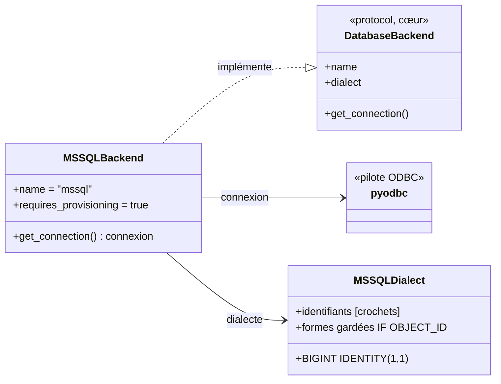
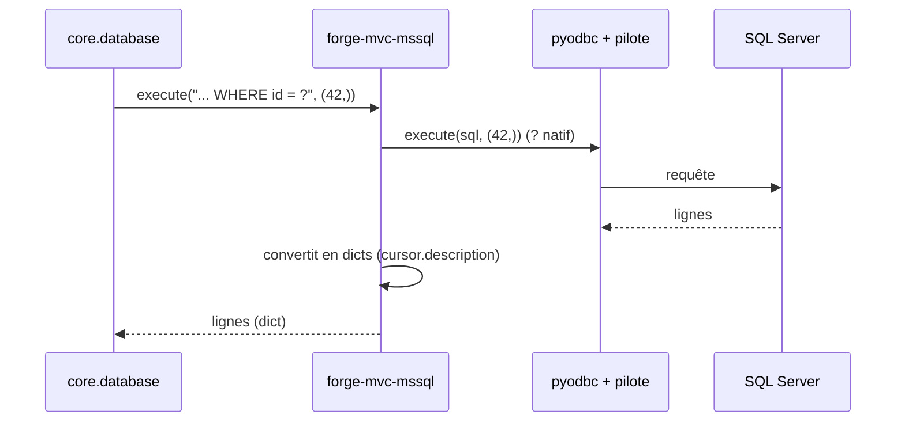

# Le backend SQL Server dans Forge (forge-mvc-mssql)

Ce document explique ce que fait l'opt-in `forge-mvc-mssql`, ce qu'il expose, et comment on s'en sert.

`forge-mvc-mssql` est un **backend de base de données** pour Forge, au-dessus de `pyodbc`, pour faire fonctionner la couche BDD du cœur sur Microsoft SQL Server.

Le cœur de Forge est agnostique BDD (ADR-054) : il découvre le backend installé par un entry point et n'en utilise qu'un seul par projet.

!!! warning "Statut Alpha"
    La logique de dialecte (Transact-SQL) est **testée unitairement**, mais l'**intégration serveur** (pilote ODBC) et le **provisioning par `db:init`** restent à valider/câbler.

    À ce stade, créez la base et le login à la main, puis utilisez `db:apply` / `migration:*`.

## 1. Rôle du module

Le cœur génère le SQL et pilote les commandes BDD ; un backend les fait parler à un vrai serveur.

`forge-mvc-mssql` fournit ce backend pour SQL Server : un adaptateur de connexion `pyodbc` conforme aux attentes du cœur, et un dialecte Transact-SQL.

Bonne nouvelle côté paramètres : `pyodbc` utilise nativement les `?` de Forge, donc aucune traduction.

## 2. Installation

!!! warning "Backend Alpha"
    SQL Server est un backend **Alpha** : le dialecte et l'adaptateur sont testés, mais l'intégration sur un vrai serveur reste à valider. À réserver aux essais, pas encore à la production.

SQL Server est **client-serveur** : un serveur doit être joignable. Le pilote est `pyodbc`, qui requiert un pilote ODBC système.

```bash
pip install --pre forge-mvc-mssql
```

Le cœur découvre le backend par son entry point `forge_mvc.db_backend` : aucune commande d'activation n'est nécessaire.

`forge db:config` amorce les variables du backend dans `env/example`, `env/dev` et `env/prod` (write-if-missing, sans secret ; ADR-064) :

```bash
forge db:config
```

Renseignez ensuite les valeurs dans `env/dev` (et `env/prod`) :

```env
DB_HOST=127.0.0.1
DB_PORT=1433
DB_NAME=mon_projet
DB_APP_LOGIN=mon_projet
DB_APP_PWD=...
DB_ODBC_DRIVER=ODBC Driver 18 for SQL Server
```

`forge doctor` confirme le backend résolu (`mssql`) ; si plusieurs backends sont installés, fixez `DB_BACKEND=mssql`.

La progression guidée, pas à pas : [Installation de forge-mvc-mssql](welcome/installation.md).

## 3. Vue d'ensemble rapide

| Élément | Valeur |
|---|---|
| Paquet | `forge-mvc-mssql` |
| Module | `forge_mvc_mssql` |
| Catégorie | Bases de données (ADR-055) |
| Statut | **Alpha** (dialecte testé, intégration à valider) |
| Couche | backend BDD opt-in **exclusif** (un seul par projet) |
| Dépend de | `forge-mvc`, `pyodbc`, un pilote ODBC, un serveur SQL Server |
| Découverte | entry point `forge_mvc.db_backend` nommé `mssql` |
| Sélection | automatique si seul installé ; sinon `DB_BACKEND=mssql` |
| Paramètres | `?` natifs (pyodbc) : aucune traduction |
| Identité | `BIGINT IDENTITY(1,1)` |
| Pilote ODBC | « ODBC Driver 18 for SQL Server » par défaut (`DB_ODBC_DRIVER`) |
| Provisioning CLI | **pas encore câblé** : création base + login manuelle |
| Décision d'architecture | ADR-054 |
| Installation | `pip install --pre forge-mvc-mssql` |

## 4. Schémas UML

Les deux schémas suivants montrent deux vues complémentaires du backend.

Le diagramme de classe montre l'adaptateur et le dialecte.

Le diagramme de séquence montre une requête via pyodbc.

### 4.1 Diagramme de classe

Le diagramme de classe montre que le backend enveloppe `pyodbc` pour répondre au contrat du cœur.



À retenir :

- le backend enveloppe `pyodbc` (curseur lignes-dict via `description`, `lastrowid` via `SCOPE_IDENTITY()`) ;
- les paramètres `?` de Forge sont utilisés tels quels ;
- le dialecte gère `IDENTITY`, les crochets et les formes gardées ;
- `pyodbc` est importé paresseusement et requiert un pilote ODBC système.

### 4.2 Diagramme de séquence

Le diagramme de séquence montre une requête runtime via pyodbc.



À retenir :

- aucune traduction de paramètres (pyodbc utilise `?`) ;
- les lignes pyodbc sont converties en dicts via `cursor.description` ;
- `lastrowid` est obtenu via `SELECT SCOPE_IDENTITY()` ;
- un pilote ODBC doit être installé sur la machine.

## 5. Ce que fournit le backend

| Élément | Rôle |
|---|---|
| `MSSQLBackend` | implémente le contrat `DatabaseBackend` |
| Adaptateur `pyodbc` | curseur lignes-dict, `lastrowid` via `SCOPE_IDENTITY()` |
| `MSSQLDialect` | `BIGINT IDENTITY(1,1)`, crochets, `CREATE INDEX` gardés, `INFORMATION_SCHEMA` |
| Entry point | `forge_mvc.db_backend = mssql` |

## 6. Contextes d'utilisation

| Besoin | Élément |
|---|---|
| Utiliser SQL Server | installer `forge-mvc-mssql` + pilote ODBC + serveur |
| Forcer ce backend | `DB_BACKEND=mssql` |
| Choisir le pilote ODBC | `DB_ODBC_DRIVER` |
| Créer base et login | **à la main** (Alpha) |
| Appliquer le schéma | `forge db:apply` (sur une base existante) |
| Faire évoluer le schéma | `forge migration:*` |

## 7. Exemple d'utilisation (Alpha)

```sql
-- 1. Préparer base et login à la main (provisioning CLI non câblé)
CREATE DATABASE mon_projet;
CREATE LOGIN mon_projet WITH PASSWORD = '...';
-- puis CREATE USER + rôles dans la base
```

```bash
# 2. Installer le backend + pilote ODBC, configurer env/dev
pip install --pre forge-mvc-mssql

# 3. Appliquer le schéma
forge db:apply
```

Le code applicatif utilise `core.database.db`, comme avec tout autre backend.

!!! tip "Aide-mémoire"
    En Alpha :

    - créez base et login à la main ;
    - `db:apply` / `migration:*` fonctionnent sur la base existante ;
    - `?` est natif (pyodbc), pas de traduction.

## 8. Statut Alpha, ODBC et dialecte

Le dialecte Transact-SQL est testé unitairement ; l'**intégration** sur un vrai serveur reste à valider côté projet.

SQL Server n'a pas `IF NOT EXISTS` pour les tables : le dialecte émet des **formes gardées** (`IF OBJECT_ID(...) IS NULL`).

!!! warning "Pilote ODBC requis"
    `pyodbc` a besoin d'un pilote ODBC système (par défaut « ODBC Driver 18 for SQL Server »), surchargeable via `DB_ODBC_DRIVER`.

    Sans pilote, la connexion échoue.

!!! note "Dialecte SQL Server"
    `BIGINT IDENTITY(1,1)` pour l'identité, identifiants entre crochets `[...]`, `CREATE INDEX` gardés, introspection via `INFORMATION_SCHEMA`.

!!! note "Indépendance du cœur"
    Le cœur de Forge ne dépend pas de `forge-mvc-mssql` : il le découvre par entry point (ADR-054).

## Voir aussi

- [Progression SQL Server](welcome/installation.md) : apprendre le backend pas à pas.
- [ADR-054](https://forgemvc.com/docs/forge/adr/054-database-backend-optins/) : cœur agnostique BDD.
