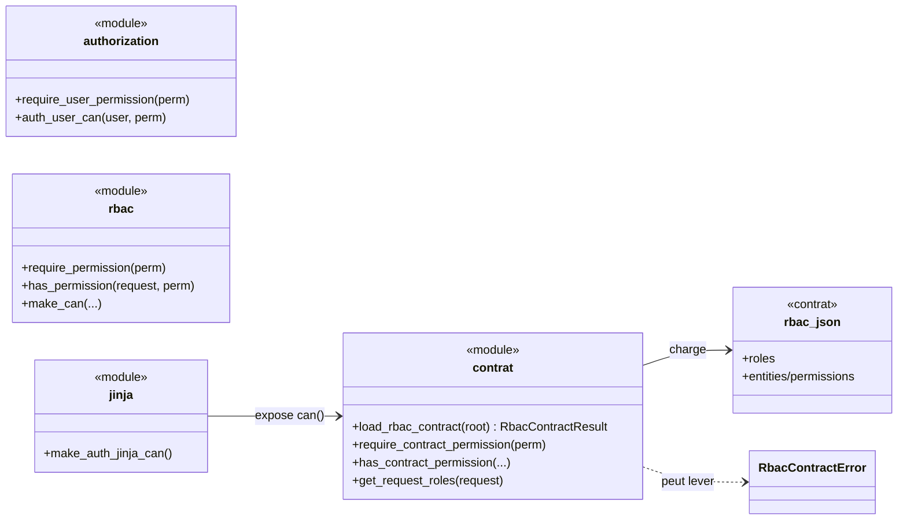
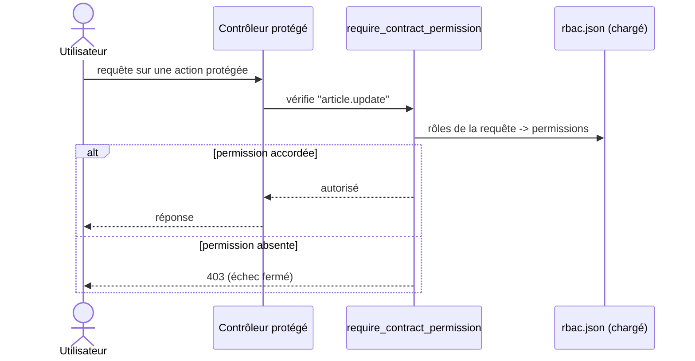

# Le contrôle d'accès (RBAC) dans Forge (forge-mvc-rbac)

Ce document explique ce que fait l'opt-in `forge-mvc-rbac`, ce qu'il expose, et comment on s'en sert.

`forge-mvc-rbac` protège les routes par **permissions**, organisées en **rôles**, avec trois gardes selon la source des permissions, un helper Jinja `can()`, et des commandes `rbac:validate` / `rbac:audit`.

Toutes les gardes **échouent fermé** (401/403) : en cas de doute, l'accès est refusé.

## 1. Rôle du module

Au-delà de « connecté ou non », une application doit dire « cet utilisateur a-t-il le droit de faire ceci ».

L'opt-in répond à cette question via des permissions (`article.update`) regroupées en rôles (`editor`), et des gardes à poser sur les contrôleurs.

Il propose **trois niveaux**, qui ne sont pas trois façons de faire la même chose mais trois **contextes** distincts selon l'origine des permissions.

## 2. Vue d'ensemble rapide

| Élément | Valeur |
|---|---|
| Paquet | `forge-mvc-rbac` |
| Module | `forge_mvc_rbac` |
| Catégorie | Sécurité et accès (ADR-055) |
| Couche | opt-in (brique optionnelle), transversal aux routes |
| Dépend de | `forge-mvc` |
| Gardes de route | `require_contract_permission`, `require_user_permission`, `require_permission` |
| Contrat | `mvc/security/rbac.json`, validé par `rbac.schema.json` (embarqué, ADR-056) |
| Helper Jinja | `can()` (via `make_auth_jinja_can`) |
| Commandes | `rbac:validate`, `rbac:audit` |
| Comportement | échec fermé (401/403) |
| Décisions d'architecture | ADR-014 (emplacement du contrat), ADR-056 (schéma + outillage) |
| Installation | `pip install --pre forge-mvc-rbac` |

## 3. Schémas UML

Les deux schémas suivants montrent deux vues complémentaires de l'opt-in.

Le diagramme de classe montre les trois gardes, le contrat et le helper Jinja.

Le diagramme de séquence montre une route protégée par le contrat.

### 3.1 Diagramme de classe

Le diagramme de classe montre les trois gardes selon la source des permissions, et le contrat RBAC chargé depuis un fichier.



À retenir :

- `require_contract_permission` lit le contrat (déclaratif, sans base) ;
- `require_user_permission` résout depuis l'utilisateur connecté (base) ;
- `require_permission` lit des permissions déjà chargées (bas niveau) ;
- `can()` expose la même logique aux templates.

### 3.2 Diagramme de séquence

Le diagramme de séquence montre une route protégée par le contrat RBAC.



À retenir :

- la garde s'exécute **avant** l'action du contrôleur ;
- les rôles de la requête sont résolus en permissions ;
- une permission manquante renvoie 403 (jamais un accès par défaut) ;
- le contrat décrit qui peut quoi, hors du code.

## 4. API publique

### Trois gardes de route (selon le contexte)

| Garde | Source des permissions | Quand |
|---|---|---|
| `require_contract_permission` | contrat `rbac.json` chargé (sans base) | **recommandé**, déclaratif, voie officielle |
| `require_user_permission` / `auth_user_can` | utilisateur Auth/User connecté (base) | permissions stockées en base |
| `require_permission` / `has_permission` | `request.permissions` (déjà peuplé) | primitive bas niveau |

### Contrat

| Élément | Rôle |
|---|---|
| `load_rbac_contract(root) -> RbacContractResult` | charge et valide `mvc/security/rbac.json` |
| `has_contract_permission`, `get_contract_permissions`, `get_request_roles` | lecture du contrat |
| `RbacContractError`, `RbacContractResult` | erreurs et résultat |

### Modèle et Jinja

| Élément | Rôle |
|---|---|
| `Role`, `Permission`, `PermissionDenied` | modèle RBAC |
| `make_can`, `make_auth_jinja_can`, `make_auth_jinja_context_with_can` | helper `can()` pour les templates |

### Commandes CLI

| Commande | Rôle |
|---|---|
| `forge rbac:validate` | valide `mvc/security/rbac.json` contre le schéma |
| `forge rbac:audit` | audit de cohérence fonctionnelle du contrat |

## 5. Contextes d'utilisation

| Besoin | Élément |
|---|---|
| Protéger une route (défaut) | `@require_contract_permission("article.update")` |
| Protéger selon l'utilisateur en base | `require_user_permission(...)` / `auth_user_can(...)` |
| Garde bas niveau | `require_permission(...)` (permissions pré-chargées) |
| Afficher un bouton conditionnel | `` |
| Décrire les droits | `mvc/security/rbac.json` |
| Vérifier le contrat | `forge rbac:validate` / `forge rbac:audit` |

## 6. Exemples d'utilisation

### 6.1 Protéger une route par le contrat (recommandé)

```python
from forge_mvc_rbac import require_contract_permission


@require_contract_permission("article.update")
def update(request):
    ...
```

Les droits sont décrits dans `mvc/security/rbac.json`, pas codés en dur.

### 6.2 Conditionner l'affichage dans un template

```html

  <a href="/article/edit/{{ article.id }}">Modifier</a>

```

`can()` est exposé aux templates via `make_auth_jinja_can` (même logique que les gardes).

!!! tip "Aide-mémoire"
    Une question, trois sources :

    - contrat (`require_contract_permission`) : déclaratif, par défaut ;
    - base (`require_user_permission`) : permissions de l'utilisateur connecté ;
    - bas niveau (`require_permission`) : permissions déjà chargées.

## 7. Contrat, sécurité et validation

Le contrat `mvc/security/rbac.json` décrit les rôles et les permissions, séparément du schéma d'entité (ADR-014). Son schéma `rbac.schema.json` est embarqué par cet opt-in (ADR-056).

`forge rbac:validate` vérifie la conformité au schéma ; `forge rbac:audit` repère les incohérences fonctionnelles (permission déclarée mais inutilisée, action CRUD sans permission).

!!! warning "Échec fermé"
    Toutes les gardes refusent l'accès en cas de doute (401 si non authentifié, 403 si non autorisé).

    Une permission absente n'ouvre jamais l'accès « par défaut ».

!!! note "Une seule façon par défaut"
    `require_contract_permission` est la voie officielle (déclarative, sans base), promue par le parcours welcome-rbac.

    Les deux autres gardes existent pour des contextes précis (permissions en base, primitive bas niveau), pas comme alternatives interchangeables.

!!! note "Indépendance du cœur"
    Le cœur de Forge ne dépend pas de `forge-mvc-rbac` ; le provider Jinja `can()` se branche au chargement du paquet (mécanisme de loader, ADR-046).

## 8. RBAC léger core ou RBAC complet opt-in ?

Forge distingue deux niveaux d'autorisation :

**RBAC léger core** : primitives dans `core/security/` (dépréciées, héritées du développement pré-1.0) :

- `user_has_role(request, role)` : vérifie qu'un rôle est présent dans le champ `roles` de la session Auth/User. Ne consulte pas les tables SQL RBAC.
- `require_role(role)` : décorateur qui redirige vers `/login` si non authentifié, retourne 403 si le rôle est absent de la session.

Ces deux fonctions conviennent aux cas les plus simples (protéger une route par un rôle déjà dans la session). Elles ne connaissent pas les permissions fines et ne remplacent pas `forge-mvc-rbac`. Les nouveaux projets utilisent `forge_mvc_rbac.require_user_permission`.

**RBAC complet opt-in** : module `forge-mvc-rbac` :

- Modèles `Role`, `Permission` (normalisation, validation)
- Décorateur `@require_permission(...)` : lit les permissions injectées dans la requête ou la session (RBAC historique, sans accès base) ; la résolution SQL via `roles`, `permissions`, `role_permissions` est faite par `require_user_permission`
- Helper Jinja `make_can` / `can(...)` : affichage conditionnel dans les templates
- Résolution backend `get_user_permissions`, `user_has_permission`
- Pont Auth/User vers RBAC via la table `user_roles`
- Administration CLI des associations utilisateurs/rôles

### Quand utiliser quoi ?

| Besoin | Choix recommandé |
|---|---|
| Vérifier simplement qu'un utilisateur a un rôle (session) | `user_has_role` (core léger, déprécié) |
| Protéger une route pour les nouveaux projets | `forge-mvc-rbac`, `require_user_permission` |
| Permissions fines (`contacts.edit`, `posts.delete`) | `forge-mvc-rbac`, `require_user_permission` (autoritatif, base) |
| Administrer rôles et permissions | `forge-mvc-rbac` |
| Affichage conditionnel dans les templates Jinja | `forge-mvc-rbac`, `can(...)` |
| Relations utilisateurs/rôles complexes | `forge-mvc-rbac` |

### Frontière d'import

`core/` ne doit pas importer `forge_mvc_rbac`. La dépendance va dans un seul sens : `forge-mvc-rbac` → `core`. `core/auth/audit.py` peut nommer des événements d'audit RBAC génériques : ce vocabulaire est assumé dans le core (ADR-011), il ne représente pas une dépendance fonctionnelle vers le module opt-in.

## Voir aussi

- [Cœur RBAC (rbac.py)](references/rbac.md) : modèle, primitives, `make_can`.
- [Contrat RBAC (contract.py)](references/contract.md) : `load_rbac_contract`, gardes contrat.
- [Autorisation Auth/User (authorization.py)](references/authorization.md) : gardes basées sur la base.
- [Résolveur de permissions (resolver.py)](references/resolver.md) et [Liens utilisateur/rôle (user_rbac.py)](references/user_rbac.md).
- [Helpers Jinja (jinja.py)](references/jinja.md) : `can()`.
- [Contrat RBAC séparé](contract.md) et [RBAC, usage applicatif](usage.md).
- [Progression RBAC](welcome/installation.md) : apprendre l'opt-in pas à pas.
