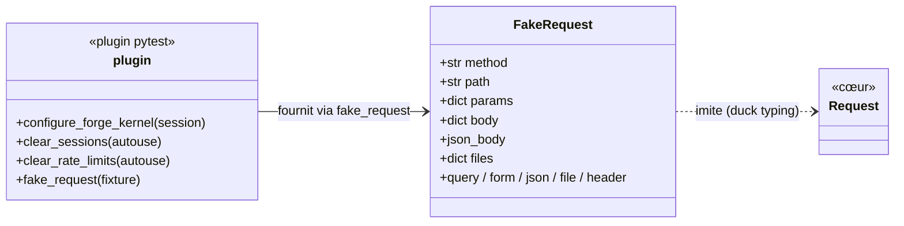
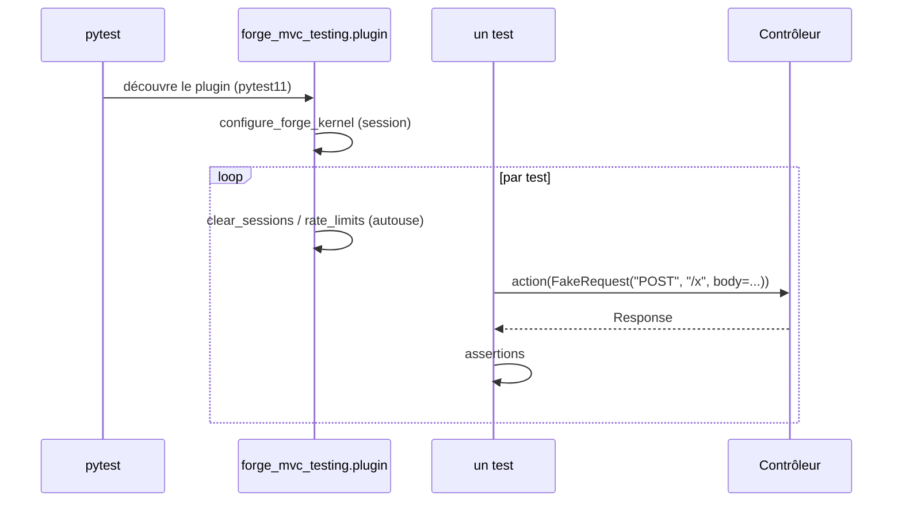

# L'infrastructure de test dans Forge (forge-mvc-testing)

Ce document explique ce que fait l'opt-in `forge-mvc-testing`, ce qu'il expose, et comment on s'en sert.

`forge-mvc-testing` fournit l'outillage de test partagé de Forge : la classe `FakeRequest` et un plugin pytest qui installe des fixtures (configuration du noyau, nettoyage entre tests, `fake_request`).

C'est un paquet **dev-only** (ADR-041) : il n'est **jamais** une dépendance d'exécution, on l'installe seulement pour les tests.

## 1. Rôle du module

Tester un contrôleur Forge demande une `Request` sans serveur HTTP, et un noyau configuré de façon reproductible.

L'opt-in apporte les deux : `FakeRequest` construit une requête factice (méthode, chemin, corps, JSON, fichiers), et le **plugin pytest** configure le noyau et nettoie l'état entre les tests.

Le plugin s'active automatiquement dès que le paquet est installé (point d'entrée `pytest11`).

## 2. Installation et désinstallation

### Installation

Infrastructure de test réservée au développement (ADR-041), listée dans `requirements-dev.txt` :

```bash
pip install forge-mvc-testing
```

Le plugin pytest et `FakeRequest` sont disponibles dès l'installation. Ce n'est pas un opt-in applicatif : il n'y a pas d'`opt-in:enable`.

### Désinstallation

```bash
pip uninstall forge-mvc-testing
```

## 3. Vue d'ensemble rapide

| Élément | Valeur |
|---|---|
| Paquet | `forge-mvc-testing` |
| Module | `forge_mvc_testing` |
| Catégorie | Exploitation et outillage (ADR-055), **dev-only** |
| Couche | infrastructure de test partagée |
| Dépend de | `forge-mvc`, `pytest` (en développement) |
| API publique | `FakeRequest` |
| Plugin pytest | point d'entrée `pytest11` (`forge_mvc_testing.plugin`) |
| Fixtures | `fake_request`, configuration du noyau, nettoyages autouse |
| Portée | **jamais** une dépendance runtime (ADR-041) |
| Installation | `pip install --pre forge-mvc-testing` (dev) |

## 4. Schémas UML

Les deux schémas suivants montrent deux vues complémentaires du paquet.

Le diagramme de classe montre `FakeRequest` et le plugin.

Le diagramme de séquence montre une session pytest qui l'utilise.

### 4.1 Diagramme de classe

Le diagramme de classe montre que `FakeRequest` imite l'objet `Request` du cœur, et que le plugin fournit les fixtures.



À retenir :

- `FakeRequest` se comporte comme une `Request` (accesseurs `query`/`form`/`json`...) ;
- le plugin configure le noyau une fois par session ;
- des fixtures autouse nettoient sessions, rate-limits, etc. entre les tests ;
- la fixture `fake_request` fabrique des requêtes factices.

### 4.2 Diagramme de séquence

Le diagramme de séquence montre une session pytest avec le plugin actif.



À retenir :

- le plugin est découvert automatiquement (rien à importer) ;
- le noyau est configuré pour les tests, de façon reproductible ;
- chaque test démarre d'un état propre (fixtures autouse) ;
- on teste un contrôleur en lui passant une `FakeRequest`.

## 5. API publique

| Élément | Signature | Rôle |
|---|---|---|
| `FakeRequest` | `FakeRequest(method="GET", path="/", *, body=None, json_body=None, params=None, session_id=None, ip="127.0.0.1", headers=None, files=None)` | requête factice, compatible `Request` |

### Fixtures du plugin (pytest)

| Fixture | Portée | Rôle |
|---|---|---|
| `configure_forge_kernel` | session, autouse | configure le noyau pour les tests |
| `clear_sessions` | autouse | nettoie les sessions entre tests |
| `clear_rate_limits` / `clear_upload_rate_limits` | autouse | réinitialise les rate-limits |
| `fake_request` | fonction | fabrique une `FakeRequest` |

Le plugin s'active par le point d'entrée `pytest11` : aucune configuration `conftest` n'est requise.

## 6. Contextes d'utilisation

| Besoin | Élément |
|---|---|
| Tester un contrôleur sans serveur | `FakeRequest(...)` puis appeler l'action |
| Simuler un POST de formulaire | `FakeRequest("POST", "/x", body={...})` |
| Simuler un corps JSON | `FakeRequest("POST", "/api", json_body={...})` |
| Partir d'un état propre | fixtures autouse (automatiques) |
| Obtenir une requête prête | fixture `fake_request` |

## 7. Exemples d'utilisation

### 7.1 Tester un contrôleur

```python
from forge_mvc_testing import FakeRequest
from mvc.controllers.article import create


def test_create_article():
    req = FakeRequest("POST", "/article/create", body={"title": "Bonjour"})
    response = create(req)
    assert response.status == 200
```

### 7.2 Via la fixture

```python
def test_avec_fixture(fake_request):
    req = fake_request("GET", "/article?id=7")
    ...
```

Les nettoyages entre tests sont automatiques (fixtures autouse du plugin).

!!! tip "Aide-mémoire"
    Deux apports :

    - `FakeRequest` : une `Request` sans serveur HTTP ;
    - le plugin pytest : noyau configuré + état propre entre tests.

## 8. Dev-only et isolation

Ce paquet ne sert qu'aux tests : il n'est jamais installé en production et n'est pas importé par le runtime (ADR-041).

Les fixtures autouse garantissent l'isolation : chaque test repart de sessions et de rate-limits vides, ce qui évite les interférences entre tests.

!!! warning "Jamais une dépendance runtime"
    `forge-mvc-testing` se déclare en dépendance de développement (par exemple dans `requirements-dev`), pas dans les dépendances du projet.

    L'application ne l'importe jamais à l'exécution.

!!! note "Activation automatique"
    Le plugin pytest est découvert par le point d'entrée `pytest11` : il suffit que le paquet soit installé dans l'environnement de test.

!!! note "Indépendance du cœur"
    Le cœur de Forge ne dépend pas de `forge-mvc-testing` : la dépendance va de l'outil de test vers le cœur.

## Voir aussi

- [Progression Testing](welcome/installation.md) : apprendre l'outillage pas à pas.
- [ADR-041](https://forgemvc.com/docs/forge/adr/041-shared-test-support/) : infrastructure de test partagée.
