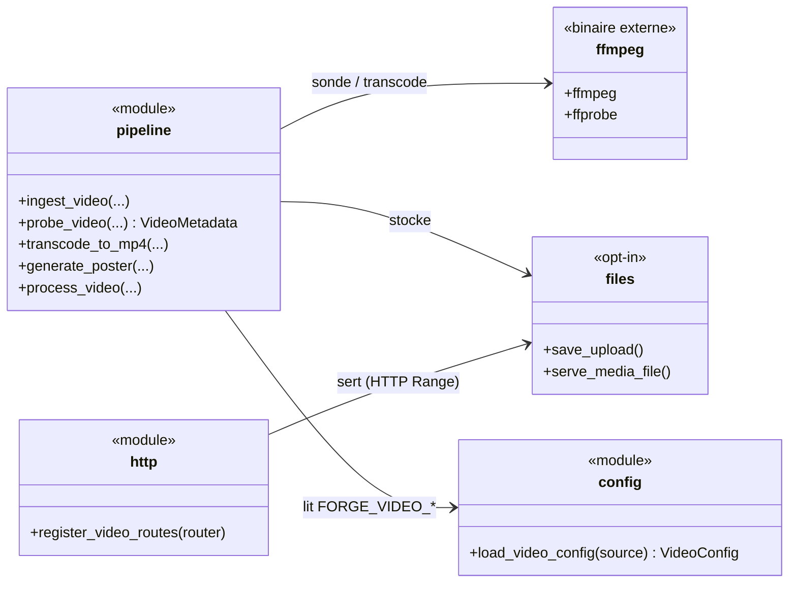
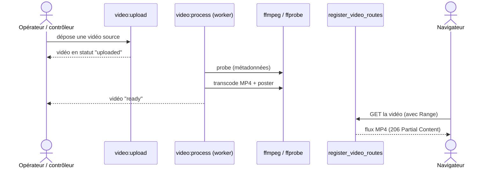

# La vidéo dans Forge (forge-mvc-video)

Ce document explique ce que fait l'opt-in `forge-mvc-video`, ce qu'il expose, et comment on s'en sert.

`forge-mvc-video` gère l'upload de vidéos, leur transcodage en MP4 (H.264/AAC) et leur lecture en streaming HTTP Range.

Le travail lourd (transcodage) se fait **hors requête HTTP**, via des commandes `video:*`, jamais pendant que le serveur répond.

## 1. Rôle du module

Servir une vidéo demande de la normaliser : un fichier source hétérogène devient un MP4 lisible par tous les navigateurs, avec une image d'affiche (poster).

L'opt-in enchaîne un **pipeline** : ingérer le fichier, le sonder (`ffprobe`), le transcoder en MP4 (`ffmpeg`), générer un poster, puis le servir en streaming.

Il branche aussi ses **routes** de lecture sur le routeur du projet, via la couche `optins/` (modèle opt-in de type route).

## 2. Installation et désinstallation

### Installation

```bash
pip install --pre forge-mvc-video
forge opt-in:enable video
```

`opt-in:enable` inscrit l'opt-in dans `optins/registry.py` (ADR-061) et câble ses routes dans `mvc/routes.py`.
`forge opt-in:install video` affiche la commande `pip` sans l'exécuter.

### Désinstallation

```bash
forge opt-in:disable video
pip uninstall forge-mvc-video
```

`opt-in:disable` est l'inverse d'`enable` : il dé-inscrit du registre et débranche les routes de `mvc/routes.py`, sans toucher au paquet.
`forge opt-in:remove video` affiche la commande `pip uninstall` sans l'exécuter.

## 3. Vue d'ensemble rapide

| Élément | Valeur |
|---|---|
| Paquet | `forge-mvc-video` |
| Module | `forge_mvc_video` |
| Catégorie | Médias et fichiers (ADR-055) |
| Couche | opt-in de type route (couche `optins/`) |
| Dépend de | `forge-mvc`, `forge-mvc-files`, et `ffmpeg` / `ffprobe` (binaires externes) |
| API publique | `register_video_routes` (branchement des routes) |
| Configuration | `FORGE_VIDEO_*` (`load_video_config`) |
| Pipeline | `ingest_video`, `probe_video`, `transcode_to_mp4`, `generate_poster`, `process_video` |
| Commandes | `video:doctor`, `video:init`, `video:upload`, `video:process`, `video:cleanup` |
| Lecture | streaming HTTP Range |
| Modèle d'exécution | worker-CLI : transcodage hors requête HTTP |
| Installation | `pip install --pre forge-mvc-video` |

## 4. Schémas UML

Les deux schémas suivants montrent deux vues complémentaires de l'opt-in.

Le diagramme de classe montre le pipeline, les routes et les dépendances externes.

Le diagramme de séquence montre l'upload, le traitement différé, puis la lecture.

### 4.1 Diagramme de classe

Le diagramme de classe montre que le pipeline s'appuie sur `ffmpeg` / `ffprobe` et sur `forge-mvc-files`, et que les routes se branchent explicitement sur le routeur.



À retenir :

- le pipeline transforme une source en MP4 + poster ;
- `ffmpeg` / `ffprobe` sont des binaires externes requis ;
- les routes de lecture se branchent via `register_video_routes` ;
- le stockage et le service viennent de `forge-mvc-files`.

### 4.2 Diagramme de séquence

Le diagramme de séquence montre l'upload, le traitement par un worker, puis la lecture.



À retenir :

- l'upload et le traitement sont **séparés** : la requête ne transcode jamais ;
- `video:process` (worker-CLI) fait probe + transcode + poster ;
- la lecture honore l'en-tête `Range` (streaming) ;
- une vidéo n'est lisible qu'une fois `ready`.

## 5. API publique

| Élément | Signature | Rôle |
|---|---|---|
| `register_video_routes` | `register_video_routes(router) -> None` | branche les routes de lecture sur le routeur |
| `load_video_config` | `load_video_config(source=None) -> VideoConfig` | lit la configuration `FORGE_VIDEO_*` |
| `process_video` | `process_video(...)` | pipeline complet : probe + transcode + poster |
| `probe_video` | `probe_video(...) -> VideoMetadata` | sonde une vidéo (`ffprobe`) |
| `transcode_to_mp4` | `transcode_to_mp4(...)` | transcode en MP4 (`ffmpeg`) |
| `generate_poster` | `generate_poster(...)` | génère l'image d'affiche |
| `ingest_video` | `ingest_video(...)` | entre une source dans le pipeline |

Les fonctions de pipeline sont surtout appelées par les commandes `video:*` (worker), pas pendant une requête.

### Commandes CLI

| Commande | Rôle |
|---|---|
| `forge video:doctor` | diagnostic (paquet, config, `ffmpeg`/`ffprobe`) |
| `forge video:init` | copie la migration vidéo vers `mvc/migrations/` |
| `forge video:upload` | dépose une vidéo source (`<fichier> [--title]`) |
| `forge video:process` | traite une vidéo (`<id>` ou `--pending`) |
| `forge video:cleanup` | purge les vidéos `failed` et fichiers orphelins |

## 6. Contextes d'utilisation

| Besoin | Élément |
|---|---|
| Vérifier l'installation | `forge video:doctor` |
| Préparer la table | `forge video:init` |
| Déposer une vidéo | `forge video:upload <fichier>` |
| Transcoder (hors requête) | `forge video:process --pending` |
| Brancher la lecture | `register_video_routes(router)` |
| Configurer le module | `FORGE_VIDEO_*` / `load_video_config` |
| Nettoyer | `forge video:cleanup --apply` |

## 7. Exemples d'utilisation

### 7.1 Brancher les routes de lecture

```python
# optins/video/routes.py (couche optins du projet)
from forge_mvc_video import register_video_routes


def register(router) -> None:
    register_video_routes(router)
```

`forge opt-in:enable video --apply` crée cette couche ; le branchement reste explicite.

### 7.2 Traiter les vidéos en attente (worker)

```bash
forge video:upload ma_video.mov --title "Cours 1"
forge video:process --pending     # probe + transcode MP4 + poster
```

Le transcodage tourne dans la commande, pas dans le serveur web.

!!! tip "Aide-mémoire"
    Trois temps :

    - déposer (`video:upload`) ;
    - traiter hors requête (`video:process`) ;
    - lire en streaming (routes branchées par `register_video_routes`).

## 8. Dépendances externes et exécution différée

`ffmpeg` et `ffprobe` doivent être installés sur la machine ; `forge video:doctor` le vérifie.

Le transcodage est lourd : il se fait via `video:process` (worker-CLI), idéalement déclenché par cron ou un service, jamais pendant une requête HTTP.

!!! warning "ffmpeg / ffprobe requis"
    Sans ces binaires, le sondage et le transcodage échouent.

    Lancez `forge video:doctor` après installation pour confirmer leur présence.

!!! note "Lecture en streaming"
    La lecture s'appuie sur `forge-mvc-files` (HTTP Range) : le navigateur peut chercher dans la vidéo sans tout télécharger.

!!! note "Indépendance du cœur"
    Le cœur de Forge ne dépend pas de `forge-mvc-video` : la dépendance va de l'opt-in vers le cœur.

## Voir aussi

- [Configuration (config.py)](references/config.md) : contrat `FORGE_VIDEO_*`.
- [Sondage (probe.py)](references/probe.md) et [Transcodage MP4 (transcode.py)](references/transcode.md) : le pipeline.
- [Traitement (process.py)](references/process.md) : orchestration complète.
- [Lecture HTTP (http.py)](references/http.md) : routes et streaming.
- [Progression Vidéo](welcome/installation.md) : apprendre l'opt-in pas à pas.
